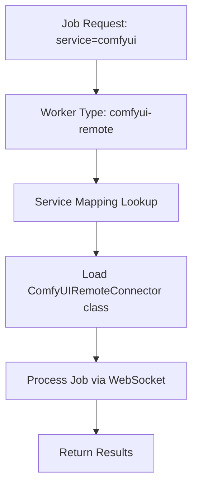

# Connector Creation Guide

This guide provides step-by-step instructions for creating new connectors in the EMP Job Queue worker-driven architecture. Connectors are the bridge between the job broker and external services, enabling distributed AI workload processing.

## Table of Contents

- [Architecture Overview](#architecture-overview)
- [Connector Types](#connector-types)
- [Quick Start](#quick-start)
- [Step-by-Step Creation](#step-by-step-creation)
- [Service Mapping Configuration](#service-mapping-configuration)
- [Health System Integration](#health-system-integration)
- [Testing and Validation](#testing-and-validation)
- [Examples](#examples)
- [Best Practices](#best-practices)
- [Troubleshooting](#troubleshooting)

## Architecture Overview

The EMP Job Queue uses a **worker-driven architecture** where:

1. **Services** define what jobs can be processed (e.g., "comfyui", "openai")
2. **Connectors** implement how to process those services (e.g., "ComfyUIRemoteConnector", "OpenAIConnector")
3. **Workers** are configured instances that handle specific services using connectors (e.g., "comfyui-remote", "openai-api")
4. **Service Mapping** (`service-mapping.json`) defines the relationships between services, connectors, and worker configurations



## Worker Types

### Internal Workers
- **Purpose**: Services that require installation and setup (ComfyUI, Playwright)
- **Characteristics**: 
  - Require PM2 service processes
  - Have port assignments
  - Need Docker build stages
  - Require installers

### External Workers  
- **Purpose**: API-only services (OpenAI, Replicate, Anthropic)
- **Characteristics**:
  - No installation required
  - No PM2 processes
  - Use shared resource binding
  - API key authentication

## Quick Start

To create a new connector, you need to:

1. **Create the connector class** (`apps/worker/src/connectors/my-service-connector.ts`)
2. **Update service mapping** (`apps/machine/src/config/service-mapping.json`) - add both connector and worker definitions
3. **Re-bundle the worker** (`pnpm run worker:bundle`) - connectors are auto-exported
4. **Test the worker configuration** (`WORKERS="my-service-api:1" pnpm machine:build test`)

## Step-by-Step Creation

### Step 1: Create the Connector Class

Create a new file: `apps/worker/src/connectors/my-service-connector.ts`

```typescript
// Example: Custom API Service Connector
import { JobData, JobResult, ProgressCallback, ServiceInfo, logger } from '@emp/core';
import { BaseConnector, HealthCheckCapabilities, ServiceJobStatus } from './base-connector.js';

export class MyServiceConnector extends BaseConnector {
  service_type = 'my-service' as const;
  version = '1.0.0';

  /**
   * REQUIRED: Define environment variables needed by this connector
   * The PM2 ecosystem generator will use this to provide environment variables to workers
   */
  static getRequiredEnvVars(): Record<string, string> {
    return {
      MY_SERVICE_API_KEY: '${MY_SERVICE_API_KEY:-}',
      MY_SERVICE_BASE_URL: '${MY_SERVICE_BASE_URL:-https://api.myservice.com}',
      MY_SERVICE_MAX_CONCURRENT: '${MY_SERVICE_MAX_CONCURRENT:-3}',
      MY_SERVICE_TIMEOUT: '${MY_SERVICE_TIMEOUT:-30000}',
      MY_SERVICE_RETRY_ATTEMPTS: '${MY_SERVICE_RETRY_ATTEMPTS:-3}'
    };
  }

  constructor(connectorId: string = 'my-service-api') {
    // Initialize with configuration
    const config = {
      service_type: 'my-service',
      base_url: process.env.MY_SERVICE_BASE_URL || 'https://api.myservice.com',
      api_key: process.env.MY_SERVICE_API_KEY,
      max_concurrent_jobs: parseInt(process.env.MY_SERVICE_MAX_CONCURRENT || '3'),
      timeout: parseInt(process.env.MY_SERVICE_TIMEOUT || '30000'),
    };

    super(connectorId, config);
    logger.info(`MyService connector ${connectorId} initialized`);
  }

  // ============================================================================
  // Required BaseConnector Implementation
  // ============================================================================

  protected async initializeService(): Promise<void> {
    // Validate API key and connection
    if (!this.config.api_key) {
      throw new Error('MY_SERVICE_API_KEY environment variable is required');
    }
    
    // Test API connection
    try {
      await this.testConnection();
      logger.info(`MyService API connection verified`);
    } catch (error) {
      throw new Error(`Failed to connect to MyService API: ${error.message}`);
    }
  }

  protected async cleanupService(): Promise<void> {
    // Cleanup resources if needed
    logger.info('MyService connector cleanup completed');
  }

  async getServiceInfo(): Promise<ServiceInfo> {
    return {
      service_name: 'MyService API',
      service_version: '2.0',
      base_url: this.config.base_url,
      status: 'online',
      capabilities: {
        supported_formats: ['text', 'json'],
        supported_models: ['my-model-v1', 'my-model-v2'],
        features: ['api_processing', 'real_time'],
        concurrent_jobs: this.config.max_concurrent_jobs,
      },
      resource_usage: {
        cpu_usage: 0, // API-only
        memory_usage_mb: 0,
      },
    };
  }

  async canProcessJob(jobData: JobData): Promise<boolean> {
    // Check if job has required parameters
    return !!(jobData.payload?.input && jobData.payload?.model);
  }

  // ============================================================================
  // Health System Integration (REQUIRED)
  // ============================================================================

  getHealthCheckCapabilities(): HealthCheckCapabilities {
    return {
      supportsBasicHealthCheck: true,
      supportsJobStatusQuery: true, // Can query API for job status
      supportsJobCancellation: true, // Can cancel API requests
      supportsServiceRestart: false, // Cannot restart external API
      supportsQueueIntrospection: false, // No queue visibility
    };
  }

  async queryJobStatus(serviceJobId: string): Promise<ServiceJobStatus> {
    try {
      // Query the external API for job status
      const response = await fetch(`${this.config.base_url}/jobs/${serviceJobId}`, {
        headers: {
          'Authorization': `Bearer ${this.config.api_key}`,
        },
      });

      if (!response.ok) {
        return {
          serviceJobId,
          status: 'unknown',
          canReconnect: true,
          canCancel: false,
          errorMessage: `API returned ${response.status}`,
        };
      }

      const data = await response.json();
      
      return {
        serviceJobId,
        status: this.mapApiStatusToJobStatus(data.status),
        canReconnect: true,
        canCancel: data.status === 'running',
        progress: data.progress || 0,
      };
    } catch (error) {
      return {
        serviceJobId,
        status: 'failed',
        canReconnect: false,
        canCancel: false,
        errorMessage: error.message,
      };
    }
  }

  // ============================================================================
  // Job Processing Implementation
  // ============================================================================

  protected async processJobImpl(
    jobData: JobData,
    progressCallback: ProgressCallback
  ): Promise<JobResult> {
    const { input, model } = jobData.payload;

    // Report initial progress
    await progressCallback({
      job_id: jobData.id,
      progress: 10,
      message: 'Starting MyService processing',
      current_step: 'initializing',
      total_steps: 3,
      estimated_completion_ms: 30000,
    });

    try {
      // Step 1: Submit job to API
      const submitResponse = await fetch(`${this.config.base_url}/process`, {
        method: 'POST',
        headers: {
          'Content-Type': 'application/json',
          'Authorization': `Bearer ${this.config.api_key}`,
        },
        body: JSON.stringify({
          input,
          model,
          job_id: jobData.id,
        }),
      });

      if (!submitResponse.ok) {
        throw new Error(`API submission failed: ${submitResponse.statusText}`);
      }

      const submitData = await submitResponse.json();
      const serviceJobId = submitData.job_id;

      // Store service job ID for health checks
      if (this.redis) {
        await this.redis.hset(`job:${jobData.id}`, 'service_job_id', serviceJobId);
      }

      await progressCallback({
        job_id: jobData.id,
        progress: 30,
        message: 'Job submitted to MyService',
        current_step: 'processing',
        total_steps: 3,
        estimated_completion_ms: 20000,
      });

      // Step 2: Poll for completion
      let result = null;
      let attempts = 0;
      const maxAttempts = 60; // 5 minutes at 5-second intervals

      while (!result && attempts < maxAttempts) {
        await new Promise(resolve => setTimeout(resolve, 5000)); // Wait 5 seconds
        
        const statusResponse = await fetch(`${this.config.base_url}/jobs/${serviceJobId}`, {
          headers: {
            'Authorization': `Bearer ${this.config.api_key}`,
          },
        });

        if (statusResponse.ok) {
          const statusData = await statusResponse.json();
          
          if (statusData.status === 'completed') {
            result = statusData.result;
            break;
          } else if (statusData.status === 'failed') {
            throw new Error(statusData.error || 'Job failed on MyService');
          }

          // Update progress
          const progress = Math.min(90, 30 + (statusData.progress || 0) * 0.6);
          await progressCallback({
            job_id: jobData.id,
            progress,
            message: `Processing: ${statusData.message || 'In progress'}`,
            current_step: 'processing',
            total_steps: 3,
            estimated_completion_ms: (maxAttempts - attempts) * 5000,
          });
        }
        
        attempts++;
      }

      if (!result) {
        throw new Error('Job timed out waiting for MyService completion');
      }

      // Step 3: Return results
      await progressCallback({
        job_id: jobData.id,
        progress: 100,
        message: 'MyService processing completed',
        current_step: 'completed',
        total_steps: 3,
        estimated_completion_ms: 0,
      });

      return {
        job_id: jobData.id,
        status: 'completed',
        result: {
          output: result.output,
          metadata: result.metadata,
          service: 'my-service',
        },
        processing_time_ms: Date.now() - jobData.created_at,
        service_info: {
          connector_id: this.connector_id,
          service_job_id: serviceJobId,
        },
      };

    } catch (error) {
      logger.error(`MyService processing failed for job ${jobData.id}:`, error);
      throw error;
    }
  }

  // ============================================================================
  // Helper Methods
  // ============================================================================

  private async testConnection(): Promise<void> {
    const response = await fetch(`${this.config.base_url}/health`, {
      headers: {
        'Authorization': `Bearer ${this.config.api_key}`,
      },
    });

    if (!response.ok) {
      throw new Error(`Health check failed: ${response.statusText}`);
    }
  }

  private mapApiStatusToJobStatus(apiStatus: string): 'pending' | 'running' | 'completed' | 'failed' | 'cancelled' | 'unknown' {
    switch (apiStatus) {
      case 'queued': return 'pending';
      case 'processing': return 'running';
      case 'completed': return 'completed';
      case 'failed': case 'error': return 'failed';
      case 'cancelled': return 'cancelled';
      default: return 'unknown';
    }
  }
}
```

### Step 2: Update Service Mapping

Edit `apps/machine/src/config/service-mapping.json`:

```json
{
  "connectors": {
    "MyServiceConnector": {
      "path": "./redis-direct-worker.js",
      "description": "MyService API connector for custom processing"
    }
  },
  "workers": {
    "my-service-api": {
      "service": [
        {
          "capability": "my-service",
          "connector": "MyServiceConnector", 
          "type": "external"
        }
      ],
      "installer": null,
      "resource_binding": "shared",
      "build_stage": "base",
      "required_env": ["MY_SERVICE_API_KEY"],
      "description": "MyService API worker for custom processing",
      "api_config": {
        "base_url": "${MY_SERVICE_BASE_URL:-https://api.myservice.com}",
        "timeout": "${MY_SERVICE_TIMEOUT:-30}",
        "max_retries": "${MY_SERVICE_MAX_RETRIES:-3}"
      }
    }
  }
}
```

### Step 3: Re-bundle Worker (Auto-Export)

**✨ Connectors are now automatically exported!** Simply re-bundle the worker to include your new connector:

```bash
# All connectors in /connectors/ are automatically exported
pnpm run worker:bundle
```

The system automatically exports all connector classes from the `/connectors/` directory, so you don't need to manually add exports. Your `MyServiceConnector` will be automatically available for dynamic loading.

**Auto-Export System:**
- All TypeScript files in `apps/worker/src/connectors/` are automatically exported
- No manual maintenance of export lists required
- New connectors are immediately available after bundling

### Step 4: Test the Configuration

```bash
# Test the connector
WORKERS="my-service-api:2" pnpm machine:build
```

## Service Mapping Configuration

### New Architecture: Connectors + Workers + Capabilities

The service mapping now separates **connectors** (how we process) from **capabilities** (what jobs we accept):

### Connector Definition
```json
{
  "connectors": {
    "ConnectorClassName": {
      "path": "./redis-direct-worker.js",
      "description": "Description of what this connector does"
    }
  }
}
```

### Worker Definition

#### External Worker (API-only)
```json
{
  "workers": {
    "worker-id": {
      "service": [
        {
          "capability": "service-name",
          "connector": "ConnectorClassName",
          "type": "external"
        }
      ],
      "installer": null,
      "resource_binding": "shared",
      "build_stage": "base",
      "required_env": ["API_KEY_VAR"],
      "description": "Description of the worker",
      "api_config": {
        "base_url": "${BASE_URL_VAR:-https://default.api.com}",
        "timeout": "${TIMEOUT_VAR:-30}",
        "max_retries": "${MAX_RETRIES_VAR:-3}"
      }
    }
  }
}
```

#### Multi-Capability Worker
```json
{
  "workers": {
    "ai-remote": {
      "service": [
        {
          "capability": "comfyui",
          "connector": "ComfyUIRemoteConnector",
          "type": "external"
        },
        {
          "capability": ["a1111", "automatic"],
          "connector": "A1111RemoteConnector",
          "type": "external"
        }
      ],
      "description": "Multi-service remote connector handling multiple AI services"
    }
  }
}
```

#### Internal Worker (Requires Installation)
```json
{
  "workers": {
    "worker-id": {
      "service": [
        {
          "capability": "service-name",
          "connector": "ConnectorClassName",
          "type": "internal"
        }
      ],
      "installer": "installServiceName",
      "resource_binding": "gpu",
      "build_stage": "service-name",
      "service_instances_per_gpu": "${INSTANCES_PER_GPU:-1}",
      "ports": ["${BASE_PORT:-8000}"],
      "port_increment": "${PORT_INCREMENT:-1}",
      "description": "Description of the worker",
      "installer_config": {
        "install_command": "${INSTALL_COMMAND:-./install.sh}",
        "config_path": "${CONFIG_PATH:-/opt/service/config}",
        "install_timeout": "${INSTALL_TIMEOUT:-300}"
      }
    }
  }
}
```

### Resource Bindings

- **`shared`**: For API-only services, unlimited scaling
- **`gpu`**: Per-GPU exclusive binding, requires GPU resources
- **`cpu`**: Per-machine CPU binding, shared CPU usage
- **`mock_gpu`**: Simulates GPU for testing, uses CPU

### Build Stages

Must match Dockerfile stages:
- **`base`**: Minimal machine setup
- **`comfyui`**: ComfyUI installed
- **`simulation`**: Simulation environment
- **`playwright`**: Browser automation

## Health System Integration

### Required Methods

All connectors **MUST** implement health check capabilities:

```typescript
getHealthCheckCapabilities(): HealthCheckCapabilities {
  return {
    supportsBasicHealthCheck: true,      // Required
    supportsJobStatusQuery: true,        // Recommended  
    supportsJobCancellation: boolean,    // Optional
    supportsServiceRestart: boolean,     // Optional
    supportsQueueIntrospection: boolean  // Optional
  };
}

async queryJobStatus(serviceJobId: string): Promise<ServiceJobStatus> {
  // Implementation required if supportsJobStatusQuery: true
}
```

### Service Job ID Tracking

Store service job IDs for health monitoring:

```typescript
// During job processing
if (this.redis && serviceJobId) {
  await this.redis.hset(`job:${jobData.id}`, 'service_job_id', serviceJobId);
}
```

## Testing and Validation

### Local Testing

1. **Environment Setup**
```bash
# Set required environment variables
export MY_SERVICE_API_KEY="your-api-key"
export MY_SERVICE_BASE_URL="https://api.myservice.com"
```

2. **Build and Test**
```bash
# Rebuild worker
pnpm worker:bundle

# Create test environment  
pnpm compose:profile my-service-api:1 --tag test/my-service:v1

# Build and run
pnpm machine:build test/my-service
```

3. **Submit Test Job**
```bash
# Using the API
curl -X POST http://localhost:3000/api/jobs \
  -H "Content-Type: application/json" \
  -d '{
    "service": "my-service",
    "payload": {
      "input": "test input",
      "model": "my-model-v1"
    }
  }'
```

### Validation Checklist

- [ ] Connector loads without errors
- [ ] Health check capabilities are properly defined
- [ ] Job status querying works correctly
- [ ] Service mapping configuration is valid
- [ ] Environment variables are properly handled
- [ ] Error handling is comprehensive
- [ ] Progress reporting works during job processing
- [ ] Jobs complete successfully
- [ ] Failed jobs are handled gracefully

## Examples

### WebSocket Connector (ComfyUI Style)

See `apps/worker/src/connectors/comfyui-websocket-connector.ts` for a complete WebSocket implementation.

### REST API Connector (OpenAI Style)  

See `apps/worker/src/connectors/simulation-connector.ts` for a REST API implementation.

### Custom Protocol Connector

For services with unique protocols, extend BaseConnector and implement custom communication logic.

## Best Practices

### Code Organization
- One connector per service type
- Clear naming conventions (`ServiceNameConnector`)
- Comprehensive error handling
- Proper logging with context

### Configuration Management
- Use environment variables for all configurable values
- Provide sensible defaults
- Validate configuration during initialization
- Support development vs production configurations

### Environment Variables Declaration (REQUIRED)

**Every connector MUST implement the `getRequiredEnvVars()` static method** to declare what environment variables it needs:

```typescript
static getRequiredEnvVars(): Record<string, string> {
  return {
    // Format: "ENV_VAR_NAME": "${ENV_VAR_NAME:-default_value}"
    MY_SERVICE_API_KEY: '${MY_SERVICE_API_KEY:-}',  // Required (no default)
    MY_SERVICE_BASE_URL: '${MY_SERVICE_BASE_URL:-https://api.example.com}',  // Optional with default
    MY_SERVICE_TIMEOUT: '${MY_SERVICE_TIMEOUT:-30000}',
  };
}
```

**Why this is required:**
- The PM2 ecosystem generator uses this to automatically pass environment variables to worker processes
- Makes connectors self-documenting about their requirements
- Eliminates the need to maintain separate configuration files
- Ensures environment variables are available when connectors initialize

**Format explanation:**
- `${VAR_NAME:-default}` - Use VAR_NAME from environment, fall back to default
- `${VAR_NAME:-}` - Use VAR_NAME from environment, fall back to empty string (for required vars)

### Error Handling
- Catch and wrap all errors with context
- Provide actionable error messages
- Use appropriate error types
- Implement retry logic for transient failures

### Performance
- Implement connection pooling for HTTP clients
- Use appropriate timeouts
- Handle backpressure for high-volume services
- Monitor resource usage

### Security
- Never log sensitive information (API keys, tokens)
- Validate all input data
- Use secure communication protocols
- Implement proper authentication

### Monitoring
- Implement comprehensive health checks
- Track service-specific metrics
- Log important events with structured data
- Support operational debugging

## Troubleshooting

### Common Issues

#### "Worker not found in service mapping"
- Check that the worker ID exists in the `workers` section of `service-mapping.json`
- Verify the service name matches between worker config and service definition
- Ensure the connector class is exported in `redis-direct-worker.ts`

#### "Could not load connector from path"
- **✨ With auto-export**: Simply run `pnpm run worker:bundle` to include new connectors
- Verify the connector class name matches exactly in the `connectors` section
- Ensure the TypeScript file is in `apps/worker/src/connectors/`

#### "Service validation failed"
- Implement required health check methods
- Ensure `getHealthCheckCapabilities()` returns appropriate values
- Implement `queryJobStatus()` if marked as supported

#### "Environment variable not set"
- Check that required environment variables are defined
- Verify environment variable names match service mapping
- Use appropriate defaults where possible

#### Docker build stage not found
- Ensure the `build_stage` in service mapping matches Dockerfile stages
- For new services, you may need `base` stage
- Complex combinations may require custom Dockerfile stages

### Debug Commands

```bash
# Check service mapping syntax
cat apps/machine/src/config/service-mapping.json | jq .

# Verify connector auto-exports (should show all connectors)
tail -20 apps/machine/worker-bundled/redis-direct-worker.js | grep -A 10 "module.exports"

# Check bundled worker
ls -la apps/machine/worker-bundled/

# Test connector loading
WORKERS="your-worker-id:1" pnpm machine:build test
```

### Log Analysis

Monitor these log patterns:
- `Loading connector {name} from {path}` - Connector loading
- `✅ Successfully loaded connector` - Successful loading  
- `Connector {name} initialization failed` - Health check failures
- `Worker {id} failed job {job} processing failed` - Job processing errors

## Advanced Topics

### Custom Resource Bindings

For specialized hardware requirements, you can define custom resource bindings in the service mapping.

### Multi-Stage Docker Builds

For complex services requiring custom installation steps, create new Dockerfile stages.

### Service Mesh Integration

For enterprise deployments, connectors can integrate with service mesh technologies for advanced networking and security.

### Monitoring and Observability

Implement custom metrics and tracing for production monitoring using the worker's Redis connection.

---

This guide should provide everything needed to create robust, production-ready connectors for the EMP Job Queue system. For additional support, refer to existing connector implementations and the system's architectural documentation.