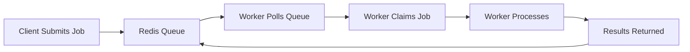

# How It Works

This section explains the technical mechanisms that make the system function, from job submission through completion.

## The Core Flow

## In This Section

- [Job Lifecycle](./job-lifecycle.md) - Complete journey of a job through the system
- [Worker Selection](./worker-selection.md) - How workers are matched to jobs
- [Redis Architecture](./redis-architecture.md) - How Redis orchestrates everything *(to be written)*
- [Machine Communication](./machine-communication.md) - How machines talk to each other *(to be written)*
- [Scaling Mechanisms](./scaling-mechanisms.md) - How the system scales up and down *(from North Star)*

## Key Technical Concepts

1. **Pull-Based Architecture** - Workers pull jobs rather than jobs being pushed
2. **Atomic Job Claiming** - Redis scripts ensure only one worker gets each job
3. **Capability Matching** - Workers only claim jobs they can handle
4. **Health Monitoring** - Continuous health checks and status reporting

## How Different Job Types Flow

### ComfyUI Jobs (GPU)
1. Job submitted with ComfyUI workflow
2. GPU machine with matching capabilities claims job
3. ComfyUI processes workflow
4. Results uploaded and returned

### API Jobs (CPU)
1. Job submitted with API parameters
2. API machine claims job
3. External API called (OpenAI, Replicate, etc.)
4. Results processed and returned

## Next Steps

After understanding how it works, dive into [Implementation Details](../03-implementation-details/) for the technical deep-dive.