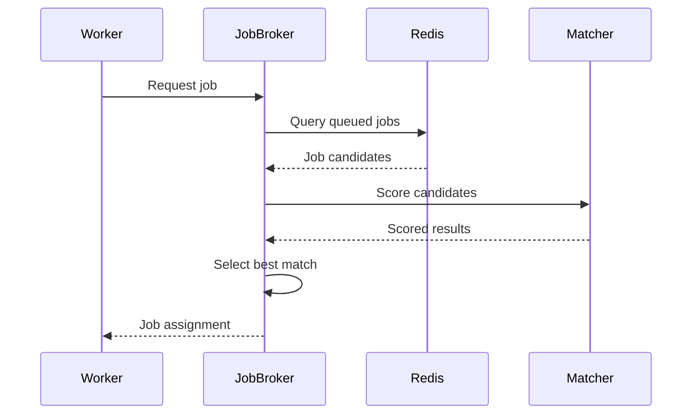

# Worker Selection and Capability Matching

The EmProps Job Queue system uses sophisticated multi-dimensional matching algorithms to select the optimal worker for each job. This document explains how workers are matched to jobs, the scoring algorithms used, and how to configure worker capabilities for optimal job routing.

## Overview

Worker selection is based on a **pull-based model** where workers actively request jobs they can handle. The system then uses multi-dimensional scoring to find the best job for each worker request.

```mermaid
graph TB
    subgraph "Job Requirements"
        JR[Job Requirements<br/>• Service: comfyui<br/>• Component: text-to-image-xl<br/>• GPU Memory: 8GB<br/>• Quality: high<br/>• Customer: enterprise-123]
    end
    
    subgraph "Available Workers"
        W1[Worker 1<br/>• Services: [comfyui, a1111]<br/>• GPU: 16GB RTX 4090<br/>• Components: all<br/>• Load: 30%]
        W2[Worker 2<br/>• Services: [comfyui]<br/>• GPU: 8GB RTX 3080<br/>• Components: [text-to-image-xl]<br/>• Load: 80%]
        W3[Worker 3<br/>• Services: [a1111]<br/>• GPU: 12GB RTX 4070<br/>• Components: all<br/>• Load: 10%]
    end
    
    subgraph "Matching Engine"
        ME[Capability Matcher<br/>• Service compatibility<br/>• Hardware requirements<br/>• Component filtering<br/>• Load balancing<br/>• Customer isolation]
    end
    
    subgraph "Scoring Results"
        S1[Worker 1: Score 95<br/>✓ Service match<br/>✓ Over-spec hardware<br/>✓ Low load<br/>✓ Component support]
        S2[Worker 2: Score 70<br/>✓ Service match<br/>✓ Min hardware<br/>✗ High load<br/>✓ Component match]
        S3[Worker 3: Score 0<br/>✗ Service mismatch<br/>- Hardware irrelevant<br/>- Load irrelevant<br/>- Component irrelevant]
    end
    
    JR --> ME
    W1 --> ME
    W2 --> ME
    W3 --> ME
    
    ME --> S1
    ME --> S2
    ME --> S3
    
    S1 -.->|Selected| Winner[Worker 1 Selected]
```

## Worker Capabilities

### Capability Structure

Workers advertise their capabilities when registering with the hub:

```typescript
interface WorkerCapabilities {
  worker_id: string;
  services: string[];                    // ["comfyui", "a1111"]
  components?: string[] | 'all';         // Component filtering
  workflows?: string[] | 'all';          // Workflow filtering
  models?: Record&lt;string, string[]&gt;;     // Service -&gt; model mapping
  hardware: HardwareSpecs;               // Physical capabilities
  customer_access: CustomerAccessConfig; // Isolation rules
  performance: PerformanceConfig;        // Performance characteristics
  location: LocationConfig;              // Geographic constraints
  cost: CostConfig;                      // Cost tier
}
```

### Service Support

Workers declare which AI services they can handle:

```json
{
  "services": ["comfyui", "a1111"],
  "service_configs": {
    "comfyui": {
      "url": "http://localhost:8188",
      "version": "0.0.45",
      "models_loaded": ["sdxl_base_1.0", "sdxl_refiner_1.0"],
      "queue_capacity": 10
    },
    "a1111": {
      "url": "http://localhost:7860",
      "version": "1.7.0",
      "models_loaded": ["sd_xl_base_1.0", "sd_xl_refiner_1.0"],
      "concurrent_jobs": 1
    }
  }
}
```

### Component and Workflow Filtering

EmProps integration allows fine-grained job routing:

```json
{
  "components": ["text-to-image-xl", "upscaling", "inpainting"],
  "workflows": ["workflow-v2.1", "workflow-optimized"],
  "component_configs": {
    "text-to-image-xl": {
      "max_resolution": "2048x2048",
      "supported_ratios": ["1:1", "16:9", "4:3"],
      "performance_tier": "premium"
    },
    "upscaling": {
      "max_input_size": "1024x1024",
      "max_scale_factor": 4,
      "supported_models": ["RealESRGAN", "ESRGAN"]
    }
  }
}
```

### Hardware Specifications

Detailed hardware capabilities for requirement matching:

```json
{
  "hardware": {
    "gpu_memory_gb": 16,
    "gpu_model": "RTX 4090",
    "cpu_cores": 16,
    "cpu_threads": 32,
    "ram_gb": 64,
    "storage_gb": 2000,
    "network_speed": "1Gbps"
  },
  "performance_benchmarks": {
    "sdxl_1024x1024_20steps": 15.2,  // seconds
    "sd15_512x512_20steps": 3.8,
    "upscale_2x_1024x1024": 8.1
  }
}
```

## Job Requirements

### Requirement Specification

Jobs specify their requirements for worker matching:

```json
{
  "requirements": {
    "service_type": "comfyui",
    "component": "text-to-image-xl",
    "workflow": "workflow-v2.1",
    "hardware": {
      "gpu_memory_gb": 8,
      "cpu_cores": 4,
      "ram_gb": 16
    },
    "customer_isolation": "loose",
    "quality_level": "balanced",
    "timeout_minutes": 30,
    "geographic_region": "us-east",
    "compliance": ["gdpr"]
  }
}
```

### Requirement Types

#### Service Requirements
- **service_type**: Primary service needed (comfyui, a1111, custom)
- **component**: Specific component if using EmProps filtering
- **workflow**: Specific workflow version if applicable
- **models**: Required models (future feature)

#### Hardware Requirements
- **gpu_memory_gb**: Minimum GPU memory required
- **cpu_cores**: Minimum CPU cores needed
- **ram_gb**: Minimum system RAM required
- **storage_gb**: Minimum storage space needed

#### Quality and Performance
- **quality_level**: fast, balanced, quality
- **timeout_minutes**: Maximum processing time allowed
- **priority**: Job priority (0-100)

#### Business Requirements
- **customer_isolation**: strict, loose, none
- **geographic_region**: Geographic constraints
- **compliance**: Compliance requirements (GDPR, HIPAA, etc.)
- **cost_tier**: economy, standard, premium

## Matching Algorithm

### Multi-Dimensional Scoring

The matching algorithm evaluates workers across multiple dimensions:

```typescript
interface MatchingScore {
  total_score: number;        // 0-100 composite score
  service_score: number;      // Service compatibility (0-100)
  hardware_score: number;     // Hardware adequacy (0-100)
  performance_score: number;  // Performance characteristics (0-100)
  load_score: number;         // Current load factor (0-100)
  isolation_score: number;    // Customer isolation compliance (0-100)
  location_score: number;     // Geographic/compliance match (0-100)
  cost_score: number;         // Cost efficiency (0-100)
  bonus_points: number;       // Additional factors
  penalty_points: number;     // Negative factors
}
```

### Scoring Algorithm

#### 1. Service Compatibility (Weight: 40%)

```typescript
function calculateServiceScore(jobReqs: JobRequirements, workerCaps: WorkerCapabilities): number {
  // Must have exact service match
  if (!workerCaps.services.includes(jobReqs.service_type)) {
    return 0; // Disqualified
  }
  
  let score = 100; // Base score for service match
  
  // Component filtering
  if (jobReqs.component && workerCaps.components !== 'all') {
    if (!workerCaps.components.includes(jobReqs.component)) {
      return 0; // Disqualified
    }
    score += 10; // Bonus for specific component support
  }
  
  // Workflow filtering
  if (jobReqs.workflow && workerCaps.workflows !== 'all') {
    if (!workerCaps.workflows.includes(jobReqs.workflow)) {
      return 0; // Disqualified
    }
    score += 10; // Bonus for specific workflow support
  }
  
  return Math.min(score, 100);
}
```

#### 2. Hardware Adequacy (Weight: 25%)

```typescript
function calculateHardwareScore(jobReqs: JobRequirements, workerCaps: WorkerCapabilities): number {
  const hw = jobReqs.hardware;
  const workerHw = workerCaps.hardware;
  
  // Check minimum requirements
  if (hw.gpu_memory_gb && workerHw.gpu_memory_gb &lt; hw.gpu_memory_gb) {
    return 0; // Disqualified
  }
  if (hw.cpu_cores && workerHw.cpu_cores &lt; hw.cpu_cores) {
    return 0; // Disqualified
  }
  if (hw.ram_gb && workerHw.ram_gb &lt; hw.ram_gb) {
    return 0; // Disqualified
  }
  
  // Calculate over-specification bonus
  let score = 100;
  
  if (hw.gpu_memory_gb) {
    const ratio = workerHw.gpu_memory_gb / hw.gpu_memory_gb;
    if (ratio &gt; 1.5) score += 10; // Bonus for over-spec
    if (ratio &gt; 2.0) score += 10; // Additional bonus
  }
  
  return Math.min(score, 100);
}
```

#### 3. Current Load (Weight: 20%)

```typescript
function calculateLoadScore(workerInfo: WorkerInfo): number {
  const loadFactor = workerInfo.current_jobs.length / workerInfo.capabilities.performance.concurrent_jobs;
  const cpuLoad = workerInfo.system_info?.cpu_usage || 0;
  const memoryLoad = workerInfo.system_info?.memory_usage || 0;
  
  // Prefer workers with lower load
  const loadScore = 100 - (loadFactor * 100);
  const systemScore = 100 - Math.max(cpuLoad, memoryLoad);
  
  return (loadScore * 0.7) + (systemScore * 0.3);
}
```

#### 4. Customer Isolation (Weight: 10%)

```typescript
function calculateIsolationScore(jobReqs: JobRequirements, workerCaps: WorkerCapabilities, workerInfo: WorkerInfo): number {
  const requiredIsolation = jobReqs.customer_isolation || 'none';
  const workerIsolation = workerCaps.customer_access.isolation;
  
  // Check if worker can provide required isolation
  const isolationLevels = { 'none': 0, 'loose': 1, 'strict': 2 };
  if (isolationLevels[workerIsolation] &lt; isolationLevels[requiredIsolation]) {
    return 0; // Disqualified
  }
  
  // Check customer conflicts
  if (requiredIsolation === 'strict') {
    const currentCustomers = workerInfo.current_jobs
      .map(jobId => getJobCustomerId(jobId))
      .filter(Boolean);
    
    if (currentCustomers.length &gt; 0 && !currentCustomers.includes(jobReqs.customer_id)) {
      return 0; // Customer conflict
    }
  }
  
  return 100;
}
```

#### 5. Performance Characteristics (Weight: 5%)

```typescript
function calculatePerformanceScore(jobReqs: JobRequirements, workerCaps: WorkerCapabilities): number {
  const qualityLevel = jobReqs.quality_level || 'balanced';
  const workerLevels = workerCaps.performance.quality_levels;
  
  if (!workerLevels.includes(qualityLevel)) {
    return 50; // Partial match, worker can adapt
  }
  
  return 100; // Perfect match
}
```

### Composite Scoring

```ts
function calculateCompositeScore(
  jobReqs: JobRequirements,
  workerCaps: WorkerCapabilities,
  workerInfo: WorkerInfo
): MatchingScore {
  const serviceScore = calculateServiceScore(jobReqs, workerCaps);
  if (serviceScore === 0) {
    return { total_score: 0, service_score: 0 /* other scores... */ }; // Early disqualification
  }
  
  const hardwareScore = calculateHardwareScore(jobReqs, workerCaps);
  if (hardwareScore === 0) {
    return { total_score: 0, hardware_score: 0 /* other scores... */ }; // Early disqualification
  }
  
  const loadScore = calculateLoadScore(workerInfo);
  const isolationScore = calculateIsolationScore(jobReqs, workerCaps, workerInfo);
  const performanceScore = calculatePerformanceScore(jobReqs, workerCaps);
  
  // Weighted composite score
  const totalScore = 
    (serviceScore * 0.40) +
    (hardwareScore * 0.25) +
    (loadScore * 0.20) +
    (isolationScore * 0.10) +
    (performanceScore * 0.05);
  
  return {
    total_score: Math.round(totalScore),
    service_score: serviceScore,
    hardware_score: hardwareScore,
    load_score: loadScore,
    isolation_score: isolationScore,
    performance_score: performanceScore,
    // other scores...
  };
}
```

## Worker Selection Process

### 1. Worker Job Request

When a worker is ready for a new job:

```json
{
  "type": "claim_job",
  "worker_id": "worker-gpu-01",
  "timestamp": "2024-01-15T10:15:30Z",
  "max_jobs": 1,
  "preferred_types": ["text_to_image", "upscaling"],
  "capabilities": {
    "services": ["comfyui"],
    "components": ["text-to-image-xl"],
    "hardware": {
      "gpu_memory_gb": 16,
      "gpu_memory_available": 14.2
    }
  }
}
```

### 2. Job Candidate Identification

The system finds jobs that could potentially match:



### 3. Candidate Scoring

Each candidate job is scored against the worker:

```typescript
interface JobCandidate {
  job: Job;
  score: MatchingScore;
  match_reasons: string[];
  warnings: string[];
}

// Example scoring results
const candidates: JobCandidate[] = [
  {
    job: { id: "job-123", type: "text_to_image", priority: 80 /* etc... */ },
    score: {
      total_score: 95,
      service_score: 100,
      hardware_score: 90,
      load_score: 95,
      isolation_score: 100,
      performance_score: 100
    },
    match_reasons: [
      "Perfect service match (comfyui)",
      "Component supported (text-to-image-xl)",
      "Hardware over-spec (16GB &gt; 8GB required)",
      "Low current load (30%)"
    ],
    warnings: []
  },
  {
    job: { id: "job-124", type: "upscaling", priority: 90 /* etc... */ },
    score: {
      total_score: 0,
      service_score: 0,
      // other scores... irrelevant
    },
    match_reasons: [],
    warnings: ["Service mismatch: requires 'a1111', worker provides 'comfyui'"]
  }
];
```

### 4. Best Match Selection

The highest-scoring job is selected:

```typescript
function selectBestJob(candidates: JobCandidate[]): JobCandidate | null {
  // Filter out disqualified candidates
  const qualified = candidates.filter(c => c.score.total_score &gt; 0);
  
  if (qualified.length === 0) {
    return null; // No suitable jobs
  }
  
  // Sort by total score (descending), then by priority (descending), then by age (ascending)
  qualified.sort((a, b) => {
    if (b.score.total_score !== a.score.total_score) {
      return b.score.total_score - a.score.total_score;
    }
    if (b.job.priority !== a.job.priority) {
      return b.job.priority - a.job.priority;
    }
    return new Date(a.job.created_at).getTime() - new Date(b.job.created_at).getTime();
  });
  
  return qualified[0];
}
```

## Advanced Matching Features

### Affinity and Anti-Affinity

Workers can express preferences for or against certain job types:

```json
{
  "job_affinity": {
    "preferred_types": ["text_to_image", "img2img"],
    "preferred_customers": ["premium-customer-1"],
    "preferred_components": ["text-to-image-xl"]
  },
  "job_anti_affinity": {
    "avoided_types": ["video_generation"],
    "avoided_customers": ["problematic-customer"],
    "avoided_components": ["experimental-component"]
  }
}
```

### Dynamic Capability Updates

Workers can update their capabilities in real-time:

```json
{
  "type": "update_capabilities",
  "worker_id": "worker-gpu-01",
  "capability_changes": {
    "models": {
      "comfyui": ["sdxl_base_1.0", "sdxl_refiner_1.0", "new_model_v2.1"]
    },
    "hardware": {
      "gpu_memory_available": 12.8
    },
    "components": ["text-to-image-xl", "upscaling", "inpainting"]
  }
}
```

### Smart Load Balancing

The system considers predictive load balancing:

```typescript
interface PredictiveLoadInfo {
  estimated_job_duration: number;
  queue_depth: number;
  historical_performance: {
    average_job_time: number;
    success_rate: number;
    quality_metrics: Record&lt;string, number&gt;;
  };
  predicted_availability: string; // ISO timestamp
}
```

## Configuration Examples

### Basic Worker Configuration

```json
{
  "worker_id": "gpu-worker-01",
  "services": ["comfyui"],
  "components": "all",
  "workflows": "all",
  "hardware": {
    "gpu_memory_gb": 16,
    "gpu_model": "RTX 4090",
    "cpu_cores": 16,
    "ram_gb": 64
  },
  "customer_access": {
    "isolation": "loose",
    "max_concurrent_customers": 5
  },
  "performance": {
    "concurrent_jobs": 2,
    "quality_levels": ["fast", "balanced", "quality"]
  }
}
```

### Specialized Worker Configuration

```json
{
  "worker_id": "premium-xl-worker",
  "services": ["comfyui"],
  "components": ["text-to-image-xl", "upscaling"],
  "workflows": ["workflow-v2.1", "workflow-optimized"],
  "hardware": {
    "gpu_memory_gb": 24,
    "gpu_model": "RTX 4090",
    "cpu_cores": 32,
    "ram_gb": 128
  },
  "customer_access": {
    "isolation": "strict",
    "allowed_customers": ["premium-tier-customers"],
    "max_concurrent_customers": 1
  },
  "performance": {
    "concurrent_jobs": 1,
    "quality_levels": ["quality"],
    "max_processing_time_minutes": 60
  },
  "cost": {
    "tier": "premium",
    "rate_per_hour": 5.00
  }
}
```

## Troubleshooting Worker Selection

### Common Issues

1. **No Workers Available**
   - Check service type matches
   - Verify hardware requirements aren't too high
   - Ensure workers are online and accepting jobs

2. **Jobs Going to Wrong Workers**
   - Review component/workflow filtering
   - Check load balancing configuration
   - Verify isolation requirements

3. **Poor Performance Matching**
   - Adjust quality level requirements
   - Review worker performance configurations
   - Check timeout settings

### Debugging Tools

The system provides detailed matching information:

```json
{
  "job_id": "job-123",
  "matching_results": {
    "candidates_considered": 5,
    "candidates_qualified": 2,
    "selected_worker": "worker-gpu-01",
    "selection_reason": "Highest composite score (95)",
    "rejected_workers": [
      {
        "worker_id": "worker-cpu-01",
        "rejection_reason": "Service mismatch",
        "score": 0
      }
    ]
  }
}
```

## Next Steps

- Learn about [Notifications](./notifications) for real-time worker updates
- Review [WebSocket API](./websocket-api) for worker communication
- Explore [Configuration](./configuration) for deployment settings
- Check [Monitoring](./monitoring) for worker performance tracking