# Connector Architecture

**Status:** Design Document - Production Implementation in Progress  
**Last Updated:** January 2025

## Overview

The connector architecture provides a unified interface for integrating diverse AI services (ComfyUI, OpenAI, A1111, etc.) with the job queue system. Each connector type inherits from a common base while providing service-specific implementations for job processing, health checks, and observability.

## 🏗️ **Connector Inheritance Hierarchy**

```mermaid
graph TB
    subgraph "Base Infrastructure"
        CI[ConnectorInterface<br/>📋 Contract Definition]
        BC[BaseConnector<br/>🏗️ Shared Functionality]
        
        CI --> BC
    end
    
    subgraph "Service-Specific Connectors"
        BC --> COMFY[ComfyUIConnector<br/>🎨 Image Generation]
        BC --> OPENAI[OpenAIConnector<br/>🤖 LLM Services]
        BC --> A1111[A1111Connector<br/>🖼️ Stable Diffusion]
        BC --> SIM[SimulationConnector<br/>⚙️ Testing & Development]
        BC --> REST[RestConnector<br/>🌐 Generic HTTP APIs]
    end
    
    subgraph "Specialized Implementations"
        COMFY --> COMFY_WS[ComfyUIWebSocketConnector<br/>🔌 Real-time Updates]
        COMFY --> COMFY_LOCAL[ComfyUILocalConnector<br/>🏠 Local Installation]
        COMFY --> COMFY_REMOTE[ComfyUIRemoteConnector<br/>☁️ Cloud Services]
        
        OPENAI --> OPENAI_TEXT[OpenAITextConnector<br/>📝 Text Generation]
        OPENAI --> OPENAI_IMAGE[OpenAIImageConnector<br/>🎯 DALL-E Integration]
        OPENAI --> OPENAI_VISION[OpenAIVisionConnector<br/>👁️ GPT-4 Vision]
        
        REST --> REST_SYNC[RestSyncConnector<br/>⚡ Synchronous APIs]
        REST --> REST_ASYNC[RestAsyncConnector<br/>🕐 Asynchronous APIs]
        REST --> REST_STREAM[RestStreamConnector<br/>🌊 Streaming APIs]
        
        A1111 --> A1111_LOCAL[A1111LocalConnector<br/>🏠 Local Installation]
        A1111 --> A1111_CLOUD[A1111CloudConnector<br/>☁️ Cloud Services]
    end
    
    subgraph "Observability Layer"
        CL[ConnectorLogger<br/>📊 Structured Logging]
        FB[Fluent Bit<br/>📡 Log Collection]
        
        COMFY_WS -.-> CL
        OPENAI_TEXT -.-> CL
        A1111_LOCAL -.-> CL
        SIM -.-> CL
        REST_SYNC -.-> CL
        
        CL --> FB
    end
    
    subgraph "Machine Pools"
        FAST[Fast Lane Pool<br/>🚀 CPU-Optimized]
        STANDARD[Standard Pool<br/>⚖️ Balanced GPU]
        HEAVY[Heavy Pool<br/>💪 High-End GPU]
        
        OPENAI_TEXT -.-> FAST
        COMFY_LOCAL -.-> STANDARD
        A1111_LOCAL -.-> HEAVY
        SIM -.-> FAST
    end
```

<FullscreenDiagram>



</FullscreenDiagram>

---

## 📋 **Connector Interface Contract**

All connectors implement the `ConnectorInterface` which defines the standard contract:

```typescript
interface ConnectorInterface {
  // Identity
  connector_id: string;
  service_type: string;
  version: string;
  
  // Lifecycle
  initialize(): Promise<void>;
  cleanup(): Promise<void>;
  
  // Health & Capabilities
  checkHealth(): Promise<boolean>;
  getAvailableModels(): Promise<string[]>;
  getServiceInfo(): Promise<ServiceInfo>;
  
  // Job Processing
  canProcessJob(jobData: JobData): Promise<boolean>;
  processJob(jobData: JobData, progressCallback?: ProgressCallback): Promise<JobResult>;
  cancelJob(jobId: string): Promise<void>;
  
  // Configuration
  updateConfiguration(config: ConnectorConfig): Promise<void>;
  getConfiguration(): ConnectorConfig;
}
```

---

## 🏗️ **BaseConnector Shared Functionality**

The `BaseConnector` abstract class provides common functionality for all service connectors:

### **Core Features**
- ✅ **Redis Connection Management** - Injected from worker for status reporting
- ✅ **Health Check Scheduling** - Configurable intervals with failure detection
- ✅ **Status Reporting** - Automated connector state updates to Redis
- ✅ **Configuration Management** - Environment-based configuration with defaults
- ✅ **Error Handling** - Standardized error classification and retry logic
- ✅ **Observability Integration** - ConnectorLogger integration points

### **Status Management**
```typescript
type ConnectorStatus = 
  | 'starting'     // Initializing connector
  | 'waiting_for_service'  // Service unavailable
  | 'connecting'   // Establishing connection
  | 'idle'         // Ready for jobs
  | 'active'       // Processing job
  | 'error'        // Error state
  | 'offline';     // Disconnected
```

### **Environment Configuration**
Each connector can define required environment variables:
```typescript
static getRequiredEnvVars(): Record<string, string> {
  return {
    HUB_REDIS_URL: '${HUB_REDIS_URL:-redis://localhost:6379}',
    MACHINE_ID: '${MACHINE_ID:-unknown}',
    WORKER_ID: '${WORKER_ID}',
    // Service-specific vars...
  };
}
```

---

## 🎨 **Service-Specific Connectors**

### **ComfyUI Ecosystem**

**ComfyUIConnector** - Base for all ComfyUI integrations
- Local installation management
- WebSocket connection handling  
- Workflow execution and monitoring
- Custom nodes support (64 nodes with parallel installation)
- Model management and VRAM optimization

**Specialized Implementations:**
- **ComfyUIWebSocketConnector** - Real-time progress updates via WebSocket
- **ComfyUILocalConnector** - Direct local ComfyUI instance integration
- **ComfyUIRemoteConnector** - Cloud ComfyUI service integration

### **OpenAI Ecosystem**

**OpenAIConnector** - Base for all OpenAI API integrations
- API key management and rotation
- Rate limiting and quota management
- Model selection and parameter validation
- Token usage tracking and optimization

**Specialized Implementations:**
- **OpenAITextConnector** - GPT-3.5/4 text generation
- **OpenAIImageConnector** - DALL-E 2/3 image generation
- **OpenAIVisionConnector** - GPT-4 Vision image analysis

### **Automatic1111 Ecosystem**

**A1111Connector** - Base for Automatic1111 Stable Diffusion
- WebUI API integration
- Model loading and management
- Extension and script support
- Performance optimization for batch processing

**Specialized Implementations:**
- **A1111LocalConnector** - Local WebUI installation
- **A1111CloudConnector** - Cloud-based A1111 services

### **REST API Ecosystem**

**RestConnector** - Generic HTTP API base
- Authentication method abstraction (API key, OAuth, Bearer token)
- Request/response transformation
- Error handling and retry strategies
- Rate limiting and circuit breaker patterns

**Specialized Implementations:**
- **RestSyncConnector** - Synchronous HTTP APIs (immediate response)
- **RestAsyncConnector** - Asynchronous APIs (polling-based)
- **RestStreamConnector** - Streaming APIs (SSE, WebSocket)

### **Development & Testing**

**SimulationConnector** - Testing and development
- Configurable processing times and failure rates
- Progress simulation with realistic delays
- Health check simulation for testing monitoring
- Load testing capabilities

---

## 📊 **Observability Integration**

### **ConnectorLogger Integration**

Each connector integrates with `ConnectorLogger` for structured observability:

```typescript
export class ExampleConnector extends BaseConnector {
  private logger: ConnectorLogger;
  
  constructor(connectorId: string) {
    super(connectorId);
    
    this.logger = new ConnectorLogger({
      machineId: process.env.MACHINE_ID,
      workerId: process.env.WORKER_ID,
      serviceType: this.service_type,
      connectorId: this.connector_id,
    });
  }
  
  async processJob(jobData: JobData): Promise<JobResult> {
    const jobLogger = this.logger.withJobContext(jobData.id);
    
    // Structured logging throughout job lifecycle
    jobLogger.jobReceived({ jobId: jobData.id, inputSize: ... });
    jobLogger.jobStarted({ jobId: jobData.id });
    jobLogger.jobProgress({ jobId: jobData.id, progress: 50 });
    jobLogger.jobCompleted({ jobId: jobData.id, duration: 15000 });
  }
}
```

### **Service-Specific Log Schemas**

Each connector type has normalized log fields:

**ComfyUI Schema:**
```json
{
  "prompt_id": "prompt-123",
  "client_id": "client-456", 
  "websocket_message_type": "execution_start",
  "node_id": "node_001",
  "model_name": "sdxl-base",
  "vram_usage": 4096
}
```

**OpenAI Schema:**
```json
{
  "model": "gpt-4",
  "request_id": "req-123",
  "token_usage": {"prompt_tokens": 50, "completion_tokens": 100},
  "response_time_ms": 1500
}
```

**A1111 Schema:**
```json
{
  "sampler": "euler",
  "steps": 20,
  "cfg_scale": 7.0,
  "seed": 12345,
  "model_checkpoint": "anything-v3"
}
```

---

## 🚀 **Machine Pool Integration**

### **Pool-Aware Connector Deployment**

Connectors are deployed to specialized machine pools based on workload characteristics:

**Fast Lane Pool** (CPU-Optimized)
- `OpenAITextConnector` - Text generation (no GPU required)
- `SimulationConnector` - CPU-intensive simulations
- `RestConnector` - API proxy and transformation services

**Standard Pool** (Balanced GPU)
- `ComfyUILocalConnector` - Standard image generation
- `OpenAIImageConnector` - DALL-E integration with moderate GPU needs

**Heavy Pool** (High-End GPU) 
- `A1111LocalConnector` - High-resolution Stable Diffusion
- `ComfyUIWebSocketConnector` - Complex multi-node workflows
- Video generation and processing connectors

### **Pool-Specific Configuration**

Each pool type has optimized connector configurations:

```typescript
// Fast Lane Pool - Optimized for throughput
const fastLaneConfig = {
  max_concurrent_jobs: 10,
  timeout_seconds: 30,
  retry_attempts: 2,
  health_check_interval_seconds: 15,
};

// Heavy Pool - Optimized for quality and resource utilization  
const heavyPoolConfig = {
  max_concurrent_jobs: 2,
  timeout_seconds: 300,
  retry_attempts: 5,
  health_check_interval_seconds: 60,
};
```

---

## 🔮 **Future Connector Types**

### **Planned Implementations**

**Video Generation:**
- `RunwayMLConnector` - RunwayML Gen-2 integration
- `StabilityVideoConnector` - Stability AI video models
- `ComfyUIVideoConnector` - Video-enabled ComfyUI workflows

**Audio Processing:**
- `ElevenLabsConnector` - Voice synthesis and cloning
- `OpenAIAudioConnector` - Whisper transcription
- `MusicGenConnector` - AI music generation

**3D & CAD:**
- `BlenderConnector` - 3D rendering and animation
- `ThreeJSConnector` - Web-based 3D visualization
- `CADConnector` - Computer-aided design automation

**Specialized AI:**
- `CodeGenConnector` - Code generation (GitHub Copilot, CodeT5)
- `MedicalAIConnector` - Healthcare AI model integration
- `FinanceAIConnector` - Financial analysis and modeling

### **Plugin Architecture**

Future connectors will support a plugin system for extensibility:

```typescript
interface ConnectorPlugin {
  name: string;
  version: string;
  initialize(connector: BaseConnector): Promise<void>;
  beforeJobProcess?(jobData: JobData): Promise<JobData>;
  afterJobProcess?(result: JobResult): Promise<JobResult>;
  onHealthCheck?(): Promise<HealthCheckResult>;
}
```

---

## 📚 **Implementation Guidelines**

### **Creating New Connectors**

1. **Extend BaseConnector** - Inherit common functionality
2. **Implement Service Methods** - processJob, checkHealth, getServiceInfo
3. **Add Observability** - Integrate ConnectorLogger
4. **Define Configuration** - Environment variables and defaults
5. **Add Health Checks** - Service-specific health validation
6. **Write Tests** - Unit tests for job processing and error scenarios

### **Best Practices**

- ✅ **Fail Fast** - Validate inputs before processing
- ✅ **Graceful Degradation** - Handle service unavailability
- ✅ **Resource Management** - Clean up connections and resources
- ✅ **Error Classification** - Categorize errors for better debugging
- ✅ **Progress Reporting** - Regular updates for long-running jobs
- ✅ **Configuration Validation** - Validate environment variables on startup

### **Testing Strategy**

- **Unit Tests** - Mock service APIs for isolated testing
- **Integration Tests** - Test against real services in development
- **Load Tests** - Verify performance under concurrent load
- **Chaos Tests** - Test resilience to service failures
- **Health Check Tests** - Verify monitoring and alerting

---

## 🎯 **Current Status & Roadmap**

### **Phase 1: Foundation** ✅ **Complete**
- ✅ BaseConnector and ConnectorInterface
- ✅ SimulationConnector for testing
- ✅ ConnectorLogger integration
- ✅ Basic ComfyUI and OpenAI connectors

### **Phase 2: Production Connectors** 🚧 **In Progress**  
- 🚧 ComfyUIWebSocketConnector with full WebSocket support
- 🚧 OpenAI connector family (Text, Image, Vision)
- 📋 A1111 connector with local installation support
- 📋 REST connector with authentication strategies

### **Phase 3: Advanced Features** 📋 **Planned**
- 📋 Plugin architecture for connector extensibility
- 📋 Pool-aware connector deployment
- 📋 Advanced health checks and service discovery
- 📋 Model-aware job routing and optimization

### **Phase 4: Specialized Connectors** 🔮 **Future**
- 🔮 Video generation connectors
- 🔮 Audio processing connectors  
- 🔮 3D rendering and CAD connectors
- 🔮 Domain-specific AI connectors

---

**Status:** Architecture defined, base implementation complete  
**Next Review:** After Phase 2 connector implementations  
**Contact:** See CLAUDE.md for development guidance