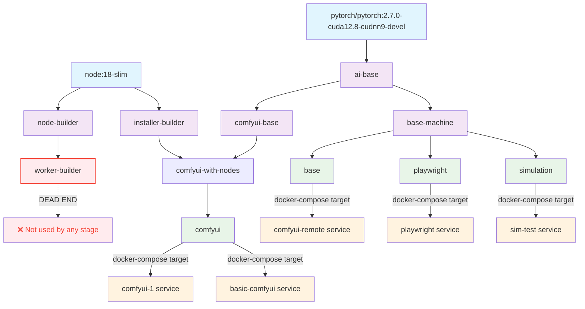

# Docker Build Architecture

This document provides a comprehensive overview of the Docker multi-stage build architecture for the EMP Job Queue machine images.

## Build Stage Dependency Tree

## Stage Breakdown

### Foundation Stages

#### `ai-base` (PyTorch + System Dependencies)
- **Base**: `pytorch/pytorch:2.7.0-cuda12.8-cudnn9-devel`
- **Purpose**: Core AI/ML infrastructure with CUDA support
- **Contents**: 
  - Node.js 18 + pnpm + PM2
  - System dependencies (git, ffmpeg, build tools)
  - Working directories (`/workspace`, `/service-manager`)

#### `base-machine` (Application Foundation)
- **Base**: `ai-base`
- **Purpose**: Complete application foundation with all Node.js dependencies and application code
- **Contents**:
  - Node.js dependencies (pnpm install)
  - Application scripts and source code
  - Worker bundles
  - PM2 ecosystem configuration
  - Entrypoint script

### ComfyUI Pipeline

#### `comfyui-base` (ComfyUI Installation)
- **Base**: `ai-base`  
- **Purpose**: ComfyUI base installation (stable layer)
- **Contents**: ComfyUI cloned and pip requirements installed
- **Caching**: Stable until ComfyUI repo changes

#### `installer-builder` (Custom Nodes Installer)
- **Base**: `node:18-slim`
- **Purpose**: Build standalone installer for custom nodes
- **Contents**: Bundled installer with workspace packages
- **Output**: Used by `comfyui-with-nodes`

#### `comfyui-with-nodes` (ComfyUI + Custom Nodes)
- **Base**: `comfyui-base`
- **Purpose**: ComfyUI with all custom nodes installed
- **Contents**: 
  - ComfyUI base installation
  - 64+ custom nodes (from `config_nodes.json`)
  - Bundled installer from `installer-builder`
- **Caching**: Stable until `config_nodes.json` changes

### Profile Stages (Final Targets)

#### `base` (External API Connectors)
- **Base**: `base-machine`
- **Purpose**: Minimal setup for external API connectors
- **Use Cases**: `comfyui-remote`, external service connectors
- **Contents**: Service manager + worker infrastructure, no local AI services
- **Docker Compose**: `target: base`

#### `comfyui` (Internal ComfyUI)
- **Base**: `comfyui-with-nodes`
- **Purpose**: Full ComfyUI installation with service manager
- **Use Cases**: Local ComfyUI processing
- **Contents**: ComfyUI + custom nodes + service manager from `base-machine`
- **Docker Compose**: `target: comfyui`

#### `playwright` (Browser Automation)
- **Base**: `base-machine`
- **Purpose**: Browser automation capabilities
- **Contents**: Service manager + Playwright browsers
- **Docker Compose**: `target: playwright`

#### `simulation` (Testing/Development)
- **Base**: `base-machine`
- **Purpose**: Testing and simulation environment
- **Contents**: Service manager + simulation tools
- **Docker Compose**: `target: simulation`

## Service to Stage Mapping

| Docker Compose Service | Docker Target | Use Case |
|------------------------|---------------|----------|
| `comfyui-remote` | `base` | External ComfyUI connector |
| `comfyui-1` | `comfyui` | Local ComfyUI instance |
| `basic-comfyui` | `comfyui` | Local ComfyUI instance |
| `sim-test` | `simulation` | Testing environment |
| *(future playwright service)* | `playwright` | Browser automation |

## Build Optimization Strategy

### Layer Caching Hierarchy
1. **Most Stable** (rarely changes):
   - `ai-base`: System dependencies and Node.js
   - `comfyui-base`: ComfyUI installation
   
2. **Moderately Stable** (changes with config):
   - `comfyui-with-nodes`: Custom nodes (changes with `config_nodes.json`)
   - `installer-builder`: Custom nodes installer
   
3. **Frequently Changed** (changes with code):
   - `base-machine`: Application code and dependencies
   - Profile stages: Final configurations

### Cache Busting Arguments
- `CACHE_BUST`: General cache busting for development
- `CUSTOM_NODES_CACHE_BUST`: Specific to custom nodes installation

## Issues and Improvements

### Dead End Stage
❌ **`worker-builder`**: This stage validates worker bundles but is never used by any other stage. It should be removed to reduce build time.

### Redundant Copying
The profile stages have redundant copying patterns. Consider:
- Moving `.env` into `base-machine` stage
- Using `COPY --from=base-machine /service-manager/ /service-manager/` instead of individual file copying

### Potential Optimizations
1. **Remove `worker-builder`** - It's a validation-only stage that's never consumed
2. **Consolidate copying** - Reduce individual file copying in profile stages
3. **Add health checks** - Currently only the final images have health checks
4. **Multi-arch support** - Currently targets `linux/amd64` only

## Worker Bundle Flow

The worker bundle follows this path:
1. **Development**: `pnpm worker:bundle` creates `worker-bundled/`
2. **Build Time**: Copied into `base-machine` stage
3. **Profile Stages**: Copied from `base-machine` to final images
4. **Runtime**: Copied from `/service-manager` to `/workspace` by entrypoint script

## Entrypoint Behavior

All profiles inherit the same entrypoint script which:
1. Sets up environment variables
2. Handles worker bundle deployment (local vs remote)
3. Installs runtime dependencies (`pnpm install`)
4. Creates custom node environment files
5. Starts the main application (`node src/index-pm2.js`)

---

*This document should be updated when the Dockerfile architecture changes.*