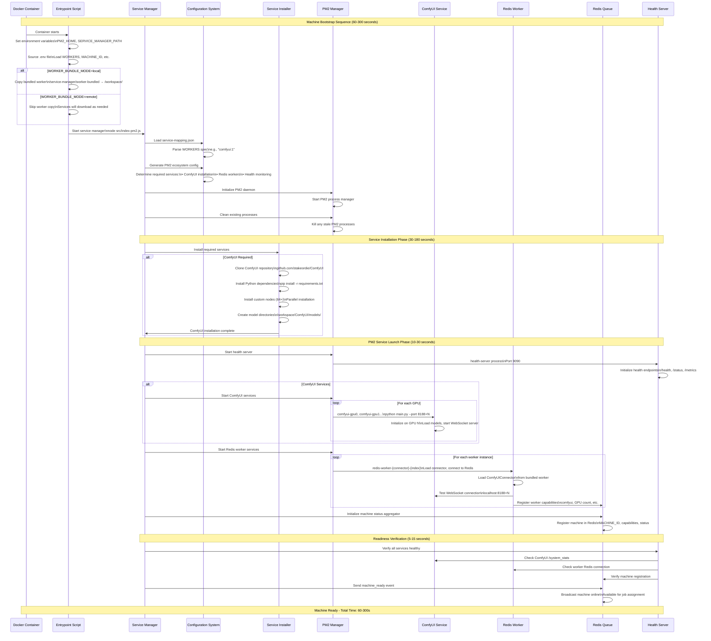
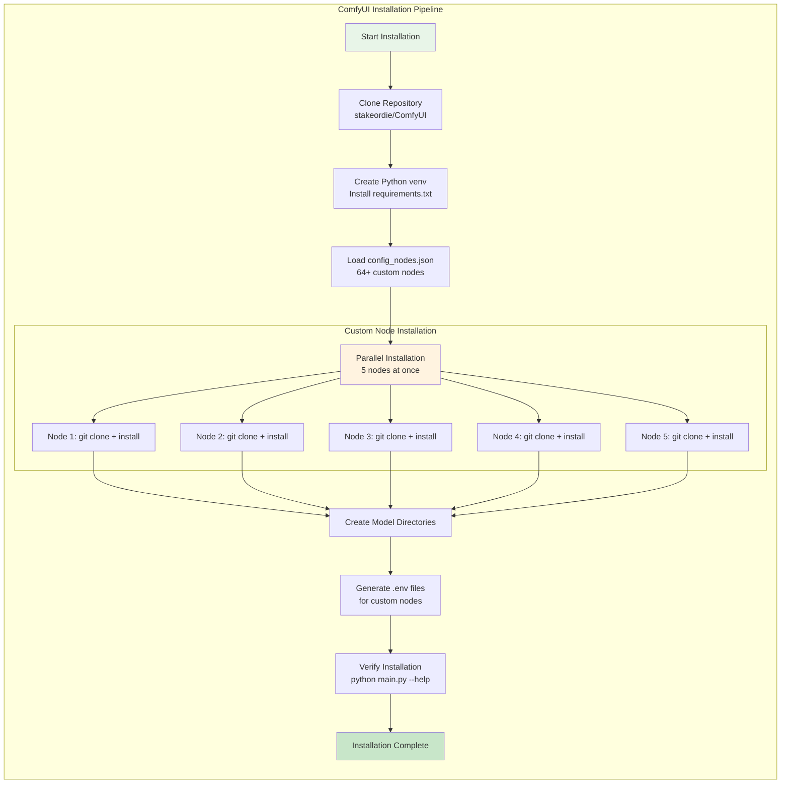
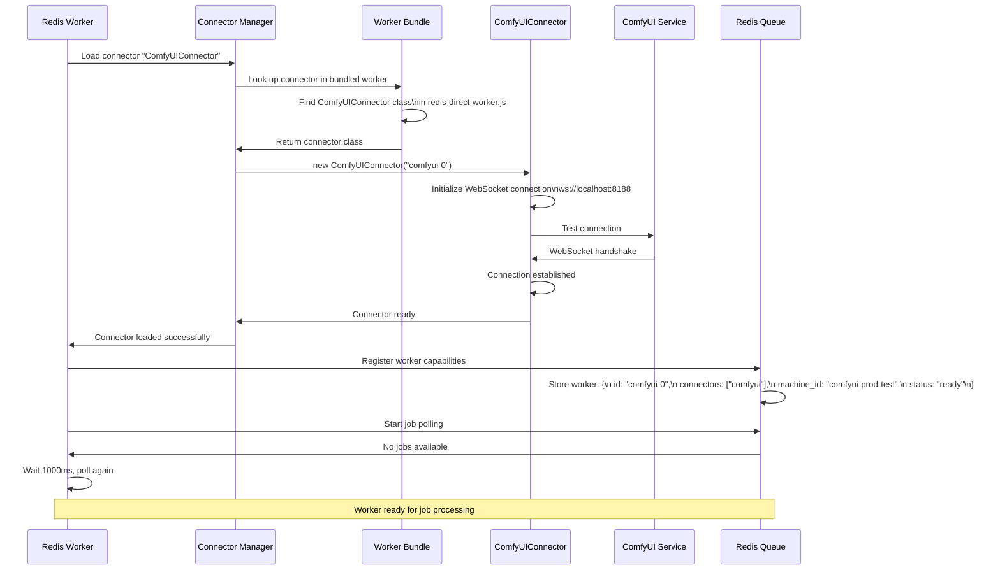
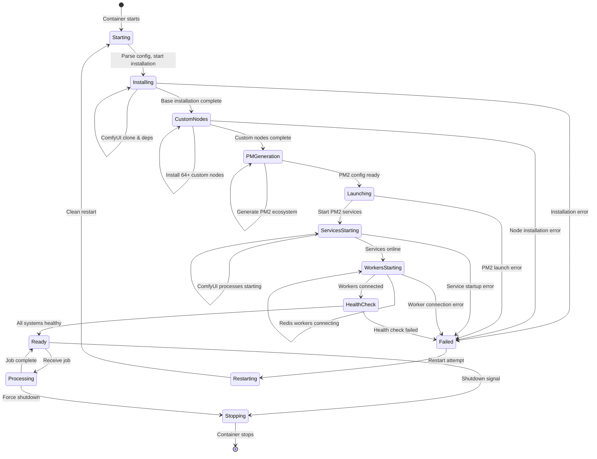

# Machine Bootstrap & Lifecycle Guide

This guide provides a comprehensive overview of how machines bootstrap from container start to job-ready state, including the complete service installation and initialization pipeline.

## Complete Bootstrap Flow

<FullscreenDiagram>



</FullscreenDiagram>

## Service Installation Pipeline

```mermaid
flowchart TD
    START[Service Manager Starts] --> PARSE[Parse service-mapping.json]
    
    PARSE --> WORKERS["Parse WORKERS env var\n e.g., comfyui:1"]
    
    WORKERS --> LOOKUP[Lookup worker config\nin service mapping]
    
    LOOKUP --> CHECK_INSTALLER{Has installer?}
    
    CHECK_INSTALLER -->|Yes| INSTALL_REQUIRED[Installation Required]
    CHECK_INSTALLER -->|No| SKIP_INSTALL[Skip Installation\nExternal service]
    
    INSTALL_REQUIRED --> COMFYUI_INSTALL[ComfyUI Installation Pipeline]
    
    subgraph "ComfyUI Installation (30-180s)"
        COMFYUI_INSTALL --> CLONE["Git clone ComfyUI\nstakeordie/ComfyUI fork"]
        CLONE --> PIP["Install Python deps\npip install -r requirements.txt"]
        PIP --> CUSTOM_NODES["Install Custom Nodes\n64+ nodes in parallel"]
        CUSTOM_NODES --> MODELS["Create model directories\n/workspace/ComfyUI/models/"]
        MODELS --> ENV_FILES["Create .env files\nfor custom nodes"]
        ENV_FILES --> VERIFY_INSTALL["Verify installation\npython main.py --help"]
    end
    
    VERIFY_INSTALL --> PM2_CONFIG[Generate PM2 Config]
    SKIP_INSTALL --> PM2_CONFIG
    
    subgraph "PM2 Ecosystem Generation"
        PM2_CONFIG --> DETECT_GPU[Detect GPU count\nnvidia-smi or mock]
        DETECT_GPU --> SERVICE_INSTANCES[Calculate service instances\n1 per GPU for ComfyUI]
        SERVICE_INSTANCES --> PORT_ASSIGN["Assign ports\n8188, 8189, 8190..."]
        PORT_ASSIGN --> WORKER_INSTANCES[Calculate worker instances\n1 per service instance]
        WORKER_INSTANCES --> ECOSYSTEM["Generate ecosystem.config.js"]
    end
    
    ECOSYSTEM --> LAUNCH[Launch PM2 Services]
    
    subgraph "Service Launch (10-30s)"
        LAUNCH --> HEALTH_SRV[Start health-server\nPort 9090]
        HEALTH_SRV --> START_SERVICES[Start service instances]
        
        START_SERVICES --> COMFYUI_PROC["ComfyUI Processes\npython main.py --port 8188+N"]
        START_SERVICES --> WORKER_PROC[Worker Processes\nredis-worker with connectors]
        
        COMFYUI_PROC --> LOAD_MODELS[Load AI models\nInitialize CUDA]
        WORKER_PROC --> LOAD_CONNECTOR["Load ComfyUIConnector\nConnect to localhost:8188+N"]
        
        LOAD_MODELS --> WEBSOCKET[Start WebSocket server\nAccept connections]
        LOAD_CONNECTOR --> REDIS_CONN[Connect to Redis queue\nRegister capabilities]
    end
    
    WEBSOCKET --> READY[Machine Ready]
    REDIS_CONN --> READY
    
    READY --> JOBS[Ready for job processing]
    
    style START fill:#e8f5e8
    style INSTALL_REQUIRED fill:#fff3e0
    style COMFYUI_INSTALL fill:#e1f5fe
    style PM2_CONFIG fill:#f3e5f5
    style LAUNCH fill:#ffebee
    style READY fill:#c8e6c9
    style JOBS fill:#4caf50,color:#fff
```

<FullscreenDiagram>



</FullscreenDiagram>

## Detailed Component Breakdown

### 1. Service Mapping Resolution

When a machine starts with `WORKERS=comfyui:1`, the system:

1. **Parses the worker specification**: `comfyui:1` → worker type: `comfyui`, instances: `1`
2. **Looks up in service-mapping.json**:
   ```json
   "comfyui": {
     "service": [{"capability": "comfyui", "connector": "ComfyUIConnector"}],
     "installer": "installComfyUI",
     "resource_binding": "gpu",
     "service_instances_per_gpu": "1",
     "ports": ["8188"]
   }
   ```
3. **Determines requirements**: Needs ComfyUI installation, GPU binding, port 8188+

### 2. ComfyUI Installation Process

<FullscreenDiagram>



</FullscreenDiagram>

**Installation Details:**
- **Repository**: `https://github.com/stakeordie/ComfyUI.git` (fork with WebSocket improvements)
- **Location**: `/workspace/ComfyUI/`
- **Custom Nodes**: 64+ nodes installed to `/workspace/ComfyUI/custom_nodes/`
- **Models**: Downloaded to `/workspace/ComfyUI/models/checkpoints/`, `/workspace/ComfyUI/models/loras/`, etc.
- **Time**: 30-180 seconds depending on network speed and node complexity

### 3. PM2 Ecosystem Generation

The system dynamically generates PM2 configuration based on:

**GPU Detection:**
```javascript
// Enhanced PM2 ecosystem generator
const gpuCount = detectGPUs(); // nvidia-smi or MOCK_GPU_NUM
const serviceInstances = workerSpec.instances * gpuCount;
const portStart = 8188;
```

**Generated PM2 Config Example (comfyui:1 on 2 GPUs):**
```javascript
module.exports = {
  apps: [
    {
      name: "health-server",
      script: "src/services/health-server.js",
      instances: 1,
      env: { NODE_ENV: "production" }
    },
    {
      name: "comfyui-gpu0", 
      script: "python",
      args: ["main.py", "--listen", "0.0.0.0", "--port", "8188"],
      cwd: "/workspace/ComfyUI",
      env: { CUDA_VISIBLE_DEVICES: "0" }
    },
    { 
      name: "comfyui-gpu1",
      script: "python", 
      args: ["main.py", "--listen", "0.0.0.0", "--port", "8189"],
      cwd: "/workspace/ComfyUI",
      env: { CUDA_VISIBLE_DEVICES: "1" }
    },
    {
      name: "redis-worker-comfyui-0",
      script: "src/services/standalone-wrapper.js",
      args: ["redis-worker", "--index=0"],
      env: {
        WORKER_ID: "comfyui-0",
        CONNECTORS: "comfyui",
        COMFYUI_HOST: "localhost",
        COMFYUI_PORT: "8188"
      }
    },
    {
      name: "redis-worker-comfyui-1", 
      script: "src/services/standalone-wrapper.js",
      args: ["redis-worker", "--index=1"],
      env: {
        WORKER_ID: "comfyui-1",
        CONNECTORS: "comfyui", 
        COMFYUI_HOST: "localhost",
        COMFYUI_PORT: "8189"
      }
    }
  ]
};
```

### 4. Connector Loading & Initialization

<FullscreenDiagram>



</FullscreenDiagram>

## Machine States & Transitions

<FullscreenDiagram>



</FullscreenDiagram>

## Timing Breakdown

| Phase | Duration | What's Happening |
|-------|----------|------------------|
| **Container Start** | 1-2s | Docker initialization, entrypoint script |
| **Configuration** | 2-5s | Parse service-mapping.json, environment setup |
| **ComfyUI Installation** | 30-180s | Git clone, pip install, custom nodes |
| **PM2 Generation** | 1-3s | Generate ecosystem config, detect GPUs |
| **Service Launch** | 10-30s | Start ComfyUI processes, model loading |
| **Worker Initialization** | 5-15s | Load connectors, connect to Redis |
| **Health Verification** | 2-8s | Verify all services healthy |
| **Total Time** | **60-300s** | **From start to job-ready** |

## Troubleshooting Bootstrap Issues

### Common Failure Points

1. **ComfyUI Installation Fails**
   - **Symptoms**: Installation hangs or errors during pip install
   - **Causes**: Network issues, dependency conflicts, disk space
   - **Solutions**: Check network connectivity, increase timeout, verify disk space

2. **Custom Nodes Installation Fails**
   - **Symptoms**: Some nodes fail to install, missing dependencies
   - **Causes**: Node-specific requirements, git access issues
   - **Solutions**: Check `config_nodes.json`, verify git credentials

3. **ComfyUI Won't Start**
   - **Symptoms**: PM2 shows ComfyUI processes as failed/errored
   - **Causes**: CUDA issues, model loading failures, port conflicts
   - **Solutions**: Check GPU availability, verify model paths, check port usage

4. **Workers Can't Connect**
   - **Symptoms**: Workers fail to connect to ComfyUI or Redis
   - **Causes**: Network issues, connector loading failures, authentication
   - **Solutions**: Verify ComfyUI is running, check Redis connectivity, validate connector bundle

5. **Health Checks Fail**
   - **Symptoms**: Machine never reports as ready
   - **Causes**: Service dependencies not met, timeout issues
   - **Solutions**: Check all service dependencies, increase health check timeouts

### Debugging Commands

```bash
# Check PM2 processes
pm2 list
pm2 logs

# Check ComfyUI installation
ls -la /workspace/ComfyUI/
python /workspace/ComfyUI/main.py --help

# Check custom nodes
ls -la /workspace/ComfyUI/custom_nodes/

# Check health endpoints
curl http://localhost:9090/health
curl http://localhost:9090/status

# Check Redis connectivity
redis-cli -h <redis-host> ping

# Check service mapping
cat /service-manager/src/config/service-mapping.json
```

## Performance Optimization

### Faster Bootstrap Strategies

1. **Pre-baked Images**: Include ComfyUI and custom nodes in Docker image
2. **Model Caching**: Pre-download common models
3. **Parallel Installation**: Install custom nodes in parallel (already implemented)
4. **Resource Allocation**: Ensure adequate CPU/memory during bootstrap
5. **Network Optimization**: Use local mirrors for dependencies

### Monitoring Bootstrap Performance

The system logs detailed timing information:

```
12:16:52.647 [info] [machine-status-aggregator] Machine Status Aggregator initialized
12:16:54.733 [info] [main-pm2] Generating PM2 ecosystem config...
12:16:55.183 [info] [main-pm2] PM2 ecosystem config generated successfully  
12:16:55.952 [info] [main-pm2] PM2 daemon started
12:17:00.025 [info] [main-pm2] Basic Machine ready in PM2 mode (4840ms)
```

This comprehensive bootstrap process ensures that when you run `comfyui:1`, you get a fully configured machine with ComfyUI installed, custom nodes loaded, workers connected, and the system ready to process jobs through the Redis queue.