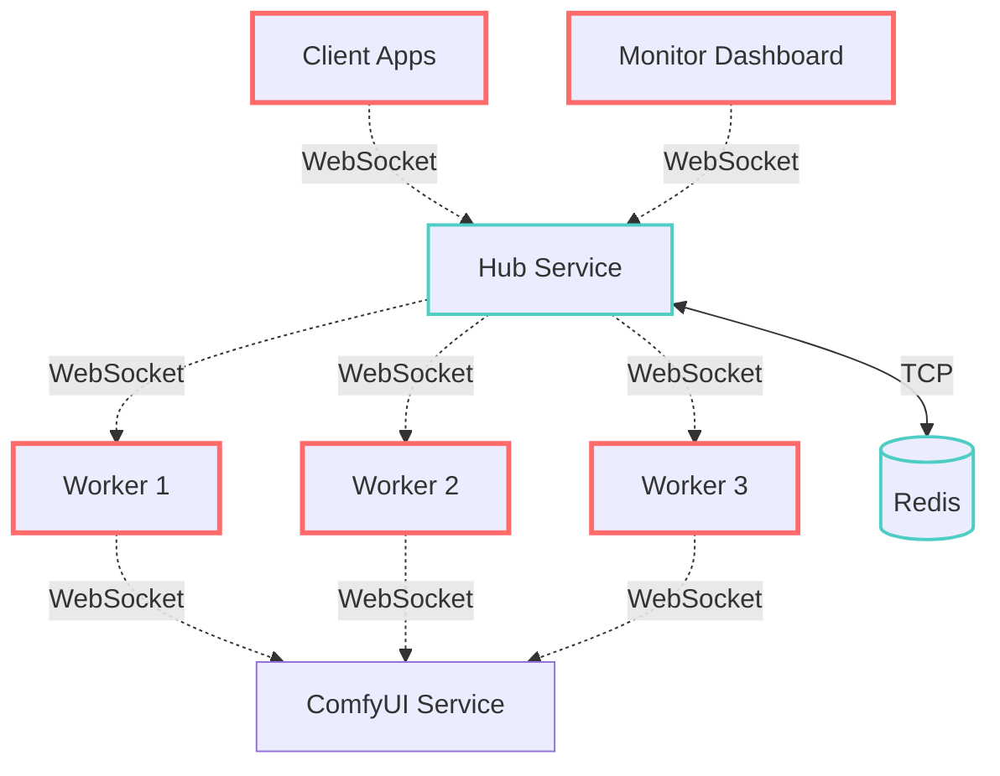
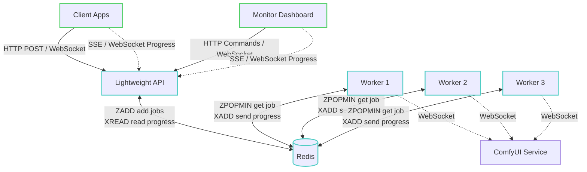
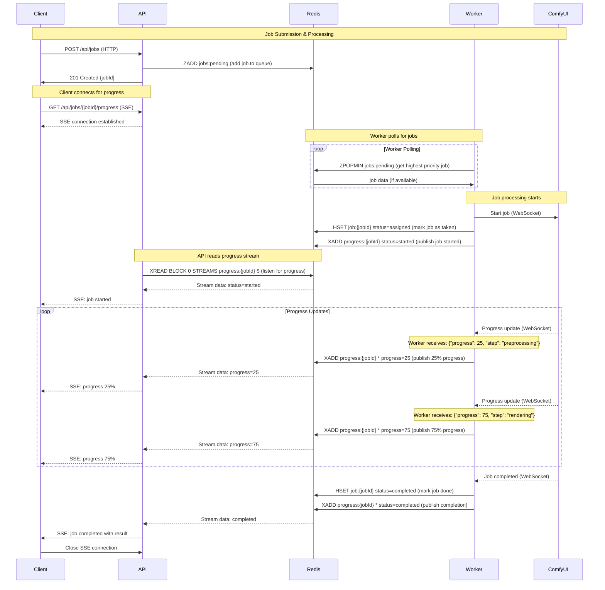
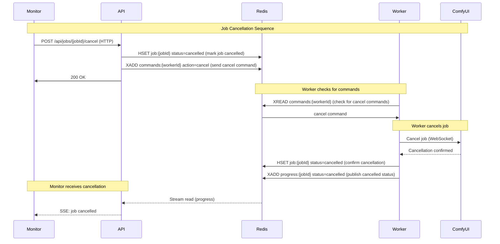
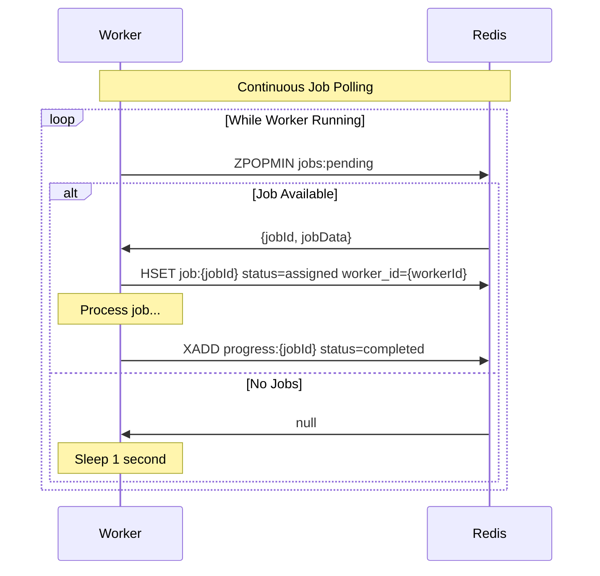
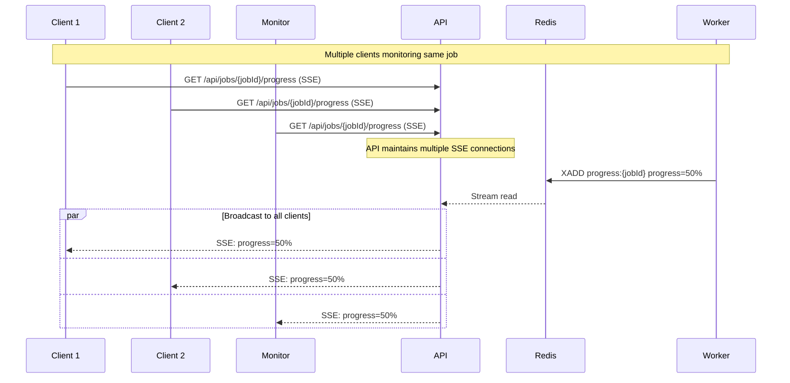

# Redis-Direct Architecture

This document outlines the proposed Redis-direct architecture that replaces WebSocket orchestration with direct Redis communication.

## Overview

The new architecture eliminates the hub as a message orchestrator and instead uses Redis as the central coordination point. Workers poll Redis directly for jobs, and clients receive progress updates via Server-Sent Events (SSE).

## Current vs Proposed Architecture

### Current Hub-Centric Architecture

<FullscreenDiagram>



</FullscreenDiagram>

### Proposed Redis-Direct Architecture

<FullscreenDiagram>



</FullscreenDiagram>

## Connection Types Overview

### HTTP Connections (Commands)
- **Client → API**: Job submission, cancellation, status queries
- **Monitor → API**: Job management commands (cancel, retry, pause)
- **Characteristics**: Request/response, reliable, infrequent

### WebSocket Connections (Backwards Compatibility)
- **Client ↔ API**: Job submission + real-time progress (legacy clients)
- **Monitor ↔ API**: Commands + live updates (existing monitoring tools)
- **Characteristics**: Bidirectional, real-time, maintains existing client code

### Server-Sent Events (Progress Streaming)
- **API → Client**: Real-time job progress updates (new clients)
- **API → Monitor**: Live job status and progress (modern approach)
- **Characteristics**: One-way server→client, auto-reconnect, frequent updates

### TCP Redis Connections
- **Workers ↔ Redis**: Job polling, status updates, progress publishing
- **API ↔ Redis**: Job creation, stats queries, progress forwarding
- **Characteristics**: Direct database operations, high performance

### WebSocket Connections (Service Integration)
- **Workers ↔ ComfyUI**: Only for service-specific communication
- **Characteristics**: Real-time progress from AI services

## Detailed Sequence Diagrams

### Job Submission & Processing Flow

<FullscreenDiagram>



</FullscreenDiagram>

### Job Cancellation Flow

<FullscreenDiagram>



</FullscreenDiagram>

### Worker Job Polling Pattern

<FullscreenDiagram>



</FullscreenDiagram>

### Multi-Client Progress Monitoring


## Key Architectural Benefits

### Eliminated Complexity
- ❌ No WebSocket connection management in hub
- ❌ No message routing and orchestration logic
- ❌ No worker capability tracking in memory
- ❌ No complex bidirectional message handling

### Added Simplicity  
- ✅ Direct Redis operations (atomic, reliable)
- ✅ HTTP API for commands (standard REST patterns)
- ✅ SSE for streaming (browser-native, auto-reconnect)
- ✅ Redis handles all concurrency and race conditions

### Improved Reliability
- ✅ No single hub failure point
- ✅ Workers can restart independently
- ✅ Redis Streams provide guaranteed delivery
- ✅ Natural load balancing via Redis polling

## Data Structures in Redis

### Job Storage
```redis
# Pending jobs queue (sorted set by priority)
ZADD jobs:pending {priority_score} {job_id}

# Individual job data (hash)
HSET job:{job_id} 
  id {job_id}
  service_required "comfyui"
  status "pending|assigned|completed|failed|cancelled"
  worker_id {worker_id}
  created_at {timestamp}
  # ... other job fields

# Job progress streams
XADD progress:{job_id} * 
  progress 50
  message "Processing step 3 of 5"
  worker_id {worker_id}
  timestamp {timestamp}

# Worker command streams  
XADD commands:{worker_id} *
  action "cancel|pause|retry"
  job_id {job_id}
  timestamp {timestamp}
```

### Worker Coordination
```redis
# Active jobs per worker (for cleanup)
HSET jobs:active:{worker_id} {job_id} {job_data}

# Worker heartbeats (for health monitoring)
HSET worker:{worker_id}
  last_heartbeat {timestamp}
  status "idle|busy"
  current_job_id {job_id}
```

## Backwards Compatibility Implementation

The lightweight API supports both new (Redis-direct) and legacy (WebSocket) client patterns:

### Legacy WebSocket Client Support
```javascript
// Existing client code continues to work
const ws = new WebSocket('ws://api/hub');

// Submit job via WebSocket (legacy)
ws.send(JSON.stringify({
  type: 'submit_job',
  job_type: 'comfyui',
  payload: {...}
}));

// Receive progress via WebSocket (legacy)
ws.onmessage = (event) => {
  const message = JSON.parse(event.data);
  if (message.type === 'job_progress') {
    updateProgress(message.progress);
  }
};
```

### API Implementation (Hybrid Support)
```typescript
class LightweightAPI {
  // WebSocket handler for backwards compatibility
  handleWebSocketMessage(ws, message) {
    switch (message.type) {
      case 'submit_job':
        // Submit to Redis (same as HTTP endpoint)
        const jobId = await redis.zadd('jobs:pending', priority, jobData);
        ws.send({type: 'job_submitted', job_id: jobId});
        break;
        
      case 'subscribe_progress':
        // Subscribe WebSocket client to Redis Stream
        this.subscribeWebSocketToProgress(ws, message.job_id);
        break;
    }
  }
  
  // Forward Redis Stream progress to WebSocket clients
  async subscribeWebSocketToProgress(ws, jobId) {
    const stream = redis.xread('BLOCK', 0, 'STREAMS', `progress:${jobId}`, '$');
    stream.on('data', (progressData) => {
      ws.send({
        type: 'job_progress', 
        job_id: jobId,
        progress: progressData.progress
      });
    });
  }
}
```

### Migration Path
1. **Phase 1**: API supports both WebSocket + SSE/HTTP
2. **Phase 2**: Migrate clients gradually to SSE/HTTP  
3. **Phase 3**: Deprecate WebSocket support (optional)

This architecture provides the same real-time capabilities as the WebSocket approach but with significantly reduced complexity and improved reliability for high-concurrency scenarios, while maintaining full backwards compatibility for existing clients.