# Technical Implementation Guide

This guide provides detailed technical diagrams and implementation details for the unified machine architecture.

## Service Startup Sequence

<fullscreen>

</fullscreen>

## Redis Job Matching Algorithm

<fullscreen>
```mermaid
flowchart TD
    START[Worker requests job] --> CHECK_QUEUE{Jobs in queue?}
    
    CHECK_QUEUE -->|No| WAIT[Wait and retry]
    CHECK_QUEUE -->|Yes| GET_CAPS[Get worker capabilities<br/>• machine_type: gpu/api<br/>• connectors: [comfyui, openai...]<br/>• gpu_count, memory, etc.]
    
    GET_CAPS --> SCAN_JOBS[Scan job queue for matches]
    
    SCAN_JOBS --> MATCH_CHECK{Job requirements match<br/>worker capabilities?}
    
    MATCH_CHECK -->|No| NEXT_JOB[Check next job]
    MATCH_CHECK -->|Yes| CLAIM_ATOMIC[Atomic job claim<br/>Redis SCRIPT execution]
    
    CLAIM_ATOMIC --> CLAIMED{Successfully claimed?}
    
    CLAIMED -->|No| NEXT_JOB
    CLAIMED -->|Yes| ASSIGN[Assign job to worker<br/>Update job status: processing]
    
    ASSIGN --> PROCESS[Worker processes job]
    
    PROCESS --> COMPLETE[Job completion<br/>Update status: completed]
    
    NEXT_JOB --> SCAN_JOBS
    WAIT --> CHECK_QUEUE
    COMPLETE --> START
    
    style START fill:#e8f5e8
    style CHECK_QUEUE fill:#fff3e0
    style MATCH_CHECK fill:#e1f5fe
    style CLAIM_ATOMIC fill:#ffebee
    style CLAIMED fill:#f3e5f5
    style COMPLETE fill:#c8e6c9
```
</fullscreen>

## Docker Layer Caching Strategy

<fullscreen>

</fullscreen>

## Service Communication Patterns

<fullscreen>

</fullscreen>

## Error Handling & Recovery

```mermaid
stateDiagram-v2
    [*] --> Healthy: Service starts
    
    Healthy --> ServiceFailure: Service crashes
    Healthy --> ConnectionLoss: Redis disconnection
    Healthy --> ResourceExhausted: Memory/CPU limits
    
    ServiceFailure --> Restarting: PM2 auto-restart
    ConnectionLoss --> Reconnecting: Retry connection
    ResourceExhausted --> ResourceRecovery: Free resources
    
    Restarting --> Healthy: Restart successful
    Restarting --> Failed: Max restarts exceeded
    
    Reconnecting --> Healthy: Connection restored
    Reconnecting --> Failed: Connection timeout
    
    ResourceRecovery --> Healthy: Resources freed
    ResourceRecovery --> Failed: Resource leak
    
    Failed --> [*]: Machine shutdown
    
    note right of Healthy
        Normal operation:
        • Processing jobs
        • Health checks pass
        • Redis connected
    end note
    
    note right of Failed
        Terminal states:
        • Send shutdown event
        • Return jobs to queue
        • Container exit
    end note
```

<fullscreen>

</fullscreen>

## Performance Monitoring

<fullscreen>
```mermaid
graph TD
    subgraph "Metrics Collection"
        PM2_METRICS[PM2 Process Metrics<br/>• CPU usage<br/>• Memory usage<br/>• Restart count<br/>• Uptime]
        
        SYSTEM_METRICS[System Metrics<br/>• GPU utilization<br/>• Disk I/O<br/>• Network traffic<br/>• Temperature]
        
        APP_METRICS[Application Metrics<br/>• Job completion time<br/>• Queue wait time<br/>• Error rates<br/>• Throughput]
    end
    
    subgraph "Health Endpoints"
        HEALTH_CHECK[/health<br/>Overall status<br/>Boolean healthy]
        
        STATUS_DETAIL[/status<br/>Detailed metrics<br/>JSON response]
        
        METRICS_EXPORT[/metrics<br/>Prometheus format<br/>Time series data]
    end
    
    subgraph "Monitoring Integration"
        REDIS_PUB[Redis Pub/Sub<br/>Real-time updates<br/>15-second intervals]
        
        WEBSOCKET_UI[WebSocket Monitor<br/>Live dashboard<br/>Machine cards]
        
        PROMETHEUS[Prometheus<br/>Metrics scraping<br/>Alerting rules]
    end
    
    PM2_METRICS --> STATUS_DETAIL
    SYSTEM_METRICS --> STATUS_DETAIL
    APP_METRICS --> STATUS_DETAIL
    
    STATUS_DETAIL --> REDIS_PUB
    HEALTH_CHECK --> REDIS_PUB
    METRICS_EXPORT --> PROMETHEUS
    
    REDIS_PUB --> WEBSOCKET_UI
    PROMETHEUS --> WEBSOCKET_UI
    
    style PM2_METRICS fill:#e1f5fe
    style SYSTEM_METRICS fill:#f3e5f5
    style APP_METRICS fill:#e8f5e8
    style HEALTH_CHECK fill:#c8e6c9
    style STATUS_DETAIL fill:#fff3e0
    style REDIS_PUB fill:#ffebee
    style WEBSOCKET_UI fill:#f9fbe7
```
</fullscreen>

## Configuration Management

<fullscreen>

</fullscreen>

## Deployment Pipeline

<fullscreen>

</fullscreen>

## Resource Allocation Strategy

<fullscreen>
```mermaid
graph TB
    subgraph "Resource Pools"
        FAST_POOL[Fast Lane Pool<br/>API Machines<br/>• 2 CPU, 4GB RAM<br/>• No GPU required<br/>• High concurrency]
        
        STANDARD_POOL[Standard Pool<br/>GPU Machines<br/>• 8 CPU, 32GB RAM<br/>• RTX 4090 (24GB)<br/>• ComfyUI optimized]
        
        HEAVY_POOL[Heavy Pool<br/>High-End Machines<br/>• 16 CPU, 64GB RAM<br/>• Multi-GPU setup<br/>• Video processing]
    end
    
    subgraph "Job Classification"
        CLASSIFY[Job Classifier<br/>Analyze requirements<br/>Route to appropriate pool]
        
        QUICK_JOBS[Quick Jobs<br/>• Text generation<br/>• Simple image ops<br/>• API calls<br/>→ Fast Lane]
        
        STANDARD_JOBS[Standard Jobs<br/>• Image generation<br/>• ComfyUI workflows<br/>• Model inference<br/>→ Standard Pool]
        
        HEAVY_JOBS[Heavy Jobs<br/>• Video generation<br/>• Large model training<br/>• Batch processing<br/>→ Heavy Pool]
    end
    
    subgraph "Auto-Scaling"
        METRICS[Resource Metrics<br/>• Queue depth<br/>• Processing time<br/>• Success rates]
        
        SCALER[Auto Scaler<br/>• Scale up on demand<br/>• Scale down on idle<br/>• Cost optimization]
        
        ALERTS[Scaling Alerts<br/>• Resource exhaustion<br/>• Performance degradation<br/>• Cost thresholds]
    end
    
    CLASSIFY --> QUICK_JOBS --> FAST_POOL
    CLASSIFY --> STANDARD_JOBS --> STANDARD_POOL
    CLASSIFY --> HEAVY_JOBS --> HEAVY_POOL
    
    FAST_POOL --> METRICS
    STANDARD_POOL --> METRICS
    HEAVY_POOL --> METRICS
    
    METRICS --> SCALER --> ALERTS
    
    style FAST_POOL fill:#f3e5f5
    style STANDARD_POOL fill:#e1f5fe
    style HEAVY_POOL fill:#ffebee
    style CLASSIFY fill:#fff3e0
    style SCALER fill:#e8f5e8
```
</fullscreen>

## Implementation Checklist

### ✅ Completed Components

- **Base Machine Foundation**: Core PM2 service management, Redis integration
- **Docker Layer Strategy**: Optimized caching with 90% hit rate
- **GPU Machine Extension**: ComfyUI + CUDA support maintaining 100% compatibility
- **API Machine Extension**: OpenAI, Replicate, RunPod connectors
- **Health Monitoring**: Comprehensive HTTP endpoints and diagnostics
- **Configuration System**: Hierarchical environment-based configuration
- **Build Automation**: `./build-machines.sh` with cache optimization

### 🔄 Next Implementation Steps

1. **Integration Testing**: Test with existing Redis infrastructure
2. **Performance Validation**: Benchmark against current system
3. **Security Hardening**: Container security, secret management
4. **Monitoring Integration**: Prometheus metrics, alerting rules
5. **Documentation**: API documentation, troubleshooting guides

### 🎯 Success Metrics

- **Build Time**: < 5 minutes for full stack (vs 15 minutes current)
- **Cache Hit Rate**: > 90% for incremental builds
- **Resource Efficiency**: 60% reduction in storage requirements
- **Development Speed**: 50% faster iteration cycles
- **Operational Consistency**: 100% unified health checking