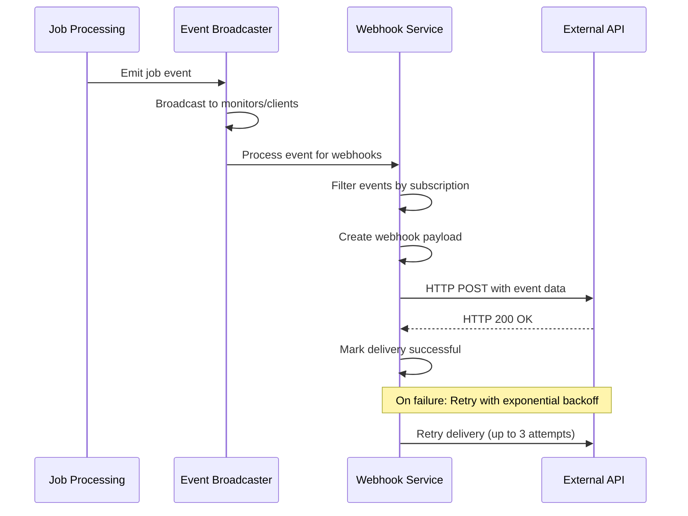

# Webhook Notification System

The webhook notification system enables real-time HTTP callbacks for job status changes and other events in the EMP Job Queue system. This allows external systems to receive immediate notifications without polling.

## Architecture Overview

<FullscreenDiagram>



</FullscreenDiagram>

## Webhook Configuration

### Event Types

The system supports the following webhook event types:

| Event Type | Description | Triggered When |
|------------|-------------|----------------|
| `job.submitted` | Job added to queue | New job submitted via API |
| `job.assigned` | Job assigned to worker | Worker claims job from queue |
| `job.progress` | Job progress update | Worker reports progress |
| `job.completed` | Job completed successfully | Worker completes job |
| `job.failed` | Job failed | Worker reports job failure |
| `job.cancelled` | Job cancelled | Job cancelled externally |
| `job.timeout` | Job timed out | Job exceeds time limit |
| `job.status_changed` | Any job status change | Status transitions |
| `machine.startup` | Machine came online | Machine bootstrap complete |
| `machine.shutdown` | Machine went offline | Machine shutdown |
| `worker.connected` | Worker connected | Worker registers with Redis |
| `worker.disconnected` | Worker disconnected | Worker loses connection |

### Webhook Payload Format

```typescript
interface WebhookPayload {
  event_type: WebhookEventType;
  event_id: string;           // Unique event identifier
  timestamp: number;          // Unix timestamp (ms)
  webhook_id: string;         // Webhook configuration ID
  data: {
    job_id?: string;          // Job identifier (if applicable)
    job_type?: string;        // Job type (e.g., 'comfyui')
    job_status?: JobStatus;   // Current job status
    worker_id?: string;       // Worker handling the job
    machine_id?: string;      // Machine running the worker
    progress?: number;        // Progress percentage (0-100)
    result?: unknown;         // Job result data
    error?: string;           // Error message (if failed)
    [key: string]: unknown;   // Additional event-specific data
  };
  metadata?: {
    retry_attempt?: number;   // Retry attempt number
    original_timestamp?: number; // Original event timestamp
  };
}
```

### Event Filtering

Webhooks support advanced filtering to reduce noise:

```typescript
interface WebhookFilters {
  job_types?: string[];          // Filter by job type
  job_priorities?: number[];     // Filter by priority levels
  machine_ids?: string[];        // Filter by specific machines
  worker_ids?: string[];         // Filter by specific workers
  custom_filters?: Record<string, unknown>; // Custom criteria
}
```

## API Endpoints

### Webhook Management

| Endpoint | Method | Description |
|----------|--------|-------------|
| `/api/webhooks` | GET | List all webhooks |
| `/api/webhooks` | POST | Create new webhook |
| `/api/webhooks/:id` | GET | Get specific webhook |
| `/api/webhooks/:id` | PUT | Update webhook |
| `/api/webhooks/:id` | DELETE | Delete webhook |
| `/api/webhooks/:id/test` | POST | Test webhook endpoint |
| `/api/webhooks/:id/stats` | GET | Get delivery statistics |

### Create Webhook Example

```bash
curl -X POST http://localhost:4000/api/webhooks \
  -H "Content-Type: application/json" \
  -d '{
    "url": "https://api.example.com/webhooks/jobs",
    "secret": "your-secret-key",
    "events": ["job.submitted", "job.completed", "job.failed"],
    "filters": {
      "job_types": ["comfyui"],
      "job_priorities": [1, 2, 3]
    },
    "headers": {
      "Authorization": "Bearer your-api-token"
    },
    "retry_config": {
      "max_attempts": 3,
      "initial_delay_ms": 1000,
      "backoff_multiplier": 2,
      "max_delay_ms": 30000
    },
    "active": true
  }'
```

Response:
```json
{
  "success": true,
  "data": {
    "id": "wh_1234567890_abc123def",
    "url": "https://api.example.com/webhooks/jobs",
    "events": ["job.submitted", "job.completed", "job.failed"],
    "filters": {
      "job_types": ["comfyui"],
      "job_priorities": [1, 2, 3]
    },
    "active": true,
    "created_at": 1642123456789,
    "updated_at": 1642123456789
  },
  "timestamp": "2024-01-14T10:30:56.789Z"
}
```

## Security Features

### HMAC Signature Verification

When a webhook includes a `secret`, all payloads are signed with HMAC-SHA256:

```http
POST /your/webhook/endpoint HTTP/1.1
Content-Type: application/json
User-Agent: EMP-Job-Queue-Webhook/1.0
X-Webhook-Event: job.completed
X-Webhook-ID: wh_1234567890_abc123def
X-Event-ID: evt_9876543210_xyz789abc
X-Webhook-Signature: sha256=a1b2c3d4e5f6...
```

To verify the signature in your webhook handler:

```javascript
const crypto = require('crypto');

function verifyWebhookSignature(payload, signature, secret) {
  const expectedSignature = crypto
    .createHmac('sha256', secret)
    .update(JSON.stringify(payload))
    .digest('hex');
  
  const providedSignature = signature.replace('sha256=', '');
  
  return crypto.timingSafeEqual(
    Buffer.from(expectedSignature, 'hex'),
    Buffer.from(providedSignature, 'hex')
  );
}
```

### Headers and Authentication

Webhooks support custom headers for authentication:

```json
{
  "headers": {
    "Authorization": "Bearer your-api-token",
    "X-API-Key": "your-api-key",
    "Content-Type": "application/json"
  }
}
```

## Retry Logic

### Exponential Backoff

Failed webhook deliveries are retried with exponential backoff:

1. **Initial Delay**: 1 second (configurable)
2. **Backoff Multiplier**: 2x (configurable)
3. **Maximum Attempts**: 3 (configurable)
4. **Maximum Delay**: 30 seconds (configurable)

**Retry Schedule Example:**
- Attempt 1: Immediate
- Attempt 2: +1 second
- Attempt 3: +2 seconds
- Attempt 4: +4 seconds (if max_attempts > 3)

### Failure Conditions

Webhooks are considered failed if:
- HTTP status code >= 400
- Connection timeout (30 seconds)
- Network error or DNS resolution failure
- SSL/TLS certificate issues

## Monitoring and Debugging

### Delivery Statistics

```bash
curl http://localhost:4000/api/webhooks/wh_123/stats
```

```json
{
  "success": true,
  "data": {
    "total_deliveries": 150,
    "successful_deliveries": 148,
    "failed_deliveries": 2,
    "retry_queue_size": 0,
    "pending_deliveries": 1
  }
}
```

### Testing Webhooks

Test webhook endpoints without triggering real events:

```bash
curl -X POST http://localhost:4000/api/webhooks/wh_123/test
```

This sends a test payload:
```json
{
  "event_type": "job.submitted",
  "event_id": "test_1234567890_abc123",
  "timestamp": 1642123456789,
  "webhook_id": "wh_123",
  "data": {
    "job_id": "test_job_123",
    "job_type": "test",
    "job_status": "pending"
  },
  "metadata": {
    "test": true
  }
}
```

### Logging

Webhook activities are logged with structured data:

```
[2024-01-14T10:30:56.789Z] INFO: Webhook registered: wh_123 -> https://api.example.com/hooks
[2024-01-14T10:31:15.123Z] INFO: Webhook delivered successfully: wh_123 (job.completed, job_123)
[2024-01-14T10:31:45.456Z] WARN: Webhook delivery failed: wh_123 (attempt 1) - HTTP 500
[2024-01-14T10:31:47.789Z] INFO: Webhook retry scheduled: wh_123 in 2000ms (attempt 2/3)
```

## Implementation Details

### Integration with EventBroadcaster

The webhook system integrates seamlessly with the existing event system:

```typescript
// In EventBroadcaster.broadcast()
broadcast(event: MonitorEvent): void {
  // Send to monitors and clients (existing)
  this.broadcastToMonitors(event);
  this.broadcastToClients(event);
  
  // Send to webhooks (new)
  this.webhookService.processEvent(event).catch(error => {
    logger.error('Webhook processing failed', { 
      eventType: event.type, 
      error: error.message 
    });
  });
}
```

### Performance Considerations

- **Asynchronous Processing**: Webhook delivery doesn't block event broadcasting
- **Queue Management**: Delivery queue processes one webhook at a time per service instance
- **Memory Usage**: Limited event history (1000 events) and delivery queue
- **Rate Limiting**: Consider implementing rate limiting for high-volume scenarios

### High Availability

For production deployments:

1. **Multiple API Instances**: Each instance has its own webhook service
2. **Shared State**: Consider Redis-backed webhook configuration storage
3. **Dead Letter Queue**: Implement persistent retry queue for critical webhooks
4. **Monitoring**: Set up alerts for webhook delivery failures

## Common Use Cases

### External System Integration

```javascript
// Webhook handler in external service
app.post('/webhooks/emp-jobs', (req, res) => {
  const { event_type, data } = req.body;
  
  switch (event_type) {
    case 'job.completed':
      // Update external database
      await updateJobStatus(data.job_id, 'completed', data.result);
      break;
      
    case 'job.failed':
      // Send alert to monitoring system
      await sendAlert('Job failed', data.error);
      break;
      
    case 'machine.startup':
      // Scale up related resources
      await scaleUpResources(data.machine_id);
      break;
  }
  
  res.status(200).json({ received: true });
});
```

### Workflow Orchestration

```json
{
  "url": "https://workflow.example.com/job-events",
  "events": ["job.completed"],
  "filters": {
    "job_types": ["workflow-step"]
  }
}
```

### Real-time Dashboards

```json
{
  "url": "https://dashboard.example.com/live-updates",
  "events": ["job.progress", "machine.startup", "worker.connected"],
  "filters": {
    "machine_ids": ["prod-cluster-*"]
  }
}
```

This webhook system provides a robust, secure, and scalable way to integrate the EMP Job Queue with external systems, enabling real-time event-driven architectures and automated workflows.