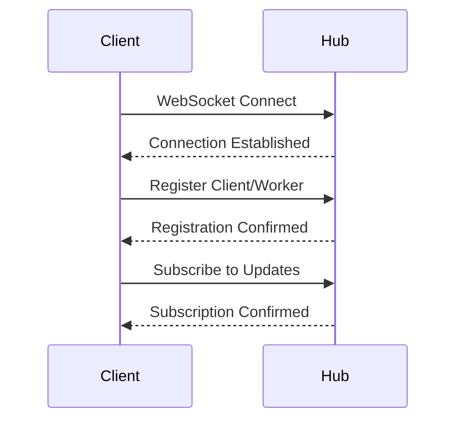
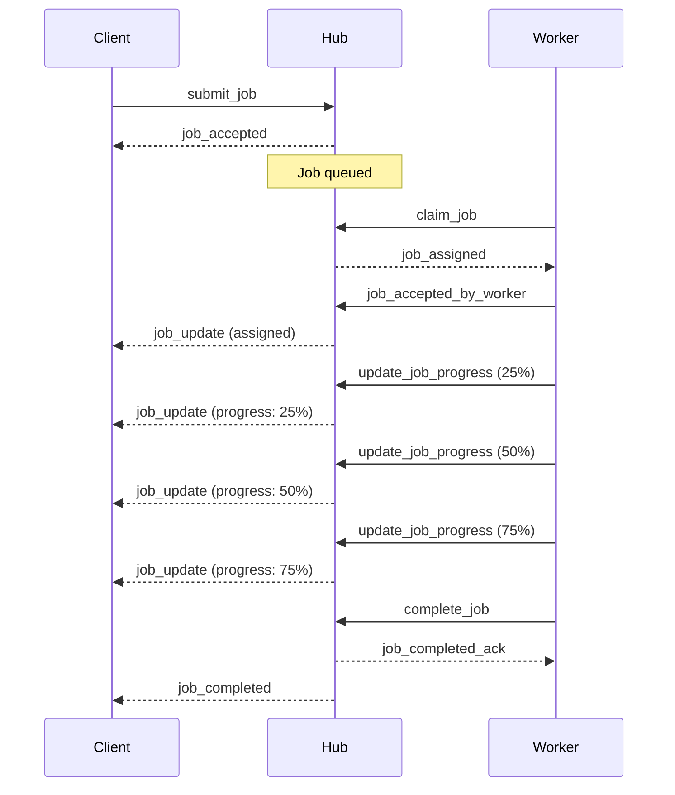

# WebSocket API Reference

The EmProps Job Queue system uses WebSocket connections for real-time, bi-directional communication between clients, workers, and the hub. This document provides a complete reference for all message types, formats, and communication patterns.

## Connection Endpoint

```
ws://[hub-host]:[ws-port]
wss://[hub-host]:[ws-port]  // SSL/TLS
```

Default WebSocket port: `3002`

## Message Format

All messages follow a consistent JSON structure:

```typescript
interface BaseMessage {
  type: string;           // Message type identifier
  timestamp: number;      // Unix timestamp in milliseconds
  id?: string;           // Optional message ID for tracking
  source?: string;       // Message source identifier
  job_id?: string;       // Job ID if message relates to a job
  worker_id?: string;    // Worker ID if message relates to a worker
  [key: string]: any;    // Additional message-specific properties
}
```

## Connection Flow

### 1. Initial Connection



### 2. Connection Establishment

```json
// Server sends on connection
{
  "type": "connection_established",
  "message": "Connected to EmProps Job Queue Hub",
  "server_version": "1.0.0",
  "timestamp": 1705312345000
}
```

## Client Registration

### Job Client Registration

```json
// Client -> Hub
{
  "type": "register_client",
  "client_type": "job_client",
  "client_id": "my-app-v1.0",
  "version": "1.0.0",
  "capabilities": {
    "webhook_support": true,
    "compression": ["gzip"]
  },
  "timestamp": 1705312345000
}

// Hub -> Client (confirmation)
{
  "type": "client_registered",
  "client_id": "my-app-v1.0",
  "status": "registered",
  "assigned_connection_id": "conn-abc123",
  "timestamp": 1705312345000
}
```

### Monitor Registration

```json
// Monitor -> Hub
{
  "type": "register_client",
  "client_type": "monitor",
  "client_id": "admin-dashboard",
  "permissions": ["view_all_jobs", "view_system_stats"],
  "timestamp": 1705312345000
}
```

### Worker Registration

```json
// Worker -> Hub
{
  "type": "register_worker",
  "worker_id": "worker-gpu-01",
  "capabilities": {
    "services": ["comfyui", "a1111"],
    "components": ["text-to-image-xl"],
    "hardware": {
      "gpu_memory_gb": 16,
      "gpu_model": "RTX 4090"
    }
  },
  "subscribe_to_jobs": true,
  "status": "idle",
  "timestamp": 1705312345000
}

// Hub -> Worker (confirmation)
{
  "type": "worker_registered",
  "worker_id": "worker-gpu-01",
  "status": "registered",
  "assigned_connection_id": "worker-conn-def456",
  "timestamp": 1705312345000
}
```

## Job Management Messages

### Job Submission

```json
// Client -> Hub
{
  "type": "submit_job",
  "job_type": "text_to_image",
  "priority": 75,
  "payload": {
    "prompt": "a beautiful landscape with mountains",
    "steps": 30,
    "cfg_scale": 7.5,
    "width": 1024,
    "height": 1024
  },
  "customer_id": "customer-123",
  "requirements": {
    "service_type": "comfyui",
    "component": "text-to-image-xl",
    "hardware": {
      "gpu_memory_gb": 8
    }
  },
  "timestamp": 1705312345000
}

// Hub -> Client (acceptance)
{
  "type": "job_accepted",
  "job_id": "job-abc123",
  "status": "queued",
  "position": 3,
  "estimated_start": "2024-01-15T10:05:30Z",
  "notified_workers": 5,
  "timestamp": 1705312345000
}
```

### Job Status Query

```json
// Client -> Hub
{
  "type": "request_job_status",
  "job_id": "job-abc123",
  "timestamp": 1705312345000
}

// Hub -> Client (response)
{
  "type": "response_job_status",
  "job_id": "job-abc123",
  "status": "in_progress",
  "progress": 45,
  "worker_id": "worker-gpu-01",
  "started_at": 1705312380000,
  "estimated_completion": "2024-01-15T10:08:30Z",
  "message": "Generating image - step 14/30",
  "timestamp": 1705312400000
}
```

### Job Cancellation

```json
// Client -> Hub
{
  "type": "cancel_job",
  "job_id": "job-abc123",
  "reason": "User requested cancellation",
  "timestamp": 1705312345000
}

// Hub -> Client (confirmation)
{
  "type": "job_cancelled",
  "job_id": "job-abc123",
  "status": "cancelled",
  "cancelled_at": 1705312345000,
  "timestamp": 1705312345000
}
```

## Worker Communication

### Job Request (Pull-based)

```json
// Worker -> Hub
{
  "type": "claim_job",
  "worker_id": "worker-gpu-01",
  "max_jobs": 1,
  "preferred_types": ["text_to_image", "upscaling"],
  "current_load": 0.3,
  "available_resources": {
    "gpu_memory_available": 14.2,
    "concurrent_slots": 1
  },
  "claim_timeout": 30000,
  "timestamp": 1705312345000
}

// Hub -> Worker (job assignment)
{
  "type": "job_assigned",
  "job_id": "job-abc123",
  "worker_id": "worker-gpu-01",
  "job_type": "text_to_image",
  "priority": 75,
  "payload": {
    "prompt": "a beautiful landscape with mountains",
    "steps": 30
  },
  "requirements": {
    "service_type": "comfyui"
  },
  "claim_timeout": 30000,
  "timestamp": 1705312345000
}

// Worker -> Hub (acceptance)
{
  "type": "job_accepted_by_worker",
  "job_id": "job-abc123",
  "worker_id": "worker-gpu-01",
  "estimated_completion": "2024-01-15T10:08:30Z",
  "timestamp": 1705312350000
}
```

### Job Progress Updates

```json
// Worker -> Hub
{
  "type": "update_job_progress",
  "job_id": "job-abc123",
  "worker_id": "worker-gpu-01",
  "progress": 45,
  "status": "in_progress",
  "message": "Generating image - step 14/30",
  "current_step": "sampling",
  "estimated_completion": "2024-01-15T10:08:15Z",
  "connector_details": {
    "connected": true,
    "service": "comfyui",
    "queue_position": 0,
    "service_status": "processing"
  },
  "timestamp": 1705312380000
}
```

### Job Completion

```json
// Worker -> Hub
{
  "type": "complete_job",
  "job_id": "job-abc123",
  "worker_id": "worker-gpu-01",
  "processing_time": 67.5,
  "result": {
    "success": true,
    "output_files": [
      "https://storage.example.com/results/job-abc123/image.png"
    ],
    "metadata": {
      "actual_steps": 30,
      "cfg_scale": 7.5,
      "seed": 1234567890,
      "model": "sdxl_base_1.0.safetensors"
    },
    "connector_info": {
      "connector_type": "comfyui",
      "service_version": "0.0.45",
      "processing_stats": {
        "gpu_memory_peak": 12.5,
        "total_time": 67.5,
        "sampling_time": 45.2
      }
    }
  },
  "timestamp": 1705312445000
}

// Hub -> Worker (acknowledgment)
{
  "type": "job_completed_ack",
  "job_id": "job-abc123",
  "worker_id": "worker-gpu-01",
  "timestamp": 1705312445000
}
```

### Job Failure

```json
// Worker -> Hub
{
  "type": "fail_job",
  "job_id": "job-abc123",
  "worker_id": "worker-gpu-01",
  "error": "Service connection timeout",
  "retry": true,
  "error_details": {
    "error_type": "ServiceTimeoutError",
    "connector": "comfyui",
    "service_url": "http://localhost:8188",
    "timeout_seconds": 30,
    "attempts": 3,
    "last_response": "Connection refused"
  },
  "processing_time": 120.0,
  "timestamp": 1705312445000
}

// Hub -> Worker (acknowledgment)
{
  "type": "job_failed_ack",
  "job_id": "job-abc123",
  "worker_id": "worker-gpu-01",
  "retry_scheduled": true,
  "retry_delay": 15,
  "timestamp": 1705312445000
}
```

## Worker Heartbeat and Status

### Heartbeat

```json
// Worker -> Hub (periodic)
{
  "type": "worker_heartbeat",
  "worker_id": "worker-gpu-01",
  "status": "busy",
  "load": 0.8,
  "current_jobs": ["job-abc123"],
  "system_info": {
    "cpu_usage": 45,
    "memory_usage": 60,
    "gpu_usage": 85,
    "gpu_memory_usage": 12.5,
    "uptime": 86400
  },
  "connector_status": {
    "comfyui": {
      "status": "active",
      "queue_length": 0,
      "response_time_ms": 150,
      "last_health_check": "2024-01-15T10:04:50Z"
    }
  },
  "timestamp": 1705312345000
}

// Hub -> Worker (acknowledgment)
{
  "type": "worker_heartbeat_ack",
  "worker_id": "worker-gpu-01",
  "status": "acknowledged",
  "next_heartbeat_expected": 1705312405000,
  "timestamp": 1705312345000
}
```

### Status Update

```json
// Worker -> Hub
{
  "type": "worker_status",
  "worker_id": "worker-gpu-01",
  "status": "idle",
  "capabilities": {
    "services": ["comfyui", "a1111"],
    "components": ["text-to-image-xl", "upscaling"]
  },
  "current_job_id": null,
  "available_slots": 2,
  "timestamp": 1705312345000
}
```

## Subscription Messages

### Job Subscriptions

```json
// Subscribe to specific job
{
  "type": "subscribe_job",
  "job_id": "job-abc123",
  "timestamp": 1705312345000
}

// Subscribe to job notifications
{
  "type": "subscribe_job_notifications",
  "enabled": true,
  "filters": {
    "customer_id": "customer-123",
    "job_types": ["text_to_image", "upscaling"],
    "priority_min": 70,
    "status": ["queued", "in_progress"]
  },
  "timestamp": 1705312345000
}

// Subscription confirmation
{
  "type": "job_notifications_subscribed",
  "subscription_id": "sub-abc123",
  "filters_applied": {
    "customer_id": "customer-123",
    "job_types": ["text_to_image", "upscaling"]
  },
  "timestamp": 1705312345000
}
```

### Stats Subscriptions

```json
// Subscribe to system stats
{
  "type": "subscribe_stats",
  "enabled": true,
  "interval_seconds": 5,
  "include_sections": ["jobs", "workers", "system"],
  "timestamp": 1705312345000
}

// Stats subscription confirmation
{
  "type": "subscription_confirmed",
  "subscription_type": "stats",
  "update_interval": 5,
  "next_broadcast": 1705312350000,
  "timestamp": 1705312345000
}

// Request immediate stats
{
  "type": "request_stats",
  "include_sections": ["jobs", "workers"],
  "timestamp": 1705312345000
}
```

## Notification Messages

### Job Notifications

```json
// Job available notification (to workers)
{
  "type": "job_available",
  "job_id": "job-abc123",
  "job_type": "text_to_image",
  "priority": 75,
  "requirements_summary": {
    "service_type": "comfyui",
    "gpu_memory_min": 8
  },
  "timestamp": 1705312345000
}

// Job status change notification
{
  "type": "job_update",
  "job_id": "job-abc123",
  "status": "in_progress",
  "previous_status": "assigned",
  "worker_id": "worker-gpu-01",
  "progress": 25,
  "message": "Job processing started",
  "timestamp": 1705312380000
}

// Job completion notification
{
  "type": "job_completed",
  "job_id": "job-abc123",
  "status": "completed",
  "worker_id": "worker-gpu-01",
  "priority": 75,
  "processing_time": 67.5,
  "result": {
    "success": true,
    "output_files": ["https://storage.example.com/results/job-abc123/image.png"]
  },
  "timestamp": 1705312445000
}
```

### System Notifications

```json
// System status update
{
  "type": "system_status",
  "active_workers": 3,
  "pending_jobs": 15,
  "active_jobs": 2,
  "completed_jobs_last_hour": 45,
  "system_health": "healthy",
  "alerts": [],
  "timestamp": 1705312345000
}

// System alert
{
  "type": "system_alert",
  "severity": "warning",
  "category": "resource_constraint",
  "message": "Queue depth exceeding normal capacity",
  "details": {
    "current_queue_depth": 25,
    "normal_threshold": 15,
    "available_workers": 2
  },
  "actions_recommended": [
    "Consider scaling up workers",
    "Review job priorities"
  ],
  "timestamp": 1705312500000
}
```

## Service Messages

### Service Requests

```json
// Service request (internal)
{
  "type": "service_request",
  "job_id": "job-abc123",
  "worker_id": "worker-gpu-01",
  "service_type": "comfyui",
  "endpoint": "/api/v1/generate",
  "method": "POST",
  "url": "http://localhost:8188/api/v1/generate",
  "payload": {
    "prompt": "a beautiful landscape",
    "steps": 30
  },
  "timestamp": 1705312345000
}

// Connector WebSocket status
{
  "type": "connector_ws_status",
  "worker_id": "worker-gpu-01",
  "connector_type": "comfyui",
  "status": "connected",
  "details": {
    "url": "ws://localhost:8188/ws",
    "connection_time": 1705312300000,
    "last_message": 1705312340000
  },
  "timestamp": 1705312345000
}
```

## Error Handling

### Error Messages

```json
// General error
{
  "type": "error",
  "error": "Invalid job parameters",
  "error_code": "INVALID_PARAMETERS",
  "details": {
    "field": "requirements.hardware.gpu_memory_gb",
    "message": "Must be a positive number",
    "provided_value": -1
  },
  "request_id": "req-abc123",
  "timestamp": 1705312345000
}

// Authentication error
{
  "type": "error",
  "error": "Authentication failed",
  "error_code": "AUTH_FAILED",
  "details": {
    "reason": "Invalid worker token",
    "worker_id": "worker-gpu-01"
  },
  "timestamp": 1705312345000
}
```

### Acknowledgments

```json
// Generic acknowledgment
{
  "type": "ack",
  "message_id": "msg-abc123",
  "original_type": "submit_job",
  "status": "processed",
  "timestamp": 1705312345000
}

// Unknown message
{
  "type": "unknown",
  "content": "Received unrecognized message type",
  "original_message": "{\"type\":\"invalid_type\",...}",
  "timestamp": 1705312345000
}
```

## Message Size Limits

### Size Constraints

- **Maximum message size**: 10MB
- **Typical message size**: < 64KB
- **Large payload handling**: Chunked messages for files > 1MB

### Chunked Messages

```json
// Large message chunk
{
  "type": "chunked_message",
  "chunk_id": "chunk-abc123",
  "chunk_index": 1,
  "total_chunks": 5,
  "data": "base64-encoded-chunk-data",
  "data_hash": "sha256-hash-of-complete-data",
  "original_type": "job_result_with_large_files",
  "timestamp": 1705312345000
}

// Chunk assembly complete
{
  "type": "chunked_message_complete",
  "chunk_id": "chunk-abc123",
  "total_size": 5242880,
  "assembled_message": {
    // Original message reconstructed from chunks
  },
  "timestamp": 1705312350000
}
```

## Connection Management

### Connection Health

```json
// Ping (periodic)
{
  "type": "ping",
  "timestamp": 1705312345000
}

// Pong (response)
{
  "type": "pong",
  "timestamp": 1705312345000
}
```

### Graceful Disconnection

```json
// Client disconnect notification
{
  "type": "disconnect",
  "reason": "Client shutdown",
  "cleanup_subscriptions": true,
  "timestamp": 1705312345000
}

// Server disconnect notification
{
  "type": "server_disconnect",
  "reason": "Server maintenance",
  "reconnect_after": 1705312405000,
  "estimated_downtime": 60,
  "timestamp": 1705312345000
}
```

## Message Flow Examples

### Complete Job Processing Flow



## Client Libraries

### JavaScript/TypeScript

```typescript
interface EmpQueueClient {
  connect(url: string): Promise<void>;
  disconnect(): void;
  submitJob(job: JobSubmission): Promise<string>;
  subscribeToJob(jobId: string, callback: (update: JobUpdate) => void): void;
  subscribeToStats(callback: (stats: SystemStats) => void): void;
  onError(callback: (error: ErrorMessage) => void): void;
}
```

### Python

```python
class EmpQueueClient:
    async def connect(self, url: str) -> None: ...
    async def disconnect(self) -> None: ...
    async def submit_job(self, job: JobSubmission) -> str: ...
    async def subscribe_to_job(self, job_id: str, callback: Callable) -> None: ...
    async def subscribe_to_stats(self, callback: Callable) -> None: ...
    def on_error(self, callback: Callable) -> None: ...
```

## Next Steps

- Review [Redis Data](./redis-data) for storage patterns
- Check [Configuration](./configuration) for WebSocket settings
- Explore [Notifications](./notifications) for implementation examples
- See [Monitoring](./monitoring) for debugging WebSocket connections