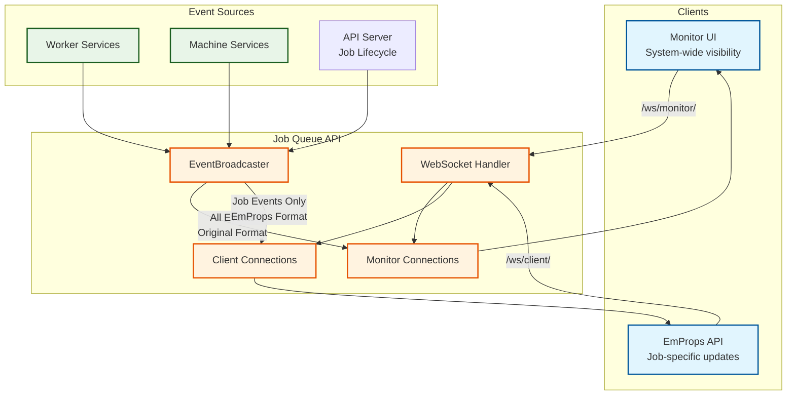
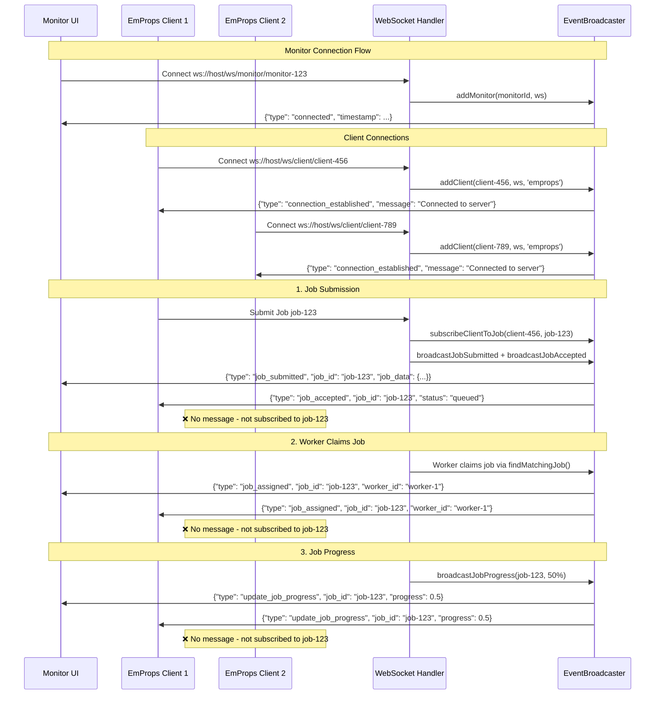
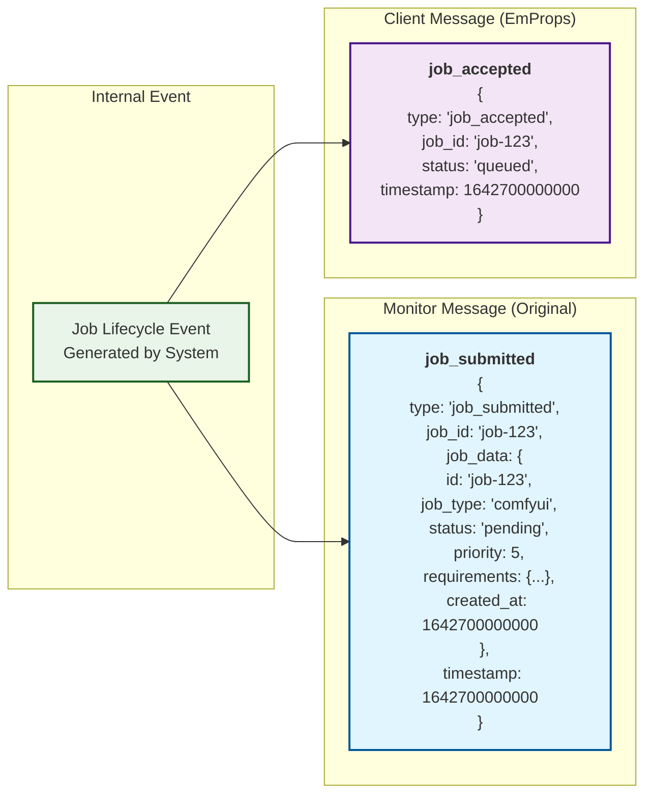
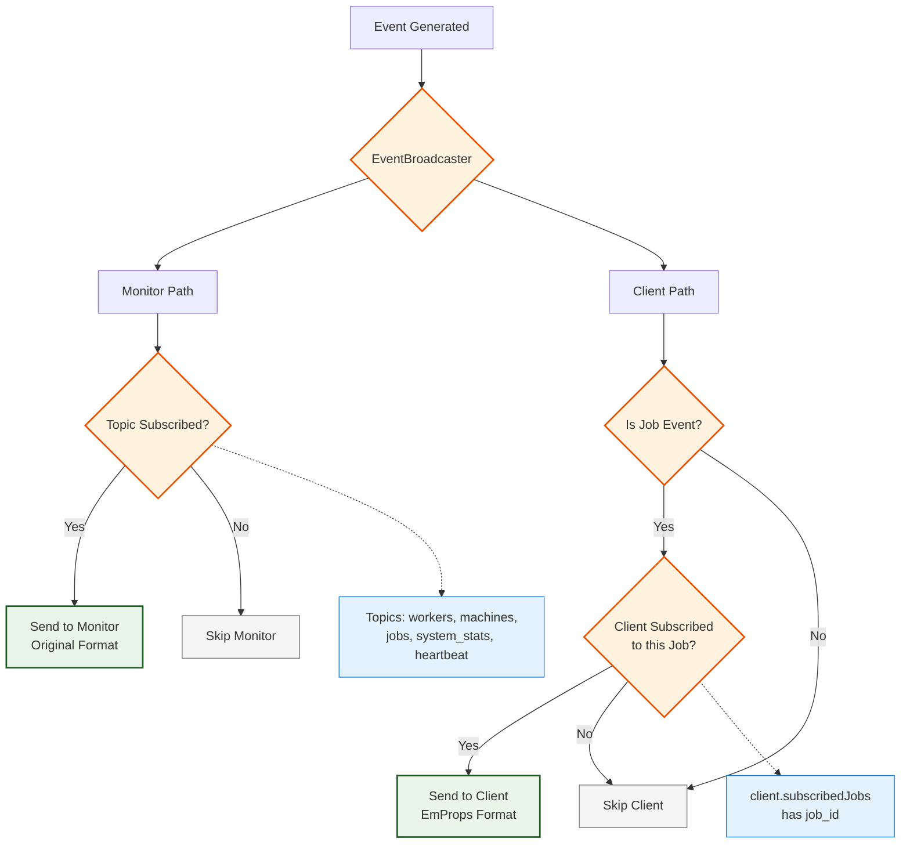
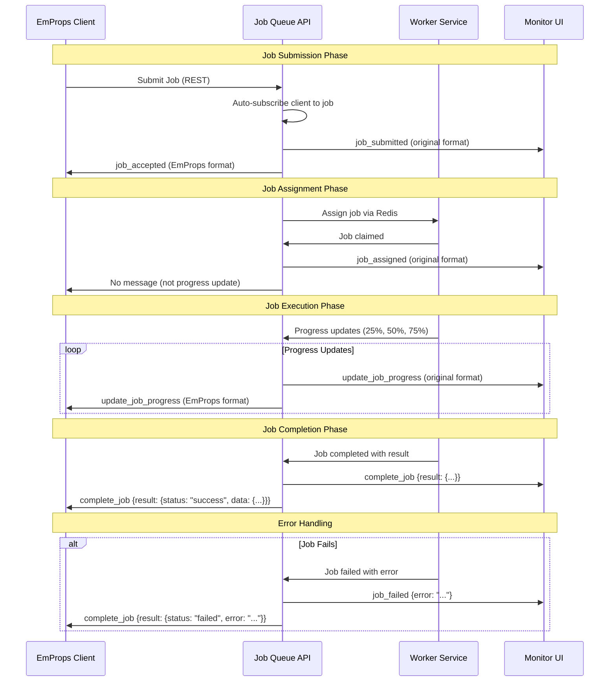
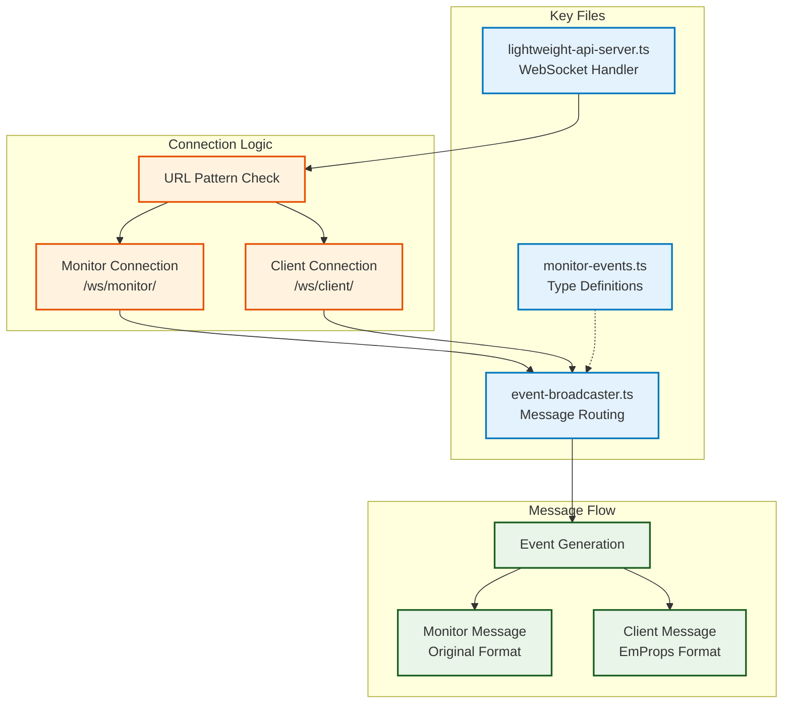

# WebSocket Broadcast Architecture

This document provides an interactive mermaid diagram showing the message flow architecture between monitors and clients in the Job Queue API.

## System Overview

The Job Queue API supports two distinct WebSocket connection types:

1. **Monitor Connections** (`/ws/monitor/`) - System-wide monitoring with original message format
2. **Client Connections** (`/ws/client/`) - Job-specific updates with EmProps message format

## Job Lifecycle Events

The system generates distinct events at different stages:

1. **`job_submitted`** (monitors) / **`job_accepted`** (clients) - Job added to pending queue
2. **`job_assigned`** (both) - Worker has claimed the job from the queue  
3. **`update_job_progress`** (both) - Progress updates during execution
4. **`complete_job`** (both) - Job finished successfully or failed

## Interactive Architecture Diagram

<FullscreenDiagram>

</FullscreenDiagram>

## Connection URL Patterns

<FullscreenDiagram>

</FullscreenDiagram>

## Message Format Comparison

<FullscreenDiagram>

</FullscreenDiagram>

## Event Filtering Logic

<FullscreenDiagram>

</FullscreenDiagram>

## Job Lifecycle Message Flow

<FullscreenDiagram>

</FullscreenDiagram>

## Implementation Architecture

<FullscreenDiagram>

</FullscreenDiagram>

## Key Benefits

- **Clear Separation**: Monitors get system-wide view, clients get job-specific updates
- **Format Optimization**: Each connection type receives messages in optimal format
- **No Translation Layer**: Events created directly in correct format at source
- **Backward Compatibility**: Monitor functionality unchanged
- **EmProps Integration**: Full compatibility with EmProps API expectations
- **Efficient Filtering**: Job subscriptions prevent unnecessary message routing