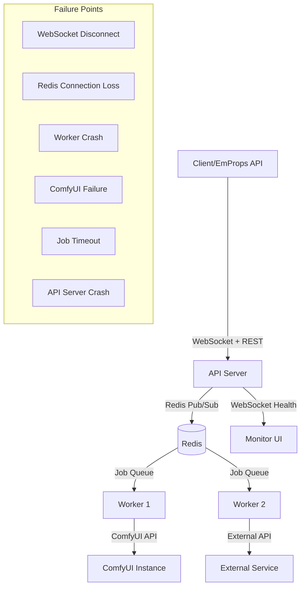
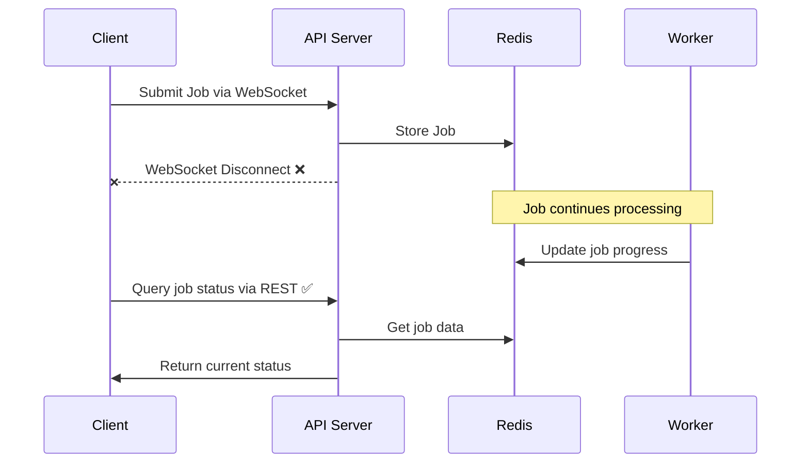
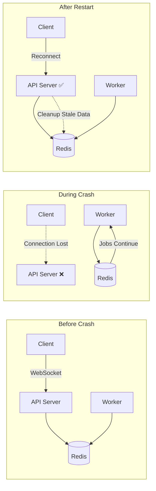
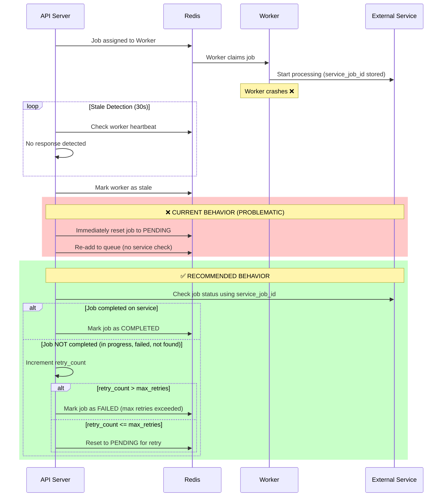
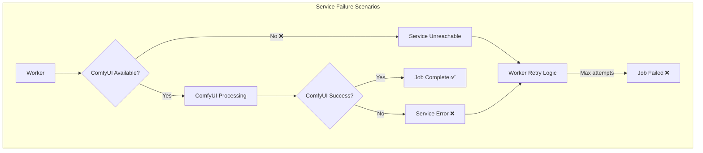
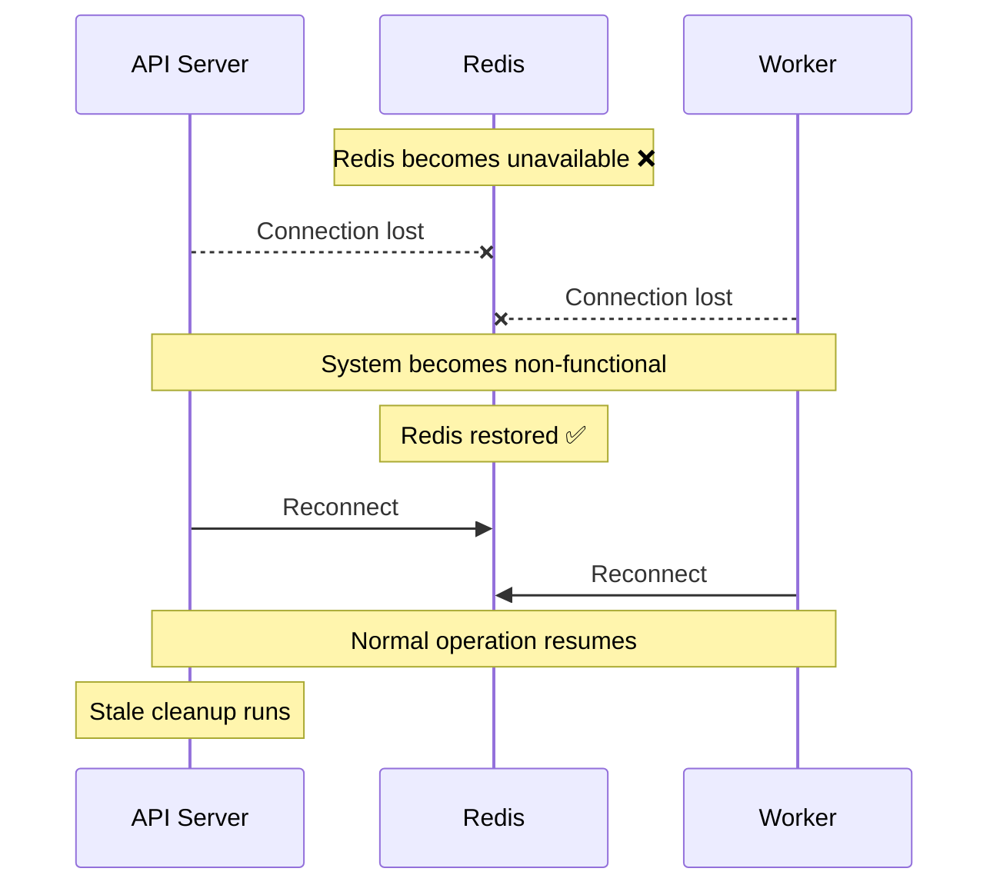

# Failure Handling & Recovery

This document provides a comprehensive overview of failure scenarios in the EmProps Job Queue system and how they are currently handled (or not handled).

## System Architecture Overview

<FullscreenDiagram>



</FullscreenDiagram>

## Job Lifecycle & Status Tracking

### Current Job States
- **PENDING** → Submitted to queue, waiting for worker
- **ASSIGNED** → Worker claimed the job
- **IN_PROGRESS** → Worker actively processing
- **COMPLETED** → Job finished successfully
- **FAILED** → Job failed (with retry logic)
- **TIMEOUT** → Job exceeded time limits
- **CANCELLED** → Manually cancelled
- **UNWORKABLE** → No available workers can handle

### Job Data Persistence
All job information is stored in Redis with comprehensive tracking:

```typescript
interface Job {
  // Core tracking
  id: string;
  status: JobStatus;
  worker_id?: string;
  
  // Failure handling
  retry_count: number;
  max_retries: number;
  last_failed_worker?: string;
  failed_at?: string;
  
  // Service integration
  service_job_id?: string;
  service_status?: string;
  last_service_check?: string;
  
  // Timing
  timeout_minutes?: number;
  estimated_completion?: string;
}
```

## Failure Scenarios Analysis

### 1. WebSocket Connection Failures

<FullscreenDiagram>



</FullscreenDiagram>

**Current Handling:** ✅ **HANDLED**
- Jobs remain queryable via REST API (`GET /api/jobs/:jobId`)
- Job processing continues independently
- Client can reconnect and resume monitoring

**Gaps:**
- No automatic WebSocket reconnection
- No job subscription restoration on reconnect

### 2. API Server Crash

<FullscreenDiagram>



</FullscreenDiagram>

**Current Handling:** ✅ **HANDLED**
- Startup cleanup removes stale machine/worker data
- Jobs in Redis remain intact
- Workers continue processing independently
- Automatic stale machine detection (30s timeout)

### 3. Worker/Machine Failures

<FullscreenDiagram>



</FullscreenDiagram>

**Current Handling:** ⚠️ **PARTIALLY HANDLED**
- ✅ Stale worker detection (30s timeout)
- ✅ Retry count tracking (`retry_count` field in job)
- ✅ Configurable max retries (`max_retries` field, default: 3)
- ✅ **Retry limit enforcement during worker cleanup** (FIXED)
- ❌ **No service status verification before re-queuing**
- ❌ **Jobs may be duplicated if service completed**

**Critical Gaps:**
- Jobs that completed on external service get re-queued unnecessarily
- Potential duplicate processing and resource waste

**Completed Improvements:**
- ✅ **Retry limit enforcement fixed** - `cleanupWorker` now properly increments `retry_count` and fails jobs exceeding `max_retries`
- ✅ **Structured health check framework** - Connectors must implement required failure recovery capabilities

**Remaining Work:**
- Check external service status before re-queuing
- Only mark as COMPLETED if external service confirms completion
- Re-queue everything else (avoids hanging on potentially broken services)

### 4. External Service Failures (ComfyUI, APIs)

<FullscreenDiagram>



</FullscreenDiagram>

**Current Handling:** ⚠️ **LIMITED**
- Worker-level retry logic varies by connector
- Service errors reported back to job queue
- `service_status` field available but underutilized

**Major Gaps:**
- No centralized external service health monitoring
- No intelligent routing around failed services
- No automatic service recovery detection

### 5. Job Timeout Scenarios

```mermaid
gantt
    title Job Timeout Handling
    dateFormat X
    axisFormat %H:%M

    section Current System
    Job Submitted    :milestone, 0, 0
    Worker Processing: active, 0, 1800
    No Timeout Check : crit, 1200, 1800
    Job Continues    : 1800, 3600
    
    section Needed System
    Job Submitted    :milestone, 0, 0  
    Worker Processing: active, 0, 1200
    Timeout Check    : crit, 1200, 1210
    Job Cancelled    : done, 1210, 1220
```

<FullscreenDiagram>



</FullscreenDiagram>

**Current Handling:** ❌ **NOT HANDLED**
- `timeout_minutes` field exists but not enforced
- Jobs can run indefinitely
- No proactive timeout monitoring

**Impact:**
- Resource waste on stuck jobs
- Poor user experience with "hung" jobs
- Potential service degradation

### 6. Redis Connection Loss

<FullscreenDiagram>



</FullscreenDiagram>

**Current Handling:** ⚠️ **PARTIAL**
- Redis connection errors handled gracefully
- System becomes non-functional during outage
- Automatic reconnection attempts
- Startup cleanup after restoration

**Gaps:**
- No job state validation after Redis recovery
- Potential data inconsistency during outage

## Current Monitoring & Recovery

### Automatic Cleanup Systems

1. **Stale Machine Detection** (30s interval)
   ```typescript
   // Automatic cleanup of unreachable machines
   private async checkStaleMachines(): Promise<void> {
     const staleThreshold = 30000; // 30 seconds
     // Mark machines as stale and cleanup workers
   }
   ```

2. **Startup Cleanup**
   ```typescript
   // Removes orphaned data from previous crashes
   private async cleanupStaleDataOnStartup(): Promise<void> {
     // Clean machines without TTL
     // Remove stale worker data
   }
   ```

3. **WebSocket Health Monitoring**
   ```typescript
   // Ping/pong with 3 missed pong tolerance
   const maxMissedPongs = 3;
   // Automatic client disconnection on timeout
   ```

### Manual Cleanup Endpoints

- `POST /api/cleanup` - Manual worker/job cleanup
- `GET /api/jobs/:id` - Always available for status checking
- Monitor UI provides real-time visibility

## Failure Recovery Recommendations

### High Priority Improvements

1. **Job Timeout Enforcement**
   ```typescript
   interface JobTimeoutMonitor {
     checkInterval: number; // 30s
     enforceTimeouts(): Promise<void>;
     cancelTimedOutJob(jobId: string): Promise<void>;
   }
   ```

2. **Enhanced WebSocket Recovery**
   ```typescript
   interface WebSocketRecovery {
     autoReconnect: boolean;
     restoreJobSubscriptions(): Promise<void>;
     backoffStrategy: 'exponential' | 'linear';
   }
   ```

3. **Service Health Monitoring**
   ```typescript
   interface ServiceHealth {
     checkExternalServices(): Promise<ServiceStatus[]>;
     routeAroundFailedServices(): Promise<void>;
     markServiceUnavailable(service: string): Promise<void>;
   }
   ```

### Medium Priority Improvements

4. **Progressive Backoff for Retries**
   ```typescript
   interface RetryStrategy {
     baseDelay: number;
     maxDelay: number;
     backoffMultiplier: number;
     jitter: boolean;
   }
   ```

5. **Partial Progress Checkpointing**
   ```typescript
   interface JobCheckpoint {
     saveProgress(jobId: string, data: unknown): Promise<void>;
     resumeFromCheckpoint(jobId: string): Promise<unknown>;
   }
   ```

## Testing Failure Scenarios

### Current Test Coverage

1. **Integration Tests** ✅
   - Machine health reporting
   - WebSocket connection handling
   - Job lifecycle management

2. **Missing Test Scenarios** ❌
   - Job timeout enforcement
   - Service failure simulation
   - Redis connection loss recovery
   - Partial progress restoration

### Recommended Test Additions

```typescript
describe('Failure Scenarios', () => {
  it('should timeout jobs after specified duration')
  it('should handle Redis disconnection gracefully')
  it('should recover from external service failures')
  it('should restore job subscriptions after reconnection')
  it('should cleanup orphaned jobs automatically')
})
```

## Monitoring Dashboard Insights

The Monitor UI currently provides:

- ✅ Real-time job status tracking
- ✅ Worker health monitoring  
- ✅ Machine status visibility
- ✅ WebSocket connection status

**Missing Monitoring:**
- ❌ Job timeout warnings
- ❌ Service health indicators
- ❌ Retry attempt visualization
- ❌ Failure rate metrics

## Summary

The EmProps Job Queue system has **solid foundations** for failure handling:

**Strengths:**
- Persistent job storage in Redis
- Automatic stale detection and cleanup
- Retry logic with configurable limits
- Always-available REST API for job queries
- Comprehensive job status tracking

**Critical Gaps:**
- Job timeout enforcement
- Service health monitoring
- WebSocket reconnection recovery
- Partial progress preservation

**Recommendation:** Prioritize job timeout enforcement and service health monitoring for immediate reliability improvements.