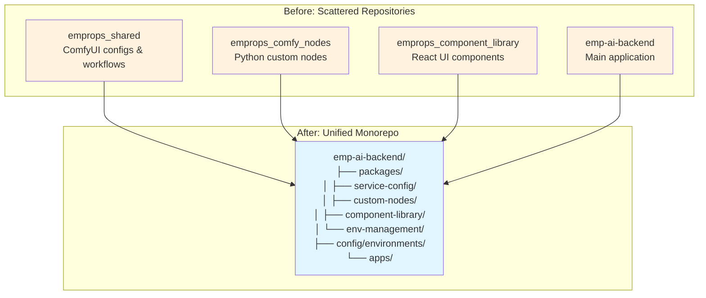
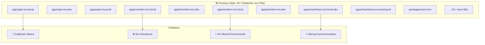
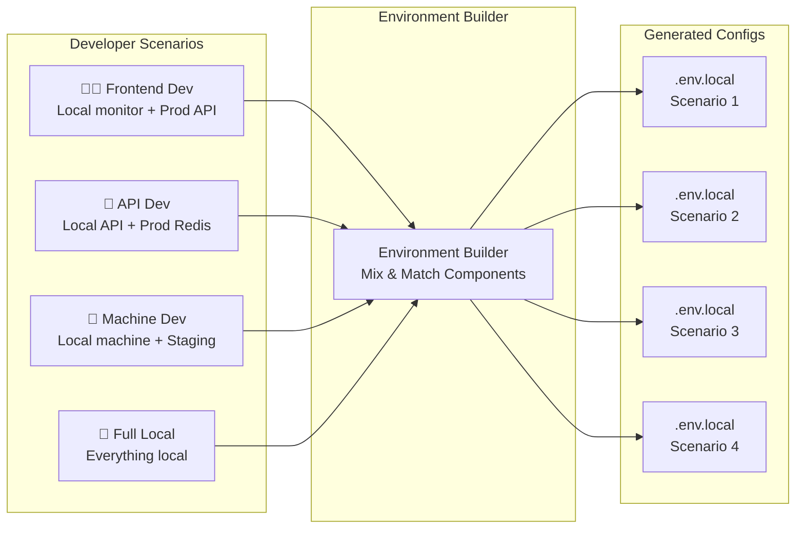
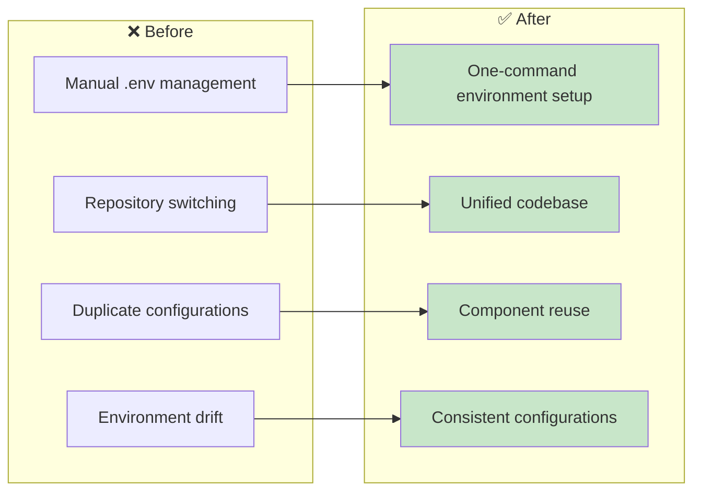
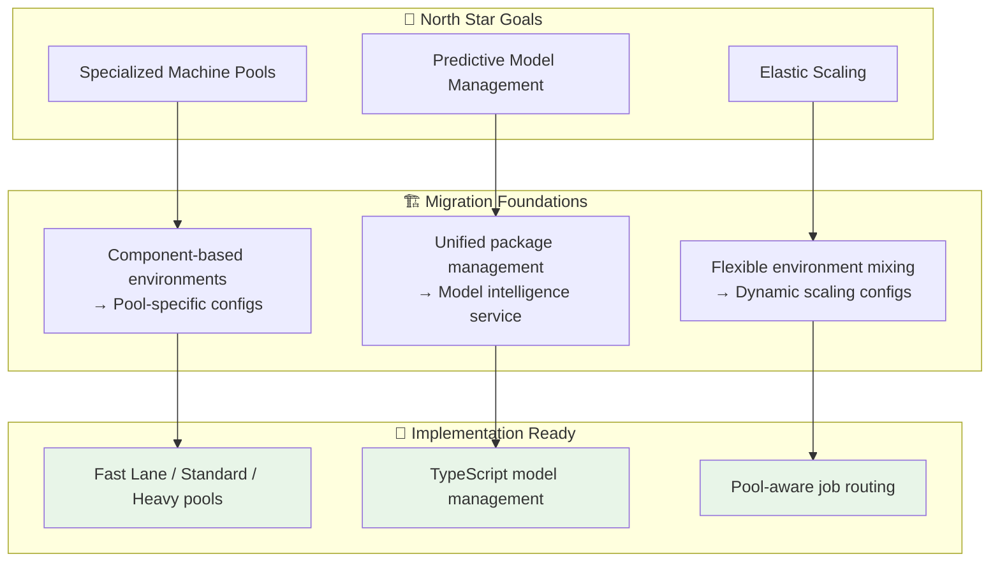
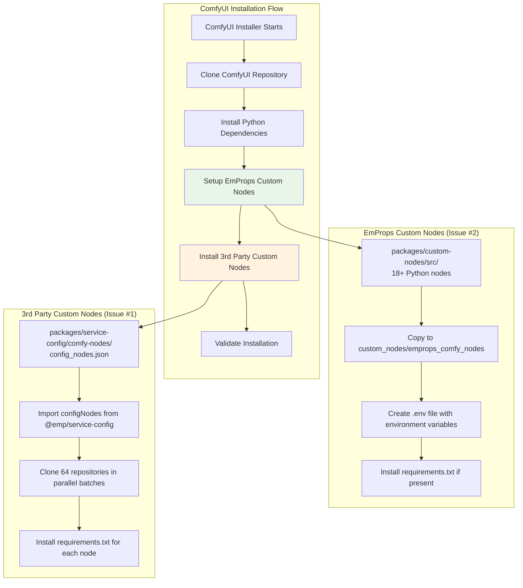
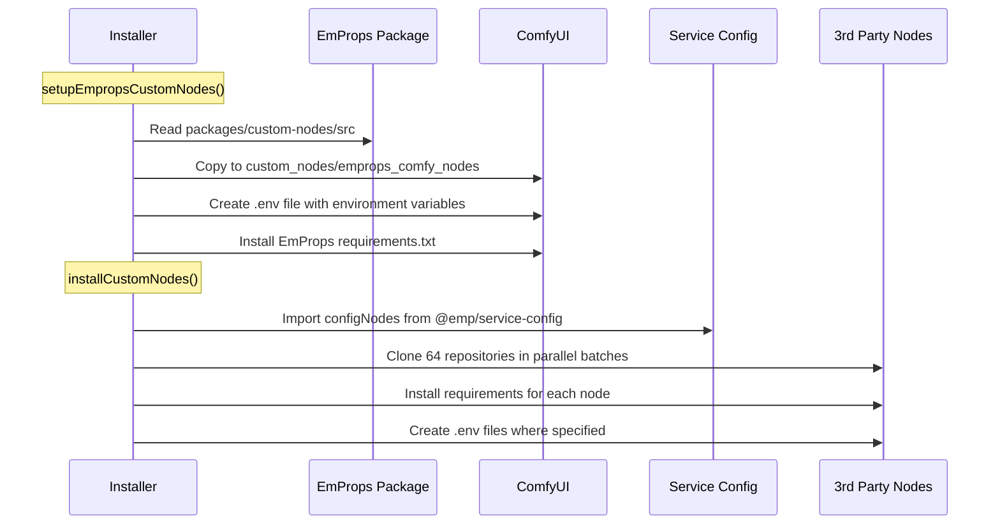

# Monorepo Migration: Consolidating EmProps AI Backend

> **Migration Status:** ✅ **COMPLETED** - All external repositories successfully integrated with working environment management system

## Overview

The EmProps AI Backend has undergone a major architectural transformation, consolidating three external repositories into a unified monorepo with a sophisticated environment management system. This migration eliminates the complexity of managing scattered repositories and 20+ environment files while providing unprecedented flexibility for development and deployment.

## What Was Migrated

### External Repositories Consolidated



### Repository Integration Details

| External Repository | New Location | Purpose | Contents |
|-------------------|--------------|---------|----------|
| `emprops_shared` | `packages/service-config/` | ComfyUI configuration management | • 64 custom nodes config<br/>• Workflow templates<br/>• Model configurations<br/>• Installation scripts |
| `emprops_comfy_nodes` | *(Removed from monorepo)* | Custom ComfyUI nodes for EmProps | • Now installed from GitHub repo<br/>• 18+ Python nodes including animated WebP saver<br/>• Cloud storage integration<br/>• Asset downloaders |
| `emprops_component_library` | `packages/component-library/` | Shared UI components | • React components<br/>• Design system<br/>• Storybook integration<br/>• CLI tools |

## Environment Management Revolution

### Before: Chaos of Configuration Files



### After: Component-Based Environment System

```mermaid
graph TB
    subgraph "✅ New State: Component-Based Configuration"
        subgraph "Component Configs"
            R[redis.env<br/>[local/dev/staging/prod]]
            A[api.env<br/>[local/dev/staging/prod]]
            M[machine.env<br/>[local/dev/staging/prod]]
            MO[monitor.env<br/>[local/dev/staging/prod]]
            C[comfy.env<br/>[local/dev/staging/prod]]
        end
        
        subgraph "Environment Profiles"
            P1[full-local.json<br/>All components local]
            P2[dev-mixed.json<br/>Mixed local/remote]
            P3[staging-mixed.json<br/>Staging testing]
            P4[prod-debug.json<br/>Production debugging]
        end
        
        subgraph "Generated Output"
            OUT[.env.local<br/>Single source of truth]
        end
    end
    
    R --> OUT
    A --> OUT
    M --> OUT
    MO --> OUT
    C --> OUT
    
    P1 --> OUT
    P2 --> OUT
    P3 --> OUT
    P4 --> OUT
    
    style OUT fill:#c8e6c9
```

## New Development Workflow

### Environment Management Commands

The migration introduces powerful new commands for environment management:

```bash
# 🎯 Build environment from profile
node scripts/env/build-env.js --profile=full-local
node scripts/env/build-env.js --profile=dev-mixed

# 🔧 Build custom environment from components  
node scripts/env/build-env.js --redis=development --api=local --machine=local

# 🔄 Switch between environments
node scripts/env/switch-env.js staging-mixed

# ✅ Validate current environment
node scripts/env/validate-env.js

# 📋 List available profiles
node scripts/env/list-profiles.js
```

### Flexible Development Scenarios



## Package Architecture

### New Monorepo Structure

```
emp-ai-backend/
├── 📦 packages/
│   ├── service-config/          # From emprops_shared
│   │   ├── comfy-nodes/         # 64 custom nodes configuration
│   │   │   ├── config_nodes.json
│   │   │   ├── config_nodes_test.json
│   │   │   └── static-models.json
│   │   ├── shared-configs/      # ComfyUI directory structure
│   │   │   ├── comfy_dir_config.yaml
│   │   │   └── workflows/       # 200+ workflow templates
│   │   ├── scripts/             # Installation logic (TypeScript)
│   │   └── src/                 # Package exports
│   │
│   ├── custom-nodes/            # From emprops_comfy_nodes  
│   │   ├── src/
│   │   │   ├── nodes/           # 18+ Python custom nodes
│   │   │   ├── db/              # Database utilities
│   │   │   └── tests/           # Python tests
│   │   ├── requirements.txt     # Python dependencies
│   │   └── utils.py             # Helper functions
│   │
│   ├── component-library/       # From emprops_component_library
│   │   ├── src/
│   │   │   ├── components/      # React components
│   │   │   ├── hooks/           # Shared React hooks
│   │   │   ├── utils/           # Utility functions
│   │   │   └── styles/          # Design system
│   │   ├── stories/             # Storybook stories
│   │   └── tests/               # Component tests
│   │
│   └── env-management/          # New: Environment utilities
│       ├── src/
│       │   ├── builder.ts       # Environment composition
│       │   ├── validator.ts     # Environment validation
│       │   └── types.ts         # TypeScript interfaces
│       └── cli/                 # CLI commands
│
├── 🔧 config/                   # New: Environment system
│   ├── environments/
│   │   ├── components/          # Component-specific configs
│   │   │   ├── redis.env       # [local/dev/staging/prod]
│   │   │   ├── api.env         # [local/dev/staging/prod]
│   │   │   ├── machine.env     # [local/dev/staging/prod]
│   │   │   ├── monitor.env     # [local/dev/staging/prod]
│   │   │   └── comfy.env       # [local/dev/staging/prod]
│   │   └── profiles/            # Pre-defined combinations
│   │       ├── full-local.json
│   │       ├── dev-mixed.json
│   │       ├── staging-mixed.json
│   │       └── prod-debug.json
│   └── services/                # Service configurations
│
├── 📜 scripts/env/              # Environment management
│   ├── build-env.js            # Build environments
│   ├── switch-env.js           # Switch profiles
│   ├── validate-env.js         # Validate configurations
│   └── list-profiles.js        # List available profiles
│
└── 🚀 apps/                     # Existing applications
    ├── api/
    ├── monitor/
    ├── worker/
    └── machines/
```

## Value Proposition

### 1. **Developer Experience Transformation**



### 2. **Operational Benefits**

| Category | Before | After | Improvement |
|----------|--------|-------|-------------|
| **Environment Setup** | 15+ manual file edits | 1 command | 🚀 15x faster |
| **Configuration Sync** | Manual copy/paste | Automatic inheritance | ✅ Error-free |
| **Mixed Environments** | Not possible | Fully supported | 🎯 Flexible development |
| **Repository Management** | 4 separate repos | 1 unified repo | 📦 Simplified workflow |
| **Dependency Management** | Scattered package.json | Centralized monorepo | 🔧 Easier maintenance |

### 3. **Strategic Alignment with North Star**



## Environment Profile Examples

### Full Local Development
```json
{
  "name": "Full Local Development",
  "description": "All components running locally for offline development",
  "components": {
    "redis": "local",
    "api": "local", 
    "machine": "local",
    "monitor": "local",
    "comfy": "local"
  }
}
```

### Mixed Development
```json
{
  "name": "Development Mixed",
  "description": "Local development with production API and development Redis",
  "components": {
    "redis": "development",
    "api": "production",
    "machine": "local",
    "monitor": "local", 
    "comfy": "local"
  }
}
```

### Production Debug
```json
{
  "name": "Production Debug",
  "description": "Local debugging tools with production infrastructure",
  "components": {
    "redis": "production",
    "api": "production",
    "machine": "local",
    "monitor": "local",
    "comfy": "production"
  }
}
```

## Migration Impact

### Code Changes Required

**Immediate Impact:** ✅ **Zero breaking changes** - All existing workflows continue to work

**Future Optimization:** Apps can gradually migrate to use new packages:
```typescript
// Future import optimization
import { ComfyNodeConfig } from '@emp/service-config';
import { EmpropsAssetDownloader } from '@emp/custom-nodes';
import { Button, Card } from '@emp/component-library';
```

### Development Workflow Changes

#### Old Workflow
```bash
# ❌ Before: Manual environment management
1. Edit apps/api/.env.local
2. Edit apps/monitor/.env.local  
3. Edit apps/machines/.env.local.dev
4. Copy values between files
5. Hope for consistency
```

#### New Workflow
```bash
# ✅ After: One-command environment management
pnpm env:switch dev-mixed
# or
pnpm env:build --redis=development --api=local --machine=local
```

## Future Roadmap

### Phase 1: Pool Specialization (Immediate)
- Environment profiles for Fast Lane / Standard / Heavy pools
- Pool-specific container configurations
- Duration-based job routing

### Phase 2: Model Intelligence (Next)
- Replace Python asset downloader with TypeScript model service
- Predictive model placement using consolidated package structure
- Intelligent caching strategies

### Phase 3: Advanced Optimization (Future)
- ML-based demand prediction
- Dynamic environment scaling
- Automated pool management

## Getting Started

### For Existing Developers
```bash
# Continue with existing workflow - nothing changes
pnpm dev:local-redis

# Or try new environment system
pnpm env:switch full-local
pnpm dev
```

### For New Developers
```bash
# One-command setup
pnpm env:switch full-local
pnpm setup:developer
```

### For DevOps/Infrastructure
```bash
# Environment validation
pnpm env:validate

# List all available environments
pnpm env:list

# Build custom deployment environment
pnpm env:build --redis=production --api=staging --machine=production
```

## Custom Nodes Integration

### Issue Resolution: Two-Part Custom Nodes System

Following the monorepo migration, we implemented a two-part custom nodes integration system that separates 3rd party nodes from our proprietary EmProps nodes.

#### Integration Architecture



#### Implementation Details

**Issue #1: 3rd Party Custom Nodes**
- Configuration imported from `@emp/service-config` package
- 64 custom nodes installed from `config_nodes.json`
- Parallel batch processing (5 nodes at a time)
- Support for requirements installation, environment variables, and custom scripts

**Issue #2: EmProps Custom Nodes**
- Source: `packages/custom-nodes/src/`
- Target: `ComfyUI/custom_nodes/emprops_comfy_nodes/`
- Automatic .env file creation with 15+ environment variables
- Seamless integration with existing EmProps workflows

#### Installation Flow



### Benefits of the Two-Part System

| Aspect | EmProps Nodes | 3rd Party Nodes | Benefit |
|--------|---------------|------------------|---------|
| **Source** | Monorepo package | External repositories | Clear separation of concerns |
| **Installation** | Copy from local source | Git clone from remote | Fast local + reliable remote |
| **Updates** | Automatic with monorepo | Controlled via config | Version control for both |
| **Environment** | Comprehensive .env | Selective .env | Proper isolation |
| **Maintenance** | Internal development | External tracking | Clear ownership |

## Summary

The monorepo migration represents a **foundational transformation** that:

1. **Eliminates complexity** - No more scattered repositories and configuration files
2. **Enables flexibility** - Mix and match environment components as needed
3. **Improves consistency** - Single source of truth for all configurations
4. **Accelerates development** - One-command environment setup and switching
5. **Supports North Star** - Foundation for specialized machine pools and model intelligence
6. **Integrates custom nodes** - Seamless two-part system for EmProps and 3rd party nodes

This migration positions the EmProps AI Backend for rapid advancement toward the North Star architecture while immediately improving developer experience and operational efficiency.

---

*For questions about the migration or environment management, see the [Environment Management CLI Guide](./environment-management.md) or consult the [North Star Architecture](../../../docs/NORTH_STAR_ARCHITECTURE.md).*