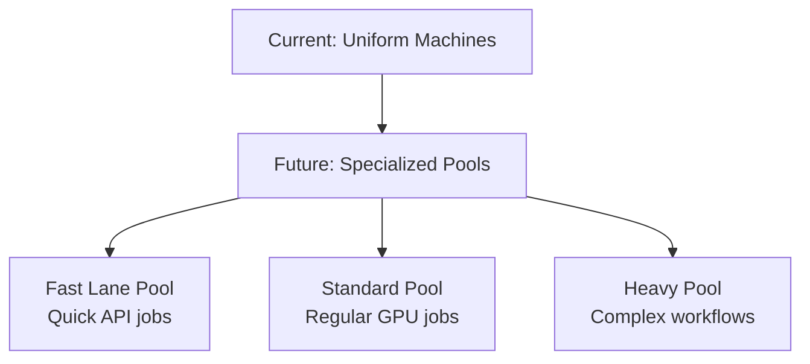

# Future Vision

This section outlines where the system is heading based on our North Star architecture and strategic plans.

## North Star: Specialized Machine Pools

We're evolving from uniform machines to specialized pools optimized for different workload patterns:

## In This Section

- [Planned Features & Todo Items](./planned-features.md) - **Current implementation plans and todo list**
- [North Star Architecture](./north-star-architecture.md) - Strategic technical vision *(from plans)*
- [Predictive Model Management](./predictive-model-management.md) - Smart model placement *(from plans)*
- [Pool-Based Routing](./pool-based-routing.md) - Intelligent job routing *(to be written)*
- [Technical Roadmap](./technical-roadmap.md) - Implementation timeline *(to be written)*
- [Customer Documentation Plans](./customer-docs-planning.md) - Future external docs *(to be written)*

## Key Future Capabilities

### Phase 1: Pool Separation (Next 2 months)
- Separate fast/standard/heavy workload pools
- Pool-specific machine configurations
- Basic affinity routing

### Phase 2: Model Intelligence (Months 3-4)
- Predictive model placement
- Model usage analytics
- Proactive model caching

### Phase 3: Advanced Optimization (Months 5-6)
- ML-based demand prediction
- Cross-pool optimization
- Automatic capacity planning

## What This Enables

### For the Business
- **10x scale capacity** without 10x cost
- **Sub-10 second response** for 95% of jobs
- **Predictable performance** across workload types

### For Operations
- **Automated scaling** based on workload patterns
- **Smart resource allocation** reducing waste
- **Proactive problem prevention** via prediction

### For Users
- **Faster job completion** through optimal routing
- **Higher reliability** with specialized pools
- **Better cost efficiency** passed through

## Technical Challenges

1. **Pool Coordination** - Managing multiple pools efficiently
2. **Model Prediction** - Accurately predicting model needs
3. **Cost Optimization** - Balancing performance and cost
4. **Migration Path** - Moving from current to target state

## Success Metrics

- **Pool Utilization**: >80% for each pool type
- **Model Cache Hits**: >90% for popular models
- **Job Routing Accuracy**: >95% to optimal pool
- **Cost per Job**: 50% reduction from current

## Getting Involved

This future vision requires collaboration across:
- **Engineering**: Building the pool infrastructure
- **Data Science**: Creating prediction models
- **Operations**: Managing complex deployments
- **Product**: Defining user experience

---

*This section contains forward-looking plans that are subject to change based on learnings and business priorities.*