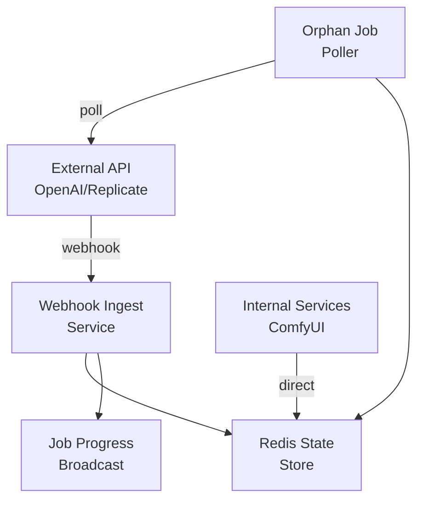

# General-Purpose Webhook Ingest Service

**Status**: Planning Phase  
**Priority**: High  
**Estimated Time**: 1-2 days  
**Dependencies**: Redis, Current connector architecture

## Overview

Create a centralized webhook service to handle job state updates from external APIs (OpenAI, Replicate, etc.), ensuring Redis always has the latest job status and providing resilient job recovery.

This service will be **external-service specific** - internal services like ComfyUI will continue using direct Redis updates.

## Architecture Components

### 1. Webhook Ingest Service Structure

```
apps/webhook-ingest/
├── src/
│   ├── webhook-server.ts        # Main HTTP server
│   ├── webhook-handlers/        # Provider-specific handlers
│   │   ├── openai-handler.ts
│   │   ├── replicate-handler.ts
│   │   └── base-handler.ts
│   ├── orphan-poller.ts         # Background job recovery
│   └── redis-state-manager.ts   # Centralized state updates
└── package.json
```

### 2. System Flow



### 3. Connector Interface Extension

Update `BaseConnector` to support webhook-capable connectors:

```typescript
export interface WebhookCapableConnector extends ConnectorInterface {
  /**
   * Get webhook configuration for this connector
   */
  getWebhookConfig(jobId: string): WebhookConfig;
  
  /**
   * Check if connector supports webhooks
   */
  supportsWebhooks(): boolean;
  
  /**
   * Poll job status (fallback for webhook failures)
   */
  pollJobStatus(externalJobId: string): Promise<JobStatus>;
}

export interface WebhookConfig {
  url: string;           // https://webhook-ingest.your-domain.com/webhook/openai/job123
  events: string[];      // ['progress', 'completed', 'failed']
  auth?: {              // Optional authentication
    type: 'bearer' | 'basic' | 'hmac';
    credentials: string;
  };
}
```

### 4. Service Differentiation

**External Services (Need Webhooks)**
- OpenAI - Running on their servers, needs to callback
- Replicate - External API, long-running jobs  
- Midjourney - External service
- Stability AI - External API

**Internal Services (Direct Redis Updates)**
- ComfyUI - Running in your containers, direct access
- Local models - Running on your machines
- Simulation connector - Internal testing
- Your custom processing - Internal to your system

## Implementation Phases

### Phase 1: Basic Webhook Service (3-4 hours)

**Deliverables:**
- HTTP server with generic webhook endpoints
- Basic provider routing (`/webhook/{provider}/{jobId}`)
- Redis state management integration
- Authentication middleware

**Code Structure:**
```typescript
// apps/webhook-ingest/src/webhook-server.ts
export class WebhookIngestServer {
  private app: express.Express;
  private redis: Redis;
  private stateManager: RedisStateManager;
  private handlers = new Map<string, WebhookHandler>();

  setupRoutes() {
    this.app.post('/webhook/:provider/:jobId?', async (req, res) => {
      const { provider, jobId } = req.params;
      const handler = this.handlers.get(provider);
      
      const normalizedUpdate = await handler.process(req.body, jobId);
      await this.stateManager.updateJobState(normalizedUpdate);
      
      res.json({ received: true });
    });
  }
}
```

### Phase 2: Connector Integration (2-3 hours)

**Deliverables:**
- Updated OpenAI connector with webhook support
- Job mapping and external ID tracking
- Background + webhook job submission

**OpenAI Connector Updates:**
```typescript
export class OpenAIImageConnector extends BaseConnector implements WebhookCapableConnector {
  
  supportsWebhooks(): boolean {
    return true;
  }

  getWebhookConfig(jobId: string): WebhookConfig {
    return {
      url: `${WEBHOOK_BASE_URL}/webhook/openai/${jobId}`,
      events: ['progress', 'completed', 'failed']
    };
  }

  async processJobImpl(jobData: JobData): Promise<JobResult> {
    const webhookConfig = this.getWebhookConfig(jobData.id);
    
    // Use background + webhook for resilient processing
    const response = await this.client.responses.create({
      model: 'gpt-4.1-mini',
      input: jobData.payload.prompt,
      background: true,     // Returns job ID immediately
      webhook: webhookConfig,
      tools: [{ type: "image_generation", partial_images: 2 }]
    });

    // Store external job mapping
    await this.redis.hset(`job_mapping:${jobData.id}`, {
      external_job_id: response.id,
      provider: 'openai',
      created_at: Date.now()
    });

    return {
      success: true,
      data: { external_job_id: response.id, status: 'processing' },
      processing_time_ms: 0
    };
  }
}
```

### Phase 3: Resilience Features (3-4 hours)

**Deliverables:**
- Orphan job poller for webhook failures
- Background polling fallback
- Error handling and retry logic

**Orphan Job Poller:**
```typescript
export class OrphanJobPoller {
  async pollOrphanJobs() {
    // Find jobs that haven't been updated recently
    const staleJobs = await this.redis.scan(0, 'MATCH', 'job_mapping:*');
    
    for (const jobKey of staleJobs[1]) {
      const jobData = await this.redis.hgetall(jobKey);
      const lastUpdate = parseInt(jobData.last_webhook_update || '0');
      
      // If no webhook update in 5 minutes, poll manually
      if (Date.now() - lastUpdate > 5 * 60 * 1000) {
        await this.pollAndUpdateJob(jobData);
      }
    }
  }
}
```

### Phase 4: Testing & Integration (2-4 hours)

**Deliverables:**
- End-to-end webhook flow testing
- Integration with existing job lifecycle
- Performance benchmarking
- Error scenario testing

## Technical Specifications

### Webhook Endpoint Pattern
```
POST /webhook/{provider}/{jobId}
Authorization: Bearer {token}
Content-Type: application/json
```

### Generic State Update Format
```typescript
interface JobStateUpdate {
  job_id: string;
  external_job_id: string;
  status: 'processing' | 'completed' | 'failed';
  progress: number; // 0-100
  result?: any;
  error_message?: string;
  provider: string;
  updated_at: number;
  source: 'webhook' | 'orphan_poll';
}
```

### Redis Key Patterns
```
job_mapping:{internal_job_id} -> {
  external_job_id: string,
  provider: string,
  created_at: number,
  last_webhook_update: number
}

job_state:{internal_job_id} -> {
  status: string,
  progress: number,
  result: string,
  updated_at: number
}
```

## Benefits & Success Metrics

### Benefits
✅ **Provider Agnostic** - Works with any external service  
✅ **Resilient** - Webhook failures handled by polling  
✅ **Centralized State** - Redis always has latest job status  
✅ **Scalable** - Webhook service can run separately  
✅ **Recoverable** - Orphan jobs resolved automatically  
✅ **Real-time** - Immediate updates via webhooks  

### Success Metrics
- **Webhook Delivery Success Rate**: >99%
- **Orphan Job Recovery Time**: <5 minutes
- **State Consistency**: 100% (Redis matches external state)
- **Performance Impact**: <50ms added latency

## Security Considerations

- **HMAC Signature Verification** for webhook authenticity
- **Rate Limiting** on webhook endpoints
- **Bearer Token Authentication** for webhook calls
- **IP Allowlisting** for known providers
- **Request Size Limits** to prevent abuse

## Monitoring & Observability

- **Webhook delivery metrics** (success/failure rates)
- **Orphan job detection frequency**
- **State update latency tracking**
- **Provider-specific error rates**
- **Redis state consistency checks**

## Future Extensions

- **Multi-region webhook support** for global deployments
- **Webhook retry policies** with exponential backoff
- **Provider-specific optimizations** based on usage patterns
- **Webhook payload caching** for debugging
- **Automated provider onboarding** tools

---

*This plan provides a robust foundation for external service integration while maintaining simplicity for internal services.*