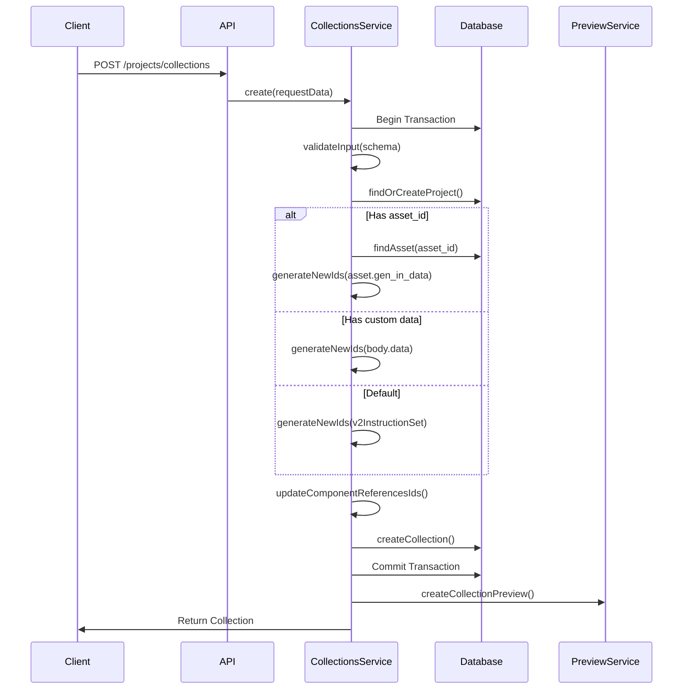
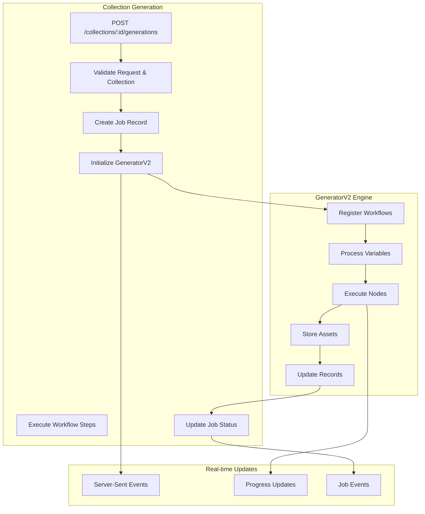

# Collection System Architecture

This document provides a comprehensive analysis of the EmProps platform's collection creation and generation systems.

## Collection Data Model

### Core Collection Schema

The collection model serves as the central entity for NFT collections:

```prisma
model collection {
  id                         String                       @id @default(dbgenerated("gen_random_uuid()")) @db.Uuid
  archived                   Boolean                      @default(false)
  batch_max_tokens           Int?
  batch_mint_enabled         Boolean                      @default(false)
  blockchain                 String?                      // "ETHEREUM", "BASE", "TEZOS"
  cover_image_url            String?
  data                       Json?                        // Core: GenerationInput workflow data
  description                String?
  editions                   Int?
  encryption_enabled         Boolean?
  images                     Json?
  is_current                 Boolean                      @default(true)
  price                      Float?
  project_id                 String                       @db.Uuid
  publish_date               DateTime?
  status                     String                       @default("draft")
  title                      String?
  updated_at                 DateTime                     @default(now())
  created_at                 DateTime                     @default(now())
  // Relations...
}
```

### Key Design Elements

**UUID-Based Identity**: Collections use UUID primary keys for global uniqueness across distributed systems.

**Rich Metadata Support**: Comprehensive fields for NFT publishing including pricing, editions, blockchain selection, and batch minting capabilities.

**Workflow Data Storage**: The `data` JSON field contains the core `GenerationInput` structure with workflow steps, variables, and generation parameters.

**Status Management**: Collections progress through states from "draft" to "published" with proper lifecycle management.

## Related Data Models

### Component System
```prisma
model component {
  id                   BigInt                @id @default(autoincrement())
  collection_id        String                @db.Uuid
  created_at           DateTime?             @default(now())
  component_flat_files component_flat_file[]
}
```

Individual workflow steps are represented as components, allowing for:
- **Step Tracking**: Each workflow node becomes a trackable component
- **Asset Association**: Generated assets link to specific components
- **Reusability**: Components can be referenced across collections

### Asset Management
```prisma
model flat_file {
  id                   BigInt                @id @default(autoincrement())
  url                  String?
  name                 String
  gen_in_data          Json?                 // Input parameters
  gen_out_data         Json?                 // Generation results
  mime_type            String?
  user_id              String                @db.Uuid
  // Relations...
}

model component_flat_file {
  id           BigInt    @id @default(autoincrement())
  component_id BigInt
  flat_file_id BigInt
  // Junction table for many-to-many relationship
}
```

**Asset Lifecycle**: Files are created during generation and linked to components through junction tables.

**Metadata Preservation**: Both input parameters and output results are stored for full traceability.

## Collection Creation Flow

### Current Implementation (`CollectionsService.create`)

The collection creation process follows these steps:



### Key Processes

#### ID Generation (`generateNewIds`)
```typescript
export const generateNewIds = async (
  prisma: PrismaClient,
  collectionId: string,
  data: GenerationInput,
) => {
  // Create component records for each workflow step
  const currentComponents = data.steps.map(() => ({
    collection_id: collectionId,
  }));
  
  const newComponents = await prisma.component.createManyAndReturn({
    data: currentComponents,
  });
  
  // Map old IDs to new component IDs
  const newSteps = data.steps.map((step, index) => ({
    ...step,
    fromId: step.id,
    id: Number(newComponents[index].id),
  }));

  return { ...data, steps: newSteps };
};
```

This process ensures:
- **Database Consistency**: Each workflow step gets a real component record
- **ID Mapping**: Old template IDs are mapped to new database IDs
- **Relationship Preservation**: Component flat file associations are maintained

#### Reference Updates (`updateComponentReferencesIds`)
```typescript
export async function updateComponentReferencesIds(
  prisma: PrismaClient,
  data: GenerationInput,
) {
  // Walk through workflow data and update $ref dependencies
  for (let i = 0; i < data.steps.length; i++) {
    const step = data.steps[i];
    // Update $ref dependencies to use new component IDs
    // Handle prompt editor components with embedded references
    data.steps[i] = await updateReferences(step);
  }
  return data;
}
```

**Reference Resolution**: Internal `$ref` dependencies between workflow steps are updated to use the new component IDs.

**Prompt Integration**: Special handling for prompt editor fields that may contain component references.

## Generation System Integration

### Current Generation Flow (`runCollectionGeneration`)



### Workflow Type Support

The system supports multiple workflow node types:

```typescript
this.workflows = await this.prisma.workflow.findMany({
  where: {
    type: {
      in: ["comfy_workflow", "fetch_api", "direct_job"],
    },
  },
});
```

**ComfyUI Workflows**: Complex AI image generation workflows
**API Integrations**: Third-party service integrations  
**Direct Jobs**: Submissions to the EmProps Job Queue system

### Job Tracking System

```typescript
// Job lifecycle management
await prisma.job.create({
  data: {
    id: jobId,
    name: `Collection Generation: ${collection.title}`,
    status: "pending",
    job_type: "collection_generation",
    user_id: userId,
  },
});

// Real-time progress updates
generator.on("node_completed", async (data) => {
  await prisma.job_history.create({
    data: {
      job_id: jobId,
      status: "processing", 
      message: `Node ${data.args.step.nodeName} completed`,
      data: { output: data.nodeStepOutput },
    },
  });
});
```

**Comprehensive Tracking**: Every job state change is recorded in the database
**Real-time Streaming**: Server-Sent Events provide live progress updates
**Error Handling**: Failed jobs are properly captured with error details

## Asset Storage Integration

### Multi-Cloud Storage
```typescript
const storageClient = new StorageClient(gcpStorageClient, azureStorageClient);

// Unified storage interface
const url = await storageClient.storeFile(
  path,
  mimeType, 
  buffer
);
```

**Provider Abstraction**: Single interface for multiple cloud providers
**CDN Integration**: Automatic CloudFront URL generation for asset access
**Efficient Processing**: Stream-based processing for large files

### File Organization
```typescript
// Organized path structure
const path = `generations/${ctx.userId}/${ctx.uid}/${ctx.gid}/${ctx.sid}/${filename}`;
```

**Hierarchical Structure**: Files organized by user, generation, and step
**Collision Prevention**: UUID-based paths prevent filename conflicts
**Easy Cleanup**: User-scoped organization enables efficient cleanup

## Integration Points

### Credits System
```typescript
// Pre-generation validation
const result = await this.creditsService.hasEnoughCredits(
  userId,
  input,
  generations.generations,
);

// Post-generation deduction  
await this.creditsService.decrementCredits(
  userId,
  creditCost.total_cost,
  `Generation ${id}/${gid}`,
);
```

### Authentication & Authorization
```typescript
// JWT middleware with user context
const userId = req.headers["user_id"] as string;

// Project ownership validation
const project = await prisma.project.findFirst({
  where: {
    id: projectId,
    user_id: userId,
  },
});
```

### Blockchain Integration
Collections support multi-chain deployment with comprehensive metadata:

```typescript
const collectionSchema = z.object({
  blockchain: z.enum(["ETHEREUM", "BASE", "TEZOS"]).optional(),
  batch_mint_enabled: z.boolean().optional(),
  batch_max_tokens: z.number().int().optional(),
  encryption_enabled: z.boolean().optional(),
});
```

## Performance Considerations

### Database Optimization
- **Connection Pooling**: Efficient database connection management
- **Transaction Scope**: Minimized transaction duration for better concurrency
- **Index Strategy**: Proper indexing on frequently queried fields

### Memory Management
- **Stream Processing**: Large files processed as streams to minimize memory usage
- **Background Jobs**: Heavy operations moved to background job system
- **Connection Cleanup**: Proper WebSocket and SSE connection cleanup

### Scalability Patterns
- **Stateless Design**: API servers can scale horizontally
- **Event-Driven**: Asynchronous processing for non-blocking operations  
- **Resource Limits**: Credit-based limiting prevents resource exhaustion

This architecture provides a solid foundation for the proposed Collection Generation API while maintaining compatibility with existing systems and supporting future enhancements.