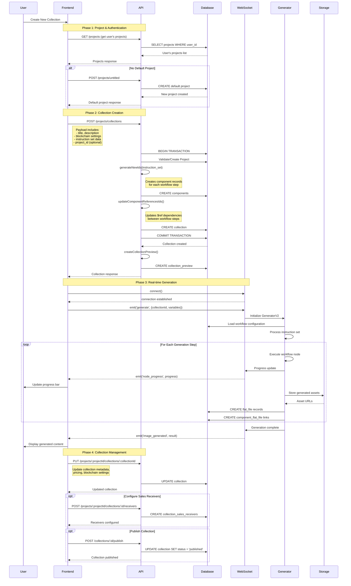

# Frontend Collection Creation Flow

This document provides a comprehensive breakdown of how the EmProps frontend creates collections, including all API interactions, data flows, and WebSocket communications.

## Overview

The collection creation process in EmProps involves multiple steps and API calls that transform user input into a fully functional NFT collection. This process includes project management, collection creation, component setup, and real-time generation updates.

## Complete Flow Diagram



## Phase-by-Phase Breakdown

### Phase 1: Authentication & Project Setup

#### 1.1 Initial Authentication
```typescript
// Frontend automatically includes JWT token in all requests
const headers = {
  'Authorization': `Bearer ${userToken}`,
  'Content-Type': 'application/json'
};
```

#### 1.2 Project Discovery
```http
GET /projects
Authorization: Bearer <jwt_token>
```

**Response Structure:**
```json
{
  "data": [
    {
      "id": "uuid",
      "name": "My Project",
      "user_id": "user-uuid", 
      "is_default": true,
      "version": "v2",
      "created_at": "2024-07-31T12:00:00Z",
      "collection": []
    }
  ],
  "error": null
}
```

#### 1.3 Default Project Creation (if needed)
```http
POST /projects/untitled
Authorization: Bearer <jwt_token>
Content-Type: application/json

{
  "version": "v2"
}
```

### Phase 2: Collection Creation

#### 2.1 Collection Creation Request
```http
POST /projects/collections
Authorization: Bearer <jwt_token>
Content-Type: application/json
```

**Frontend Payload Structure:**
```json
{
  "title": "Cyberpunk Avatars",
  "description": "AI-generated cyberpunk style avatars",
  "data": {
    "version": "v2",
    "steps": [
      {
        "id": 1,
        "nodeName": "stable-diffusion-xl",
        "nodePayload": {
          "prompt": "cyberpunk avatar, neon colors",
          "negative_prompt": "blurry, low quality",
          "steps": 30,
          "cfg_scale": 7.5,
          "width": 512,
          "height": 512,
          "seed": -1
        },
        "alias": "Main Generation"
      }
    ],
    "generations": {
      "hashes": ["generated-hash-string"],
      "generations": 1,
      "use_custom_hashes": false
    },
    "variables": [
      {
        "name": "style",
        "type": "pick",
        "value_type": "strings",
        "value": {
          "display_names": ["Cyberpunk", "Steampunk", "Synthwave"],
          "values": ["cyberpunk", "steampunk", "synthwave"],
          "weights": [1, 1, 1]
        },
        "lock_value": false,
        "test_value": "cyberpunk"
      }
    ]
  },
  "editions": 1000,
  "price": 0.05,
  "blockchain": "ETHEREUM",
  "batch_mint_enabled": true,
  "batch_max_tokens": 100,
  "encryption_enabled": false
}
```

**Query Parameters:**
- `project_id` (optional): Target project UUID
- `asset_id` (optional): Create from existing asset

#### 2.2 Backend Processing Flow

**Step 1: Validation**
```typescript
// Zod schema validation
const collectionSchema = z.object({
  data: z.any(),
  title: z.string().optional().nullable(),
  description: z.string().optional().nullable(),
  editions: z.number().int().optional().nullable(),
  // ... other fields
});
```

**Step 2: Project Resolution**
```typescript
// Get or create default project
if (!projectId) {
  const defaultProject = await tx.project.findFirst({
    where: { user_id: userId, is_default: true }
  });
  if (!defaultProject) {
    project = await tx.project.create({
      data: {
        name: "Default",
        user_id: userId,
        is_default: true,
        version: "v2"
      }
    });
  }
}
```

**Step 3: Component ID Generation**
```typescript
// generateNewIds() process:
// 1. Create component records for each workflow step
const currentComponents = data.steps.map(() => ({
  collection_id: collectionId,
}));

const newComponents = await prisma.component.createManyAndReturn({
  data: currentComponents,
});

// 2. Map old template IDs to new database IDs
const newSteps = data.steps.map((step, index) => ({
  ...step,
  fromId: step.id,
  id: Number(newComponents[index].id),
}));
```

**Step 4: Reference Updates**
```typescript
// updateComponentReferencesIds() process:
// Updates $ref dependencies between workflow steps
for (const key in step.nodePayload) {
  const value = step.nodePayload[key];
  if (value && typeof value === "object" && value.$ref !== undefined) {
    const relatedStep = data.steps.find((s) => s.fromId === value.$ref);
    if (relatedStep) {
      value.$ref = relatedStep.id; // Update to new component ID
    }
  }
}
```

#### 2.3 Collection Creation Response
```json
{
  "data": {
    "id": "collection-uuid",
    "title": "Cyberpunk Avatars",
    "description": "AI-generated cyberpunk style avatars",
    "status": "draft",
    "project_id": "project-uuid",
    "data": {
      "version": "v2",
      "steps": [
        {
          "id": 12345,
          "fromId": 1,
          "nodeName": "stable-diffusion-xl",
          "nodePayload": { /* ... */ },
          "alias": "Main Generation"
        }
      ],
      "generations": { /* ... */ },
      "variables": [ /* ... */ ]
    },
    "created_at": "2024-07-31T12:00:00Z",
    "updated_at": "2024-07-31T12:00:00Z"
  },
  "error": null
}
```

### Phase 3: Real-time Generation via WebSocket

#### 3.1 WebSocket Connection
```typescript
// Frontend WebSocket connection
const socket = io('wss://api.emprops.com', {
  auth: { token: userJwtToken },
  transports: ['websocket']
});

socket.on('connect', () => {
  console.log('Connected to generation service');
});
```

#### 3.2 Generation Initiation
```typescript
// Frontend sends generation request
socket.emit('generate', {
  collectionId: 'collection-uuid',
  variables: {
    style: 'cyberpunk',
    background: 'neon city'
  },
  options: {
    generations: 1,
    seed: -1
  }
});
```

#### 3.3 Progress Updates
```typescript
// Frontend listeners for real-time updates
socket.on('node_started', (data) => {
  updateProgress(`Starting ${data.nodeName}...`);
});

socket.on('node_progress', (data) => {
  updateProgressBar(data.progress);
});

socket.on('node_completed', (data) => {
  updateProgress(`Completed ${data.nodeName}`);
});

socket.on('image_generated', (data) => {
  displayGeneratedImage(data.src);
  updateCollectionAssets(data);
});

socket.on('error', (error) => {
  displayError(error.message);
});
```

#### 3.4 Backend WebSocket Processing
```typescript
// WebSocketEventManager handles generation requests
async generate(message: GenerationMessage) {
  const collection = await this.prisma.collection.findUnique({
    where: { id: message.collectionId }
  });

  const generator = new GeneratorV2(/* ... */)
    .on("image_generated", (data) => this.send("image_generated", data))
    .on("node_progress", (data) => this.send("node_progress", data))
    .on("error", (error) => this.send("error", error));

  await generator.generateImage(
    uuid(),
    collection.data as GenerationInput,
    {
      userId: message.userId,
      collectionId: message.collectionId,
      source: "component_test"
    }
  );
}
```

### Phase 4: Collection Management

#### 4.1 Collection Updates
```http
PUT /projects/:projectId/collections/:collectionId
Authorization: Bearer <jwt_token>
Content-Type: application/json

{
  "title": "Updated Collection Name",
  "description": "Updated description",
  "price": 0.08,
  "editions": 1500,
  "blockchain": "BASE"
}
```

#### 4.2 Current Collection Retrieval
```http
GET /projects/:projectId/collections/current
Authorization: Bearer <jwt_token>
```

**Response:** Returns the user's current active collection for the project.

#### 4.3 Sales Receivers Configuration
```http
POST /projects/:projectId/collections/:id/receivers
Authorization: Bearer <jwt_token>
Content-Type: application/json

{
  "address": "0x742d35Cc6661C0532C9d4c8dA4f7D59B2D66B4a4",
  "value": 95.0,
  "type": "creator"
}
```

#### 4.4 Collection Publishing
```http
POST /collections/:id/publish
Authorization: Bearer <jwt_token>
```

**Effect:** Changes collection status from "draft" to "published", making it publicly visible.

## Frontend State Management

### Collection Creation State
```typescript
interface CollectionCreationState {
  // Creation flow
  isCreating: boolean;
  currentStep: 'project' | 'collection' | 'generation' | 'complete';
  
  // Project state
  selectedProject: Project | null;
  availableProjects: Project[];
  
  // Collection data
  collectionForm: {
    title: string;
    description: string;
    blockchain: 'ETHEREUM' | 'BASE' | 'TEZOS';
    price: number;
    editions: number;
    instructionSet: GenerationInput;
  };
  
  // Generation state
  isGenerating: boolean;
  generationProgress: number;
  generationStatus: string;
  generatedAssets: Asset[];
  
  // WebSocket state
  socketConnected: boolean;
  socketError: string | null;
}
```

### Typical Frontend Hooks
```typescript
// Collection creation hook
export function useCollectionCreation() {
  const [state, setState] = useState<CollectionCreationState>(initialState);
  
  const createCollection = async (formData: CollectionFormData) => {
    setState(s => ({ ...s, isCreating: true }));
    
    try {
      // 1. Ensure project exists
      if (!state.selectedProject) {
        const project = await createDefaultProject();
        setState(s => ({ ...s, selectedProject: project }));
      }
      
      // 2. Create collection
      const collection = await fetch('/projects/collections', {
        method: 'POST',
        headers: getAuthHeaders(),
        body: JSON.stringify({
          ...formData,
          project_id: state.selectedProject.id
        })
      });
      
      // 3. Start generation if enabled
      if (formData.autoGenerate) {
        await startGeneration(collection.id, formData.variables);
      }
      
      setState(s => ({ 
        ...s, 
        isCreating: false, 
        currentStep: 'complete' 
      }));
      
    } catch (error) {
      setState(s => ({ 
        ...s, 
        isCreating: false, 
        error: error.message 
      }));
    }
  };
  
  return { state, createCollection };
}
```

## Error Handling Patterns

### API Error Responses
```json
{
  "data": null,
  "error": "Invalid blockchain selection",
  "details": [
    {
      "field": "blockchain",
      "message": "Must be one of: ETHEREUM, BASE, TEZOS"
    }
  ]
}
```

### WebSocket Error Handling
```typescript
socket.on('error', (error) => {
  switch (error.code) {
    case 'INSUFFICIENT_CREDITS':
      showCreditsPurchaseModal();
      break;
    case 'GENERATION_FAILED':
      showRetryDialog(error.details);
      break;
    case 'WORKFLOW_ERROR':
      showWorkflowErrorDetails(error);
      break;
    default:
      showGenericError(error.message);
  }
});
```

## Performance & Optimization

### Frontend Optimizations
1. **Lazy Loading**: Collection editor components loaded on-demand
2. **State Persistence**: Form data saved to localStorage during creation
3. **Debounced Updates**: Collection updates debounced to prevent excessive API calls
4. **WebSocket Reconnection**: Automatic reconnection with exponential backoff
5. **Progress Caching**: Generation progress cached across page refreshes

### Backend Optimizations
1. **Transaction Scope**: Database transactions kept minimal for better concurrency
2. **Component Batching**: Component creation done in batch operations
3. **WebSocket Pooling**: Connection pooling for WebSocket management
4. **Asset Streaming**: Large assets streamed rather than loaded into memory

## Common Integration Patterns

### Collection Templates
```typescript
// Frontend can create collections from predefined templates
const createFromTemplate = async (templateId: string, overrides: Partial<CollectionData>) => {
  const template = await fetch(`/project-templates/${templateId}`);
  const collectionData = {
    ...template.data,
    ...overrides,
    title: overrides.title || `${template.name} - ${Date.now()}`
  };
  
  return createCollection(collectionData);
};
```

### Asset-based Creation
```typescript
// Create collection from existing generated asset
const createFromAsset = async (assetId: number) => {
  return fetch('/projects/collections?asset_id=' + assetId, {
    method: 'POST',
    headers: getAuthHeaders(),
    body: JSON.stringify({
      title: 'Collection from Asset',
      // Other metadata...
    })
  });
};
```

This comprehensive flow documentation provides developers with a complete understanding of how collections are created, from initial user interaction through final asset generation and publishing. The multi-phase approach ensures robust error handling and optimal user experience throughout the process.