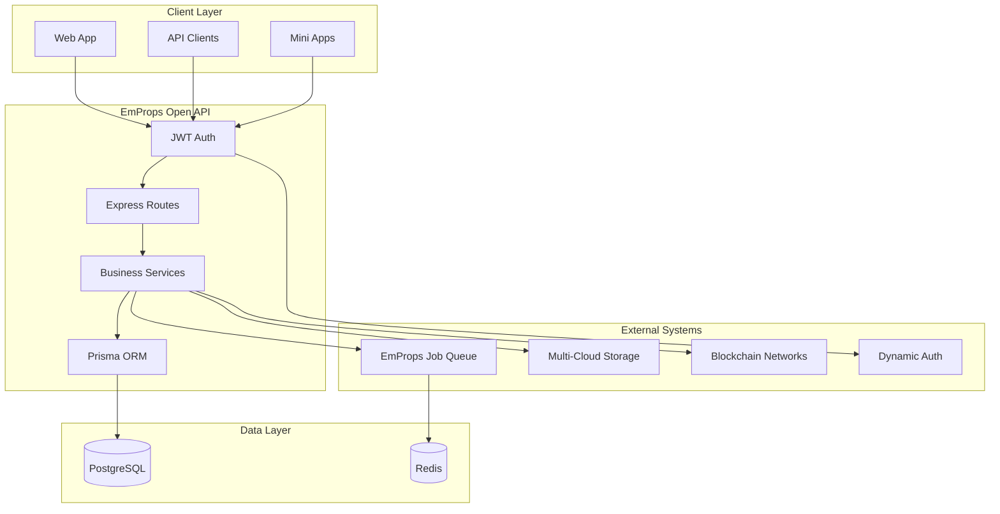

# Architecture Overview

The EmProps Open API is designed as a comprehensive REST API server that manages NFT collections, executes AI workflows, and integrates with blockchain infrastructure.

## System Architecture



## Core Components

### API Server (`src/index.ts`)
- Express.js application with comprehensive middleware
- JWT authentication with Dynamic integration
- Rate limiting and security headers
- WebSocket support for real-time updates

### Business Services (`src/lib/`)
- **CollectionsService**: Collection CRUD and generation
- **CreditsService**: User credit management
- **GeneratorV2**: AI workflow execution engine

### Database Layer (`prisma/`)
- PostgreSQL with Prisma ORM
- Rich schema supporting collections, workflows, jobs, and users
- Transaction support for complex operations

### Job Integration
- DirectJobNode for submitting to EmProps Job Queue
- Real-time progress tracking via Server-Sent Events
- Comprehensive error handling and retry logic

## Key Design Principles

### 1. **Separation of Concerns**
- Clear separation between API routes, business logic, and data access
- Service-oriented architecture with dependency injection
- Modular design allowing independent testing and scaling

### 2. **Robust Error Handling**
- Comprehensive validation using Zod schemas  
- Structured error responses with proper HTTP status codes
- Detailed logging and monitoring integration

### 3. **Real-time Communication**
- WebSocket connections for live updates
- Server-Sent Events for job progress streaming
- Event-driven architecture with proper cleanup

### 4. **Multi-tenant Security**
- User-scoped data access with proper authorization
- API key management for workflow access
- Encrypted sensitive data storage

## Integration Patterns

### Job Queue Integration
The API integrates with the EmProps Job Queue system for AI workload processing:

```typescript
// DirectJobNode submits to distributed workers
const result = await this.redisServerClient.submitJob({
  service_required: "comfy_ui",
  payload: workflowData,
  metadata: { user_id, workflow_context }
});
```

### Storage Integration  
Multi-cloud storage with unified interface:

```typescript
// StorageClient abstracts cloud providers
const url = await storageClient.storeFile(
  path, 
  mimeType, 
  buffer
);
```

### Blockchain Integration
Multi-chain NFT deployment support:

```typescript
// Collection publishing to multiple chains
await collection.publish({
  blockchain: "ETHEREUM" | "BASE" | "TEZOS",
  metadata: nftMetadata
});
```

## Scalability Considerations

### Horizontal Scaling
- Stateless API design allows multiple instances
- Database connection pooling for high concurrency
- Redis for session and job state management

### Performance Optimization
- Efficient Prisma queries with proper indexing
- Background job processing for heavy operations
- CDN integration for static asset delivery

### Resource Management
- Credit-based usage limiting
- Configurable rate limiting per user/endpoint
- Memory-efficient file processing with streams

## Next Steps

- [Frontend Collection Flow](/08-emprops-open-api/architecture/frontend-collection-flow) - Complete frontend integration guide
- [Collection System](/08-emprops-open-api/architecture/collection-system) - Collection architecture deep dive
- [Database Schema](/08-emprops-open-api/architecture/database-schema) - Detailed database design  
- [API Reference](/08-emprops-open-api/api-reference/) - Complete API documentation