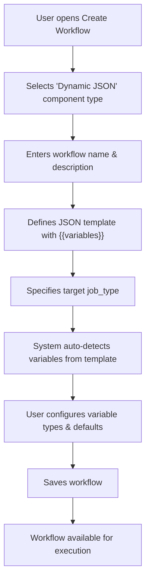
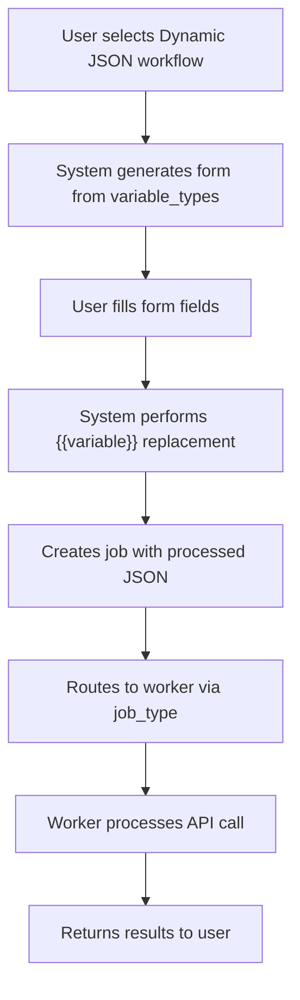
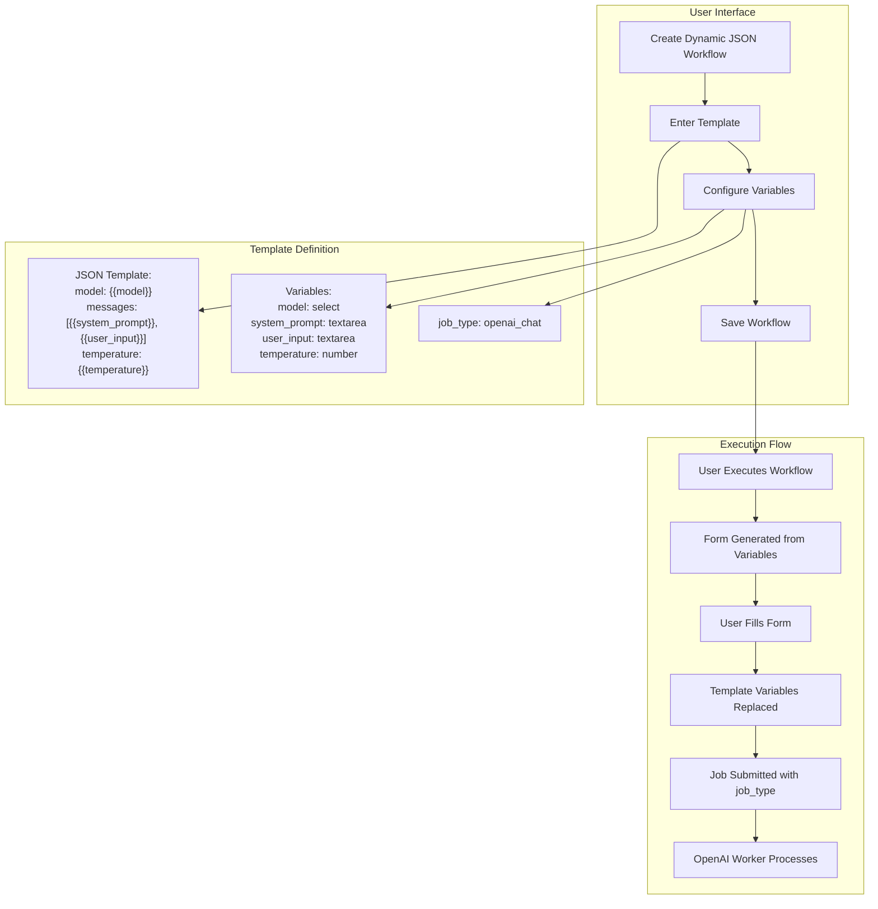
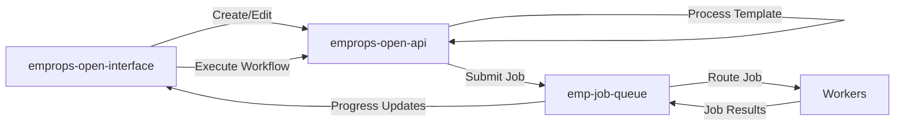

# Dynamic JSON Workflow Component Design

**Date**: September 3, 2025  
**Status**: Design Phase  
**Context**: EmProps Job Queue System - New Component Type for API Integration

## Context for Implementation

### Current System Overview
The EmProps Job Queue System is a distributed AI workload broker designed for elastic scaling across ephemeral machines (SALAD, vast.ai). The system consists of:

- **Redis-based job broker**: Atomic job matching and claiming via Redis Functions
- **Pull-based workers**: Workers request jobs they can handle based on capabilities
- **WebSocket monitoring**: Real-time job progress and machine status via apps/monitor
- **Component Library**: ECLI system for managing workflow definitions via packages/component-library
- **Current Architecture**: apps/api (lightweight orchestration), apps/worker (Redis-direct with connectors), apps/machines/basic_machine (PM2-managed containers)

### Key Existing Patterns
- **Job Routing**: `job_type` field routes to appropriate worker connectors (e.g., `openai_text` → OpenAITextConnector)
- **Worker Selection**: Redis function `findMatchingJob` handles capability-based routing
- **API Keys**: Per-user storage in api_key table + environment fallbacks, distributed across machines
- **Component Types**: `comfy_workflow` (ComfyUI graphs), `fetch_api` (direct API), `direct_job` (job queue), `basic` (credits only)

### Current Pain Points Being Solved
1. **ECLI Complexity**: Current workflows require managing form.json, inputs.json, workflow.json files
2. **ComfyUI Dependency**: API-only workflows forced into ComfyUI node graph format
3. **File Management**: Version control and sync issues with multiple config files
4. **Learning Curve**: Users must understand ComfyUI internals for simple API calls

### Integration Points
- **Database**: Existing `workflow` table with flexible JSONB `data` field (no schema changes needed)
- **Job Queue**: Existing Redis job submission via apps/worker/src/redis-direct-worker-client.ts
- **Connectors**: Pattern established in apps/worker/src/connectors/ (OpenAITextConnector, etc.)
- **UI**: EmProps frontend already handles dynamic form generation from workflow.data.form

### Implementation Context
This feature is being implemented on master branch across **three separate codebases**:

1. **emp-job-queue** (this repo) - Core types, utilities, job routing
2. **~/code/emprops/emprops-open-api** - Workflow CRUD, database, processing services  
3. **~/code/emprops/core-services/emprops-open-interface** - Frontend UI components

The design leverages existing infrastructure patterns while eliminating file management complexity for API-based workflows.

## Overview

The Dynamic JSON Workflow Component is a new component type designed to eliminate the complexity of file management for simple API-based workflows. Instead of requiring ECLI (EmpropsComfyLifeImage) files and complex node graphs, this component type allows users to define API workflows using JSON templates with variable substitution.

### What Problem Does This Solve?

Current workflow creation requires:
1. Creating ECLI files with ComfyUI node graphs
2. Managing complex dependencies and node relationships  
3. Understanding ComfyUI's internal structure
4. File uploads and version management

The Dynamic JSON Component simplifies this to:
1. Define a JSON template with `{{variable}}` placeholders
2. Specify the target `job_type` for worker routing
3. Let the system auto-generate form fields from template variables
4. Submit jobs directly without file management

## Architecture Comparison

### Current ComfyUI Component Type
- **File Dependency**: Requires ECLI file upload
- **Form Generation**: Static, pre-defined based on ECLI analysis
- **Job Routing**: Based on ComfyUI capabilities (`comfyui` job type)
- **Template Processing**: Complex node graph execution
- **Storage**: Files stored in database, managed lifecycles

### New Dynamic JSON Component Type
- **File Dependency**: None - pure JSON template
- **Form Generation**: Dynamic, auto-generated from `{{variables}}`
- **Job Routing**: User-specified `job_type` field
- **Template Processing**: Simple string replacement
- **Storage**: JSON template stored inline in workflow record

## Database Schema Changes

The existing `workflow` table requires minimal changes to support this new component type:

```sql
-- Existing schema supports this with no changes needed
-- component_type can be 'comfyui' or 'dynamic_json' 
-- template_data JSONB field stores the JSON template
-- Additional metadata in existing fields
```

### Template Data Structure

For `dynamic_json` component type, the `template_data` field contains:

```json
{
  "job_type": "openai_chat",
  "template": {
    "model": "{{model}}",
    "messages": [
      {
        "role": "system", 
        "content": "{{system_prompt}}"
      },
      {
        "role": "user",
        "content": "{{user_input}}"
      }
    ],
    "temperature": "{{temperature}}",
    "max_tokens": "{{max_tokens}}"
  },
  "variable_types": {
    "model": { "type": "select", "options": ["gpt-4", "gpt-3.5-turbo"], "default": "gpt-4" },
    "system_prompt": { "type": "textarea", "default": "You are a helpful assistant." },
    "user_input": { "type": "textarea", "required": true },
    "temperature": { "type": "number", "min": 0, "max": 2, "default": 0.7 },
    "max_tokens": { "type": "number", "min": 1, "max": 4000, "default": 1000 }
  }
}
```

## User Experience Flow

### 1. Workflow Creation


### 2. Workflow Execution


## Technical Implementation

### Frontend Changes

#### New Component Type Registration
```typescript
// Add to existing component type definitions
export const COMPONENT_TYPES = {
  COMFYUI: 'comfyui',
  DYNAMIC_JSON: 'dynamic_json'
} as const;
```

#### Dynamic Form Generation
```typescript
interface VariableDefinition {
  type: 'text' | 'textarea' | 'number' | 'select' | 'checkbox';
  required?: boolean;
  default?: any;
  min?: number;
  max?: number;
  options?: string[];
}

interface DynamicJsonTemplate {
  job_type: string;
  template: Record<string, any>;
  variable_types: Record<string, VariableDefinition>;
}

function generateFormFromTemplate(templateData: DynamicJsonTemplate) {
  // Extract variables from template using regex: /\{\{(\w+)\}\}/g
  // Cross-reference with variable_types for form field generation
  // Return React form components
}
```

#### Template Variable Extraction
```typescript
function extractVariablesFromTemplate(template: any): string[] {
  const variables = new Set<string>();
  const variableRegex = /\{\{(\w+)\}\}/g;
  
  const extractFromValue = (value: any) => {
    if (typeof value === 'string') {
      let match;
      while ((match = variableRegex.exec(value)) !== null) {
        variables.add(match[1]);
      }
    } else if (typeof value === 'object' && value !== null) {
      Object.values(value).forEach(extractFromValue);
    }
  };
  
  extractFromValue(template);
  return Array.from(variables);
}
```

### Backend Changes

#### Workflow Processing Service
```typescript
class DynamicJsonWorkflowProcessor {
  processWorkflow(workflow: Workflow, userInputs: Record<string, any>) {
    if (workflow.component_type !== 'dynamic_json') {
      throw new Error('Invalid component type for dynamic JSON processing');
    }
    
    const templateData = workflow.template_data as DynamicJsonTemplate;
    const processedTemplate = this.replaceVariables(templateData.template, userInputs);
    
    return {
      job_type: templateData.job_type,
      payload: processedTemplate
    };
  }
  
  private replaceVariables(template: any, variables: Record<string, any>): any {
    const templateStr = JSON.stringify(template);
    let processed = templateStr;
    
    Object.entries(variables).forEach(([key, value]) => {
      const placeholder = `{{${key}}}`;
      processed = processed.replace(new RegExp(placeholder, 'g'), JSON.stringify(value).slice(1, -1));
    });
    
    return JSON.parse(processed);
  }
}
```

#### Job Submission Integration
```typescript
// Modify existing job submission endpoint
app.post('/api/workflows/:id/execute', async (req, res) => {
  const workflow = await getWorkflow(req.params.id);
  
  if (workflow.component_type === 'dynamic_json') {
    const processor = new DynamicJsonWorkflowProcessor();
    const { job_type, payload } = processor.processWorkflow(workflow, req.body.inputs);
    
    const job = await submitJob({
      job_type,
      payload,
      user_id: req.user.id,
      workflow_id: workflow.id
    });
    
    res.json({ job_id: job.id });
  } else {
    // Existing ComfyUI processing logic
    handleComfyUIWorkflow(workflow, req.body);
  }
});
```

### Worker Routing Changes

No changes needed to the core worker routing system. The `job_type` field in the job payload will route to appropriate workers:

- `job_type: "openai_chat"` → Routes to OpenAI-capable workers
- `job_type: "claude_api"` → Routes to Anthropic-capable workers  
- `job_type: "custom_api"` → Routes to generic API workers
- `job_type: "comfyui"` → Routes to ComfyUI workers (existing)

The existing Redis function `findMatchingJob` already handles job type routing based on worker capabilities.

## Implementation Examples

### Example 1: OpenAI Chat Completion

<FullscreenDiagram>



</FullscreenDiagram>

```json
{
  "job_type": "openai_chat",
  "template": {
    "model": "{{model}}",
    "messages": [
      {
        "role": "system",
        "content": "{{system_prompt}}"
      },
      {
        "role": "user", 
        "content": "{{user_input}}"
      }
    ],
    "temperature": "{{temperature}}",
    "max_tokens": "{{max_tokens}}"
  },
  "variable_types": {
    "model": { 
      "type": "select", 
      "options": ["gpt-4o", "gpt-4o-mini", "gpt-3.5-turbo"],
      "default": "gpt-4o"
    },
    "system_prompt": { 
      "type": "textarea",
      "default": "You are a helpful assistant.",
      "required": true
    },
    "user_input": { 
      "type": "textarea", 
      "required": true 
    },
    "temperature": { 
      "type": "number", 
      "min": 0, 
      "max": 2, 
      "default": 0.7 
    },
    "max_tokens": { 
      "type": "number", 
      "min": 1, 
      "max": 4000, 
      "default": 1000 
    }
  }
}
```

### Example 2: Claude API Integration

```json
{
  "job_type": "claude_api",
  "template": {
    "model": "{{model}}",
    "max_tokens": "{{max_tokens}}",
    "messages": [
      {
        "role": "user",
        "content": "{{prompt}}"
      }
    ]
  },
  "variable_types": {
    "model": {
      "type": "select",
      "options": ["claude-3-5-sonnet-20241022", "claude-3-haiku-20240307"],
      "default": "claude-3-5-sonnet-20241022"
    },
    "prompt": {
      "type": "textarea",
      "required": true
    },
    "max_tokens": {
      "type": "number",
      "min": 1,
      "max": 8000,
      "default": 1000
    }
  }
}
```

### Example 3: Custom API Webhook

```json
{
  "job_type": "custom_webhook",
  "template": {
    "url": "{{webhook_url}}",
    "method": "POST",
    "headers": {
      "Authorization": "Bearer {{api_key}}",
      "Content-Type": "application/json"
    },
    "body": {
      "text": "{{input_text}}",
      "options": {
        "format": "{{output_format}}",
        "priority": "{{priority}}"
      }
    }
  },
  "variable_types": {
    "webhook_url": {
      "type": "text",
      "required": true
    },
    "api_key": {
      "type": "text",
      "required": true
    },
    "input_text": {
      "type": "textarea", 
      "required": true
    },
    "output_format": {
      "type": "select",
      "options": ["json", "xml", "csv"],
      "default": "json"
    },
    "priority": {
      "type": "select",
      "options": ["low", "medium", "high"],
      "default": "medium"
    }
  }
}
```

## Benefits of This Approach

### 1. **Simplified Workflow Creation**
- No file uploads or management required
- No understanding of ComfyUI node graphs needed
- Direct JSON template editing with familiar syntax

### 2. **Flexible Worker Routing** 
- Jobs route based on `job_type`, not component capabilities
- Can target any worker type: OpenAI, Claude, custom APIs, etc.
- Existing Redis routing infrastructure handles everything

### 3. **Auto-Generated Forms**
- Form fields automatically generated from template variables
- Type-safe input validation based on `variable_types`
- Rich form controls: selects, numbers, textareas, etc.

### 4. **Developer-Friendly**
- Template variables use familiar `{{mustache}}` syntax
- JSON structure is intuitive and readable
- Easy to version control and modify templates

### 5. **Minimal Infrastructure Changes**
- Uses existing workflow table structure
- Leverages existing job queue and worker routing
- No new microservices or databases required

### 6. **Type Safety and Validation**
- Variable type definitions provide frontend validation
- Backend validates against defined schemas
- Prevents runtime errors from invalid inputs

## Three-Codebase Implementation Plan

This implementation spans **three separate repositories** in master branch production architecture:

---

## **Codebase 1: emp-job-queue** (this repo)
**Role**: Core types, shared utilities, job routing, and worker processing
**Repository**: `/Users/the_dusky/code/emprops/ai_infra/emp-job-queue/`

### Phase 1: Shared Core Infrastructure ✅ **(COMPLETED)**
- [x] **Component type constants** - Added to `packages/core/src/types/index.ts`
- [x] **TypeScript interfaces** - Created `packages/core/src/types/dynamic-json.ts`
- [x] **Template utilities** - Created `apps/api/src/utils/template-utils.ts`
- [x] **Template processor service** - Created `apps/api/src/services/dynamic-json-workflow-processor.ts`

### Phase 2: Job Routing & Worker Integration 
- [ ] **Verify existing connectors** support new job types (`openai_chat`, `claude_api`, etc.)
- [ ] **Update Redis job routing** to handle `dynamic_json` component types
- [ ] **Test job routing** from processed templates to appropriate workers
- [ ] **Remove incorrect API endpoints** (workflow CRUD should be in emprops-open-api)

### Phase 3: Package for Distribution
- [ ] **Publish updated @emp/core** with new types for other codebases to consume
- [ ] **Create example job submissions** demonstrating dynamic JSON workflows
- [ ] **Document job routing** for dynamic JSON component types

---

## **Codebase 2: emprops-open-api** 
**Role**: Workflow CRUD operations, database integration, template processing
**Repository**: `~/code/emprops/emprops-open-api/`

### Phase 1: Workflow Management API
- [ ] **Install updated @emp/core** dependency with dynamic JSON types
- [ ] **Workflow CRUD endpoints**:
  - `POST /api/workflows` - Create new dynamic JSON workflows
  - `GET /api/workflows/:id` - Get workflow with template data
  - `PUT /api/workflows/:id` - Update workflow template
  - `DELETE /api/workflows/:id` - Delete workflow
- [ ] **Database integration** for storing `dynamic_json` workflows in `workflow` table

### Phase 2: Template Processing Services  
- [ ] **Template validation endpoint** - `POST /api/workflows/validate-template`
- [ ] **Template preview endpoint** - `POST /api/workflows/preview-template`
- [ ] **Job submission integration** - Process dynamic JSON templates and submit to job-queue
- [ ] **Variable extraction service** - Extract variables from templates for form generation

### Phase 3: Integration with Job Queue
- [ ] **Job submission client** - Submit processed jobs to emp-job-queue via Redis/HTTP
- [ ] **Job status tracking** - Monitor dynamic JSON job progress
- [ ] **Error handling** - Handle template processing failures gracefully
- [ ] **User management** - Associate workflows with user accounts

### Phase 4: Production Features
- [ ] **Template caching** for performance optimization
- [ ] **Input validation** and sanitization for security
- [ ] **Rate limiting** on template processing endpoints
- [ ] **Audit logging** for workflow creation and execution

---

## **Codebase 3: emprops-open-interface**
**Role**: Frontend UI components, template editor, form generation
**Repository**: `~/code/emprops/core-services/emprops-open-interface/`

### Phase 1: Component Type Integration
- [ ] **Component type selector** - Add "Dynamic JSON" option to workflow creation
- [ ] **Navigation updates** - Add routes for dynamic JSON workflow management
- [ ] **Icon and styling** - Create visual identity for dynamic JSON workflows

### Phase 2: Template Editor UI
- [ ] **JSON template editor** with syntax highlighting and validation
- [ ] **Variable extraction preview** - Show detected `{{variables}}` in real-time
- [ ] **Job type selector** - Dropdown for selecting target worker types
- [ ] **Template examples** - Provide sample templates for common use cases

### Phase 3: Dynamic Form Generation
- [ ] **Form generator service** - Generate React forms from `variable_types`
- [ ] **Variable configuration UI** - Configure type, validation, defaults for each variable
- [ ] **Form validation** - Client-side validation based on variable definitions
- [ ] **Default value handling** - Pre-populate forms with defaults

### Phase 4: Workflow Execution Interface  
- [ ] **Workflow execution page** - Form-based interface for running dynamic JSON workflows
- [ ] **Real-time progress** - WebSocket integration for job progress updates
- [ ] **Result display** - Show job outputs and handle different result types
- [ ] **Error handling UI** - Display validation errors and processing failures

### Phase 5: Advanced Features
- [ ] **Template library** - Browse and clone community templates
- [ ] **Version control** - Template versioning and rollback capabilities
- [ ] **Collaborative editing** - Multiple users editing templates
- [ ] **Export/import** - Share templates between environments

---

## **Cross-Codebase Integration Points**

### Data Flow Architecture


### Shared Dependencies
- **@emp/core package** - Shared types and interfaces from emp-job-queue
- **Database schema** - Workflow table supports `dynamic_json` component type
- **Redis job queue** - Job routing and progress updates
- **WebSocket events** - Real-time job progress across codebases

### Testing Strategy
- **Unit tests** in each codebase for their specific logic
- **Integration tests** spanning emprops-open-api → emp-job-queue job submission
- **End-to-end tests** from UI template creation → job execution → results
- **Performance tests** for template processing and job routing at scale

## Technical Considerations

### Security
- **Input Sanitization**: All user inputs must be sanitized before template replacement
- **Template Validation**: Validate JSON template structure before saving
- **Variable Bounds**: Enforce min/max values for numeric inputs
- **API Key Security**: Handle sensitive variables (API keys) with proper encryption

### Performance
- **Template Caching**: Cache parsed templates to avoid repeated processing
- **Variable Extraction**: Optimize regex-based variable extraction for large templates
- **Form Generation**: Memoize form components based on template hash

### Error Handling
- **Template Errors**: Clear error messages for invalid JSON templates
- **Variable Mismatches**: Validate all required variables are provided
- **Worker Failures**: Proper job failure handling for API timeouts/errors

### Future Extensibility
- **Advanced Variable Types**: Support for file uploads, date pickers, etc.
- **Conditional Logic**: Simple if/else logic in templates
- **Template Libraries**: Shared template marketplace
- **Version Control**: Template versioning and rollback capabilities

## Success Metrics

- **Adoption Rate**: % of new workflows using `dynamic_json` vs `comfyui`
- **Creation Time**: Average time to create workflow (should be 10x faster)
- **Error Rate**: Runtime errors in dynamic JSON workflows vs ComfyUI
- **User Satisfaction**: Feedback scores for workflow creation experience

This design provides a clear path toward the North Star Architecture goal of specialized machine pools by enabling more flexible job routing while dramatically simplifying the workflow creation experience for API-based use cases.

---

## Appendix: EmProps Open API Implementation Plan

Based on analysis of the current emprops-open-api codebase, this section outlines the specific implementation steps needed to support dynamic JSON workflow components.

### Current State Assessment

**✅ Strong Existing Foundation:**
- **Workflow CRUD System**: Complete workflow management with type-safe database operations via Prisma
- **Component Type Architecture**: Extensible system already supporting `comfy_workflow`, `fetch_api`, `direct_job`, `basic`
- **Form Generation Engine**: Sophisticated form generation from `workflow.data.form` JSON structures
- **Job Integration**: Robust job submission pipeline with Redis WebSocket client and real-time progress tracking
- **Database Schema**: Flexible `workflow` table with JSONB `data` field - no schema changes needed
- **Input Processing**: Advanced variable substitution and dependency resolution systems
- **API Key Management**: Secure handling of user API keys for external service integration

**🔄 Foundation Gaps Identified:**
- No `dynamic_json` component type registration in workflow processing system
- Missing template variable extraction utilities for `{{variable}}` syntax
- No JSON template validation and preview endpoints
- Limited dynamic form field type definitions for complex templates

### Phase 1: Core Dynamic JSON Infrastructure (Week 1-2)

#### 1.1 Component Type Registration
```typescript
// Add to src/modules/art-gen/nodes-v2/index.ts
export const COMPONENT_TYPES = {
  COMFYUI: 'comfy_workflow',
  FETCH_API: 'fetch_api', 
  DIRECT_JOB: 'direct_job',
  BASIC: 'basic',
  DYNAMIC_JSON: 'dynamic_json' // NEW
} as const;
```

#### 1.2 Template Processing Service
Create `src/services/dynamic-json-template-processor.ts`:
- **Template variable extraction** using regex `/\{\{(\w+)\}\}/g`
- **Variable replacement engine** with type-safe substitution
- **Template validation** ensuring JSON structure integrity
- **Integration with existing input preprocessing** pipeline

#### 1.3 Workflow Database Integration
Extend existing workflow CRUD operations:
- **Template storage** in `workflow.data.template` field (leveraging existing JSON storage)
- **Variable definitions** in `workflow.data.variable_types` (using existing form field patterns)
- **Job type specification** in `workflow.data.job_type` field
- **Validation middleware** for dynamic JSON workflow creation

#### 1.4 API Endpoints Enhancement
Extend existing workflow endpoints:
```typescript
// Enhance existing endpoints
PUT /api/workflows/:id    // Add dynamic_json template validation
POST /api/workflows       // Support dynamic_json creation with template processing

// New dynamic JSON specific endpoints  
POST /api/workflows/validate-template    // Template syntax and variable validation
POST /api/workflows/preview-template     // Generate form preview from template
GET /api/workflows/:id/template-variables // Extract variables for form generation
```

### Phase 2: Form Generation Enhancement (Week 3)

#### 2.1 Dynamic Form Schema Generation
Extend existing form generation in `src/modules/art-gen/nodes-v2/`:
- **Schema converter** from `variable_types` to existing form field format
- **Advanced field types** beyond current text/number/select (date, file, color, etc.)
- **Conditional field logic** based on other field values
- **Form validation** integration with existing validation pipeline

#### 2.2 Template Variable Integration
Build on existing variable system (`BaseWorkflowNode.mapInputs()`):
- **Template-based variable extraction** alongside existing `$ref` system
- **Type conversion utilities** for template variable types
- **Default value population** from template definitions
- **Cross-template variable validation**

### Phase 3: Job Submission Integration (Week 4)

#### 3.1 Enhanced Job Processing Pipeline
Extend existing job submission in `GeneratorV2`:
- **Dynamic JSON workflow detection** in workflow processing loop  
- **Template processing** before job submission via WebSocket
- **Job type routing** to appropriate workers via existing `RedisServerClient` WebSocket connection
- **Error handling** for template processing failures

#### 3.2 Template-to-Job Conversion
Create job payload processor integrated with existing workflow node system:
```typescript
// Create new WorkflowNode for dynamic_json type
class DynamicJsonWorkflowNode extends BaseWorkflowNode {
  async execute(context: WorkflowContext, inputs: Record<string, any>) {
    // Extract template from workflow.data
    const template = workflow.data.template;
    const jobType = workflow.data.job_type;
    
    // Replace variables using existing input preprocessing
    const processedPayload = this.replaceTemplateVariables(template, inputs);
    
    // Submit job via existing WebSocket client (not direct Redis)
    const jobRequest = {
      job_type: jobType,
      payload: processedPayload,
      workflow_id: context.workflow_id
    };
    
    // Use existing RedisServerClient WebSocket submission
    return await this.redisServerClient.submitJob(jobRequest, context);
  }
}
```

### Phase 4: Advanced Features (Week 5-6)

#### 4.1 Template Management
- **Template validation** with JSON schema checking
- **Template preview** with mock data
- **Template import/export** functionality
- **Template versioning** using existing workflow history patterns

#### 4.2 Enhanced User Experience
- **Real-time template validation** during editing
- **Variable auto-completion** in template editor
- **Template examples** and starter galleries
- **Error reporting** with specific line/column information

### Phase 5: Production Readiness (Week 7-8)

#### 5.1 Performance Optimization
- **Template caching** for frequently used templates
- **Form generation memoization** based on template hash
- **Database query optimization** for template-based workflows
- **Background processing** for complex template validation

#### 5.2 Security and Validation
- **Input sanitization** for template variables
- **XSS prevention** in template rendering
- **API key security** for template-based external API calls
- **Rate limiting** on template processing endpoints

#### 5.3 Monitoring and Observability
- **Template processing metrics** (processing time, error rates)
- **Usage analytics** for dynamic JSON workflows vs traditional workflows
- **Error tracking** for template validation and processing failures
- **Performance monitoring** for form generation and job submission

### Implementation Strategy

#### Leveraging Existing Infrastructure
1. **Build on proven patterns**: Use existing workflow node architecture as foundation
2. **Extend, don't replace**: Enhance existing form generation rather than creating new system
3. **Reuse existing APIs**: Extend current workflow endpoints rather than creating parallel system
4. **Maintain compatibility**: Ensure existing ComfyUI workflows continue working unchanged

#### Risk Mitigation
1. **Feature flagging**: Deploy dynamic JSON support behind feature flags
2. **Gradual rollout**: Start with simple templates, expand complexity over time
3. **Backward compatibility**: Maintain full compatibility with existing workflow types
4. **Comprehensive testing**: Unit tests for template processing, integration tests for job submission

#### Success Metrics
- **Adoption rate**: Percentage of new workflows using dynamic_json vs existing types
- **Creation time**: Reduction in average workflow creation time (target: 10x improvement)
- **Error rates**: Template processing error rates vs existing workflow error rates
- **User satisfaction**: User feedback scores for dynamic JSON workflow creation experience

### Database Impact
**No schema changes required** - the existing `workflow` table structure with flexible JSONB `data` field can store all dynamic JSON template information:
- `workflow.data.template` - JSON template with `{{variables}}`
- `workflow.data.variable_types` - Form field definitions
- `workflow.data.job_type` - Target worker routing
- `workflow.type = 'dynamic_json'` - Component type identification

### Integration Points
- **Job Queue**: Submit processed templates to emp-job-queue via existing `RedisServerClient` WebSocket connection (not direct Redis)
- **Frontend**: Provide enhanced API endpoints for emprops-open-interface template editing  
- **Workers**: Processed jobs route to appropriate workers through redis-server WebSocket gateway based on `job_type` field
- **Database**: Store all template data in existing workflow table structure
- **WebSocket Gateway**: Communication flows through redis-server service, not direct Redis communication

This implementation leverages the strong existing foundation in emprops-open-api while adding the minimal necessary components to support sophisticated dynamic JSON workflow functionality.