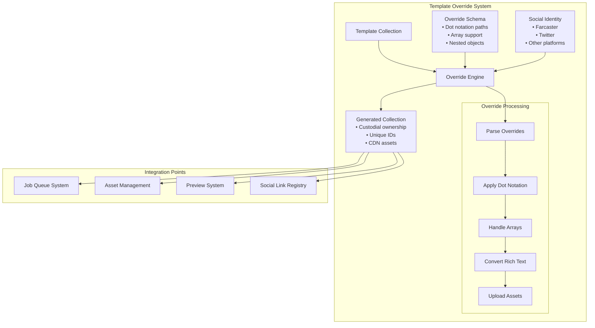
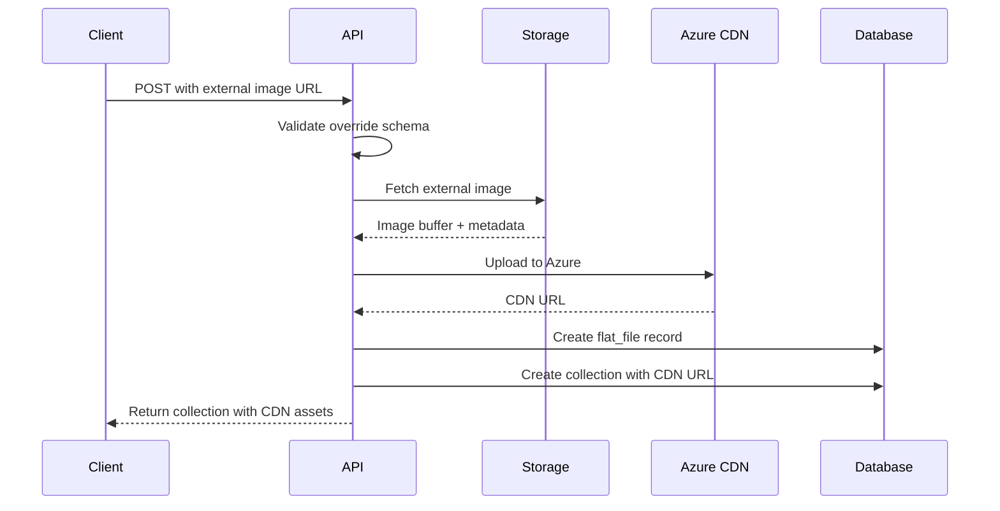

# Custodial Collection Template Override System

## Overview

The EmProps API custodial collection template override system is a sophisticated framework that enables the creation of collections from templates with dynamic, fine-grained customizations using dot notation paths. This system is specifically designed for creating collections with custodial ownership, where social identities (Farcaster, Twitter, etc.) own the collections rather than traditional user accounts.

<FullscreenDiagram>



</FullscreenDiagram>

## Endpoint Details

### POST `/collections/custodial/from-template`

Creates a new custodial collection from a template with dynamic overrides.

**Authentication**: API Key required (User ID in headers)

**Content-Type**: `application/json`

## Request Schema

```typescript
interface CustodialCollectionFromTemplateRequest {
  // Required: Template source
  template_collection_id: string; // UUID of the template collection

  // Required: Social identity
  social_org: string; // "farcaster", "twitter", etc.
  social_identifier: string; // Username/handle

  // Optional: Miniapp integration
  miniapp_user_id?: string; // UUID for miniapp user mapping
  miniapp_cover_image?: string; // URL for miniapp-specific cover image

  // Core feature: Flat overrides using dot notation
  overrides: Record<string, any>;

  // Optional: Collection preview configuration
  collection_preview?: {
    enabled?: boolean;
    max_generations?: number;
    access_level?: "PRIVATE" | "PUBLIC";
    is_remixable?: boolean;
    farcaster_collection?: boolean;
  };
}
```

## Override System Deep Dive

### Dot Notation Syntax

The override system uses dot notation with array support to provide granular control over any aspect of the template:

| Pattern | Description | Example |
|---------|-------------|---------|
| `"key"` | Direct property | `"title": "New Title"` |
| `"object.key"` | Nested property | `"data.version": "2.0"` |
| `"array[index]"` | Array element | `"steps[0].name": "First Step"` |
| `"object.array[index].key"` | Complex nested | `"data.steps[0].components[1].value": "new value"` |

### Automatic Rich Text Conversion

The system automatically converts plain text prompts to rich text format:

```typescript
// Input override
{
  "data.steps[0].prompt": "Generate a sunset landscape"
}

// Automatically converted to rich text format
{
  "data.steps[0].prompt": '[{"type":"paragraph","children":[{"text":"Generate a sunset landscape"}]}]'
}
```

### Asset Management

External image URLs in overrides are automatically uploaded to the CDN:

```typescript
// Override with external image
{
  "cover_image_url": "https://example.com/image.jpg"
}

// System automatically:
// 1. Downloads the image
// 2. Uploads to Azure CDN
// 3. Creates flat_file record
// 4. Updates URL to CDN location
```

## Comprehensive Override Examples

### 1. Basic Collection Customization

```json
{
  "template_collection_id": "550e8400-e29b-41d4-a716-446655440000",
  "social_org": "farcaster",
  "social_identifier": "alice.eth",
  "overrides": {
    "title": "Alice's Custom Collection",
    "description": "A personalized collection created from template",
    "cover_image_url": "https://example.com/alice-cover.jpg",
    "price": "0.1",
    "editions": 100
  }
}
```

### 2. Advanced Generation Workflow Override

```json
{
  "template_collection_id": "550e8400-e29b-41d4-a716-446655440000",
  "social_org": "farcaster",
  "social_identifier": "bob.eth",
  "overrides": {
    "data.steps[0].prompt": "Create a cyberpunk cityscape at night",
    "data.steps[0].components[0].value": "cyberpunk",
    "data.steps[0].components[1].value": "neon",
    "data.steps[1].prompt": "Add rain effects and reflections",
    "data.generations.generations": 5,
    "data.metadata.style": "cyberpunk",
    "data.metadata.mood": "dark"
  }
}
```

### 3. Variable-Based Prompt System

For templates that use variable substitution:

```json
{
  "template_collection_id": "550e8400-e29b-41d4-a716-446655440000",
  "social_org": "twitter", 
  "social_identifier": "creator123",
  "overrides": {
    "data.variables.subject": "dragon",
    "data.variables.environment": "ancient castle",
    "data.variables.style": "fantasy art",
    "data.variables.lighting": "dramatic sunset",
    "data.steps[0].prompt": "A majestic {{subject}} in an {{environment}}, rendered in {{style}} with {{lighting}}"
  }
}
```

### 4. Multi-Step Generation Pipeline

```json
{
  "template_collection_id": "550e8400-e29b-41d4-a716-446655440000",
  "social_org": "farcaster",
  "social_identifier": "artist.eth",
  "overrides": {
    "data.steps[0].name": "Base Generation",
    "data.steps[0].prompt": "Generate base concept art",
    "data.steps[0].components[0].model": "sdxl-turbo",
    "data.steps[1].name": "Style Enhancement", 
    "data.steps[1].prompt": "Apply artistic style filters",
    "data.steps[1].components[0].model": "stable-diffusion-xl",
    "data.steps[2].name": "Final Polish",
    "data.steps[2].prompt": "Add final details and effects",
    "data.routing.preferred_queue": "high-priority"
  }
}
```

### 5. Social Context Integration

```json
{
  "template_collection_id": "550e8400-e29b-41d4-a716-446655440000",
  "social_org": "farcaster",
  "social_identifier": "community.eth",
  "miniapp_user_id": "123e4567-e89b-12d3-a456-426614174000",
  "miniapp_cover_image": "https://miniapp.example.com/cover.jpg",
  "overrides": {
    "title": "Community Collection - Wave 3",
    "data.metadata.social_context": "farcaster",
    "data.metadata.community": "community.eth",
    "data.steps[0].prompt": "Generate artwork representing the community spirit",
    "data.variables.community_name": "Community DAO"
  },
  "collection_preview": {
    "enabled": true,
    "max_generations": 50,
    "access_level": "PUBLIC",
    "is_remixable": true,
    "farcaster_collection": true
  }
}
```

### 6. Complex Nested Component Configuration

```json
{
  "template_collection_id": "550e8400-e29b-41d4-a716-446655440000",
  "social_org": "farcaster",
  "social_identifier": "developer.eth",
  "overrides": {
    "data.steps[0].components[0].type": "text_to_image",
    "data.steps[0].components[0].config.width": 1024,
    "data.steps[0].components[0].config.height": 1024,
    "data.steps[0].components[0].config.steps": 50,
    "data.steps[0].components[0].config.guidance": 7.5,
    "data.steps[0].components[1].type": "image_enhance",
    "data.steps[0].components[1].config.enhancement_type": "upscale",
    "data.steps[0].components[1].config.scale_factor": 2,
    "data.routing.machine_pool": "gpu-high-memory",
    "data.routing.priority": "normal"
  }
}
```

### 7. Dynamic JSON Workflow Component

For collections using the dynamic-json workflow component with API-based templates:

```json
{
  "template_collection_id": "550e8400-e29b-41d4-a716-446655440000",
  "social_org": "farcaster",
  "social_identifier": "ai-creator.eth",
  "overrides": {
    "data.steps[0].components[0].name": "dynamic-json",
    "data.steps[0].components[0].template": {
      "model": "{{ai_model}}",
      "messages": [
        {
          "role": "system", 
          "content": "{{system_prompt}}"
        },
        {
          "role": "user",
          "content": "{{user_input}}"
        }
      ],
      "temperature": "{{temperature}}",
      "max_tokens": "{{max_tokens}}"
    },
    "data.steps[0].components[0].job_type": "openai_chat",
    "data.steps[0].components[0].variable_mappings": {
      "ai_model": "selected_model",
      "system_prompt": "system_instructions", 
      "user_input": "prompt_text",
      "temperature": "creativity_level",
      "max_tokens": "response_length"
    }
  }
}
```

**Note**: The dynamic-json component now uses a simplified structure where:
- `template`: JSON template with `{{variable}}` placeholders
- `job_type`: Target worker type (e.g., "openai_chat")
- `variable_mappings`: Maps template variables to collection variable names
- The API resolves collection variables and substitutes them into the template automatically

## Response Format

### Success Response (201 Created)

```json
{
  "data": {
    "id": "123e4567-e89b-12d3-a456-426614174000",
    "title": "Custom Collection Title",
    "description": "Collection description",
    "blockchain": "tezos",
    "cover_image_url": "https://cdn.emprops.ai/collections/covers/image.jpg",
    "miniapp_cover_image": "https://miniapp.example.com/cover.jpg",
    "editions": 100,
    "price": "0.1",
    "status": "draft",
    "is_custodial": true,
    "custodied_for": "social-link-uuid",
    "project_id": "project-uuid",
    "data": {
      "version": "2.0",
      "steps": [...],
      "generations": {
        "generations": 5,
        "hashes": ["hash1", "hash2", "hash3", "hash4", "hash5"]
      }
    },
    "collection_preview": {
      "id": "preview-uuid",
      "enabled": true,
      "max_generations": 50,
      "access_level": "PUBLIC",
      "is_remixable": true,
      "farcaster_collection": true
    },
    "social_link": {
      "id": "social-link-uuid",
      "social_org": "farcaster",
      "social_identifier": "alice.eth",
      "miniapp_user_id": "miniapp-user-uuid"
    },
    "template_used": {
      "id": "template-uuid",
      "title": "Original Template Name"
    }
  },
  "error": null
}
```

### Error Response (400 Bad Request)

```json
{
  "data": null,
  "error": "overrides.data.steps[0].prompt: Required field missing"
}
```

## Integration Points

### 1. Job Queue System

Generated collections integrate seamlessly with the job queue:

```typescript
// The collection data becomes GenerationInput for job processing
interface GenerationInput {
  version: string;
  steps: Step[];
  generations: {
    generations: number;
    hashes: string[];
  };
  routing?: {
    preferred_queue?: string;
    machine_pool?: string;
    priority?: string;
  };
}
```

### 2. Social Link Registry

The system maintains a registry of social identities:

```typescript
interface SocialLink {
  id: string;
  social_org: 'farcaster' | 'twitter' | '...';
  social_identifier: string;
  miniapp_user_id?: string;
}
```

### 3. Asset Management Flow

<FullscreenDiagram>



</FullscreenDiagram>

### 4. Unique ID Generation

The system ensures all collections have unique identifiers:

```typescript
// After template copying, all IDs are regenerated
const updatedData = await generateNewIds(tx, collection.id, templateData);
await updateComponentReferencesIds(tx, updatedData);
```

## Advanced Use Cases

### Template Inheritance Patterns

```typescript
// Base template provides structure
const baseTemplate = {
  data: {
    steps: [
      { type: "generation", prompt: "{{subject}} in {{style}}" }
    ],
    variables: {
      subject: "landscape",
      style: "impressionist"
    }
  }
};

// Override for specific use case
const overrides = {
  "data.variables.subject": "portrait",
  "data.variables.style": "photorealistic",
  "data.steps[0].components[0].model": "sdxl-lightning"
};
```

### Conditional Overrides Based on Social Platform

```typescript
const farcasterOverrides = {
  "data.metadata.platform": "farcaster",
  "data.metadata.frame_integration": true,
  "collection_preview.farcaster_collection": true
};

const twitterOverrides = {
  "data.metadata.platform": "twitter", 
  "data.metadata.thread_integration": true,
  "collection_preview.farcaster_collection": false
};
```

### Batch Operations

```typescript
// Create multiple collections from same template
const collections = await Promise.all([
  createFromTemplate(templateId, "farcaster", "user1.eth", overrides1),
  createFromTemplate(templateId, "farcaster", "user2.eth", overrides2),
  createFromTemplate(templateId, "twitter", "user3", overrides3)
]);
```

## Error Handling

The system provides comprehensive error handling:

### Validation Errors
- **Schema Validation**: Zod schema ensures type safety
- **Social Org Validation**: Validates against supported platforms
- **Override Path Validation**: Ensures dot notation paths are valid

### Processing Errors
- **Template Not Found**: 404 when template doesn't exist
- **CDN Upload Failures**: Graceful fallback to original URLs
- **ID Generation Failures**: Detailed error context for debugging

### Transaction Safety
- **Atomic Operations**: All database changes in single transaction
- **Rollback on Failure**: No partial state changes
- **Error Context**: Full error details for troubleshooting

## Performance Considerations

### Optimization Strategies

1. **Asset Caching**: CDN URLs are cached to avoid re-uploads
2. **Template Reuse**: Template data is efficiently cloned
3. **Batch ID Generation**: IDs generated in bulk for efficiency
4. **Transaction Scope**: Minimize transaction duration

### Monitoring Points

- Override processing time
- CDN upload success rates
- Template resolution performance
- Database transaction durations

## Security Features

### Input Sanitization
- Zod schema validation
- URL validation for external images
- SQL injection prevention via Prisma

### Access Control
- API key authentication
- Social org validation
- Project-based permissions

### Asset Security
- CDN upload validation
- MIME type verification
- File size limits

## Future Enhancements

### Planned Features

1. **Template Versioning**: Support for template evolution
2. **Override Validation**: Custom validation rules per template
3. **Batch Operations**: Bulk collection creation
4. **Template Marketplace**: Public template sharing
5. **Advanced Analytics**: Override usage patterns

### Integration Roadmap

1. **Real-time Preview**: Live preview of override effects
2. **Visual Override Editor**: GUI for complex overrides
3. **Template Designer**: Visual template creation tool
4. **API Rate Limiting**: Enhanced rate limiting per social org
5. **Webhook Notifications**: Event-driven integrations

The custodial collection template override system represents a sophisticated approach to scalable, personalized content generation that bridges social platforms with advanced AI workflows while maintaining security, performance, and flexibility.