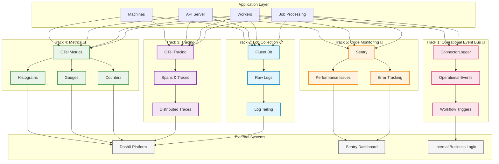

# 5-Track Observability System

This document defines the comprehensive **5-Track Observability Architecture** for the EmProps Job Queue system. Each track serves a distinct purpose and provides specific value for different stakeholders.

## Architecture Overview

The EmProps Job Queue uses a **multi-layered observability approach** with 5 independent but complementary tracks:

<FullscreenDiagram>



</FullscreenDiagram>

## The Five Tracks

### Track 1: Operational Event Bus 🚌 - Application State Management

**Purpose**: Generate structured operational events that trigger application state changes and workflow automation

**Technology Stack**:
- **ConnectorLogger**: Structured operational event generation
- **Event Bus Architecture**: Message routing and delivery system
- **Event Processors**: Application state change handlers and workflow triggers
- **State Coordination Engine**: Distributed system state synchronization

**What It Captures**:
- Job lifecycle events (received, started, progress, completed, failed)
- System coordination events (resource allocation, service health changes)
- Workflow automation triggers (notifications, data pipelines, integrations)
- State synchronization events across distributed components

**Target Destination**: 
- **Internal Business Logic**: Job status updates, resource management, retry logic
- **Analytics**: Performance optimization, capacity planning

**Current Status**: ✅ **Active** - ConnectorLogger implemented and in use

### Track 2: Log Collection 📋 - Raw Log Aggregation

**Purpose**: Collect and aggregate ALL raw logs from containers and processes

**Technology Stack**:
- **Fluent Bit**: Primary log collection agent
- **Fluentd**: Log aggregation and processing (if needed)  
- **Log Tailing**: Direct log file monitoring
- **Container Logs**: Docker stdout/stderr collection

**What It Captures**:
- Container stdout/stderr streams
- Application log files
- System logs (auth, kernel, etc.)
- Service-specific logs (PM2, ComfyUI, etc.)
- Error logs and stack traces

**Target Destination**: 
- **Dash0**: Centralized log storage and search
- **Alternative**: ELK Stack, Splunk, etc.

**Current Status**: ✅ **Active** - Fluent Bit configured and running

```yaml
# Fluent Bit Configuration Example
[INPUT]
    Name tail
    Path /workspace/logs/*.log
    Tag machine.logs
    
[OUTPUT]
    Name http
    Match *
    URI /logs/ingest
    Host dash0-collector
```

### Track 3: Tracing 🔗 - Request Flow Tracking

**Purpose**: Track request lifecycles and performance across distributed services

**Technology Stack**:
- **OpenTelemetry (OTel)**: Tracing SDK and auto-instrumentation
- **OTel Collector**: Local trace aggregation and forwarding
- **Trace Context Propagation**: Cross-service correlation

**What It Captures**:
- **Request Spans**: HTTP requests, WebSocket connections, job processing
- **Service Interactions**: API → Redis → Worker → ComfyUI flows  
- **Performance Timing**: Latency, duration, bottlenecks
- **Error Correlation**: Failed spans with context

**Target Destination**: 
- **Dash0**: Distributed tracing UI and analytics

**Current Status**: ✅ **Active** - OTel collector configured

```typescript
// Tracing Integration Example
import { trace } from '@opentelemetry/api';

const tracer = trace.getTracer('job-processing');

async function processJob(jobData: JobData) {
  const span = tracer.startSpan('process-job', {
    attributes: {
      'job.id': jobData.id,
      'job.service': jobData.service_required,
      'worker.id': process.env.WORKER_ID
    }
  });
  
  try {
    const result = await this.processJobImpl(jobData);
    span.setStatus({ code: SpanStatusCode.OK });
    return result;
  } catch (error) {
    span.recordException(error);
    span.setStatus({ 
      code: SpanStatusCode.ERROR, 
      message: error.message 
    });
    throw error;
  } finally {
    span.end();
  }
}
```

### Track 4: Metrics 📊 - System Performance Data

**Purpose**: Collect quantitative performance metrics and operational data

**Technology Stack**:
- **OpenTelemetry Metrics**: Counters, gauges, histograms
- **OTel Collector**: Metrics aggregation and export
- **Custom Metrics**: Business-specific measurements

**What It Captures**:
- **Counters**: Jobs processed, errors occurred, requests received
- **Gauges**: Active jobs, queue sizes, resource usage
- **Histograms**: Response times, job durations, queue wait times
- **Resource Metrics**: CPU, memory, GPU usage

**Target Destination**: 
- **Dash0**: Metrics dashboards and alerting

**Current Status**: ⚠️ **Planned** - Implementation needed

::: warning Track 4 Implementation Gap
This track is identified as **"NOT SURE YET HOW TO DO THIS"** and requires implementation planning.
:::

```typescript
// Metrics Integration Example (To Be Implemented)
import { metrics } from '@opentelemetry/api';

const meter = metrics.getMeter('emp-job-queue');

// Counters
const jobsProcessed = meter.createCounter('jobs_processed_total', {
  description: 'Total number of jobs processed'
});

const errorsCount = meter.createCounter('errors_total', {
  description: 'Total number of errors encountered'  
});

// Gauges
const activeJobs = meter.createUpDownCounter('jobs_active', {
  description: 'Number of currently active jobs'
});

const queueSize = meter.createObservableGauge('queue_size', {
  description: 'Current size of job queue'
});

// Histograms  
const jobDuration = meter.createHistogram('job_duration_seconds', {
  description: 'Job processing duration in seconds',
  boundaries: [0.1, 0.5, 1, 2, 5, 10, 30, 60, 300]
});

// Usage in job processing
async function processJob(jobData: JobData) {
  const startTime = Date.now();
  
  activeJobs.add(1, { service: jobData.service_required });
  
  try {
    const result = await this.processJobImpl(jobData);
    
    jobsProcessed.add(1, { 
      status: 'success',
      service: jobData.service_required 
    });
    
    return result;
  } catch (error) {
    errorsCount.add(1, {
      error_type: classifyError(error),
      service: jobData.service_required
    });
    throw error;
  } finally {
    const duration = (Date.now() - startTime) / 1000;
    jobDuration.record(duration, { service: jobData.service_required });
    activeJobs.add(-1, { service: jobData.service_required });
  }
}
```

### Track 5: Code Monitoring 🐛 - Error Tracking & Analysis

**Purpose**: Capture, aggregate, and analyze application errors and performance issues

**Technology Stack**:
- **Sentry**: Error tracking and performance monitoring
- **Source Maps**: Accurate error location mapping
- **Context Enrichment**: User and environment data

**What It Captures**:
- **Exceptions**: Unhandled errors with full stack traces
- **Performance Issues**: Slow queries, memory leaks, bottlenecks
- **User Context**: Request details, user sessions, environment
- **Release Tracking**: Error rates per deployment

**Target Destination**: 
- **Sentry Dashboard**: Error analysis and alerting

**Current Status**: 🚧 **Ready for Implementation**

```typescript
// Sentry Integration Example
import * as Sentry from '@sentry/node';

// Initialize Sentry
Sentry.init({
  dsn: process.env.SENTRY_DSN,
  environment: process.env.NODE_ENV,
  tracesSampleRate: 0.1,
  profilesSampleRate: 0.1
});

// Express error handling
app.use(Sentry.Handlers.requestHandler());
app.use(Sentry.Handlers.tracingHandler());

// Your routes...

app.use(Sentry.Handlers.errorHandler());

// Custom error capture
async function processJob(jobData: JobData) {
  try {
    return await this.processJobImpl(jobData);
  } catch (error) {
    Sentry.withScope((scope) => {
      scope.setTag('operation', 'job-processing');
      scope.setContext('job', {
        id: jobData.id,
        service: jobData.service_required,
        worker: process.env.WORKER_ID
      });
      Sentry.captureException(error);
    });
    throw error;
  }
}
```


## Track Integration Patterns

### Unified Job Processing

All 5 tracks work together to provide comprehensive observability:

```typescript
async function processJobWithFullObservability(jobData: JobData, progressCallback: ProgressCallback) {
  // Track 2: Start distributed trace
  const span = tracer.startSpan('process-job-full', {
    attributes: { 'job.id': jobData.id, 'job.service': jobData.service_required }
  });
  
  // Track 5: Business intelligence
  const jobLogger = connectorLogger.withJobContext(jobData.id);
  jobLogger.jobReceived({ jobId: jobData.id, inputSize: JSON.stringify(jobData).length });
  
  const startTime = Date.now();
  
  try {
    // Track 3: Metrics - increment active jobs  
    activeJobsGauge.add(1, { service: jobData.service_required });
    
    // Track 5: Business event
    jobLogger.jobStarted({ jobId: jobData.id });
    
    // Process job...
    const result = await this.processJobImpl(jobData, progressCallback);
    
    // Track 5: Business completion
    const duration = Date.now() - startTime;
    jobLogger.jobCompleted({ jobId: jobData.id, duration, outputSize: JSON.stringify(result).length });
    
    // Track 3: Metrics - success counter and duration histogram
    jobsProcessedCounter.add(1, { status: 'success', service: jobData.service_required });
    jobDurationHistogram.record(duration / 1000, { service: jobData.service_required });
    
    // Track 2: Mark span as successful
    span.setStatus({ code: SpanStatusCode.OK });
    span.setAttributes({ 'job.output_size': JSON.stringify(result).length });
    
    return result;
    
  } catch (error) {
    // Track 4: Capture error with context
    Sentry.withScope((scope) => {
      scope.setTag('job_id', jobData.id);
      scope.setTag('service_type', jobData.service_required);
      scope.setContext('job_data', { id: jobData.id, service: jobData.service_required });
      Sentry.captureException(error);
    });
    
    // Track 5: Business failure event
    const duration = Date.now() - startTime;
    jobLogger.jobFailed({ jobId: jobData.id, error: error.message, duration });
    
    // Track 3: Error metrics
    errorsCounter.add(1, { error_type: classifyError(error), service: jobData.service_required });
    
    // Track 2: Mark span as error
    span.recordException(error);
    span.setStatus({ code: SpanStatusCode.ERROR, message: error.message });
    
    throw error;
    
  } finally {
    // Track 3: Decrement active jobs
    activeJobsGauge.add(-1, { service: jobData.service_required });
    
    // Track 2: End trace span
    span.end();
    
    // Track 1: Raw logs automatically collected by Fluent Bit
  }
}
```

### Cross-Track Correlation

Each track provides unique correlation identifiers:

- **Job ID**: Correlates events across all tracks
- **Trace ID**: Links distributed requests (Track 2)
- **Session ID**: Groups related operations (Track 5)
- **Worker ID**: Machine-specific correlation
- **Request ID**: API request correlation (Track 4)

```typescript
// Example: Finding related data across all tracks
const correlationData = {
  jobId: 'job-12345',
  traceId: 'trace-abc-def',
  workerId: 'worker-gpu-01', 
  sessionId: 'session-xyz',
  machineId: 'machine-prod-03'
};

// Track 1: Search logs by job ID
// Query: machine.logs WHERE job_id="job-12345"

// Track 2: Find trace by trace ID  
// Query: traces WHERE trace_id="trace-abc-def"

// Track 3: Get metrics by worker ID
// Query: metrics WHERE worker_id="worker-gpu-01" AND timestamp > now-1h

// Track 4: Find errors by job ID
// Query: Sentry issues WHERE tags.job_id="job-12345"

// Track 5: Business events by session ID
// Query: connector_logs WHERE session_id="session-xyz"
```

## Implementation Status

### ✅ Currently Active
- **Track 1 (Log Collection)**: Fluent Bit configured and shipping logs
- **Track 2 (Tracing)**: OTel collector configured, spans implemented
- **Track 5 (Business Intelligence)**: ConnectorLogger active in all connectors

### 🚧 Ready for Implementation  
- **Track 4 (Code Monitoring)**: Sentry integration planned and ready

### ⚠️ Needs Implementation
- **Track 3 (Metrics)**: Requires OTel Metrics API implementation

## Next Steps

### Phase 1: Complete Track 4 (Sentry Integration)
1. Install Sentry SDK in API server and workers
2. Configure error handling and performance monitoring
3. Set up release tracking and alerts

### Phase 2: Implement Track 3 (OTel Metrics)
1. Define core metrics (counters, gauges, histograms)
2. Integrate metrics collection in job processing
3. Configure OTel Collector for metrics export
4. Set up Dash0 metrics dashboards

### Phase 3: Enhanced Integration
1. Implement cross-track correlation
2. Create unified observability dashboards
3. Set up intelligent alerting across tracks
4. Performance optimization based on metrics

### Phase 4: Advanced Features
1. Automated anomaly detection
2. Predictive failure analysis
3. Business intelligence analytics
4. Custom observability tools

## Configuration Examples

### Environment Variables

```bash
# Track 1: Log Collection
FLUENT_BIT_HOST=localhost
FLUENT_BIT_PORT=9880
DISABLE_FLUENT_BIT_LOGGING=false

# Track 2: Tracing  
OTEL_EXPORTER_OTLP_ENDPOINT=http://localhost:4317
OTEL_RESOURCE_ATTRIBUTES=service.name=emp-job-queue
OTEL_SERVICE_NAME=job-processor

# Track 3: Metrics (To Be Implemented)
OTEL_METRICS_EXPORTER=otlp
METRICS_COLLECTION_INTERVAL=30s

# Track 4: Code Monitoring
SENTRY_DSN=https://your-sentry-dsn@sentry.io/project
SENTRY_ENVIRONMENT=production
SENTRY_SAMPLE_RATE=0.1

# Track 5: Business Intelligence  
MACHINE_ID=machine-prod-01
WORKER_ID=worker-gpu-01
CONNECTOR_LOGGING_ENABLED=true
```

### Docker Configuration

```yaml
# docker-compose.yml
services:
  worker:
    environment:
      # All 5 tracks configuration
      FLUENT_BIT_HOST: fluent-bit
      OTEL_EXPORTER_OTLP_ENDPOINT: http://otel-collector:4317
      SENTRY_DSN: ${SENTRY_DSN}
      MACHINE_ID: ${MACHINE_ID}
      WORKER_ID: ${WORKER_ID}
    
  fluent-bit:
    image: fluent/fluent-bit:latest
    # Track 1 configuration
    
  otel-collector:
    image: otel/opentelemetry-collector:latest
    # Track 2 & 3 configuration
```

## Troubleshooting

### Track Integration Issues

**Problem**: Data not appearing in expected destination
- Check network connectivity to external services
- Verify authentication credentials
- Examine local collector logs
- Test with simplified configuration

**Problem**: Performance impact from observability
- Reduce sampling rates
- Use asynchronous logging
- Optimize collector configuration
- Monitor resource usage

**Problem**: Missing correlation between tracks
- Ensure consistent ID propagation
- Check context passing between services
- Verify trace/span creation
- Test cross-service requests

### Common Configuration Errors

```bash
# Check Fluent Bit connectivity
curl -X POST http://localhost:9880/logs -d '{"test": "message"}'

# Verify OTel Collector status
curl http://localhost:8888/metrics

# Test Sentry connection
curl -X POST "${SENTRY_DSN}/api/1/store/" -H "Content-Type: application/json"

# Check ConnectorLogger output
grep "event_type" /workspace/logs/*.log | head -10
```

## Best Practices

### Data Retention
- **Track 1**: 30 days for general logs, 90 days for error logs
- **Track 2**: 7 days for all traces, longer for errors  
- **Track 3**: 1 year for aggregated metrics, 30 days for raw data
- **Track 4**: 90 days for resolved issues, 1 year for unresolved
- **Track 5**: 6 months for business events, longer for analytics

### Sampling Strategies
- **Track 2**: 10% for normal requests, 100% for errors
- **Track 3**: All metrics, 30-second intervals
- **Track 4**: 10% for performance, 100% for errors
- **Track 5**: All business events (critical for business logic)

### Alert Configuration
- **Track 1**: Log volume spikes, error rate increases
- **Track 2**: High latency, failed traces  
- **Track 3**: Resource exhaustion, SLA breaches
- **Track 4**: Error rate spikes, new error types
- **Track 5**: Business logic failures, job processing issues

## Conclusion

The 5-Track Observability System provides comprehensive visibility into the EmProps Job Queue system:

1. **Track 1** ensures no log data is lost
2. **Track 2** provides request flow visibility  
3. **Track 3** offers quantitative performance insights
4. **Track 4** enables rapid error resolution
5. **Track 5** drives business logic and optimization

Together, these tracks create a robust foundation for operating a distributed AI workload system at scale.