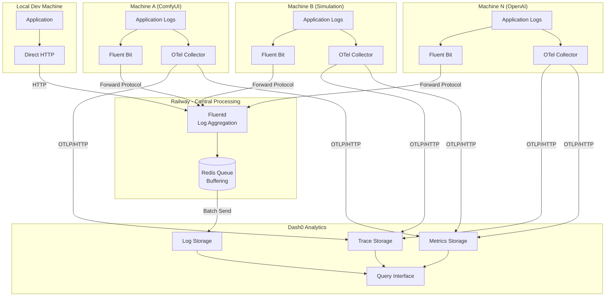
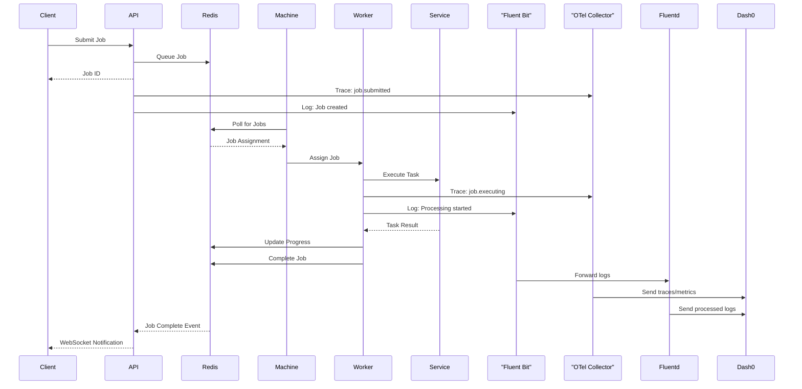
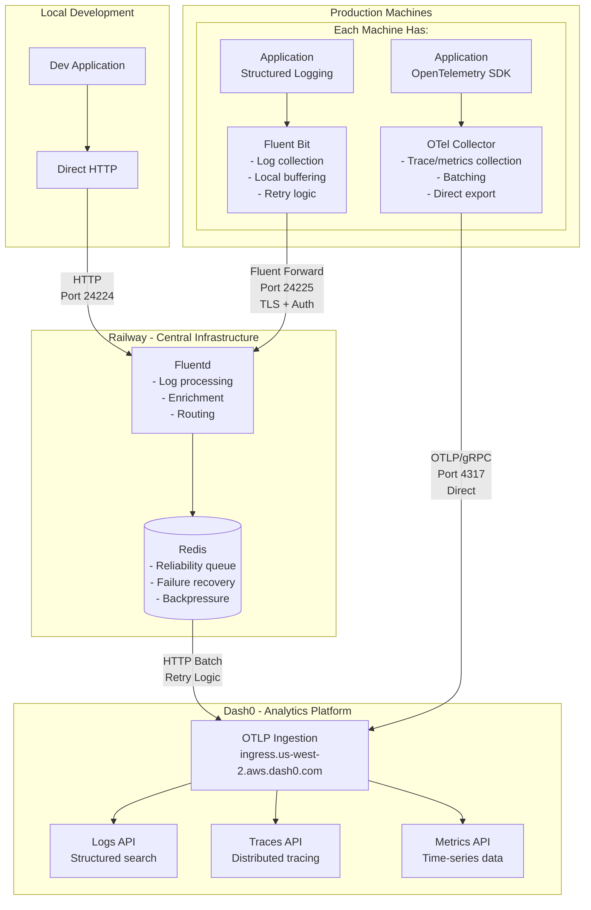
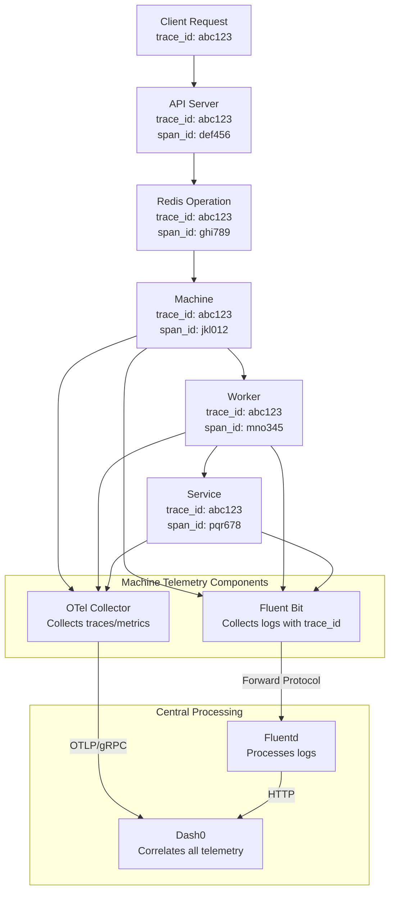

# Observability Information Flow

## System Overview

The EMP Job Queue system consists of distributed services that need comprehensive observability. This document defines the information flow between services and how telemetry data moves through the system.

## Observability Architecture

<FullscreenDiagram>

</FullscreenDiagram>

## Job Lifecycle Flow

<FullscreenDiagram>

</FullscreenDiagram>

## Data Pipeline Architecture

<FullscreenDiagram>

</FullscreenDiagram>

## Trace Context Flow

<FullscreenDiagram>

</FullscreenDiagram>

## Key Concepts

### Primary Correlation IDs

- **trace_id**: Links all operations for a single request (32-character hex)
- **job_id**: Links all operations for a job (`job-{uuid}`)  
- **machine_id**: Identifies originating machine (`{type}-{identifier}`)
- **worker_id**: Identifies specific worker (`{machine_id}-worker-{index}`)

### Context Propagation

Every telemetry event includes automatic correlation through:
- HTTP headers (`traceparent`, `tracestate`) 
- Redis context (stored with jobs)
- Environment context (machine_id, environment, region)

## Implementation Priority

1. **Foundation** - Define correlation ID standards, context propagation
2. **Critical Path** - Instrument job submission flow, error paths, health monitoring  
3. **Full Coverage** - Instrument all services, add performance metrics, buffering
4. **Intelligence** - Add correlation queries, dashboards, alerts

## Complete Documentation

For detailed service information flows, telemetry specifications, and implementation details, see:
**[/docs/OBSERVABILITY_INFORMATION_FLOW.md](../../../../docs/OBSERVABILITY_INFORMATION_FLOW.md)**