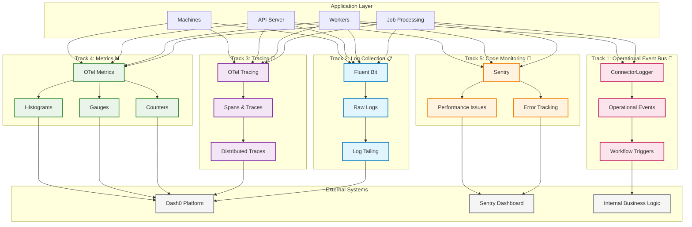
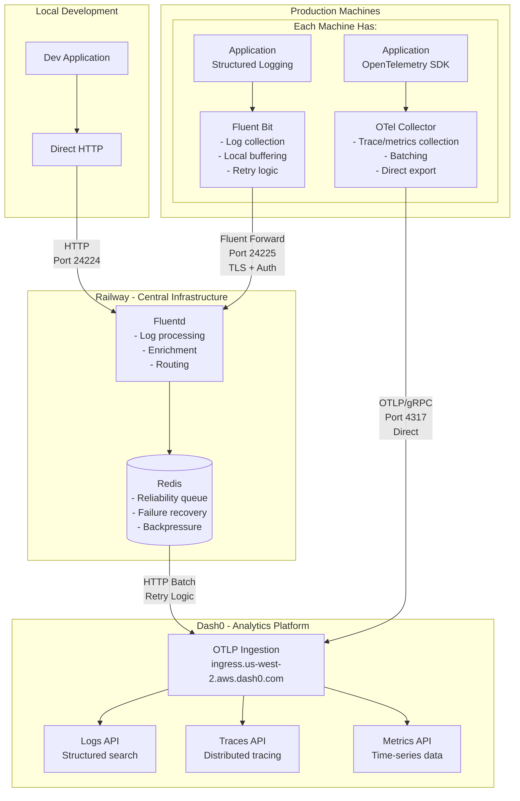

# System Architecture

> **5-Track Observability System** - Complete observability architecture for distributed AI workloads

## Architecture Overview

The emp-job-queue implements a comprehensive **5-track observability approach** with each track serving distinct but complementary purposes:

<FullscreenDiagram>



</FullscreenDiagram>

## The Five Tracks

### Track 1: Operational Event Bus 🚌 - Application State Management

**Purpose**: Generate structured operational events that trigger application state changes and workflow automation

**Technology Stack**:
- **ConnectorLogger**: Structured operational event generation
- **Event Bus Architecture**: Message routing and delivery system
- **Event Processors**: Application state change handlers and workflow triggers

**What It Captures**:
- Job lifecycle events (received, started, progress, completed, failed)
- System coordination events (resource allocation, service health changes)
- Workflow automation triggers (notifications, data pipelines, integrations)

**Current Status**: ✅ **Active** - ConnectorLogger implemented and in use

### Track 2: Log Collection 📋 - Raw Log Aggregation

**Purpose**: Collect and aggregate ALL raw logs from containers and processes

**Technology Stack**:
- **Fluent Bit**: Primary log collection agent
- **Fluentd**: Log aggregation and processing  
- **Log Tailing**: Direct log file monitoring

**What It Captures**:
- Container stdout/stderr streams
- Application log files
- System logs (auth, kernel, etc.)
- Service-specific logs (PM2, ComfyUI, etc.)

**Current Status**: ✅ **Active** - Fluent Bit configured and running

### Track 3: Tracing 🔗 - Request Flow Tracking

**Purpose**: Track request lifecycles and performance across distributed services

**Technology Stack**:
- **OpenTelemetry (OTel)**: Tracing SDK and auto-instrumentation
- **OTel Collector**: Local trace aggregation and forwarding
- **Trace Context Propagation**: Cross-service correlation

**What It Captures**:
- Request spans (HTTP requests, WebSocket connections, job processing)
- Service interactions (API → Redis → Worker → ComfyUI flows)
- Performance timing (latency, duration, bottlenecks)
- Error correlation (failed spans with context)

**Current Status**: ✅ **Active** - OTel collector configured

### Track 4: Metrics 📊 - System Performance Data

**Purpose**: Collect quantitative performance metrics and operational data

**Technology Stack**:
- **OpenTelemetry Metrics**: Counters, gauges, histograms
- **OTel Collector**: Metrics aggregation and export
- **Custom Metrics**: Business-specific measurements

**What It Captures**:
- Counters (jobs processed, errors occurred, requests received)
- Gauges (active jobs, queue sizes, resource usage)
- Histograms (response times, job durations, queue wait times)
- Resource metrics (CPU, memory, GPU usage)

**Current Status**: ⚠️ **Planned** - Implementation needed

### Track 5: Code Monitoring 🐛 - Error Tracking & Analysis

**Purpose**: Capture, aggregate, and analyze application errors and performance issues

**Technology Stack**:
- **Sentry**: Error tracking and performance monitoring
- **Source Maps**: Accurate error location mapping
- **Context Enrichment**: User and environment data

**What It Captures**:
- Exceptions (unhandled errors with full stack traces)
- Performance issues (slow queries, memory leaks, bottlenecks)
- User context (request details, user sessions, environment)
- Release tracking (error rates per deployment)

**Current Status**: 🚧 **Ready for Implementation**

## Worker ID Scheme & Log Structure

### Structure
```json
{
  "machine_id": "railway-abc123",     // Railway deployment instance
  "worker_id": "worker-001",          // Unique worker per machine
  "service_type": "comfyui"           // Service type (comfyui, simulation, a1111)
}
```

### Combined Identifier
- **Full ID**: `machine-railway-abc123.worker-001`
- **Used for**: OpenTelemetry `service.instance.id`, log correlation

### Standardized Log Format
All logs are normalized to this structure by Fluent Bit:

```json
{
  "timestamp": "2025-08-07T00:15:23.456Z",
  "level": "info",
  "message": "Processing job job-abc123",
  "machine_id": "railway-abc123",
  "worker_id": "worker-001", 
  "service_type": "comfyui",
  "job_id": "job-abc123",
  "duration_ms": 1250,
  "source": "stdout"
}
```

## Context Propagation & Correlation

### Primary Correlation IDs

- **trace_id**: Links all operations for a single request (32-character hex)
- **job_id**: Links all operations for a job (`job-{uuid}`)  
- **machine_id**: Identifies originating machine (`{type}-{identifier}`)
- **worker_id**: Identifies specific worker (`{machine_id}-worker-{index}`)

### Correlation Strategy

Every piece of telemetry is automatically correlated using these IDs across all tracks, enabling powerful cross-track analysis:

- Find all logs for a trace_id
- See all traces for a job_id  
- Check all metrics for a machine_id
- Correlate all events in a time window

## Deployment Architecture

<FullscreenDiagram>



</FullscreenDiagram>

## Key Benefits

### Immediate Benefits (Current Implementation)
- ✅ **Unified Log View** - All worker logs in single Dash0 interface
- ✅ **Structured Search** - Query by job_id, worker_id, service_type, event_type
- ✅ **Job Lifecycle Tracking** - Complete visibility into job processing stages
- ✅ **Error Correlation** - Connect failures across distributed workers

### Future Benefits (Planned Implementation)
- 🔮 **Distributed Tracing** - End-to-end request flows across services
- 🔮 **Predictive Alerting** - ML-based anomaly detection
- 🔮 **Capacity Planning** - Resource utilization trends and forecasting
- 🔮 **SLA Monitoring** - Automated performance threshold tracking

## Best Practices

### Data Retention
- **Track 1**: 30 days for general logs, 90 days for error logs
- **Track 2**: 7 days for all traces, longer for errors  
- **Track 3**: 1 year for aggregated metrics, 30 days for raw data
- **Track 4**: 90 days for resolved issues, 1 year for unresolved
- **Track 5**: 6 months for business events, longer for analytics

### Sampling Strategies
- **Track 2**: 10% for normal requests, 100% for errors
- **Track 3**: All metrics, 30-second intervals
- **Track 4**: 10% for performance, 100% for errors
- **Track 5**: All business events (critical for business logic)

For detailed implementation instructions, see the [Telemetry Setup Guide](./telemetry-setup-guide.md).