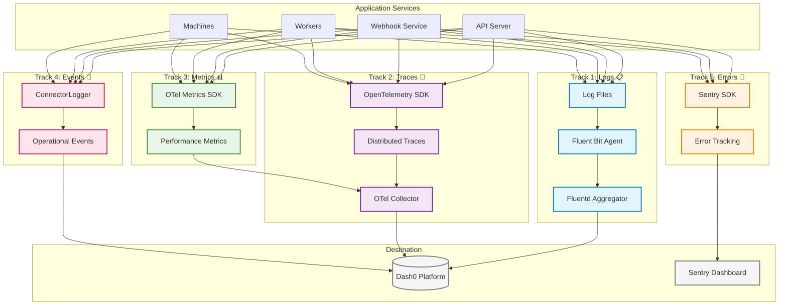

# Telemetry Setup Guide

> **Complete implementation guide for the emp-job-queue telemetry system** - Setting up logs, metrics, and traces for comprehensive observability

## Overview

The emp-job-queue system implements a sophisticated **5-track observability architecture** that provides complete visibility into distributed AI workloads. This guide covers the practical setup and configuration of all telemetry components.

## Architecture Summary

The telemetry system consists of five complementary tracks:

<FullscreenDiagram>



</FullscreenDiagram>

## Quick Start

### 1. Environment Variables Setup

The telemetry system is configured through environment variables. Set up the following in your service environment:

```bash
# Core Telemetry Configuration
DASH0_API_KEY=your-dash0-api-key
DASH0_DATASET=development  # or 'production'
OTEL_ENABLED=true
SERVICE_NAME=your-service-name
SERVICE_VERSION=1.0.0
MACHINE_ID=your-machine-id

# Development Environment
FLUENTD_HOST=host.docker.internal
FLUENTD_PORT=24224
FLUENTD_SECURE=false

# Production Environment  
FLUENTD_HOST=shortline.proxy.rlwy.net
FLUENTD_PORT=19571
FLUENTD_SECURE=false

# OTEL Collector Endpoints
OTEL_COLLECTOR_TRACES_ENDPOINT=http://localhost:4318/v1/traces
OTEL_COLLECTOR_METRICS_ENDPOINT=http://localhost:4318/v1/metrics

# Dash0 Endpoints
DASH0_OTLP_BASE_URL=https://ingress.us-west-2.aws.dash0.com
DASH0_API_BASE_URL=https://api.us-west-2.aws.dash0.com
```

### 2. Initialize Telemetry Client

```typescript
import { createTelemetryClient } from '@emp/telemetry';

// Create client for your service type
const telemetryClient = createTelemetryClient('api'); // or 'webhook', 'machine', 'worker'

// Initialize with full observability
const health = await telemetryClient.startup({
  testConnections: true,
  logConfiguration: true, 
  sendStartupPing: true
});

console.log('Telemetry initialized:', health);
```

### 3. Basic Usage

```typescript
// Logging - writes to files that Fluent Bit monitors
await telemetryClient.log.info('Service started successfully', {
  component: 'api-server',
  startup_time_ms: 1200
});

// Metrics - sent to OTEL collector
await telemetryClient.otel.counter('requests_total', 1, {
  endpoint: '/api/v1/jobs',
  status: '200'
});

// Custom metric
await telemetryClient.otel.gauge('active_jobs', 15, {
  service_type: 'comfyui'
});
```

## Track 1: Log Collection (Fluent Bit → Fluentd → Dash0)

### Architecture

Log collection uses a two-stage pipeline for reliability and flexibility:

1. **Fluent Bit** (lightweight agent) - Monitors log files on each service/machine
2. **Fluentd** (aggregator) - Receives logs and forwards to Dash0

### Configuration

#### Fluent Bit Configuration

Fluent Bit is automatically configured by the telemetry client:

```ini
# Auto-generated /tmp/telemetry/fluent-bit.conf
[SERVICE]
    Flush 5
    Log_Level info
    Daemon off

[INPUT]
    Name tail
    Tag api.logs.0
    Path /api-server/logs/emp-api-server-api.log
    Skip_Long_Lines On
    Skip_Empty_Lines On
    Refresh_Interval 5

[FILTER]
    Name record_modifier
    Match api.logs.0
    Record service_name emp-api-server
    Record service_type api
    Record environment development
    Record machine_id machine-local-dev
    Record source_identification emp-api-server:machine-local-dev:/api-server/logs/emp-api-server-api.log

[OUTPUT]
    Name forward
    Match *.logs.*
    Host host.docker.internal
    Port 24224
    tls off
```

#### Fluentd Aggregator Configuration

The main Fluentd service configuration:

```ruby
# Receive from Fluent Bit agents
<source>
  @type forward
  @id forward_input
  port 24224
  bind 0.0.0.0
</source>

# Add environment metadata
<filter **>
  @type record_transformer
  @id add_common_fields
  enable_ruby true
  
  <record>
    fluentd_env development
    fluentd_host "#{Socket.gethostname}"
    processed_at ${time}
    dash0_dataset development
  </record>
</filter>

# Send to Dash0
<match **>
  @type http
  @id dash0_output
  
  endpoint https://ingress.us-west-2.aws.dash0.com/logs/json
  http_method post
  headers {"Authorization":"Bearer ${DASH0_API_KEY}","Content-Type":"application/json","Dash0-Dataset":"development"}
  
  <buffer>
    flush_mode interval
    flush_interval 5s
    retry_max_times 3
  </buffer>
</match>
```

### Usage Examples

#### Adding Log Files to Monitor

```typescript
// Add additional log files for monitoring
await telemetryClient.log.addFile('/workspace/logs/comfyui.log', 'comfyui');
await telemetryClient.log.addFile('/workspace/logs/pm2-*.log'); // Supports wildcards
```

#### Writing Structured Logs

```typescript
// Standard logging
await telemetryClient.log.info('Job processing started', {
  job_id: 'job-12345',
  service_type: 'comfyui',
  estimated_duration: 30000
});

await telemetryClient.log.error('Job processing failed', {
  job_id: 'job-12345', 
  error_type: 'timeout',
  duration_ms: 45000,
  retry_count: 2
});

// Write to specific log file
await telemetryClient.writeLogToFile(
  '/workspace/logs/job-processing.log',
  'info',
  'Job completed successfully',
  {
    job_id: 'job-12345',
    output_count: 4,
    total_size_bytes: 2048576
  }
);
```

#### Log Format

All logs use a structured JSON format with consistent fields:

```json
{
  "timestamp": "2025-08-26T10:30:45.123Z",
  "level": "info",
  "message": "Job processing completed",
  "service_name": "emp-api-server",
  "service_type": "api",
  "machine_id": "machine-prod-01",
  "environment": "production",
  "log_file_path": "/api-server/logs/emp-api-server-api.log",
  "source_identification": "emp-api-server:machine-prod-01:/api-server/logs/emp-api-server-api.log",
  "job_id": "job-12345",
  "duration_ms": 15000,
  "output_count": 2
}
```

### Troubleshooting Logs

```bash
# Check Fluent Bit process status
docker exec -it your-container ps aux | grep fluent-bit

# View Fluent Bit configuration
cat /tmp/telemetry/fluent-bit.conf

# Test log pipeline
echo '{"test": "message", "timestamp": "'$(date -Iseconds)'"}' >> /api-server/logs/test.log

# Monitor Fluentd
curl http://fluentd-host:24220/api/plugins.json
```

## Track 2: Distributed Tracing (OpenTelemetry → Dash0)

### Architecture

Distributed tracing tracks requests across services using OpenTelemetry:

1. **OTEL SDK** - Instrument application code with spans
2. **OTEL Collector** - Local aggregation and export to Dash0
3. **Trace Context** - Propagated across service boundaries

### OTEL Collector Configuration

The telemetry client automatically generates OTEL collector configuration:

```yaml
# Auto-generated /tmp/telemetry/otel-collector.yaml
receivers:
  otlp:
    protocols:
      http:
        endpoint: 0.0.0.0:4318
      grpc:
        endpoint: 0.0.0.0:4317

processors:
  batch:
    timeout: 10s
    send_batch_size: 100
  
  resource:
    attributes:
      - key: service.instance.id
        value: "machine-prod-01"
        action: upsert
      - key: service.name
        value: "emp-api-server"
        action: upsert

exporters:
  otlp:
    endpoint: https://ingress.us-west-2.aws.dash0.com:4317
    headers:
      "Authorization": "Bearer your-dash0-api-key"
      "Dash0-Dataset": "production"

service:
  pipelines:
    traces:
      receivers: [otlp]
      processors: [resource, batch]
      exporters: [otlp]
```

### Usage Examples

#### Using the Universal OTEL Client

The system provides a universal OTEL client for simple trace and metric sending:

```typescript
import { sendTrace, sendMetric, startSpan } from '@emp/core/telemetry/otel-client';

// Simple trace
const { traceId, spanId } = await sendTrace('job.processing', {
  'job.id': 'job-12345',
  'job.service': 'comfyui',
  'machine.id': process.env.MACHINE_ID
}, {
  duration_ms: 15000,
  status: 'ok'
});

// Automatic duration tracking
const span = startSpan('api.request', {
  'http.method': 'POST',
  'http.route': '/api/v1/jobs'
});

// ... do work ...

span.setAttributes({
  'http.status_code': '200',
  'response.size': 2048
});
await span.end();
```

#### Job Lifecycle Instrumentation

Built-in instrumentation for complete job lifecycles:

```typescript
import { JobInstrumentation, WorkflowInstrumentation } from '@emp/core/telemetry/otel-client';

// Job lifecycle tracking
const submitSpan = await JobInstrumentation.submit({
  jobId: 'job-12345',
  jobType: 'comfyui.txt2img',
  priority: 5,
  workflowId: 'workflow-789',
  payload: jobData,
  payloadSizeBytes: JSON.stringify(jobData).length
});

const claimSpan = await JobInstrumentation.claim({
  jobId: 'job-12345',
  workerId: 'worker-gpu-01',
  machineId: 'machine-prod-03', 
  connectorId: 'comfyui-connector',
  serviceType: 'comfyui',
  queueWaitTime: 2500
}, submitSpan);

const processSpan = await JobInstrumentation.process({
  jobId: 'job-12345',
  connectorId: 'comfyui-connector',
  serviceType: 'comfyui',
  estimatedDuration: 30000
}, claimSpan);

// ... processing ...

await JobInstrumentation.complete({
  jobId: 'job-12345',
  status: 'completed',
  result: { output_urls: ['https://cdn.example.com/img1.png'] },
  duration: 28500
}, processSpan);
```

#### Service-Level Processing Instrumentation

Track specific service operations:

```typescript
import { ProcessingInstrumentation } from '@emp/core/telemetry/otel-client';

// HTTP request to external service
const httpSpan = await ProcessingInstrumentation.httpRequest({
  jobId: 'job-12345',
  method: 'POST',
  url: 'https://api.openai.com/v1/chat/completions',
  requestSize: 1024,
  timeout: 30000,
  payload: JSON.stringify(requestData).substring(0, 2000)
}, processSpan);

// WebSocket communication
const wsSpan = await ProcessingInstrumentation.websocketConnect({
  jobId: 'job-12345',
  url: 'ws://localhost:8188/ws',
  timeout: 10000
}, processSpan);

await ProcessingInstrumentation.websocketSend({
  jobId: 'job-12345',
  messageType: 'prompt',
  messageSize: 512,
  sequenceNumber: 1
}, wsSpan);

// Model operations
await ProcessingInstrumentation.downloadModel({
  jobId: 'job-12345',
  modelName: 'stable-diffusion-xl-base-1.0',
  modelSize: 6580000000, // bytes
  downloadSpeed: 50000000, // bytes/sec  
  cached: false
}, processSpan);

// Image generation and upload
await ProcessingInstrumentation.imageGeneration({
  jobId: 'job-12345',
  imagesGenerated: 4,
  totalSize: 8192000,
  format: 'png',
  resolution: '1024x1024'
}, processSpan);

await ProcessingInstrumentation.imageUpload({
  jobId: 'job-12345',
  imageCount: 4,
  totalSize: 8192000,
  storageProvider: 'aws-s3',
  cdnUrl: 'https://cdn.example.com'
}, processSpan);
```

### Trace Context Propagation

Traces automatically propagate across service boundaries. Key correlation IDs:

- **`trace_id`** - Links all operations in a request
- **`job_id`** - Links all operations for a specific job  
- **`machine_id`** - Identifies the originating machine
- **`worker_id`** - Identifies specific workers

## Track 3: Metrics Collection (OpenTelemetry → Dash0)

### Architecture

Metrics use the same OTEL collector as traces but with different data pipelines.

### Usage Examples

#### Basic Metrics

```typescript
// Counter - cumulative values
await telemetryClient.otel.counter('jobs_processed_total', 1, {
  service_type: 'comfyui',
  status: 'completed'
});

// Gauge - point-in-time values
await telemetryClient.otel.gauge('active_jobs_count', 12, {
  machine_id: 'machine-prod-01',
  service_type: 'comfyui'
});

// Histogram - measure distributions
await telemetryClient.otel.histogram('job_duration_seconds', 28.5, {
  job_type: 'txt2img',
  service_type: 'comfyui'
}, 's');
```

#### Custom Metrics with Full Control

```typescript
await telemetryClient.sendMetric(
  'custom.machine.gpu_utilization', 
  78.5, 
  {
    gpu_id: 'gpu-0',
    machine_id: 'machine-prod-01',
    service_type: 'comfyui'
  }, 
  '%'
);
```

#### Business Metrics

```typescript
// Resource utilization
await telemetryClient.otel.gauge('machine.cpu.percent', cpuUsage);
await telemetryClient.otel.gauge('machine.memory.used_bytes', memoryUsed);
await telemetryClient.otel.gauge('machine.gpu.utilization', gpuUtil);

// Queue metrics
await telemetryClient.otel.gauge('queue.size', queueLength, { queue: 'priority' });
await telemetryClient.otel.histogram('queue.wait_time_seconds', waitTime);

// Performance metrics
await telemetryClient.otel.histogram('http.request.duration', requestTime, { endpoint: '/api/v1/jobs' });
await telemetryClient.otel.counter('http.requests.total', 1, { method: 'POST', status: '200' });
```

## Track 4: Operational Events (ConnectorLogger → Business Logic)

### Architecture

The operational event bus generates structured events that trigger business logic and state changes:

- **ConnectorLogger** - Generates operational events
- **Event Bus** - Routes events to processors
- **State Management** - Updates application state based on events

### Usage Examples

#### ConnectorLogger Integration

ConnectorLogger is automatically used by all connectors:

```typescript
// Already integrated in connector base classes
export class MyConnector extends BaseConnector {
  async processJob(jobData: JobData): Promise<JobResult> {
    // Automatic event generation
    this.connectorLogger.jobReceived({ jobId: jobData.id });
    
    try {
      const result = await this.doProcessing(jobData);
      this.connectorLogger.jobCompleted({ 
        jobId: jobData.id, 
        duration: Date.now() - startTime,
        outputCount: result.outputs.length
      });
      return result;
    } catch (error) {
      this.connectorLogger.jobFailed({ 
        jobId: jobData.id, 
        error: error.message 
      });
      throw error;
    }
  }
}
```

#### Custom Operational Events

```typescript
import { connectorLogger } from '@emp/core';

// Machine lifecycle events
connectorLogger.machineStarted({
  machineId: 'machine-prod-01',
  capabilities: ['comfyui', 'ollama'],
  resourcesAvailable: {
    cpu: 16,
    memory: '64GB', 
    gpu: 'RTX 4090'
  }
});

// Resource allocation events
connectorLogger.resourceAllocated({
  jobId: 'job-12345',
  machineId: 'machine-prod-01',
  resources: { gpu_memory: '8GB' }
});

// Service health events
connectorLogger.serviceHealthChanged({
  serviceType: 'comfyui',
  machineId: 'machine-prod-01',
  status: 'healthy',
  responseTime: 150
});
```

## Track 5: Error Monitoring (Sentry Integration)

### Setup

```typescript
import * as Sentry from '@sentry/node';

// Initialize Sentry (typically in service startup)
Sentry.init({
  dsn: process.env.SENTRY_DSN,
  environment: process.env.NODE_ENV,
  tracesSampleRate: 0.1,
  profilesSampleRate: 0.1
});

// Express integration
app.use(Sentry.Handlers.requestHandler());
app.use(Sentry.Handlers.tracingHandler());

// Error handling
app.use(Sentry.Handlers.errorHandler());
```

### Usage Examples

```typescript
// Automatic error capture with context
async function processJob(jobData: JobData): Promise<JobResult> {
  try {
    return await processJobImpl(jobData);
  } catch (error) {
    Sentry.withScope((scope) => {
      scope.setTag('operation', 'job-processing');
      scope.setContext('job', {
        id: jobData.id,
        service: jobData.service_required,
        worker: process.env.WORKER_ID
      });
      scope.setLevel('error');
      Sentry.captureException(error);
    });
    throw error;
  }
}

// Performance monitoring
const transaction = Sentry.startTransaction({
  op: 'job.processing',
  name: 'Process ComfyUI Job'
});

const span = transaction.startChild({
  op: 'http.request',
  description: 'POST /api/v1/jobs'
});

// ... work ...

span.finish();
transaction.finish();
```

## Unified Logging Examples

### Complete Job Processing with All Tracks

```typescript
async function processJobWithFullObservability(jobData: JobData): Promise<JobResult> {
  const startTime = Date.now();
  
  // Track 2: Start distributed trace
  const span = startSpan('process-job-complete', {
    'job.id': jobData.id,
    'job.service': jobData.service_required
  });
  
  // Track 4: Business event
  connectorLogger.jobReceived({ 
    jobId: jobData.id, 
    inputSize: JSON.stringify(jobData).length 
  });
  
  // Track 1: Structured log
  await telemetryClient.log.info('Job processing started', {
    job_id: jobData.id,
    service_type: jobData.service_required,
    estimated_duration: 30000
  });
  
  try {
    // Track 3: Metrics - increment active jobs
    await telemetryClient.otel.counter('jobs_active', 1, { 
      service: jobData.service_required 
    });
    
    const result = await processJobImpl(jobData);
    const duration = Date.now() - startTime;
    
    // Track 4: Business completion event
    connectorLogger.jobCompleted({ 
      jobId: jobData.id, 
      duration, 
      outputSize: JSON.stringify(result).length 
    });
    
    // Track 3: Success metrics
    await telemetryClient.otel.counter('jobs_completed_total', 1, { 
      status: 'success', 
      service: jobData.service_required 
    });
    await telemetryClient.otel.histogram('job_duration_seconds', duration / 1000, { 
      service: jobData.service_required 
    });
    
    // Track 2: Mark span as successful
    span.setAttributes({ 
      'job.output_size': JSON.stringify(result).length,
      'job.success': 'true' 
    });
    await span.end();
    
    // Track 1: Completion log
    await telemetryClient.log.info('Job completed successfully', {
      job_id: jobData.id,
      duration_ms: duration,
      output_count: result.outputs?.length || 0
    });
    
    return result;
    
  } catch (error) {
    const duration = Date.now() - startTime;
    
    // Track 5: Error capture with context
    Sentry.withScope((scope) => {
      scope.setTag('job_id', jobData.id);
      scope.setContext('job_data', { 
        id: jobData.id, 
        service: jobData.service_required 
      });
      Sentry.captureException(error);
    });
    
    // Track 4: Business failure event
    connectorLogger.jobFailed({ 
      jobId: jobData.id, 
      error: error.message, 
      duration 
    });
    
    // Track 3: Error metrics
    await telemetryClient.otel.counter('jobs_failed_total', 1, { 
      error_type: classifyError(error), 
      service: jobData.service_required 
    });
    
    // Track 2: Mark span as error
    span.setAttributes({ 
      'job.error': error.message,
      'job.success': 'false' 
    });
    await span.end();
    
    // Track 1: Error log
    await telemetryClient.log.error('Job processing failed', {
      job_id: jobData.id,
      error: error.message,
      duration_ms: duration,
      error_type: classifyError(error)
    });
    
    throw error;
  }
}
```

## Environment-Specific Configuration

### Development Environment

```bash
# .env.development
DASH0_DATASET=development
FLUENTD_HOST=host.docker.internal
FLUENTD_PORT=24224
OTEL_ENABLED=true
SENTRY_ENVIRONMENT=development
LOG_LEVEL=debug
```

### Production Environment

```bash
# .env.production  
DASH0_DATASET=production
FLUENTD_HOST=shortline.proxy.rlwy.net
FLUENTD_PORT=19571
FLUENTD_SECURE=false
OTEL_ENABLED=true
SENTRY_ENVIRONMENT=production
SENTRY_SAMPLE_RATE=0.1
LOG_LEVEL=info
```

## Service-Specific Setup

### API Server

```typescript
// apps/api/src/index.ts
import { createTelemetryClient } from '@emp/telemetry';

const telemetryClient = createTelemetryClient('api');

// Initialize with connection testing
await telemetryClient.startup({
  testConnections: true,
  logConfiguration: true,
  sendStartupPing: true
});

// Add API-specific log monitoring
await telemetryClient.log.addFile('/api-server/logs/api-access.log', 'api-access');
await telemetryClient.log.addFile('/api-server/logs/api-error.log', 'api-errors');
```

### Worker/Machine Services

```typescript
// apps/machine/src/index.ts  
import { createTelemetryClient } from '@emp/telemetry';

const telemetryClient = createTelemetryClient('machine');

await telemetryClient.startup();

// Add machine-specific logs
await telemetryClient.log.addFile('/workspace/logs/pm2-*.log');
await telemetryClient.log.addFile('/workspace/logs/comfyui-*.log', 'comfyui');
await telemetryClient.log.addFile('/workspace/logs/worker.log', 'worker');
```

### Webhook Service

```typescript
// apps/webhook-service/src/index.ts
import { createTelemetryClient } from '@emp/telemetry';

const telemetryClient = createTelemetryClient('webhook');

await telemetryClient.startup();

// Monitor webhook-specific events
await telemetryClient.log.addFile('/webhook-service/logs/webhook-events.log', 'webhook');
```

## Docker Configuration

### Docker Compose Integration

```yaml
services:
  api-server:
    environment:
      # Telemetry configuration
      DASH0_API_KEY: ${DASH0_API_KEY}
      DASH0_DATASET: ${DASH0_DATASET}
      OTEL_ENABLED: "true"
      SERVICE_NAME: emp-api-server
      SERVICE_VERSION: "1.0.0"
      MACHINE_ID: ${MACHINE_ID}
      
      # Fluentd routing
      FLUENTD_HOST: fluentd
      FLUENTD_PORT: "24224"
    
    volumes:
      # Mount log directories
      - ./logs:/api-server/logs
      - ./telemetry:/tmp/telemetry
      
    depends_on:
      - fluentd
      - otel-collector

  fluentd:
    image: fluent/fluentd:latest
    ports:
      - "24224:24224"
      - "8888:8888"
    environment:
      DASH0_API_KEY: ${DASH0_API_KEY}
      DASH0_DATASET: ${DASH0_DATASET}
    volumes:
      - ./fluentd/calyptia-fluentd.conf:/fluentd/etc/fluent.conf

  otel-collector:
    image: otel/opentelemetry-collector-contrib:latest
    ports:
      - "4317:4317" # OTLP gRPC
      - "4318:4318" # OTLP HTTP
      - "8888:8888" # Prometheus metrics
    volumes:
      - ./telemetry/otel-collector.yaml:/etc/otel-collector-config.yaml
    command: ["--config=/etc/otel-collector-config.yaml"]
```

## Monitoring and Health Checks

### Telemetry Pipeline Health

```typescript
// Check telemetry health
const health = await telemetryClient.test();

console.log('Pipeline Health:', health);
// Output:
// {
//   overall: 'healthy',
//   otelCollector: { status: 'connected', latency: 45 },
//   fluentd: { status: 'connected', latency: 23 },
//   dash0Direct: { status: 'connected', latency: 156 }
// }
```

### Connection Testing

```bash
# Test Fluent Bit connectivity
curl -X POST http://localhost:9880/logs -d '{"test": "message"}'

# Test OTEL Collector
curl http://localhost:8888/metrics

# Test Fluentd health  
curl http://fluentd-host:24220/api/plugins.json
```

### Debug Commands

```bash
# View generated configurations
cat /tmp/telemetry/fluent-bit.conf
cat /tmp/telemetry/otel-collector.yaml

# Check running processes
ps aux | grep -E "(fluent-bit|otelcol)"

# Monitor log pipeline
tail -f /api-server/logs/*.log

# Check telemetry client logs
grep -E "(TelemetryClient|VALIDATION)" /api-server/logs/*.log
```

## Query Examples

### Dash0 Query Patterns

```sql
-- Find all logs for a specific job
SELECT * FROM logs 
WHERE job_id = 'job-12345'
ORDER BY timestamp ASC;

-- Machine performance metrics
SELECT * FROM metrics 
WHERE machine_id = 'machine-prod-01' 
AND metric_name LIKE 'machine.%'
ORDER BY timestamp DESC LIMIT 100;

-- Error rate by service type
SELECT service_type, COUNT(*) as error_count
FROM logs 
WHERE level = 'error' 
AND timestamp > now() - interval '1 hour'
GROUP BY service_type;

-- Job processing durations
SELECT service_type, 
       AVG(duration_ms) as avg_duration,
       P50(duration_ms) as p50_duration,
       P95(duration_ms) as p95_duration
FROM traces
WHERE span_name = 'job.complete'
GROUP BY service_type;
```

### Correlation Queries

```sql
-- Find all telemetry for a job across all tracks
SELECT 'logs' as track, timestamp, message, level, service_type
FROM logs WHERE job_id = 'job-12345'
UNION ALL
SELECT 'traces' as track, timestamp, span_name, status, service_type  
FROM traces WHERE job_id = 'job-12345'
UNION ALL
SELECT 'metrics' as track, timestamp, metric_name, value, service_type
FROM metrics WHERE job_id = 'job-12345'
ORDER BY timestamp;
```

## Troubleshooting

### Common Issues

#### 1. Logs Not Appearing in Dash0

**Symptoms:** Log files are being written but don't appear in Dash0

**Diagnosis:**
```bash
# Check if Fluent Bit is running
ps aux | grep fluent-bit

# Check Fluent Bit configuration
cat /tmp/telemetry/fluent-bit.conf

# Test direct connection to Fluentd
curl -X POST http://$FLUENTD_HOST:$FLUENTD_PORT/ -H "Content-Type: application/json" -d '{"test": "message"}'
```

**Solutions:**
- Verify `FLUENTD_HOST` and `FLUENTD_PORT` environment variables
- Check network connectivity between services  
- Ensure log files exist and have content
- Verify Dash0 API key and dataset configuration

#### 2. OTEL Traces Not Appearing

**Symptoms:** Traces are sent but not visible in Dash0

**Diagnosis:**
```bash
# Check OTEL collector status
curl http://localhost:8888/metrics | grep otelcol

# Verify collector configuration
cat /tmp/telemetry/otel-collector.yaml

# Test direct trace sending
curl -X POST http://localhost:4318/v1/traces \
  -H "Content-Type: application/json" \
  -d '{"resourceSpans": []}'
```

**Solutions:**
- Verify `DASH0_API_KEY` is correct
- Check `DASH0_OTLP_BASE_URL` endpoint
- Ensure OTEL collector is running (`OTEL_ENABLED=true`)
- Verify network connectivity to Dash0

#### 3. High Resource Usage

**Symptoms:** Telemetry causing high CPU/memory usage

**Solutions:**
- Reduce log flush interval in Fluent Bit configuration
- Lower OTEL trace sampling rate
- Use batch processors in OTEL collector
- Limit log file sizes and implement rotation

#### 4. Missing Correlation IDs

**Symptoms:** Cannot correlate data across tracks

**Solutions:**
- Ensure consistent `job_id`, `machine_id`, `worker_id` across all services
- Verify trace context propagation in HTTP requests
- Check that business events include all required correlation fields

### Performance Optimization

#### Reduce Overhead

```typescript
// Reduce sampling for high-frequency operations
const shouldTrace = Math.random() < 0.1; // 10% sampling
if (shouldTrace) {
  const span = startSpan('high-frequency-operation');
  // ... work ...
  await span.end();
}

// Batch log writes
const logBuffer = [];
logBuffer.push(logEntry);
if (logBuffer.length >= 100) {
  await flushLogBuffer();
}

// Use async logging
telemetryClient.log.info('Message', context); // Non-blocking
```

#### Resource Limits

```yaml
# Docker resource limits
services:
  otel-collector:
    deploy:
      resources:
        limits:
          memory: 256M
          cpus: '0.5'
        reservations:
          memory: 128M
          cpus: '0.25'
```

## Best Practices

### 1. Consistent Correlation

Always include these correlation IDs:

```typescript
const context = {
  job_id: 'job-12345',
  machine_id: process.env.MACHINE_ID,
  worker_id: process.env.WORKER_ID,
  trace_id: getCurrentTraceId(),
  service_type: 'comfyui'
};
```

### 2. Structured Logging

Use consistent field names across all services:

```typescript
// Good - consistent field names
await telemetryClient.log.info('Job started', {
  job_id: 'job-12345',
  service_type: 'comfyui', 
  duration_ms: 1500,
  machine_id: 'machine-01'
});

// Avoid - inconsistent naming
await telemetryClient.log.info('Job started', {
  jobID: 'job-12345', // inconsistent
  service: 'comfyui',  // inconsistent
  time: 1500,         // ambiguous
  host: 'machine-01'  // inconsistent
});
```

### 3. Error Classification

Classify errors consistently:

```typescript
function classifyError(error: Error): string {
  const msg = error.message.toLowerCase();
  if (msg.includes('timeout')) return 'timeout';
  if (msg.includes('network')) return 'network';
  if (msg.includes('memory')) return 'memory';
  if (msg.includes('validation')) return 'validation';
  if (msg.includes('auth')) return 'authorization';
  return 'unknown';
}
```

### 4. Metric Naming

Use consistent metric naming:

```typescript
// Counter metrics - use _total suffix
'jobs_processed_total'
'requests_received_total' 
'errors_occurred_total'

// Gauge metrics - use current state
'active_jobs_count'
'queue_size'
'memory_usage_bytes'

// Histogram metrics - include units
'job_duration_seconds'
'request_size_bytes'
'response_time_milliseconds'
```

### 5. Sampling Strategy

Use appropriate sampling rates:

```typescript
// High-frequency operations - low sampling
const tracingConfig = {
  'http.requests': 0.01,        // 1% - very frequent
  'job.processing': 0.1,        // 10% - moderate frequency  
  'machine.startup': 1.0,       // 100% - rare but important
  'error.handling': 1.0         // 100% - always trace errors
};
```

## Migration Guide

### From Legacy Logging

If migrating from existing logging systems:

1. **Identify Current Log Files**
```bash
find /your/app -name "*.log" -type f
```

2. **Add to Telemetry Monitoring**
```typescript
// Add all existing log files
const logFiles = [
  '/app/logs/application.log',
  '/app/logs/error.log',
  '/app/logs/access.log'
];

for (const logFile of logFiles) {
  await telemetryClient.log.addFile(logFile);
}
```

3. **Gradually Replace Log Statements**
```typescript
// Before
console.log('Job completed:', jobId);

// After  
await telemetryClient.log.info('Job completed', { job_id: jobId });
```

### From Custom Metrics

```typescript
// Before - custom metrics collection
const metrics = {
  jobs_completed: 0,
  jobs_failed: 0
};

// After - OTEL metrics
await telemetryClient.otel.counter('jobs_completed_total', 1);
await telemetryClient.otel.counter('jobs_failed_total', 1);
```

## Next Steps

After implementing basic telemetry:

1. **Create Dashboards** - Build Dash0 dashboards for key metrics
2. **Set Up Alerts** - Configure alerts for error rates and performance issues  
3. **Implement SLI/SLOs** - Define service level indicators and objectives
4. **Add Custom Events** - Track business-specific events
5. **Performance Optimization** - Use telemetry data to identify bottlenecks

For advanced configuration, see:
- [5-Track Observability System](./5-track-system.md)
- [Information Flow Architecture](./information-flow.md)
- [OTEL Trace Library](./otel-trace-library.md)