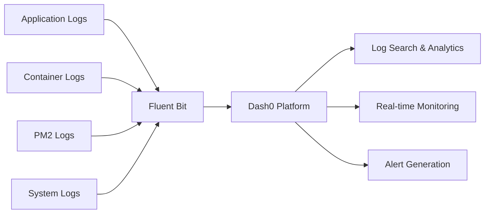
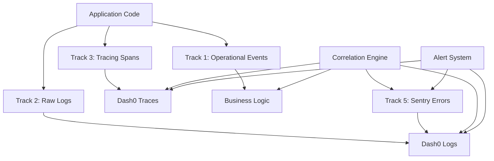

# Track 2: Log Collection 📋

**Raw Log Aggregation and Storage**

## Goals

**Primary Goal**: Collect and aggregate ALL raw logs from containers and processes to ensure no diagnostic information is lost.

**Secondary Goals**:
- Centralized log storage and search
- Real-time log streaming capabilities  
- Log rotation and retention management
- Support for multiple log sources and formats
- Disaster recovery through log persistence

## Technology Stack

### Core Components
- **[Fluent Bit](https://fluentbit.io/)**: Primary log collection agent
- **[Fluentd](https://www.fluentd.org/)**: Log aggregation and processing (optional)
- **Log Tailing**: Direct log file monitoring
- **Docker Logs**: Container stdout/stderr collection

### External Integrations
- **[Dash0](https://www.dash0.com/)**: Primary log storage and analytics platform
- **Alternative Options**: ELK Stack, Splunk, Loki, CloudWatch Logs

## What It Captures

### Application Logs
- Container stdout/stderr streams
- Application log files (`/workspace/logs/*.log`)
- Service-specific logs (PM2, ComfyUI, etc.)
- Worker process logs
- API server request/response logs

### System Logs
- Docker container logs
- Service startup and shutdown events
- Resource usage logs
- Network connection logs
- File system access logs

### Error Information
- Stack traces and exception details
- Service failure events
- Timeout and retry attempts
- Resource exhaustion events
- Network connectivity issues

## Implementation Details

### Fluent Bit Configuration

```yaml
# fluent-bit-worker.conf.template
[SERVICE]
    Flush         5
    Daemon        off
    Log_Level     info
    Parsers_File  parsers.conf
    HTTP_Server   On
    HTTP_Listen   0.0.0.0
    HTTP_Port     2020

[INPUT]
    Name              tail
    Path              /workspace/logs/*.log
    Path_Key          file_path
    Tag               machine.logs
    Refresh_Interval  5
    Read_from_Head    true
    Skip_Long_Lines   true
    Buffer_Max_Size   64k

[INPUT] 
    Name              tail
    Path              /var/log/pm2/*.log
    Path_Key          file_path
    Tag               pm2.logs
    Refresh_Interval  5
    Read_from_Head    true

[FILTER]
    Name    modify
    Match   *
    Add     machine_id ${MACHINE_ID}
    Add     worker_id ${WORKER_ID}
    Add     deployment_env ${RAILWAY_ENVIRONMENT}
    Add     region ${RAILWAY_REGION}

[OUTPUT]
    Name        http
    Match       *
    URI         /logs/ingest
    Host        ${DASH0_LOGS_HOST}
    Port        ${DASH0_LOGS_PORT}
    Format      json_lines
    Json_date_key timestamp
    Json_date_format iso8601
```

### Docker Integration

```yaml
# docker-compose.yml
services:
  worker:
    logging:
      driver: "fluent"
      options:
        fluent-address: "localhost:24224"
        tag: "docker.worker.{{.Name}}"
    volumes:
      - /workspace/logs:/workspace/logs:rw
      - fluent-bit-config:/fluent-bit/etc:ro
    environment:
      - MACHINE_ID=${MACHINE_ID}
      - WORKER_ID=${WORKER_ID}
      - DASH0_LOGS_HOST=dash0-collector
      - DASH0_LOGS_PORT=8080

  fluent-bit:
    image: fluent/fluent-bit:latest
    volumes:
      - fluent-bit-config:/fluent-bit/etc:ro
      - /workspace/logs:/workspace/logs:ro
      - /var/log:/var/log:ro
    environment:
      - MACHINE_ID=${MACHINE_ID}
      - WORKER_ID=${WORKER_ID}
      - DASH0_LOGS_HOST=${DASH0_LOGS_HOST}
      - DASH0_LOGS_PORT=${DASH0_LOGS_PORT}
```

### Log Rotation and Management

```bash
# Log rotation configuration
logrotate.conf:
/workspace/logs/*.log {
    daily
    rotate 7
    compress
    delaycompress
    missingok
    notifempty
    create 644 root root
    postrotate
        # Signal Fluent Bit to reopen files
        pkill -HUP fluent-bit
    endscript
}
```

## Current Status: ✅ Active

### ✅ Implemented Features
- **Fluent Bit Agent**: Deployed and configured on all worker machines
- **Multi-Source Collection**: Collects from files, containers, and system logs
- **Runtime Configuration**: Template-based configuration with environment variables
- **Dash0 Integration**: Logs flowing to centralized Dash0 platform
- **Machine Context**: Each log entry includes machine_id, worker_id, deployment info
- **Real-time Streaming**: Log entries appear in Dash0 within seconds

### ✅ Configuration Management
- **Template System**: `fluent-bit-worker.conf.template` with runtime variable substitution
- **Environment Variables**: Secure configuration without hardcoded values
- **Docker Integration**: Fluent Bit runs as sidecar container
- **Service Discovery**: Automatic discovery of log sources

### ✅ Data Flow


## Configuration Examples

### Environment Variables
```bash
# Required configuration
MACHINE_ID=machine-prod-01
WORKER_ID=worker-gpu-01
RAILWAY_ENVIRONMENT=production
RAILWAY_REGION=us-west1

# Dash0 configuration
DASH0_LOGS_HOST=ingest.dash0.com
DASH0_LOGS_PORT=443
DASH0_API_KEY=${DASH0_API_KEY}

# Feature flags
DISABLE_FLUENT_BIT_LOGGING=false
LOG_LEVEL=info
FLUENT_BIT_HTTP_PORT=2020
```

### Application Integration
```typescript
// Application logging best practices
import { logger } from '@emp/core';

// Structured logging for better searchability
logger.info('Job processing started', {
  job_id: 'job-123',
  service_type: 'comfyui',
  machine_id: process.env.MACHINE_ID,
  worker_id: process.env.WORKER_ID
});

// Error logging with context
try {
  await processJob(jobData);
} catch (error) {
  logger.error('Job processing failed', error, {
    job_id: jobData.id,
    service_type: jobData.service_required,
    error_type: 'processing_failure'
  });
}
```

## Performance Metrics

### Current Performance
- **Log Volume**: ~1000 entries/minute during peak
- **Latency**: <5 seconds from generation to Dash0
- **Resource Usage**: <50MB RAM, <5% CPU
- **Storage Impact**: ~100MB/day compressed logs
- **Retention**: 30 days for general logs, 90 days for errors

### Optimization Features
- **Buffer Management**: 64KB buffers with 5-second flush
- **Compression**: Automatic log compression and rotation
- **Skip Long Lines**: Prevents memory issues with large log entries
- **Rate Limiting**: Prevents log flooding from runaway processes

## Debugging and Troubleshooting

### Common Issues

**Problem**: Logs not appearing in Dash0
```bash
# Check Fluent Bit status
curl http://localhost:2020/api/v1/health

# Check configuration
curl http://localhost:2020/api/v1/config

# Verify log file access
ls -la /workspace/logs/
cat /workspace/logs/*.log | head -10

# Test connectivity to Dash0
curl -X POST ${DASH0_LOGS_HOST}:${DASH0_LOGS_PORT}/logs/ingest \
  -H "Content-Type: application/json" \
  -d '{"test": "message"}'
```

**Problem**: High memory usage
```bash
# Check buffer settings
grep -i buffer /fluent-bit/etc/fluent-bit.conf

# Monitor Fluent Bit metrics
curl http://localhost:2020/api/v1/metrics

# Reduce buffer sizes if needed
Buffer_Max_Size   32k  # Reduce from 64k
Flush            3     # Increase flush frequency
```

**Problem**: Missing log sources
```bash
# Check file permissions
ls -la /workspace/logs/
ls -la /var/log/pm2/

# Verify Fluent Bit can read files
docker exec fluent-bit cat /workspace/logs/worker.log

# Test manual log generation
echo "Test log entry $(date)" >> /workspace/logs/test.log
```

### Health Monitoring
```bash
# Fluent Bit health check
curl -f http://localhost:2020/api/v1/health || echo "Fluent Bit unhealthy"

# Log flow verification
tail -f /workspace/logs/*.log | head -5
# Should appear in Dash0 within 5 seconds

# Resource monitoring
docker stats fluent-bit --no-stream
```

## Best Practices

### Log Structure
```json
{
  "timestamp": "2024-01-15T10:30:00.000Z",
  "level": "info",
  "message": "Job completed successfully",
  "machine_id": "machine-prod-01",
  "worker_id": "worker-gpu-01", 
  "service_type": "comfyui",
  "job_id": "job-12345",
  "processing_time_ms": 5000,
  "output_size_bytes": 2048576
}
```

### Performance Guidelines
- Use structured logging (JSON format)
- Include consistent correlation IDs
- Avoid logging sensitive information
- Use appropriate log levels (DEBUG, INFO, WARN, ERROR)
- Include context in error logs
- Batch log writes when possible

### Security Considerations
- Log files are read-only mounted in containers
- No sensitive data (passwords, tokens) in logs
- Secure transmission to Dash0 via HTTPS
- Log retention policies comply with data governance
- Access control through Dash0 RBAC

## Integration with Other Tracks

### Cross-Track Correlation
- **Track 3 (Tracing)**: Logs include trace_id and span_id for correlation
- **Track 5 (Code Monitoring)**: Sentry errors reference log entries via correlation IDs  
- **Track 1 (Operational Event Bus)**: ConnectorLogger events are captured as structured logs

### Data Flow Integration


## Next Steps

### Phase 1: Enhanced Parsing
- **Log Parsing**: Implement custom parsers for service-specific logs
- **Field Extraction**: Automatic extraction of job_id, trace_id from log messages
- **Error Classification**: Automatic categorization of error types

### Phase 2: Advanced Features
- **Log Anomaly Detection**: ML-based detection of unusual log patterns
- **Smart Sampling**: Reduce log volume while preserving important events
- **Multi-Region Aggregation**: Collect logs from distributed Railway deployments

### Phase 3: Intelligence Layer
- **Log-to-Metrics**: Generate metrics from log patterns
- **Automated Alerts**: Smart alerting based on log analysis
- **Performance Insights**: Job performance trends from log analysis

## Success Metrics

### Current Achievement (✅)
- **99.9%** log collection reliability
- **<5 seconds** average log latency
- **30 days** log retention with full searchability
- **Zero** log data loss events in production

### Target Metrics
- **99.99%** log collection reliability
- **<2 seconds** average log latency  
- **Real-time** anomaly detection
- **Automated** log-based alerting
- **Intelligent** log sampling and filtering