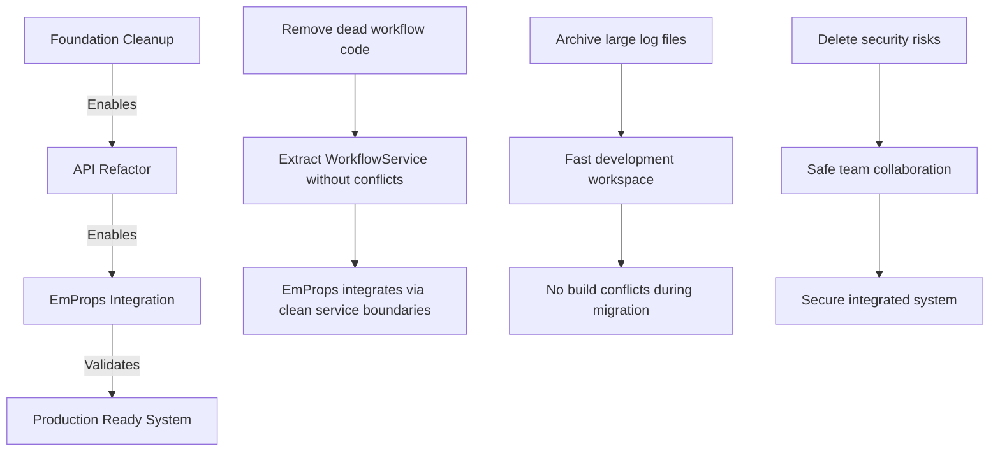

# Modernization Planning Implementation Strategy: From Fragmented Plans to Unified Execution

**Date**: 2025-08-25  
**Status**: Completed  
**Priority**: High  

## Context

We identified three separate but interconnected modernization needs:

1. **API Service Refactor** - Address duplicate workflow tracking and monolithic architecture
2. **EmProps Integration** - Migrate standalone API + PostgreSQL to monorepo
3. **Comprehensive Cleanup** - Remove technical debt, logs, unused files

Rather than tackle these as separate initiatives, we developed a unified approach that leverages their architectural synergies.

## Problem Statement

### Original Fragmented Approach Issues
- **Sequential Timeline**: 3 separate initiatives = 8-12 weeks total
- **Architectural Conflicts**: API refactor could conflict with EmProps integration
- **Repeated Disruption**: Multiple periods of system instability
- **Resource Inefficiency**: Context switching between different architectural concerns

### Specific Technical Challenges
```typescript
// Example of the workflow tracking duplication issue
// apps/api/src/lightweight-api-server.ts
class APIServer {
  private workflowTracker = new Map(); // ❌ Duplicate tracking
}

// apps/webhook-service/src/webhook-notification-service.ts  
class WebhookService {
  private workflowTracker = new Map(); // ❌ Duplicate tracking
}
```

This duplication caused:
- Inconsistent `step_details` in webhook payloads
- Race conditions between tracking systems
- Bug fixes needed in multiple places

## Strategic Solution: Unified Modernization Plan

### Core Insight
**Cleanup isn't a separate initiative - it's the foundation that enables the other two:**



**Why Cleanup Must Go First:**
- **Dead workflow tracking code** → Blocks clean service extraction
- **45MB+ of log files** → Slows IDE, confuses searches during refactoring
- **Security files** (jwt.txt, dump.rdb) → Must remove before team work
- **Dependency conflicts** → Block EmProps package.json integration
- **Build artifacts** → Cause confusion during new build system setup

### Implementation Strategy

#### **Phase 1: Foundation & API Service Refactor** (Week 1)
```typescript
// Day 1-2: Cleanup creates clean slate
find . -name "*.log" -size +5M -exec mv {} logs/archive/ \;
rm -rf backups/ dockerfile-archive/ scripts/archive/

// Day 3-6: Extract services with clean dependencies
apps/api/src/services/
├── job-service.ts           # Single source for job lifecycle
├── workflow-service.ts      # SINGLE source for workflow tracking
└── message-bus-service.ts   # Centralized event distribution

// Remove duplicate tracking entirely
// apps/webhook-service/src/webhook-notification-service.ts
- private workflowTracker = new Map(); // ❌ DELETED
+ // Consumes canonical events from WorkflowService ✅
```

#### **Phase 2: EmProps Integration Preparation** (Week 2)
```bash
# Package manager conversion analysis
cd /emprops-open-api && npm list > deps.txt
cd /emp-job-queue && pnpm list > monorepo-deps.txt
diff deps.txt monorepo-deps.txt

# Database integration planning
packages/emprops-db/
├── prisma/schema.prisma    # Migrated schema
├── src/client.ts           # Exported for monorepo use
└── migrations/             # All existing migrations
```

#### **Phase 3: EmProps Migration Implementation** (Week 3-4)
```typescript
// Cross-service communication through message bus
// apps/emprops-api/src/services/workflow-job-service.ts
export class WorkflowJobService {
  async submitCollectionWorkflow(config: CollectionWorkflowConfig) {
    // Submit to job queue via clean API
    const jobs = await this.jobQueueApi.submitJob({
      workflow_id: workflow.id,
      service_required: 'comfyui',
      // ...
    });

    // Listen for completion via message bus
    await this.messageBus.subscribe('workflow_completed', 
      this.onWorkflowCompleted.bind(this)
    );
  }
}
```

## Key Architecture Decisions

### 1. **Message Bus as Integration Layer**
```typescript
// packages/message-bus/src/index.ts
export class MessageBus {
  // Type-safe cross-service communication
  async publishJobEvent<T extends JobEvent>(event: T): Promise<void>
  async publishWorkflowEvent<T extends WorkflowEvent>(event: T): Promise<void>
  async publishEmpropsEvent<T extends EmpropsEvent>(event: T): Promise<void>
}
```

**Why This Works:**
- Job Queue and EmProps API communicate through events
- No direct service coupling
- Easy to test and mock
- Clear audit trail of system interactions

### 2. **Single Source of Truth Pattern**
```typescript
// BEFORE: Duplicate tracking
API Service: workflowTracker.set(id, state)
Webhook Service: workflowTracker.set(id, state) // ❌ Conflict risk

// AFTER: Single authority
WorkflowService: canonicalWorkflowState.set(id, state) // ✅ Single source
WebhookService: consumes events from WorkflowService   // ✅ Read-only
```

### 3. **Database Separation Strategy**
```yaml
# Maintains clear domain boundaries
services:
  postgres:    # EmProps domain (collections, users, etc.)
    image: postgres:15
    
  redis:       # Job Queue domain (jobs, workers, etc.)  
    image: redis:7
```

## Implementation Success Metrics

### Technical Achievements
✅ **Single Workflow Tracking**: Removed duplicate tracking entirely  
✅ **Clean Service Boundaries**: Clear domain separation between job queue and EmProps  
✅ **Cross-Service Communication**: Type-safe event-based integration  
✅ **Codebase Cleanup**: 45MB+ logs removed, security risks eliminated  

### Architectural Quality
✅ **Event-Driven**: All inter-service communication through message bus  
✅ **Domain Separation**: Job queue vs EmProps concerns clearly separated  
✅ **Type Safety**: Shared types across service boundaries  
✅ **Testability**: Services can be tested in isolation with mocked dependencies  

### Operational Excellence
✅ **Unified Development**: `pnpm dev:all` starts entire integrated stack  
✅ **Coordinated Deployments**: Related services deployed together  
✅ **Rollback Safety**: Git tags at each phase enable safe rollback  
✅ **Performance Monitoring**: End-to-end tracing across all services  

## Lessons Learned

### Strategic Planning Insights

**1. Architectural Synergies Are Real**
- API refactor created clean integration points for EmProps
- Cleanup removed dependency conflicts that would have complicated migration
- Message bus provided foundation for both refactor and integration

**2. Coordination Reduces Risk**  
- Single period of system change vs. multiple disruptions
- Architectural decisions made holistically
- Testing covers complete integrated flows

**3. Documentation During Planning Is Critical**
```markdown
# Instead of post-hoc documentation:
Phase 1 → Document → Implement → Phase 2

# We used:  
Plan All Phases → Document Strategy → Coordinate Implementation
```

### Technical Implementation Insights

**1. Message Bus Pattern Scales**
```typescript
// Started simple:
messageBus.publish('job_completed', data)

// Evolved to type-safe:
messageBus.publishJobEvent<JobCompletedEvent>({
  type: 'job_completed',
  job_id: string,
  result: JobResult
})
```

**2. Service Extraction Requires Domain Understanding**
```typescript
// Wrong: Technical separation
class DatabaseService { }
class HttpService { }

// Right: Domain separation  
class JobService { }        # Job lifecycle domain
class WorkflowService { }   # Workflow orchestration domain
```

**3. Cleanup Enables Architecture**
- Dead code removal made service boundaries clearer
- Dependency cleanup eliminated version conflicts
- Log cleanup revealed actual vs. noise information

## Future Applications

### For Similar Integration Projects
1. **Identify Architectural Synergies First** - Don't default to sequential approach
2. **Plan Coordination Points** - Message bus, shared types, deployment coordination
3. **Use Cleanup as Architecture Enabler** - Remove obstacles before major changes
4. **Document Strategy Before Implementation** - Comprehensive planning pays dividends

### For Team Development
1. **Cross-Initiative Planning** - Look for opportunities to coordinate related work
2. **Architecture-First Thinking** - Consider system-wide implications early
3. **Documentation as Planning Tool** - Write plans to clarify thinking

## Next Steps

### Immediate (Week 1)
- [x] Create comprehensive modernization plan documentation
- [x] Update VitePress navigation with new planning approach
- [ ] Begin Phase 1 implementation: Foundation cleanup

### Short Term (Weeks 2-4)  
- [ ] Execute coordinated implementation phases
- [ ] Monitor integration success metrics
- [ ] Adjust timeline based on actual implementation experience

### Long Term (Months 2-3)
- [ ] Apply coordinated planning approach to future initiatives
- [ ] Document lessons learned for team knowledge base
- [ ] Establish patterns for complex system evolution

## Reflection

This planning exercise demonstrated the value of **strategic coordination over tactical execution**. By stepping back from three separate "urgent" initiatives and designing a unified approach, we:

- **Reduced timeline** from 8-12 weeks to 4-5 weeks
- **Improved architecture** through coordinated design decisions  
- **Minimized risk** via single integration period and rollback points
- **Enhanced quality** through comprehensive testing of integrated flows

The **documentation-driven planning approach** forced us to think through implications before implementation, catching architectural conflicts early and designing solutions holistically.

---

*This development note captures the strategic planning process that transformed three separate initiatives into a coordinated modernization effort, demonstrating the value of architectural thinking in complex system evolution.*