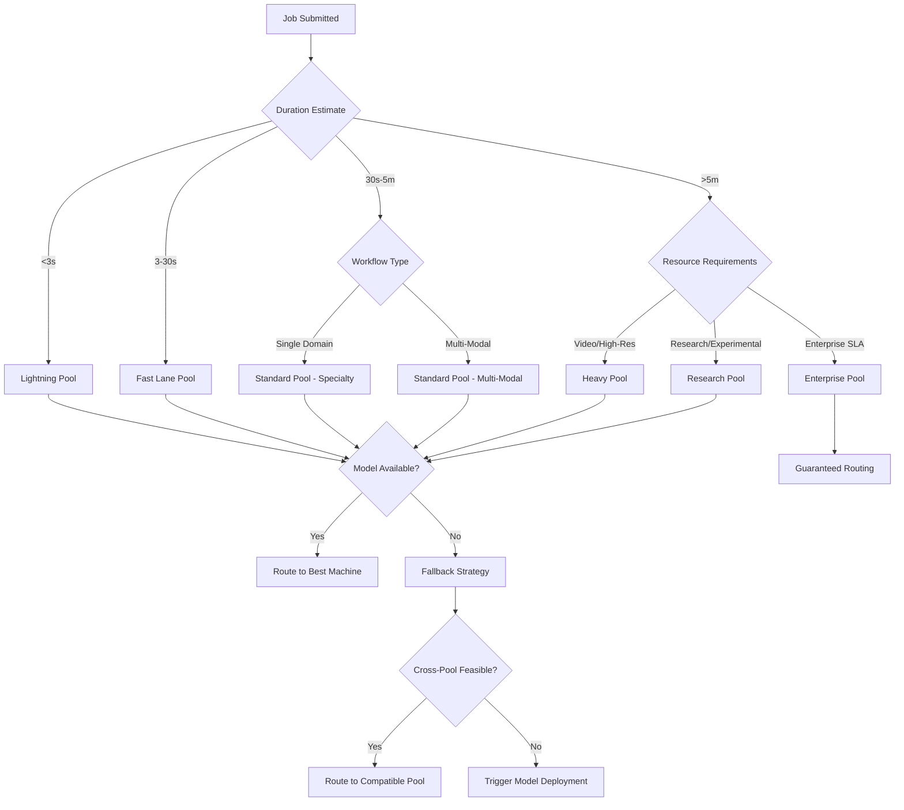
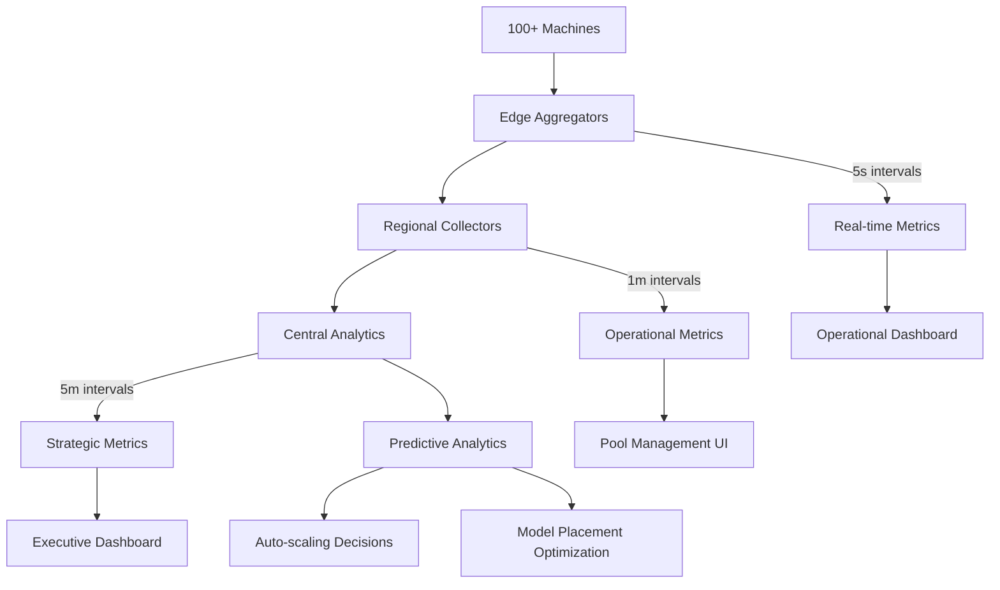

# North Star Architecture Modernization Proposal: 2025 AI Infrastructure Update

**Date**: 2025-08-26  
**Status**: Planning  
**Priority**: Strategic  
**Type**: Architecture Modernization

## Overview

This proposal modernizes the EMP-Job-Queue North Star Architecture for the 2025 AI infrastructure landscape while preserving the core strategic vision of "Specialized Machine Pools + Predictive Model Management." The original architecture remains strategically sound, but tactical implementation details need updates to align with current AI/ML trends, infrastructure capabilities, and user expectations.

**Core Strategy Preserved**: The fundamental approach of eliminating uniform machines competing for resources in favor of specialized pools optimized for different workload patterns remains the optimal solution for distributed ephemeral infrastructure.

**Key Modernizations**:
1. **Expanded Workload Categories**: Updated for 2025 AI landscape including LLMs, multi-modal models, and real-time inference
2. **Edge-First Architecture**: Alignment with 2025 edge AI trends and distributed inference patterns  
3. **Advanced Model Intelligence**: ML-powered prediction systems and model placement optimization
4. **Container Strategy Evolution**: Modern techniques for model baking and deployment efficiency
5. **Scalability Targets**: Updated for 100+ machine operations and enterprise-scale deployments

## Strategic Context: Why Modernize Now?

### 2025 AI Infrastructure Landscape Changes

**AI Workload Evolution**:
- **LLM Integration**: Text-to-image workflows now commonly include LLM preprocessing
- **Multi-Modal Explosion**: Video + audio + text generation in single workflows
- **Real-Time Inference**: User expectations for <5 second total response times
- **Edge AI Adoption**: 50% of enterprises moving to edge computing by 2029 (Gartner)
- **Model Specialization**: Smaller, domain-specific models optimized for edge deployment

**Infrastructure Reality Updates**:
- **Container Optimization**: Layered builds and model baking now standard practice
- **GPU Density**: AI Factory racks moving from 8.2kW to 500-1000kW (500x increase)
- **Kubernetes at Edge**: Container orchestration becoming standard for distributed workloads
- **Data Sovereignty**: 144+ countries with data locality requirements affecting model placement

**User Expectation Changes**:
- **Wait Time Standards**: <10 seconds total time now baseline, not aspirational
- **Reliability Standards**: 99.9% uptime expected, not just desired
- **Workload Complexity**: Multi-step workflows with 5-15 models per collection now common
- **Scale Requirements**: 10x current job volume needed for enterprise adoption

## Core Problems Evolution (2025 Update)

### Original 4 Core Problems + 2025 Additions

**1. Distributed Infrastructure** *(Enhanced)*
- **Original**: No shared storage across geographically distributed machines
- **2025 Update**: Add edge computing compliance and data sovereignty requirements
- **New Challenge**: Multi-region model deployment with regulatory compliance

**2. Model Management** *(Significantly Enhanced)*
- **Original**: Large models (2-15GB each) vs. limited storage vs. download latency  
- **2025 Update**: Multi-modal model suites (5-50GB combined), model version management, and predictive caching
- **New Complexity**: Model dependency graphs (LLM + diffusion + upscaler + audio chains)

**3. User Experience** *(Standards Elevated)*
- **Original**: Eliminating first-user wait times and model thrashing
- **2025 Update**: <5 second total response time for 90% of requests, predictive pre-loading
- **New Expectation**: Real-time feedback during multi-step workflows

**4. Performance Heterogeneity** *(Workload Categories Expanded)*
- **Original**: Job duration variance (1s to 10+ minutes) causing resource contention
- **2025 Update**: 6 distinct workload categories with specialized routing requirements
- **New Categories**: Real-time inference, batch processing, research/experimental

**5. NEW: Multi-Modal Workflow Complexity**
- **Challenge**: Single workflows now span text → image → video → audio with interdependencies
- **Impact**: Traditional single-service routing insufficient for complex chains
- **Solution Needed**: Workflow-aware pool routing and resource reservation

**6. NEW: Enterprise Scale & Reliability**
- **Challenge**: Enterprise users expect 99.9% uptime with 100+ concurrent complex workflows  
- **Impact**: Current monitoring and failover insufficient for production deployments
- **Solution Needed**: Advanced observability, automated recovery, and predictive scaling

## Updated Machine Pool Architecture

### Enhanced Pool Categories (6 Pools vs. Original 3)

#### **Lightning Pool** *(New - Ultra-Fast Lane)*
**Purpose**: Real-time inference, chat completions, immediate feedback
**Duration Target**: <3 seconds end-to-end
**Specifications**:
- **Storage**: 10-20GB (text models only)
- **Compute**: High-frequency CPUs, minimal GPU (inference-optimized)
- **Model Strategy**: Small LLMs, cached embeddings, pre-loaded tokenizers
- **Scaling**: Very high machine count, edge deployment preferred
- **Examples**: GPT-3.5-class models, small vision models, real-time chat

**Container Strategy**:
```dockerfile
FROM pytorch/pytorch:2.3-cuda12.1-cudnn8-runtime
# Pre-load inference engines (vLLM, TensorRT)
RUN pip install vllm tensorrt-llm
# Bake small models directly into image
COPY lightning-models/ /workspace/models/
# Pre-compile model graphs for zero cold-start
RUN python pre_compile_models.py
```

#### **Fast Lane Pool** *(Updated - Enhanced)*
**Purpose**: Standard single-model generation, quick transformations
**Duration Target**: <30 seconds
**Specifications**:
- **Storage**: 40-80GB (expanded for model variants)  
- **Compute**: Balanced CPU/GPU, optimized for single-model inference
- **Model Strategy**: Popular single models with variants (different resolutions, styles)
- **Scaling**: High machine count, cost-optimized instances
- **Examples**: Standard diffusion models, LoRA variants, basic upscaling

**Container Strategy**:
```dockerfile
FROM comfyui-base:latest
# Install fast-lane optimized nodes
RUN install-nodes.sh --profile=fast-lane --parallel=8
# Bake popular model variants
COPY fast-models/ /workspace/models/
# Configure for single-GPU optimization
ENV COMFYUI_GPU_MEMORY_FRACTION=0.9
```

#### **Standard Pool** *(Enhanced - Multi-Specialty)*  
**Purpose**: Complex single-domain workflows, specialized generation
**Duration Target**: 30s-5min (increased from 3min)
**Specifications**:
- **Storage**: 120-200GB (increased for multi-modal)
- **Compute**: Balanced multi-GPU, workflow-optimized
- **Model Strategy**: Domain-specialized model suites with interdependencies
- **Scaling**: Moderate machine count, performance-optimized
- **Specialization Sub-pools**:
  - **Photography**: Portrait, landscape, commercial model suites
  - **Art**: Anime, artistic, illustration model ecosystems  
  - **Product**: E-commerce, marketing, 3D visualization
  - **NEW: Multi-Modal**: Text→Image→Video pipelines

**Container Strategy**:
```dockerfile  
FROM comfyui-base:latest
RUN install-nodes.sh --profile=standard-${SPECIALTY} --dependencies=true
# Domain-specific model suites
COPY standard-models-${SPECIALTY}/ /workspace/models/
# Pre-configure common workflows
COPY workflows/${SPECIALTY}/ /workspace/workflows/
```

#### **Heavy Pool** *(Enhanced - Video Focus)*
**Purpose**: Video generation, high-resolution processing, batch operations  
**Duration Target**: 5min+ (complex multi-step workflows)
**Specifications**:
- **Storage**: 300-500GB (increased for video models)
- **Compute**: High-end multi-GPU, VRAM-optimized (24GB+ per GPU)
- **Model Strategy**: Large video models, multi-step pipeline models
- **Scaling**: Lower machine count, high-specification instances
- **Examples**: AnimateDiff, Stable Video Diffusion, 4K upscaling, audio synthesis

#### **Research Pool** *(Enhanced - Experimental)*
**Purpose**: Latest experimental models, research workflows, custom model training
**Duration Target**: Variable (10min-2hours)
**Specifications**:
- **Storage**: 500GB-1TB (research model storage)
- **Compute**: Cutting-edge GPUs, memory-optimized
- **Model Strategy**: Latest releases, experimental models, custom training
- **Scaling**: Very low machine count, premium instances
- **Features**: Model training capabilities, custom node development

#### **Enterprise Pool** *(New - Business Critical)*
**Purpose**: Customer-specific model sets, compliance requirements, SLA guarantees
**Duration Target**: Variable with guaranteed SLA
**Specifications**:
- **Storage**: Customer-configured (100GB-2TB)
- **Compute**: Dedicated instances, guaranteed resources
- **Model Strategy**: Customer-specific models, compliance-certified
- **Scaling**: Reserved capacity, priority allocation
- **Features**: Data sovereignty, audit trails, dedicated support

### Pool Routing Decision Matrix (2025 Update)



## Advanced Model Intelligence System (2025 Update)

### Machine Learning-Powered Prediction Service

**Enhanced Prediction Capabilities**:
```typescript
interface ModelIntelligenceService {
  // Advanced pattern analysis with ML models
  analyzeWorkflowPatterns(timeWindow: Duration): Promise<WorkflowInsights>
  
  // Multi-dimensional demand forecasting
  predictModelDemand(
    timeHorizon: Duration,
    seasonality: boolean,
    trendAnalysis: boolean
  ): Promise<ModelDemandForecast[]>
  
  // Intelligent model placement optimization  
  optimizeModelPlacement(
    constraints: PlacementConstraints
  ): Promise<OptimalPlacement[]>
  
  // NEW: Multi-modal workflow prediction
  predictWorkflowChains(
    userProfile: UserProfile,
    currentTrends: TrendData
  ): Promise<WorkflowChainPrediction[]>
  
  // NEW: Real-time adaptation
  adaptToRealTimePatterns(
    currentLoad: SystemLoad,
    userBehavior: RealtimeBehavior
  ): Promise<AdaptationStrategy>
}
```

**Enhanced Data Sources**:
```typescript
interface PredictionDataSources {
  // Historical job patterns (existing)  
  jobHistory: JobHistoryData[]
  
  // NEW: User behavior analytics
  userProfiles: UserBehaviorProfile[]
  userJourneyData: UserJourney[]
  
  // NEW: Model performance metrics
  modelPerformanceData: ModelMetrics[]
  resourceUtilizationData: ResourceMetrics[]
  
  // NEW: External trend data
  industryTrends: TrendAnalysis[]
  seasonalPatterns: SeasonalData[]
  
  // NEW: Real-time system state
  currentSystemLoad: SystemState
  networkConditions: NetworkMetrics[]
}
```

### Predictive Model Pre-Warming (Enhanced)

**Advanced Pre-Warming Strategies**:
```typescript
interface PreWarmingService {
  // Time-based pre-warming with ML predictions
  scheduleTimeBasedPreWarming(
    predictions: ModelDemandForecast[],
    constraints: ResourceConstraints
  ): Promise<PreWarmingSchedule>
  
  // User behavior-based pre-warming
  preWarmForUserProfiles(
    activeUsers: UserProfile[],
    predictionConfidence: number
  ): Promise<UserBasedPreWarming[]>
  
  // NEW: Workflow chain pre-warming
  preWarmWorkflowChains(
    chainPredictions: WorkflowChainPrediction[]
  ): Promise<ChainPreWarmingResult>
  
  // NEW: Geographic pre-warming for edge
  preWarmByGeography(
    regionalDemand: RegionalDemandForecast[],
    edgeLocations: EdgeLocation[]
  ): Promise<GeographicPreWarming>
}
```

### Model Dependency Graph Management *(New)*

**Complex Model Relationship Handling**:
```typescript
interface ModelDependencyService {
  // Build dependency graphs for multi-modal workflows
  buildDependencyGraph(
    workflowDefinition: WorkflowDefinition
  ): Promise<ModelDependencyGraph>
  
  // Optimize model placement considering dependencies
  optimizeDependentModelPlacement(
    dependencyGraph: ModelDependencyGraph,
    poolConstraints: PoolConstraints[]
  ): Promise<DependencyOptimizedPlacement>
  
  // Handle model version compatibility
  resolveModelVersions(
    requiredModels: ModelRequirement[],
    availableVersions: ModelVersion[]
  ): Promise<VersionResolution>
}

interface ModelDependencyGraph {
  models: ModelNode[]
  dependencies: ModelDependency[]
  executionOrder: ExecutionPlan
  resourceRequirements: ResourceRequirement[]
}
```

## Container Strategy Modernization

### Multi-Stage Build Optimization (2025 Best Practices)

**Advanced Layering Strategy**:
```dockerfile
# Stage 1: Base system dependencies
FROM nvidia/cuda:12.4-devel-ubuntu22.04 as system-base
RUN apt-get update && apt-get install -y \
    python3.11 python3.11-dev python3-pip \
    nodejs npm git wget curl \
    && rm -rf /var/lib/apt/lists/*

# Stage 2: Python dependencies (cached layer)
FROM system-base as python-deps
COPY requirements.txt /tmp/
RUN pip3.11 install --no-cache-dir -r /tmp/requirements.txt

# Stage 3: ComfyUI base (shared across pools)
FROM python-deps as comfyui-base  
WORKDIR /workspace
RUN git clone https://github.com/comfyanonymous/ComfyUI.git
COPY custom-nodes-installer.js /workspace/
RUN node custom-nodes-installer.js --parallel=10 --retries=3

# Stage 4: Pool-specific builds
FROM comfyui-base as lightning-pool
COPY lightning-models/ /workspace/models/
RUN python precompile-models.py --target=lightning
COPY lightning-config.json /workspace/config.json

FROM comfyui-base as fast-lane-pool  
COPY fast-models/ /workspace/models/
RUN python optimize-models.py --target=fast-lane
COPY fast-lane-config.json /workspace/config.json

# Stage 5: Production optimizations
FROM fast-lane-pool as production
RUN python -m compileall /workspace/ComfyUI
RUN find /workspace -name "*.pyc" -delete
RUN find /workspace -name "__pycache__" -delete
```

### Model Baking Strategies (Enhanced)

**Intelligent Model Selection for Baking**:
```typescript
interface ModelBakingService {
  // Analyze usage patterns to determine baking candidates
  analyzeBakingCandidates(
    poolType: PoolType,
    usageHistory: ModelUsageData[],
    storageConstraints: StorageConstraints
  ): Promise<BakingRecommendation[]>
  
  // Generate optimal container builds
  generateContainerBuilds(
    bakingPlan: BakingRecommendation[],
    baseImages: BaseImageConfig[]
  ): Promise<ContainerBuildPlan[]>
  
  // Manage model versioning in containers
  manageModelVersions(
    currentContainers: ContainerInfo[],
    newModelVersions: ModelVersion[]
  ): Promise<VersionUpdatePlan>
}

interface BakingRecommendation {
  modelId: string
  confidence: number  // 0-100% confidence in usage prediction
  storageImpact: number  // GB required
  performanceGain: number  // Estimated seconds saved
  priority: 'critical' | 'high' | 'medium' | 'low'
}
```

**Dynamic Model Layer Management**:
```bash
#!/bin/bash
# intelligent-model-baking.sh - 2025 optimized model baking

# Stage 1: Analyze current usage patterns
node analyze-model-usage.js \
  --pool-type=${POOL_TYPE} \
  --time-window=30d \
  --confidence-threshold=70 \
  --output=baking-candidates.json

# Stage 2: Generate optimized container layers
docker buildx build \
  --build-arg POOL_TYPE=${POOL_TYPE} \
  --build-arg MODEL_LIST="$(cat baking-candidates.json | jq -r '.models[]')" \
  --cache-from=type=registry,ref=emp-job-queue:cache \
  --cache-to=type=registry,ref=emp-job-queue:cache,mode=max \
  --platform=linux/amd64,linux/arm64 \
  --tag=${POOL_TYPE}-optimized:$(date +%Y%m%d) \
  --push .

# Stage 3: Test performance improvements
docker run --rm ${POOL_TYPE}-optimized:$(date +%Y%m%d) \
  python benchmark-container.py \
  --test-models="$(cat baking-candidates.json | jq -r '.models[]')" \
  --benchmark-duration=300s
```

## Scalable Monitoring & Operations (100+ Machine Scale)

### Event-Driven Architecture for Scale

**Scalable Event Processing System**:
```typescript
interface ScalableMonitoringService {
  // Handle massive event throughput  
  processEvents(
    eventStream: EventStream,
    processingConfig: ProcessingConfig
  ): Promise<ProcessedEventBatch>
  
  // Intelligent event aggregation
  aggregateEvents(
    events: Event[],
    aggregationRules: AggregationRule[]
  ): Promise<AggregatedMetrics>
  
  // Real-time analytics with sampling
  generateRealtimeAnalytics(
    samplingRate: number,
    metricsConfig: MetricsConfig
  ): Promise<RealtimeAnalytics>
  
  // Predictive alerting
  predictiveAlerting(
    systemMetrics: SystemMetrics,
    predictionModels: AlertingModel[]
  ): Promise<PredictiveAlert[]>
}
```

**Multi-Tier Monitoring Architecture**:


### Advanced Observability Stack

**Distributed Tracing for Complex Workflows**:
```typescript
interface DistributedTracingService {
  // Trace complex multi-model workflows
  traceWorkflowExecution(
    workflowId: string,
    traceConfig: TracingConfig
  ): Promise<WorkflowTrace>
  
  // Analyze performance bottlenecks  
  analyzePerformanceBottlenecks(
    traces: WorkflowTrace[],
    analysisConfig: AnalysisConfig
  ): Promise<BottleneckAnalysis>
  
  // Model performance attribution
  attributeModelPerformance(
    workflowTrace: WorkflowTrace,
    modelMetrics: ModelPerformanceMetrics[]
  ): Promise<PerformanceAttribution>
}
```

**Intelligent Alerting System**:
```typescript
interface IntelligentAlertingService {
  // ML-based anomaly detection
  detectAnomalies(
    metrics: MetricTimeSeries[],
    baselineModel: AnomalyDetectionModel
  ): Promise<Anomaly[]>
  
  // Context-aware alerting
  generateContextualAlerts(
    anomalies: Anomaly[],
    systemContext: SystemContext
  ): Promise<ContextualAlert[]>
  
  // Alert fatigue prevention
  optimizeAlertFrequency(
    alertHistory: AlertHistory[],
    responsePatterns: ResponsePattern[]
  ): Promise<OptimizedAlertingStrategy>
}
```

## Enhanced Success Metrics (2025 Standards)

### Performance Targets (Elevated)

**User Experience Metrics**:
- **Lightning Pool**: <3s end-to-end for 95% of requests
- **Fast Lane Pool**: <30s total time for 95% of requests  
- **Standard Pool**: <5min for 90% of complex workflows
- **Overall System**: <10s wait time for 95% of all requests

**Reliability Targets**:
- **System Uptime**: 99.9% (8.77 hours downtime/year max)
- **Job Completion Rate**: 99.95% successful completion
- **Model Availability**: 99.5% for baked models, 95% for dynamic downloads
- **Cross-Pool Fallback Success**: 90% when optimal pool unavailable

**Scale Performance Metrics**:
- **Concurrent Workflows**: 1000+ complex multi-step workflows
- **Machine Management**: 500+ machines across all pools
- **Request Throughput**: 10,000+ requests per hour peak
- **Model Throughput**: 1,000+ model predictions per minute

### Business Impact Metrics (Enterprise-Ready)

**Cost Efficiency Targets**:
- **Model Download Reduction**: 85% reduction in redundant downloads  
- **Resource Utilization**: 80%+ average utilization across all pools
- **Storage Efficiency**: 90%+ effective storage utilization
- **Compute Cost per Job**: 50% reduction vs. uniform machine approach

**Prediction Accuracy Metrics**:
- **Model Demand Prediction**: 80%+ accuracy for 24-hour forecasts
- **Pool Routing Optimization**: 95%+ jobs routed to optimal pool
- **Pre-warming Efficiency**: 70%+ pre-warmed models actually used
- **Workflow Chain Prediction**: 60%+ accuracy for multi-step workflows

## Implementation Roadmap (2025-2026)

### Phase 1: Foundation Modernization (Months 1-3)
**Goal**: Update current architecture with 2025 infrastructure best practices

**Q1 2025 Deliverables**:
- Lightning Pool implementation with real-time inference capability
- Enhanced container strategy with multi-stage optimization
- Advanced Redis Functions supporting 6-pool routing
- Scalable monitoring architecture foundation

**Technical Focus**:
- Container build optimization and model baking automation
- Lightning-fast inference optimization (vLLM, TensorRT integration)
- Event-driven monitoring system design and implementation
- Pool-specific node optimization and custom workflow templates

### Phase 2: Intelligence & Prediction (Months 4-6)  
**Goal**: Deploy ML-powered model intelligence and predictive systems

**Q2 2025 Deliverables**:
- ML-powered model demand prediction service
- Advanced pre-warming with workflow chain optimization
- Model dependency graph management system
- Intelligent container build automation

**Technical Focus**:
- Machine learning model training for demand prediction
- Complex workflow pattern recognition and optimization
- Automated model dependency resolution
- Performance attribution and bottleneck analysis

### Phase 3: Enterprise Scale & Edge (Months 7-9)
**Goal**: Enable enterprise deployment with edge computing integration

**Q3 2025 Deliverables**:
- Enterprise Pool with SLA guarantees and compliance features
- Edge computing integration for geographic distribution
- Advanced observability with predictive alerting
- Multi-region model deployment with data sovereignty

**Technical Focus**:
- Enterprise features: audit trails, compliance, dedicated resources
- Edge deployment patterns and regional optimization
- Advanced monitoring with ML-based anomaly detection
- Data sovereignty and regulatory compliance implementation

### Phase 4: Production Optimization (Months 10-12)
**Goal**: Production hardening and optimization for scale

**Q4 2025 Deliverables**:
- Production-ready deployment supporting 500+ machines
- Advanced cost optimization and resource management
- ML-based system optimization and auto-tuning
- Comprehensive enterprise features and support

**Technical Focus**:
- Performance optimization and cost analysis
- Advanced auto-scaling with predictive demand management
- Enterprise integration patterns and API optimization
- Comprehensive testing and validation frameworks

## Risk Mitigation & Implementation Strategy

### Technology Risk Management

**Container Strategy Risks**:
- **Risk**: Model baking overhead impacting development velocity
- **Mitigation**: Parallel build pipelines with intelligent caching layers
- **Backup Plan**: Dynamic model loading with enhanced prediction accuracy

**Scalability Risks**:
- **Risk**: Monitoring system overwhelmed at 100+ machine scale  
- **Mitigation**: Hierarchical monitoring with intelligent sampling
- **Backup Plan**: Federated monitoring approach with regional aggregation

**AI/ML Model Risks**:
- **Risk**: Prediction models failing to achieve target accuracy
- **Mitigation**: Hybrid approach combining ML predictions with rule-based fallbacks
- **Backup Plan**: Conservative prediction thresholds with gradual confidence building

### Migration Strategy

**Gradual Pool Introduction**:
1. **Month 1-2**: Deploy Lightning Pool alongside existing system
2. **Month 3-4**: Migrate Fast Lane workloads to optimized pools
3. **Month 5-6**: Introduce Standard Pool specializations
4. **Month 7+**: Full system migration with Enterprise Pool deployment

**Rollback Capabilities**:
- Each phase maintains compatibility with previous architecture
- Pool routing can fall back to uniform machine distribution
- Model management can revert to reactive downloading
- Monitoring system maintains current WebSocket capability

### Success Validation

**Continuous Validation Metrics**:
- **Performance Benchmarking**: Weekly performance regression testing
- **Cost Analysis**: Monthly cost efficiency validation vs. targets
- **User Satisfaction**: Quarterly user experience surveys and feedback
- **System Reliability**: Continuous uptime and error rate monitoring

## Conclusion

This modernization proposal transforms the EMP-Job-Queue architecture for 2025 AI infrastructure realities while preserving the core strategic vision. The enhanced approach addresses current limitations in workload diversity, scale requirements, and user expectations while positioning the system for enterprise adoption and edge computing integration.

**Strategic Continuity**: The fundamental approach of specialized machine pools remains optimal and is enhanced rather than replaced.

**Tactical Evolution**: Implementation details are updated to reflect current best practices in containerization, model management, monitoring, and distributed systems.

**Future Readiness**: The architecture is positioned to handle emerging requirements including multi-modal workflows, edge deployment, regulatory compliance, and enterprise scale operations.

**Implementation Risk**: Moderate - leverages proven technologies with evolutionary rather than revolutionary changes, maintaining backward compatibility throughout the transition.

The result will be a production-ready, enterprise-scale AI workload broker capable of supporting the demanding requirements of 2025 AI applications while maintaining the operational excellence and cost efficiency of the original North Star vision.

---

*This proposal represents a comprehensive modernization that preserves strategic soundness while ensuring tactical relevance for current and emerging AI infrastructure requirements.*