# Phase 2: Message Bus Implementation Guide

**Date**: 2025-08-26  
**Status**: Ready for Implementation  
**Priority**: Critical - Communication Layer  
**Timeline**: Days 6-10 (5 days)  
**Dependencies**: Phase 1 (Testing Infrastructure) Complete

## Executive Summary

> **🎯 Mission**: Establish robust event-driven communication infrastructure using Redis pub/sub and streams.

This guide provides detailed implementation instructions for Phase 2 of the unified modernization plan. Phase 2 establishes a robust event-driven communication layer using Redis pub/sub and streams, enabling reliable service decoupling and setting the foundation for service extraction in Phase 3.

### 📡 Message Bus Architecture Flow

```mermaid
flowchart TD
    Start(["🚀 Start Phase 2"]) --> Core["🏗️ Core Message Bus"]
    Core --> Events["📋 Event Type System"]
    Events --> Redis["📡 Redis Integration"]
    Redis --> Local["⚡ Local EventEmitter"]
    Local --> WebSocket["🔌 WebSocket Bridge"]
    WebSocket --> Testing["🧪 Event Testing"]
    Testing --> Complete(["✅ Phase 2 Complete"])
    
    Core --> |"Day 6"| C1["MessageBusService Class"]
    Core --> |"Day 6"| C2["Event Interfaces"]
    Core --> |"Day 6"| C3["Publisher/Subscriber"]
    
    Events --> |"Day 7"| E1["Job Events"]
    Events --> |"Day 7"| E2["Workflow Events"]  
    Events --> |"Day 7"| E3["System Events"]
    
    Redis --> |"Day 8"| R1["Pub/Sub Integration"]
    Redis --> |"Day 8"| R2["Streams Persistence"]
    Redis --> |"Day 8"| R3["Consumer Groups"]
    
    Local --> |"Day 9"| L1["EventEmitter Bridge"]
    Local --> |"Day 9"| L2["Immediate Processing"]
    Local --> |"Day 9"| L3["Error Handling"]
    
    WebSocket --> |"Day 10"| W1["Real-time Updates"]
    WebSocket --> |"Day 10"| W2["Client Broadcasting"]
    WebSocket --> |"Day 10"| W3["Connection Management"]
    
    Testing --> T1["Event Flow Tests"]
    Testing --> T2["Persistence Tests"] 
    Testing --> T3["Performance Tests"]
    
    classDef dayStyle fill:#e1f5fe,stroke:#01579b,stroke-width:2px
    classDef systemStyle fill:#f3e5f5,stroke:#4a148c,stroke-width:2px
    classDef completeStyle fill:#e8f5e8,stroke:#1b5e20,stroke-width:3px
    
    class C1,C2,C3,E1,E2,E3,R1,R2,R3,L1,L2,L3,W1,W2,W3 dayStyle
    class Core,Events,Redis,Local,WebSocket,Testing systemStyle
    class Start,Complete completeStyle
```

<FullscreenDiagram>



</FullscreenDiagram>

**Key Deliverables:**
- **Redis-based Message Bus Service** with pub/sub and stream persistence
- **Event Type System** with comprehensive event definitions and schemas
- **Local Event Emitter Integration** for immediate processing + distributed delivery
- **Event Sourcing Foundation** using Redis Streams for audit trail and replay
- **WebSocket Integration** for real-time client notifications
- **Testing Infrastructure** for event-driven patterns

## Research Findings: Modern Event-Driven Architecture

### Redis Event-Driven Patterns
Based on Context7 research of Redis patterns, optimal approach combines:

**Redis Pub/Sub + Streams Hybrid:**
- **Pub/Sub**: Immediate event distribution to connected consumers
- **Streams**: Persistent event log with consumer groups and replay capability
- **Local EventEmitter**: Immediate in-process handling for critical operations

**Key Benefits:**
- **Reliability**: Events persisted in streams survive service restarts
- **Scalability**: Consumer groups enable distributed event processing
- **Performance**: Pub/sub provides immediate notification, streams provide durability
- **Auditability**: Complete event history for debugging and compliance

### Event Sourcing Best Practices
Research reveals proven patterns for event sourcing implementation:

**Event Store Design:**
- Immutable event streams per aggregate type
- Event versioning for schema evolution
- Idempotency keys for at-least-once delivery
- Consumer offset tracking for resume capability

**Event Processing Patterns:**
- **At-least-once delivery** with idempotency checks
- **Consumer groups** for scalable processing
- **Dead letter queues** for failed events
- **Event replay** for service recovery

## Current System Analysis

### Message Flow Problems Identified
1. **Tight Coupling**: Direct HTTP calls between API and Webhook services
2. **Duplicate Logic**: Same business logic in multiple services
3. **Race Conditions**: Inconsistent state between services
4. **No Audit Trail**: Events not recorded for debugging
5. **WebSocket Gaps**: Real-time updates implemented ad-hoc

### Current Communication Architecture
```
┌─────────────────┐    HTTP Calls    ┌──────────────────┐
│   API Server    ├─────────────────→│ Webhook Service  │
│                 │                  │                  │
│ - Job Logic     │                  │ - Job Logic      │
│ - Workflow      │                  │ - Workflow       │ 
│ - WebSocket     │                  │ - HTTP Delivery  │
└─────────────────┘                  └──────────────────┘
```

**Problems**: Tight coupling, duplicate state management, race conditions

## Target Event-Driven Architecture

### Message Bus Overview
```
┌─────────────────────────────────────────────────────────────┐
│                     Message Bus Layer                      │
│                                                             │
│  ┌─────────────────┐ ┌─────────────────┐ ┌───────────────┐│
│  │ Redis Pub/Sub   │ │ Redis Streams   │ │ Local Events  ││
│  │                 │ │                 │ │               ││
│  │ - Immediate     │ │ - Persistent    │ │ - In-Process  ││
│  │ - Distribution  │ │ - Audit Trail   │ │ - Performance ││
│  │ - Fan-out       │ │ - Replay        │ │ - Critical    ││
│  └─────────────────┘ └─────────────────┘ └───────────────┘│
└─────────────────────────────────────────────────────────────┘
                            │
┌─────────────────────────────────────────────────────────────┐
│                    Service Layer                           │
│                                                             │
│ ┌─────────────┐ ┌─────────────┐ ┌─────────────┐ ┌─────────┐│
│ │ API Service │ │   Webhook   │ │   Monitor   │ │ Future  ││
│ │             │ │   Service   │ │   Service   │ │ Services││
│ │ - Publish   │ │ - Subscribe │ │ - Subscribe │ │         ││
│ │ - Subscribe │ │ - Process   │ │ - Display   │ │         ││
│ └─────────────┘ └─────────────┘ └─────────────┘ └─────────┘│
└─────────────────────────────────────────────────────────────┘
```

### Event Flow Strategy
1. **Immediate Processing**: Local EventEmitter for critical operations
2. **Reliable Distribution**: Redis pub/sub for connected services
3. **Persistent Storage**: Redis streams for audit trail and replay
4. **Real-time Updates**: WebSocket notifications from event bus

## Step-by-Step Implementation

### Day 6: Message Bus Core Infrastructure

#### 6.1 Event Type Definitions
```typescript
// packages/core/src/events/types.ts
export interface BaseEvent {
  id: string
  type: string
  timestamp: number
  correlation_id?: string
  causation_id?: string
  version: number
  metadata?: Record<string, any>
}

export interface JobEvent extends BaseEvent {
  job_id: string
  machine_id?: string
  worker_id?: string
  payload?: any
}

// Job Lifecycle Events
export interface JobSubmittedEvent extends JobEvent {
  type: 'job_submitted'
  payload: JobPayload
  requirements: JobRequirements
  priority: number
  webhook_url?: string
}

export interface JobAssignedEvent extends JobEvent {
  type: 'job_assigned'
  worker_id: string
  machine_id: string
  assigned_at: string
}

export interface JobProgressEvent extends JobEvent {
  type: 'job_progress'
  progress: number
  stage?: string
  message?: string
}

export interface JobCompletedEvent extends JobEvent {
  type: 'job_completed'
  result: JobResult
  duration: number
  completed_at: string
}

export interface JobFailedEvent extends JobEvent {
  type: 'job_failed'
  error: JobError
  retry_count: number
  failed_at: string
}

// Workflow Events
export interface WorkflowEvent extends BaseEvent {
  workflow_id: string
  total_steps: number
}

export interface WorkflowCreatedEvent extends WorkflowEvent {
  type: 'workflow_created'
  name: string
  description?: string
  job_ids: string[]
  webhook_url?: string
}

export interface WorkflowStepCompletedEvent extends WorkflowEvent {
  type: 'workflow_step_completed'
  step_index: number
  job_id: string
  result: any
  completed_steps: number
}

export interface WorkflowCompletedEvent extends WorkflowEvent {
  type: 'workflow_completed'
  step_details: StepDetail[]
  completed_at: string
  success_count: number
  failed_count: number
}

// Machine/Worker Events
export interface MachineEvent extends BaseEvent {
  machine_id: string
}

export interface MachineRegisteredEvent extends MachineEvent {
  type: 'machine_registered'
  capabilities: WorkerCapabilities
  ip_address: string
  status: 'online'
}

export interface MachineStatusChangedEvent extends MachineEvent {
  type: 'machine_status_changed'
  status: 'online' | 'offline' | 'busy' | 'error'
  previous_status: string
  details?: any
}

export interface WorkerStatusChangedEvent extends BaseEvent {
  type: 'worker_status_changed'
  worker_id: string
  machine_id: string
  status: 'idle' | 'busy' | 'offline'
  current_job_id?: string
}

// Union type for all events
export type Event = 
  | JobSubmittedEvent
  | JobAssignedEvent
  | JobProgressEvent
  | JobCompletedEvent
  | JobFailedEvent
  | WorkflowCreatedEvent
  | WorkflowStepCompletedEvent
  | WorkflowCompletedEvent
  | MachineRegisteredEvent
  | MachineStatusChangedEvent
  | WorkerStatusChangedEvent

// Event handler type
export type EventHandler<T extends Event = Event> = (event: T) => Promise<void> | void
```

#### 6.2 Message Bus Service Core
```typescript
// packages/core/src/services/message-bus-service.ts
import Redis from 'ioredis'
import EventEmitter from 'events'
import { v4 as uuidv4 } from 'uuid'
import { logger } from '../utils/logger'
import type { Event, EventHandler } from '../events/types'

interface MessageBusConfig {
  redis: {
    host: string
    port: number
    password?: string
    db?: number
  }
  streams: {
    maxLength: number
    retentionHours: number
  }
  consumer: {
    group: string
    name: string
  }
}

export class MessageBusService {
  private redis: Redis
  private pubSubRedis: Redis
  private localEmitter: EventEmitter
  private subscriptions: Map<string, Set<EventHandler>>
  private consumerGroups: Map<string, string>
  private isShuttingDown: boolean = false

  constructor(private config: MessageBusConfig) {
    // Separate Redis connections for pub/sub and commands
    this.redis = new Redis({
      host: config.redis.host,
      port: config.redis.port,
      password: config.redis.password,
      db: config.redis.db || 0,
      maxRetriesPerRequest: 3,
      lazyConnect: true,
    })

    this.pubSubRedis = new Redis({
      host: config.redis.host,
      port: config.redis.port,
      password: config.redis.password,
      db: config.redis.db || 0,
      maxRetriesPerRequest: 3,
      lazyConnect: true,
    })

    this.localEmitter = new EventEmitter()
    this.localEmitter.setMaxListeners(100) // Support many subscribers
    
    this.subscriptions = new Map()
    this.consumerGroups = new Map()

    this.setupErrorHandling()
  }

  async connect(): Promise<void> {
    try {
      await Promise.all([
        this.redis.connect(),
        this.pubSubRedis.connect()
      ])

      // Set up pub/sub message handling
      this.pubSubRedis.on('message', this.handlePubSubMessage.bind(this))
      
      logger.info('Message bus connected successfully')
    } catch (error) {
      logger.error('Failed to connect to message bus:', error)
      throw error
    }
  }

  async disconnect(): Promise<void> {
    this.isShuttingDown = true
    
    try {
      await Promise.all([
        this.redis.disconnect(),
        this.pubSubRedis.disconnect()
      ])
      
      this.localEmitter.removeAllListeners()
      logger.info('Message bus disconnected')
    } catch (error) {
      logger.error('Error disconnecting message bus:', error)
    }
  }

  /**
   * Publish an event with triple reliability:
   * 1. Local EventEmitter for immediate processing
   * 2. Redis pub/sub for real-time distribution 
   * 3. Redis streams for persistence and replay
   */
  async publishEvent<T extends Event>(event: T): Promise<void> {
    try {
      // Ensure event has required fields
      const enrichedEvent: T = {
        ...event,
        id: event.id || uuidv4(),
        timestamp: event.timestamp || Date.now(),
        version: event.version || 1
      }

      // 1. Emit locally for immediate processing (synchronous)
      this.localEmitter.emit(event.type, enrichedEvent)
      this.localEmitter.emit('*', enrichedEvent) // Global event listener

      if (this.isShuttingDown) {
        logger.warn(`Skipping distributed event publishing during shutdown: ${event.type}`)
        return
      }

      // 2. Publish to Redis pub/sub for real-time distribution (fire-and-forget)
      const eventJson = JSON.stringify(enrichedEvent)
      await Promise.all([
        this.redis.publish(`events:${event.type}`, eventJson),
        this.redis.publish('events:*', eventJson) // Global channel
      ])

      // 3. Add to Redis stream for persistence and audit trail
      await this.redis.xadd(
        `stream:${event.type}`,
        'MAXLEN', '~', this.config.streams.maxLength.toString(),
        '*',
        'event_id', enrichedEvent.id,
        'event_type', enrichedEvent.type,
        'timestamp', enrichedEvent.timestamp.toString(),
        'data', eventJson
      )

      logger.debug(`Event published: ${event.type}`, {
        eventId: enrichedEvent.id,
        type: event.type
      })

    } catch (error) {
      logger.error(`Failed to publish event: ${event.type}`, {
        error: error.message,
        eventId: event.id
      })
      throw error
    }
  }

  /**
   * Subscribe to events with multiple consumption patterns
   */
  subscribe<T extends Event>(
    eventType: string | string[], 
    handler: EventHandler<T>,
    options: {
      local?: boolean      // Listen to local events only
      distributed?: boolean // Listen to distributed events
      persistent?: boolean  // Process from stream with consumer group
    } = { local: true, distributed: true, persistent: false }
  ): void {
    const eventTypes = Array.isArray(eventType) ? eventType : [eventType]

    eventTypes.forEach(type => {
      // Local subscription (immediate processing)
      if (options.local !== false) {
        this.localEmitter.on(type, handler)
      }

      // Distributed subscription (Redis pub/sub)
      if (options.distributed !== false) {
        if (!this.subscriptions.has(type)) {
          this.subscriptions.set(type, new Set())
          // Subscribe to Redis channel
          this.pubSubRedis.subscribe(`events:${type}`)
        }
        this.subscriptions.get(type)!.add(handler)
      }

      // Persistent subscription (Redis streams with consumer groups)
      if (options.persistent) {
        this.setupStreamConsumer(type, handler)
      }
    })

    logger.debug(`Subscribed to event: ${eventTypes.join(', ')}`, options)
  }

  /**
   * Unsubscribe from events
   */
  unsubscribe<T extends Event>(eventType: string, handler: EventHandler<T>): void {
    // Remove local listener
    this.localEmitter.removeListener(eventType, handler)

    // Remove distributed listener
    if (this.subscriptions.has(eventType)) {
      this.subscriptions.get(eventType)!.delete(handler)
      
      // If no more handlers, unsubscribe from Redis
      if (this.subscriptions.get(eventType)!.size === 0) {
        this.pubSubRedis.unsubscribe(`events:${eventType}`)
        this.subscriptions.delete(eventType)
      }
    }

    logger.debug(`Unsubscribed from event: ${eventType}`)
  }

  /**
   * Get event history from stream
   */
  async getEventHistory(
    eventType: string, 
    options: {
      start?: string   // Stream ID or timestamp
      end?: string     // Stream ID or timestamp  
      count?: number   // Max events to return
    } = {}
  ): Promise<Event[]> {
    try {
      const streamKey = `stream:${eventType}`
      const start = options.start || '-'
      const end = options.end || '+'
      const count = options.count || 100

      const events = await this.redis.xrange(
        streamKey, 
        start, 
        end, 
        'COUNT', 
        count.toString()
      )

      return events.map(([streamId, fields]) => {
        const fieldMap = this.parseStreamFields(fields)
        return JSON.parse(fieldMap.data) as Event
      })
    } catch (error) {
      logger.error(`Failed to get event history for ${eventType}:`, error)
      throw error
    }
  }

  /**
   * Replay events from a specific point in time
   */
  async replayEvents(
    eventType: string,
    fromTimestamp: number,
    handler: EventHandler,
    options: {
      batchSize?: number
      parallel?: boolean
    } = {}
  ): Promise<void> {
    const batchSize = options.batchSize || 50
    let lastId = fromTimestamp.toString()

    try {
      while (true) {
        const events = await this.getEventHistory(eventType, {
          start: lastId,
          count: batchSize
        })

        if (events.length === 0) break

        if (options.parallel) {
          await Promise.all(events.map(event => handler(event)))
        } else {
          for (const event of events) {
            await handler(event)
          }
        }

        lastId = events[events.length - 1].id
        
        logger.debug(`Replayed ${events.length} events of type ${eventType}`)
      }
    } catch (error) {
      logger.error(`Failed to replay events for ${eventType}:`, error)
      throw error
    }
  }

  private async setupStreamConsumer(eventType: string, handler: EventHandler): Promise<void> {
    const streamKey = `stream:${eventType}`
    const groupName = this.config.consumer.group
    const consumerName = this.config.consumer.name

    try {
      // Create consumer group if it doesn't exist
      if (!this.consumerGroups.has(eventType)) {
        try {
          await this.redis.xgroup('CREATE', streamKey, groupName, '0', 'MKSTREAM')
          logger.debug(`Created consumer group ${groupName} for stream ${streamKey}`)
        } catch (error) {
          // Group might already exist
          if (!error.message.includes('BUSYGROUP')) {
            throw error
          }
        }
        this.consumerGroups.set(eventType, groupName)
      }

      // Start consuming in background
      this.startStreamConsumer(streamKey, groupName, consumerName, handler)

    } catch (error) {
      logger.error(`Failed to setup stream consumer for ${eventType}:`, error)
      throw error
    }
  }

  private async startStreamConsumer(
    streamKey: string, 
    groupName: string, 
    consumerName: string, 
    handler: EventHandler
  ): Promise<void> {
    // Background consumer loop
    setTimeout(async () => {
      while (!this.isShuttingDown) {
        try {
          // Read from stream with consumer group
          const messages = await this.redis.xreadgroup(
            'GROUP', groupName, consumerName,
            'COUNT', '10',
            'BLOCK', '5000', // 5 second timeout
            'STREAMS', streamKey, '>'
          )

          if (messages && messages.length > 0) {
            const [, events] = messages[0]
            
            for (const [messageId, fields] of events) {
              try {
                const fieldMap = this.parseStreamFields(fields)
                const event = JSON.parse(fieldMap.data) as Event
                
                await handler(event)
                
                // Acknowledge message
                await this.redis.xack(streamKey, groupName, messageId)
                
              } catch (error) {
                logger.error(`Error processing stream event ${messageId}:`, error)
                // Message will remain unacknowledged and can be retried
              }
            }
          }
        } catch (error) {
          if (!this.isShuttingDown) {
            logger.error('Stream consumer error:', error)
            // Wait before retrying
            await new Promise(resolve => setTimeout(resolve, 5000))
          }
        }
      }
    }, 100)
  }

  private handlePubSubMessage(channel: string, message: string): void {
    try {
      const event = JSON.parse(message) as Event
      const eventType = channel.replace('events:', '')
      
      // Skip global channel to avoid duplicate processing
      if (eventType === '*') return
      
      const handlers = this.subscriptions.get(eventType)
      if (handlers) {
        handlers.forEach(handler => {
          try {
            handler(event)
          } catch (error) {
            logger.error(`Error in event handler for ${eventType}:`, error)
          }
        })
      }
    } catch (error) {
      logger.error('Error processing pub/sub message:', error)
    }
  }

  private parseStreamFields(fields: string[]): Record<string, string> {
    const result: Record<string, string> = {}
    for (let i = 0; i < fields.length; i += 2) {
      result[fields[i]] = fields[i + 1]
    }
    return result
  }

  private setupErrorHandling(): void {
    this.redis.on('error', (error) => {
      logger.error('Redis command error:', error)
    })

    this.pubSubRedis.on('error', (error) => {
      logger.error('Redis pub/sub error:', error)
    })

    this.localEmitter.on('error', (error) => {
      logger.error('Local event emitter error:', error)
    })
  }

  // Health check method
  async healthCheck(): Promise<{
    status: 'healthy' | 'unhealthy'
    redis: boolean
    pubsub: boolean
    lastEventTimestamp?: number
  }> {
    try {
      const [redisPing, pubsubPing] = await Promise.all([
        this.redis.ping(),
        this.pubSubRedis.ping()
      ])

      const healthy = redisPing === 'PONG' && pubsubPing === 'PONG'

      return {
        status: healthy ? 'healthy' : 'unhealthy',
        redis: redisPing === 'PONG',
        pubsub: pubsubPing === 'PONG'
      }
    } catch (error) {
      return {
        status: 'unhealthy',
        redis: false,
        pubsub: false
      }
    }
  }
}
```

#### 6.3 Message Bus Factory and Configuration
```typescript
// packages/core/src/services/message-bus-factory.ts
import { MessageBusService } from './message-bus-service'
import type { MessageBusConfig } from './message-bus-service'

// Singleton instance for the application
let messageBusInstance: MessageBusService | null = null

export function createMessageBus(config: MessageBusConfig): MessageBusService {
  if (messageBusInstance) {
    return messageBusInstance
  }

  messageBusInstance = new MessageBusService(config)
  return messageBusInstance
}

export function getMessageBus(): MessageBusService {
  if (!messageBusInstance) {
    throw new Error('Message bus not initialized. Call createMessageBus first.')
  }
  return messageBusInstance
}

export async function shutdownMessageBus(): Promise<void> {
  if (messageBusInstance) {
    await messageBusInstance.disconnect()
    messageBusInstance = null
  }
}
```

### Day 7: Event Publisher Implementation

#### 7.1 Job Event Publishers
```typescript
// packages/core/src/services/job-event-publisher.ts
import { v4 as uuidv4 } from 'uuid'
import { getMessageBus } from './message-bus-factory'
import type {
  JobSubmittedEvent,
  JobAssignedEvent,
  JobProgressEvent,
  JobCompletedEvent,
  JobFailedEvent,
  JobPayload,
  JobRequirements,
  JobResult,
  JobError
} from '../events/types'

export class JobEventPublisher {
  private messageBus = getMessageBus()

  async publishJobSubmitted(
    jobId: string,
    payload: JobPayload,
    requirements: JobRequirements,
    priority: number = 50,
    webhookUrl?: string,
    correlationId?: string
  ): Promise<void> {
    const event: JobSubmittedEvent = {
      id: uuidv4(),
      type: 'job_submitted',
      timestamp: Date.now(),
      version: 1,
      correlation_id: correlationId,
      job_id: jobId,
      payload,
      requirements,
      priority,
      webhook_url: webhookUrl
    }

    await this.messageBus.publishEvent(event)
  }

  async publishJobAssigned(
    jobId: string,
    workerId: string,
    machineId: string,
    correlationId?: string
  ): Promise<void> {
    const event: JobAssignedEvent = {
      id: uuidv4(),
      type: 'job_assigned',
      timestamp: Date.now(),
      version: 1,
      correlation_id: correlationId,
      job_id: jobId,
      worker_id: workerId,
      machine_id: machineId,
      assigned_at: new Date().toISOString()
    }

    await this.messageBus.publishEvent(event)
  }

  async publishJobProgress(
    jobId: string,
    progress: number,
    stage?: string,
    message?: string,
    machineId?: string,
    workerId?: string,
    correlationId?: string
  ): Promise<void> {
    const event: JobProgressEvent = {
      id: uuidv4(),
      type: 'job_progress',
      timestamp: Date.now(),
      version: 1,
      correlation_id: correlationId,
      job_id: jobId,
      machine_id: machineId,
      worker_id: workerId,
      progress,
      stage,
      message
    }

    await this.messageBus.publishEvent(event)
  }

  async publishJobCompleted(
    jobId: string,
    result: JobResult,
    duration: number,
    machineId?: string,
    workerId?: string,
    correlationId?: string
  ): Promise<void> {
    const event: JobCompletedEvent = {
      id: uuidv4(),
      type: 'job_completed',
      timestamp: Date.now(),
      version: 1,
      correlation_id: correlationId,
      job_id: jobId,
      machine_id: machineId,
      worker_id: workerId,
      result,
      duration,
      completed_at: new Date().toISOString()
    }

    await this.messageBus.publishEvent(event)
  }

  async publishJobFailed(
    jobId: string,
    error: JobError,
    retryCount: number,
    machineId?: string,
    workerId?: string,
    correlationId?: string
  ): Promise<void> {
    const event: JobFailedEvent = {
      id: uuidv4(),
      type: 'job_failed',
      timestamp: Date.now(),
      version: 1,
      correlation_id: correlationId,
      job_id: jobId,
      machine_id: machineId,
      worker_id: workerId,
      error,
      retry_count: retryCount,
      failed_at: new Date().toISOString()
    }

    await this.messageBus.publishEvent(event)
  }
}
```

#### 7.2 Workflow Event Publishers
```typescript
// packages/core/src/services/workflow-event-publisher.ts
import { v4 as uuidv4 } from 'uuid'
import { getMessageBus } from './message-bus-factory'
import type {
  WorkflowCreatedEvent,
  WorkflowStepCompletedEvent,
  WorkflowCompletedEvent,
  StepDetail
} from '../events/types'

export class WorkflowEventPublisher {
  private messageBus = getMessageBus()

  async publishWorkflowCreated(
    workflowId: string,
    name: string,
    totalSteps: number,
    jobIds: string[],
    description?: string,
    webhookUrl?: string,
    correlationId?: string
  ): Promise<void> {
    const event: WorkflowCreatedEvent = {
      id: uuidv4(),
      type: 'workflow_created',
      timestamp: Date.now(),
      version: 1,
      correlation_id: correlationId,
      workflow_id: workflowId,
      total_steps: totalSteps,
      name,
      description,
      job_ids: jobIds,
      webhook_url: webhookUrl
    }

    await this.messageBus.publishEvent(event)
  }

  async publishWorkflowStepCompleted(
    workflowId: string,
    stepIndex: number,
    jobId: string,
    result: any,
    completedSteps: number,
    totalSteps: number,
    correlationId?: string
  ): Promise<void> {
    const event: WorkflowStepCompletedEvent = {
      id: uuidv4(),
      type: 'workflow_step_completed',
      timestamp: Date.now(),
      version: 1,
      correlation_id: correlationId,
      workflow_id: workflowId,
      total_steps: totalSteps,
      step_index: stepIndex,
      job_id: jobId,
      result,
      completed_steps: completedSteps
    }

    await this.messageBus.publishEvent(event)
  }

  async publishWorkflowCompleted(
    workflowId: string,
    stepDetails: StepDetail[],
    totalSteps: number,
    successCount: number,
    failedCount: number,
    correlationId?: string
  ): Promise<void> {
    const event: WorkflowCompletedEvent = {
      id: uuidv4(),
      type: 'workflow_completed',
      timestamp: Date.now(),
      version: 1,
      correlation_id: correlationId,
      workflow_id: workflowId,
      total_steps: totalSteps,
      step_details: stepDetails,
      completed_at: new Date().toISOString(),
      success_count: successCount,
      failed_count: failedCount
    }

    await this.messageBus.publishEvent(event)
  }
}
```

### Day 8: Event Subscribers and Handlers

#### 8.1 WebSocket Event Broadcaster
```typescript
// apps/api/src/services/websocket-event-broadcaster.ts
import { getMessageBus } from '@emp/core'
import type { Event, JobEvent, WorkflowEvent, MachineEvent } from '@emp/core'
import type { WebSocket } from 'ws'

interface WebSocketConnection {
  ws: WebSocket
  clientId: string
  subscribedJobs: Set<string>
  subscribedWorkflows: Set<string>
  subscribedMachines: Set<string>
  isAlive: boolean
}

export class WebSocketEventBroadcaster {
  private connections = new Map<string, WebSocketConnection>()
  private messageBus = getMessageBus()

  constructor() {
    this.setupEventSubscriptions()
  }

  addConnection(clientId: string, ws: WebSocket): void {
    const connection: WebSocketConnection = {
      ws,
      clientId,
      subscribedJobs: new Set(),
      subscribedWorkflows: new Set(),
      subscribedMachines: new Set(),
      isAlive: true
    }

    this.connections.set(clientId, connection)

    ws.on('close', () => {
      this.connections.delete(clientId)
    })

    ws.on('pong', () => {
      connection.isAlive = true
    })

    // Handle subscription requests
    ws.on('message', (data) => {
      try {
        const message = JSON.parse(data.toString())
        this.handleSubscriptionMessage(clientId, message)
      } catch (error) {
        console.error('Invalid WebSocket message:', error)
      }
    })
  }

  private handleSubscriptionMessage(clientId: string, message: any): void {
    const connection = this.connections.get(clientId)
    if (!connection) return

    switch (message.type) {
      case 'subscribe_job':
        if (message.job_id) {
          connection.subscribedJobs.add(message.job_id)
        }
        break

      case 'unsubscribe_job':
        if (message.job_id) {
          connection.subscribedJobs.delete(message.job_id)
        }
        break

      case 'subscribe_workflow':
        if (message.workflow_id) {
          connection.subscribedWorkflows.add(message.workflow_id)
        }
        break

      case 'unsubscribe_workflow':
        if (message.workflow_id) {
          connection.subscribedWorkflows.delete(message.workflow_id)
        }
        break

      case 'subscribe_machine':
        if (message.machine_id) {
          connection.subscribedMachines.add(message.machine_id)
        }
        break

      case 'unsubscribe_machine':
        if (message.machine_id) {
          connection.subscribedMachines.delete(message.machine_id)
        }
        break
    }
  }

  private setupEventSubscriptions(): void {
    // Job Events
    this.messageBus.subscribe('job_submitted', this.handleJobEvent.bind(this))
    this.messageBus.subscribe('job_assigned', this.handleJobEvent.bind(this))
    this.messageBus.subscribe('job_progress', this.handleJobEvent.bind(this))
    this.messageBus.subscribe('job_completed', this.handleJobEvent.bind(this))
    this.messageBus.subscribe('job_failed', this.handleJobEvent.bind(this))

    // Workflow Events
    this.messageBus.subscribe('workflow_created', this.handleWorkflowEvent.bind(this))
    this.messageBus.subscribe('workflow_step_completed', this.handleWorkflowEvent.bind(this))
    this.messageBus.subscribe('workflow_completed', this.handleWorkflowEvent.bind(this))

    // Machine Events
    this.messageBus.subscribe('machine_registered', this.handleMachineEvent.bind(this))
    this.messageBus.subscribe('machine_status_changed', this.handleMachineEvent.bind(this))
    this.messageBus.subscribe('worker_status_changed', this.handleMachineEvent.bind(this))
  }

  private handleJobEvent(event: JobEvent): void {
    const message = {
      type: event.type,
      timestamp: event.timestamp,
      job_id: event.job_id,
      data: event
    }

    // Send to subscribers of this specific job
    this.connections.forEach((connection) => {
      if (connection.subscribedJobs.has(event.job_id) && connection.ws.readyState === 1) {
        connection.ws.send(JSON.stringify(message))
      }
    })

    // Also send to global monitor clients (those not subscribed to specific jobs)
    this.connections.forEach((connection) => {
      if (connection.subscribedJobs.size === 0 && connection.ws.readyState === 1) {
        connection.ws.send(JSON.stringify(message))
      }
    })
  }

  private handleWorkflowEvent(event: WorkflowEvent): void {
    const message = {
      type: event.type,
      timestamp: event.timestamp,
      workflow_id: event.workflow_id,
      data: event
    }

    this.connections.forEach((connection) => {
      if (connection.subscribedWorkflows.has(event.workflow_id) && connection.ws.readyState === 1) {
        connection.ws.send(JSON.stringify(message))
      }
    })
  }

  private handleMachineEvent(event: MachineEvent): void {
    const message = {
      type: event.type,
      timestamp: event.timestamp,
      machine_id: event.machine_id,
      data: event
    }

    this.connections.forEach((connection) => {
      if (connection.subscribedMachines.has(event.machine_id) && connection.ws.readyState === 1) {
        connection.ws.send(JSON.stringify(message))
      }
    })
  }

  // Health check - ping all connections and remove dead ones
  startHealthCheck(): void {
    setInterval(() => {
      this.connections.forEach((connection, clientId) => {
        if (!connection.isAlive) {
          connection.ws.terminate()
          this.connections.delete(clientId)
          return
        }

        connection.isAlive = false
        if (connection.ws.readyState === 1) {
          connection.ws.ping()
        }
      })
    }, 30000) // Every 30 seconds
  }
}
```

#### 8.2 Redis State Synchronizer
```typescript
// apps/api/src/services/redis-state-synchronizer.ts
import { getMessageBus, RedisService } from '@emp/core'
import type { Event, JobEvent, WorkflowEvent } from '@emp/core'

/**
 * Keeps Redis state synchronized with events
 * This ensures Redis remains the source of truth for queries
 */
export class RedisStateSynchronizer {
  private messageBus = getMessageBus()
  private redis: RedisService

  constructor(redis: RedisService) {
    this.redis = redis
    this.setupEventHandlers()
  }

  private setupEventHandlers(): void {
    // Job state synchronization
    this.messageBus.subscribe('job_submitted', this.handleJobSubmitted.bind(this), {
      local: true, // Process locally for immediate consistency
      distributed: false
    })

    this.messageBus.subscribe('job_assigned', this.handleJobAssigned.bind(this))
    this.messageBus.subscribe('job_progress', this.handleJobProgress.bind(this))
    this.messageBus.subscribe('job_completed', this.handleJobCompleted.bind(this))
    this.messageBus.subscribe('job_failed', this.handleJobFailed.bind(this))

    // Workflow state synchronization
    this.messageBus.subscribe('workflow_created', this.handleWorkflowCreated.bind(this))
    this.messageBus.subscribe('workflow_step_completed', this.handleWorkflowStepCompleted.bind(this))
    this.messageBus.subscribe('workflow_completed', this.handleWorkflowCompleted.bind(this))
  }

  private async handleJobSubmitted(event: JobSubmittedEvent): Promise<void> {
    try {
      const jobData = {
        id: event.job_id,
        type: event.payload.type,
        status: 'pending',
        payload: JSON.stringify(event.payload),
        requirements: JSON.stringify(event.requirements),
        priority: event.priority,
        webhook_url: event.webhook_url || '',
        created_at: new Date(event.timestamp).toISOString(),
        correlation_id: event.correlation_id || ''
      }

      // Store job data
      await this.redis.hmset(`job:${event.job_id}`, jobData)
      
      // Add to pending queue with priority
      await this.redis.zadd('jobs:pending', event.priority, event.job_id)

      console.log(`Job ${event.job_id} added to Redis`)
    } catch (error) {
      console.error(`Failed to handle job_submitted event:`, error)
      throw error
    }
  }

  private async handleJobAssigned(event: JobAssignedEvent): Promise<void> {
    try {
      // Update job status and assignment details
      await this.redis.hmset(`job:${event.job_id}`, {
        status: 'assigned',
        worker_id: event.worker_id,
        machine_id: event.machine_id,
        assigned_at: event.assigned_at,
        updated_at: new Date(event.timestamp).toISOString()
      })

      // Remove from pending queue
      await this.redis.zrem('jobs:pending', event.job_id)
      
      // Add to assigned queue
      await this.redis.sadd('jobs:assigned', event.job_id)

      console.log(`Job ${event.job_id} marked as assigned`)
    } catch (error) {
      console.error(`Failed to handle job_assigned event:`, error)
      throw error
    }
  }

  private async handleJobProgress(event: JobProgressEvent): Promise<void> {
    try {
      const updateData: Record<string, string> = {
        status: 'running',
        progress: event.progress.toString(),
        updated_at: new Date(event.timestamp).toISOString()
      }

      if (event.stage) updateData.stage = event.stage
      if (event.message) updateData.message = event.message

      await this.redis.hmset(`job:${event.job_id}`, updateData)

      console.log(`Job ${event.job_id} progress: ${event.progress}%`)
    } catch (error) {
      console.error(`Failed to handle job_progress event:`, error)
      throw error
    }
  }

  private async handleJobCompleted(event: JobCompletedEvent): Promise<void> {
    try {
      // Update job status and result
      await this.redis.hmset(`job:${event.job_id}`, {
        status: 'completed',
        result: JSON.stringify(event.result),
        progress: '100',
        duration: event.duration.toString(),
        completed_at: event.completed_at,
        updated_at: new Date(event.timestamp).toISOString()
      })

      // Remove from assigned queue
      await this.redis.srem('jobs:assigned', event.job_id)
      
      // Add to completed set
      await this.redis.sadd('jobs:completed', event.job_id)

      console.log(`Job ${event.job_id} completed`)
    } catch (error) {
      console.error(`Failed to handle job_completed event:`, error)
      throw error
    }
  }

  private async handleJobFailed(event: JobFailedEvent): Promise<void> {
    try {
      // Update job status and error details
      await this.redis.hmset(`job:${event.job_id}`, {
        status: 'failed',
        error: JSON.stringify(event.error),
        retry_count: event.retry_count.toString(),
        failed_at: event.failed_at,
        updated_at: new Date(event.timestamp).toISOString()
      })

      // Remove from assigned queue
      await this.redis.srem('jobs:assigned', event.job_id)
      
      // Add back to pending queue for retry if retries remaining
      const maxRetries = 3 // This should come from configuration
      if (event.retry_count < maxRetries) {
        await this.redis.zadd('jobs:pending', 50, event.job_id) // Lower priority for retries
      } else {
        await this.redis.sadd('jobs:failed', event.job_id)
      }

      console.log(`Job ${event.job_id} failed (attempt ${event.retry_count})`)
    } catch (error) {
      console.error(`Failed to handle job_failed event:`, error)
      throw error
    }
  }

  // Workflow handlers
  private async handleWorkflowCreated(event: WorkflowCreatedEvent): Promise<void> {
    try {
      const workflowData = {
        id: event.workflow_id,
        name: event.name,
        description: event.description || '',
        total_steps: event.total_steps,
        completed_steps: 0,
        status: 'pending',
        job_ids: JSON.stringify(event.job_ids),
        webhook_url: event.webhook_url || '',
        created_at: new Date(event.timestamp).toISOString(),
        correlation_id: event.correlation_id || ''
      }

      await this.redis.hmset(`workflow:${event.workflow_id}`, workflowData)
      
      // Store job → workflow mapping
      for (const jobId of event.job_ids) {
        await this.redis.hset(`job:${jobId}`, 'workflow_id', event.workflow_id)
      }

      console.log(`Workflow ${event.workflow_id} created with ${event.job_ids.length} jobs`)
    } catch (error) {
      console.error(`Failed to handle workflow_created event:`, error)
      throw error
    }
  }

  private async handleWorkflowStepCompleted(event: WorkflowStepCompletedEvent): Promise<void> {
    try {
      // Update workflow progress
      await this.redis.hmset(`workflow:${event.workflow_id}`, {
        completed_steps: event.completed_steps,
        updated_at: new Date(event.timestamp).toISOString()
      })

      console.log(`Workflow ${event.workflow_id} step ${event.step_index} completed`)
    } catch (error) {
      console.error(`Failed to handle workflow_step_completed event:`, error)
      throw error
    }
  }

  private async handleWorkflowCompleted(event: WorkflowCompletedEvent): Promise<void> {
    try {
      // Update workflow status
      await this.redis.hmset(`workflow:${event.workflow_id}`, {
        status: 'completed',
        completed_steps: event.total_steps,
        step_details: JSON.stringify(event.step_details),
        success_count: event.success_count,
        failed_count: event.failed_count,
        completed_at: event.completed_at,
        updated_at: new Date(event.timestamp).toISOString()
      })

      console.log(`Workflow ${event.workflow_id} completed`)
    } catch (error) {
      console.error(`Failed to handle workflow_completed event:`, error)
      throw error
    }
  }
}
```

### Day 9: Integration with Existing Services

#### 9.1 API Server Integration
```typescript
// apps/api/src/app.ts - Updated to use message bus
import express from 'express'
import { WebSocketServer } from 'ws'
import { createMessageBus, RedisService } from '@emp/core'
import { WebSocketEventBroadcaster } from './services/websocket-event-broadcaster'
import { RedisStateSynchronizer } from './services/redis-state-synchronizer'
import { JobEventPublisher, WorkflowEventPublisher } from '@emp/core'

export async function createApp(config: any): Promise<express.Express> {
  const app = express()
  
  // Initialize message bus
  const messageBus = createMessageBus({
    redis: config.redis,
    streams: {
      maxLength: 10000,
      retentionHours: 24 * 7 // 1 week
    },
    consumer: {
      group: 'api-service',
      name: `api-${process.pid}-${Date.now()}`
    }
  })
  
  await messageBus.connect()

  // Initialize Redis service
  const redis = new RedisService(config.redis)
  await redis.connect()

  // Initialize event publishers
  const jobPublisher = new JobEventPublisher()
  const workflowPublisher = new WorkflowEventPublisher()

  // Initialize state synchronizer
  const stateSynchronizer = new RedisStateSynchronizer(redis)

  // WebSocket setup for HTTP server
  const server = require('http').createServer(app)
  const wss = new WebSocketServer({ server })
  const wsEventBroadcaster = new WebSocketEventBroadcaster()

  wss.on('connection', (ws, request) => {
    const clientId = `client-${Date.now()}-${Math.random()}`
    wsEventBroadcaster.addConnection(clientId, ws)
  })

  wsEventBroadcaster.startHealthCheck()

  app.use(express.json())

  // Updated job submission endpoint
  app.post('/api/jobs/submit', async (req, res) => {
    try {
      const { type, prompt, parameters, priority = 50, webhook_url } = req.body
      const jobId = `job-${Date.now()}-${Math.random().toString(36).substr(2, 9)}`
      const correlationId = req.headers['x-correlation-id'] as string

      const jobPayload = {
        type,
        prompt,
        parameters: parameters || {}
      }

      const requirements = {
        // Derive requirements from job type and parameters
        gpu_memory: type === 'text-to-image' ? 8 : 4,
        model_type: type,
        capabilities: [type]
      }

      // Publish job submitted event (this will handle Redis state)
      await jobPublisher.publishJobSubmitted(
        jobId,
        jobPayload,
        requirements,
        priority,
        webhook_url,
        correlationId
      )

      res.json({
        success: true,
        job_id: jobId,
        status: 'submitted'
      })
    } catch (error) {
      console.error('Job submission error:', error)
      res.status(500).json({
        success: false,
        error: { message: error.message }
      })
    }
  })

  // Updated job status endpoint
  app.get('/api/jobs/:jobId/status', async (req, res) => {
    try {
      const { jobId } = req.params
      const job = await redis.hgetall(`job:${jobId}`)
      
      if (!job || Object.keys(job).length === 0) {
        return res.status(404).json({
          success: false,
          error: { code: 'JOB_NOT_FOUND', message: 'Job not found' }
        })
      }

      res.json({
        success: true,
        job: {
          id: job.id,
          type: job.type,
          status: job.status,
          progress: parseInt(job.progress || '0'),
          created_at: job.created_at,
          started_at: job.started_at,
          completed_at: job.completed_at,
          result: job.result ? JSON.parse(job.result) : null,
          error: job.error ? JSON.parse(job.error) : null
        }
      })
    } catch (error) {
      console.error('Job status error:', error)
      res.status(500).json({
        success: false,
        error: { message: error.message }
      })
    }
  })

  // Internal endpoint for job progress updates (called by workers)
  app.post('/api/internal/jobs/:jobId/progress', async (req, res) => {
    try {
      const { jobId } = req.params
      const { progress, stage, message, worker_id, machine_id } = req.body
      
      await jobPublisher.publishJobProgress(
        jobId,
        progress,
        stage,
        message,
        machine_id,
        worker_id
      )

      res.json({ success: true })
    } catch (error) {
      console.error('Job progress error:', error)
      res.status(500).json({
        success: false,
        error: { message: error.message }
      })
    }
  })

  // Internal endpoint for job completion (called by workers)
  app.post('/api/internal/jobs/:jobId/complete', async (req, res) => {
    try {
      const { jobId } = req.params
      const { result, duration = 0, worker_id, machine_id } = req.body

      await jobPublisher.publishJobCompleted(
        jobId,
        result,
        duration,
        machine_id,
        worker_id
      )

      res.json({ success: true })
    } catch (error) {
      console.error('Job completion error:', error)
      res.status(500).json({
        success: false,
        error: { message: error.message }
      })
    }
  })

  // Workflow endpoints
  app.post('/api/workflows/create', async (req, res) => {
    try {
      const { name, description, steps, webhook_url } = req.body
      const workflowId = `workflow-${Date.now()}-${Math.random().toString(36).substr(2, 9)}`
      const correlationId = req.headers['x-correlation-id'] as string
      
      // Create jobs for each step
      const jobIds: string[] = []
      for (let i = 0; i < steps.length; i++) {
        const step = steps[i]
        const jobId = `job-${Date.now()}-${i}-${Math.random().toString(36).substr(2, 9)}`
        
        const jobPayload = {
          type: step.type,
          prompt: step.prompt,
          parameters: step.parameters || {},
          depends_on: step.depends_on || []
        }

        const requirements = {
          gpu_memory: step.type === 'text-to-image' ? 8 : 4,
          model_type: step.type,
          capabilities: [step.type]
        }

        // Submit job (but it might be in waiting state if it has dependencies)
        await jobPublisher.publishJobSubmitted(
          jobId,
          jobPayload,
          requirements,
          50, // Default priority
          undefined, // No individual webhook
          correlationId
        )

        jobIds.push(jobId)
      }

      // Publish workflow created event
      await workflowPublisher.publishWorkflowCreated(
        workflowId,
        name,
        steps.length,
        jobIds,
        description,
        webhook_url,
        correlationId
      )

      res.json({
        success: true,
        workflow_id: workflowId,
        job_ids: jobIds
      })
    } catch (error) {
      console.error('Workflow creation error:', error)
      res.status(500).json({
        success: false,
        error: { message: error.message }
      })
    }
  })

  app.get('/api/workflows/:workflowId/status', async (req, res) => {
    try {
      const { workflowId } = req.params
      const workflow = await redis.hgetall(`workflow:${workflowId}`)
      
      if (!workflow || Object.keys(workflow).length === 0) {
        return res.status(404).json({
          success: false,
          error: { code: 'WORKFLOW_NOT_FOUND', message: 'Workflow not found' }
        })
      }

      // Get job details
      const jobIds = JSON.parse(workflow.job_ids)
      const steps = []
      
      for (const jobId of jobIds) {
        const job = await redis.hgetall(`job:${jobId}`)
        steps.push({
          job_id: jobId,
          status: job.status,
          progress: parseInt(job.progress || '0'),
          result: job.result ? JSON.parse(job.result) : null,
          error: job.error ? JSON.parse(job.error) : null
        })
      }

      const completedSteps = parseInt(workflow.completed_steps || '0')
      const totalSteps = parseInt(workflow.total_steps || '0')
      
      res.json({
        success: true,
        workflow: {
          id: workflow.id,
          name: workflow.name,
          status: workflow.status,
          total_steps: totalSteps,
          completed_steps: completedSteps,
          progress_percentage: totalSteps > 0 ? (completedSteps / totalSteps) * 100 : 0,
          created_at: workflow.created_at
        },
        steps
      })
    } catch (error) {
      console.error('Workflow status error:', error)
      res.status(500).json({
        success: false,
        error: { message: error.message }
      })
    }
  })

  // Health check endpoint
  app.get('/health', async (req, res) => {
    try {
      const messageBusHealth = await messageBus.healthCheck()
      const redisHealth = await redis.ping() === 'PONG'

      const healthy = messageBusHealth.status === 'healthy' && redisHealth

      res.status(healthy ? 200 : 503).json({
        status: healthy ? 'healthy' : 'unhealthy',
        checks: {
          message_bus: messageBusHealth,
          redis: redisHealth
        },
        timestamp: new Date().toISOString()
      })
    } catch (error) {
      res.status(503).json({
        status: 'unhealthy',
        error: error.message,
        timestamp: new Date().toISOString()
      })
    }
  })

  return app
}
```

### Day 10: Testing and Webhook Service Integration

#### 10.1 Message Bus Testing
```typescript
// __tests__/message-bus.integration.test.ts
import { describe, it, expect, beforeAll, afterAll, beforeEach } from 'vitest'
import { createMessageBus, type MessageBusService } from '../packages/core/src/services/message-bus-service'
import { redis } from '../test/integration-setup'
import type { JobSubmittedEvent, JobCompletedEvent } from '../packages/core/src/events/types'

describe('Message Bus Integration', () => {
  let messageBus: MessageBusService

  beforeAll(async () => {
    messageBus = createMessageBus({
      redis: {
        host: 'localhost',
        port: 6380 // Test Redis instance
      },
      streams: {
        maxLength: 1000,
        retentionHours: 1
      },
      consumer: {
        group: 'test-group',
        name: 'test-consumer'
      }
    })

    await messageBus.connect()
  })

  afterAll(async () => {
    await messageBus.disconnect()
  })

  beforeEach(async () => {
    await redis.flushdb()
  })

  describe('Event Publishing', () => {
    it('should publish and receive events via local emitter', async ({ expect }) => {
      const receivedEvents: JobSubmittedEvent[] = []

      // Subscribe to local events only
      messageBus.subscribe('job_submitted', (event: JobSubmittedEvent) => {
        receivedEvents.push(event)
      }, { local: true, distributed: false })

      // Publish event
      const testEvent: JobSubmittedEvent = {
        id: 'test-event-1',
        type: 'job_submitted',
        timestamp: Date.now(),
        version: 1,
        job_id: 'test-job-1',
        payload: { type: 'text-to-image', prompt: 'test prompt' },
        requirements: { gpu_memory: 8, model_type: 'stable-diffusion', capabilities: ['text-to-image'] },
        priority: 50
      }

      await messageBus.publishEvent(testEvent)

      // Should receive immediately via local emitter
      expect(receivedEvents).toHaveLength(1)
      expect(receivedEvents[0]).toMatchObject({
        type: 'job_submitted',
        job_id: 'test-job-1'
      })
    })

    it('should persist events to Redis streams', async ({ expect }) => {
      const testEvent: JobSubmittedEvent = {
        id: 'test-event-2',
        type: 'job_submitted',
        timestamp: Date.now(),
        version: 1,
        job_id: 'test-job-2',
        payload: { type: 'text-to-image', prompt: 'test prompt' },
        requirements: { gpu_memory: 8, model_type: 'stable-diffusion', capabilities: ['text-to-image'] },
        priority: 70
      }

      await messageBus.publishEvent(testEvent)

      // Check Redis stream
      const streamEvents = await redis.xrange('stream:job_submitted', '-', '+')
      expect(streamEvents).toHaveLength(1)

      const [streamId, fields] = streamEvents[0]
      const fieldMap: Record<string, string> = {}
      for (let i = 0; i < fields.length; i += 2) {
        fieldMap[fields[i]] = fields[i + 1]
      }

      expect(fieldMap.event_type).toBe('job_submitted')
      expect(fieldMap.event_id).toBe('test-event-2')
      
      const eventData = JSON.parse(fieldMap.data)
      expect(eventData.job_id).toBe('test-job-2')
    })

    it('should handle distributed events via pub/sub', async ({ expect }) => {
      const receivedEvents: JobCompletedEvent[] = []

      // Subscribe to distributed events only
      messageBus.subscribe('job_completed', (event: JobCompletedEvent) => {
        receivedEvents.push(event)
      }, { local: false, distributed: true })

      // Allow subscription to be established
      await new Promise(resolve => setTimeout(resolve, 100))

      const testEvent: JobCompletedEvent = {
        id: 'test-event-3',
        type: 'job_completed',
        timestamp: Date.now(),
        version: 1,
        job_id: 'test-job-3',
        result: { image_url: 'https://example.com/result.jpg' },
        duration: 45.5,
        completed_at: new Date().toISOString()
      }

      await messageBus.publishEvent(testEvent)

      // Allow pub/sub message to be processed
      await new Promise(resolve => setTimeout(resolve, 100))

      expect(receivedEvents).toHaveLength(1)
      expect(receivedEvents[0].job_id).toBe('test-job-3')
    })
  })

  describe('Event History and Replay', () => {
    it('should retrieve event history from streams', async ({ expect }) => {
      // Publish multiple events
      const events = [
        {
          id: 'event-1',
          type: 'job_submitted' as const,
          timestamp: Date.now() - 1000,
          version: 1,
          job_id: 'job-1',
          payload: { type: 'text-to-image', prompt: 'prompt 1' },
          requirements: { gpu_memory: 8, model_type: 'stable-diffusion', capabilities: ['text-to-image'] },
          priority: 50
        },
        {
          id: 'event-2',
          type: 'job_submitted' as const,
          timestamp: Date.now(),
          version: 1,
          job_id: 'job-2',
          payload: { type: 'text-to-image', prompt: 'prompt 2' },
          requirements: { gpu_memory: 8, model_type: 'stable-diffusion', capabilities: ['text-to-image'] },
          priority: 60
        }
      ]

      for (const event of events) {
        await messageBus.publishEvent(event)
      }

      // Retrieve history
      const history = await messageBus.getEventHistory('job_submitted', { count: 10 })
      
      expect(history).toHaveLength(2)
      expect(history.map(e => e.job_id)).toEqual(['job-1', 'job-2'])
    })

    it('should replay events from a specific timestamp', async ({ expect }) => {
      // Publish some events
      const baseTimestamp = Date.now() - 2000
      
      await messageBus.publishEvent({
        id: 'old-event',
        type: 'job_submitted',
        timestamp: baseTimestamp,
        version: 1,
        job_id: 'old-job',
        payload: { type: 'text-to-image', prompt: 'old prompt' },
        requirements: { gpu_memory: 8, model_type: 'stable-diffusion', capabilities: ['text-to-image'] },
        priority: 50
      })

      await messageBus.publishEvent({
        id: 'new-event',
        type: 'job_submitted',
        timestamp: baseTimestamp + 1000,
        version: 1,
        job_id: 'new-job',
        payload: { type: 'text-to-image', prompt: 'new prompt' },
        requirements: { gpu_memory: 8, model_type: 'stable-diffusion', capabilities: ['text-to-image'] },
        priority: 60
      })

      // Replay from middle timestamp
      const replayedEvents: any[] = []
      await messageBus.replayEvents(
        'job_submitted',
        baseTimestamp + 500, // Only get events after this timestamp
        (event) => {
          replayedEvents.push(event)
        }
      )

      expect(replayedEvents).toHaveLength(1)
      expect(replayedEvents[0].job_id).toBe('new-job')
    })
  })

  describe('Consumer Groups', () => {
    it('should process events with consumer groups', async ({ expect }) => {
      const processedEvents: JobSubmittedEvent[] = []

      // Subscribe with persistent option (consumer group)
      messageBus.subscribe('job_submitted', (event: JobSubmittedEvent) => {
        processedEvents.push(event)
      }, { local: false, distributed: false, persistent: true })

      // Allow consumer group to be set up
      await new Promise(resolve => setTimeout(resolve, 500))

      // Publish events
      await messageBus.publishEvent({
        id: 'consumer-test-1',
        type: 'job_submitted',
        timestamp: Date.now(),
        version: 1,
        job_id: 'consumer-job-1',
        payload: { type: 'text-to-image', prompt: 'consumer prompt' },
        requirements: { gpu_memory: 8, model_type: 'stable-diffusion', capabilities: ['text-to-image'] },
        priority: 50
      })

      // Allow consumer to process
      await new Promise(resolve => setTimeout(resolve, 1000))

      expect(processedEvents).toHaveLength(1)
      expect(processedEvents[0].job_id).toBe('consumer-job-1')
    })
  })

  describe('Error Handling', () => {
    it('should handle subscription errors gracefully', async ({ expect }) => {
      let errorOccurred = false

      // Subscribe with handler that throws
      messageBus.subscribe('job_submitted', () => {
        errorOccurred = true
        throw new Error('Handler error')
      })

      // Publish event - should not crash the system
      await messageBus.publishEvent({
        id: 'error-test',
        type: 'job_submitted',
        timestamp: Date.now(),
        version: 1,
        job_id: 'error-job',
        payload: { type: 'text-to-image', prompt: 'error prompt' },
        requirements: { gpu_memory: 8, model_type: 'stable-diffusion', capabilities: ['text-to-image'] },
        priority: 50
      })

      expect(errorOccurred).toBe(true)
      
      // Message bus should still be functional
      const health = await messageBus.healthCheck()
      expect(health.status).toBe('healthy')
    })
  })
})
```

#### 10.2 Webhook Service Event Integration
```typescript
// apps/webhook-service/src/services/webhook-event-handler.ts
import { getMessageBus } from '@emp/core'
import type { 
  JobCompletedEvent, 
  JobFailedEvent, 
  WorkflowCompletedEvent,
  StepDetail 
} from '@emp/core'
import axios from 'axios'

export class WebhookEventHandler {
  private messageBus = getMessageBus()

  constructor() {
    this.setupEventSubscriptions()
  }

  private setupEventSubscriptions(): void {
    // Subscribe to events that require webhook delivery
    this.messageBus.subscribe('job_completed', this.handleJobCompleted.bind(this), {
      distributed: true, // Ensure we get events from other services
      persistent: true   // Use consumer group for reliability
    })

    this.messageBus.subscribe('job_failed', this.handleJobFailed.bind(this))

    this.messageBus.subscribe('workflow_completed', this.handleWorkflowCompleted.bind(this), {
      distributed: true,
      persistent: true
    })
  }

  private async handleJobCompleted(event: JobCompletedEvent): Promise<void> {
    try {
      // Get job details from Redis to find webhook URL
      const redis = getRedis()
      const job = await redis.hgetall(`job:${event.job_id}`)
      
      if (!job.webhook_url) {
        console.log(`No webhook URL for completed job ${event.job_id}`)
        return
      }

      const webhookPayload = {
        event_type: 'job_completed',
        job_id: event.job_id,
        status: 'completed',
        result: event.result,
        duration: event.duration,
        completed_at: event.completed_at,
        metadata: {
          machine_id: event.machine_id,
          worker_id: event.worker_id,
          correlation_id: event.correlation_id
        }
      }

      await this.deliverWebhook(job.webhook_url, webhookPayload, event.job_id)
      
    } catch (error) {
      console.error(`Failed to handle job_completed event ${event.id}:`, error)
    }
  }

  private async handleJobFailed(event: JobFailedEvent): Promise<void> {
    try {
      const redis = getRedis()
      const job = await redis.hgetall(`job:${event.job_id}`)
      
      if (!job.webhook_url) {
        console.log(`No webhook URL for failed job ${event.job_id}`)
        return
      }

      const webhookPayload = {
        event_type: 'job_failed',
        job_id: event.job_id,
        status: 'failed',
        error: event.error,
        retry_count: event.retry_count,
        failed_at: event.failed_at,
        metadata: {
          machine_id: event.machine_id,
          worker_id: event.worker_id,
          correlation_id: event.correlation_id
        }
      }

      await this.deliverWebhook(job.webhook_url, webhookPayload, event.job_id)
      
    } catch (error) {
      console.error(`Failed to handle job_failed event ${event.id}:`, error)
    }
  }

  private async handleWorkflowCompleted(event: WorkflowCompletedEvent): Promise<void> {
    try {
      const redis = getRedis()
      const workflow = await redis.hgetall(`workflow:${event.workflow_id}`)
      
      if (!workflow.webhook_url) {
        console.log(`No webhook URL for completed workflow ${event.workflow_id}`)
        return
      }

      // This is the critical step_details formatting that was causing bugs
      const stepDetails = event.step_details.map((step: StepDetail) => ({
        step_index: step.step_index,
        job_id: step.job_id,
        status: step.status,
        result: step.result,
        error: step.error,
        completed_at: step.completed_at
      }))

      const webhookPayload = {
        event_type: 'workflow_completed',
        workflow_id: event.workflow_id,
        name: workflow.name,
        status: 'completed',
        total_steps: event.total_steps,
        success_count: event.success_count,
        failed_count: event.failed_count,
        step_details: stepDetails, // Consistent format guaranteed
        completed_at: event.completed_at,
        metadata: {
          correlation_id: event.correlation_id
        }
      }

      await this.deliverWebhook(workflow.webhook_url, webhookPayload, event.workflow_id)
      
    } catch (error) {
      console.error(`Failed to handle workflow_completed event ${event.id}:`, error)
    }
  }

  private async deliverWebhook(
    webhookUrl: string, 
    payload: any, 
    entityId: string,
    retryCount: number = 0
  ): Promise<void> {
    const maxRetries = 3
    const retryDelay = Math.pow(2, retryCount) * 1000 // Exponential backoff

    try {
      const response = await axios.post(webhookUrl, payload, {
        timeout: 10000,
        headers: {
          'Content-Type': 'application/json',
          'User-Agent': 'EMP-Job-Queue-Webhook/1.0'
        }
      })

      if (response.status >= 200 && response.status < 300) {
        console.log(`Webhook delivered successfully for ${entityId}`)
      } else {
        throw new Error(`Webhook returned status ${response.status}`)
      }

    } catch (error) {
      console.error(`Webhook delivery failed for ${entityId} (attempt ${retryCount + 1}):`, error.message)

      if (retryCount < maxRetries) {
        console.log(`Retrying webhook delivery for ${entityId} in ${retryDelay}ms`)
        setTimeout(() => {
          this.deliverWebhook(webhookUrl, payload, entityId, retryCount + 1)
        }, retryDelay)
      } else {
        console.error(`Max retries exceeded for webhook delivery to ${webhookUrl}`)
        // Could publish a webhook_failed event here for monitoring
      }
    }
  }
}
```

## Configuration and Deployment

### Environment Configuration
```typescript
// config/environments/components/message-bus.env
# Message Bus Configuration
MESSAGE_BUS_REDIS_HOST=localhost
MESSAGE_BUS_REDIS_PORT=6379
MESSAGE_BUS_REDIS_PASSWORD=
MESSAGE_BUS_REDIS_DB=1

# Stream Configuration
MESSAGE_BUS_STREAM_MAX_LENGTH=10000
MESSAGE_BUS_STREAM_RETENTION_HOURS=168

# Consumer Configuration
MESSAGE_BUS_CONSUMER_GROUP=emp-job-queue
MESSAGE_BUS_CONSUMER_NAME=

# Performance Tuning
MESSAGE_BUS_BATCH_SIZE=50
MESSAGE_BUS_PROCESSING_TIMEOUT=30000
MESSAGE_BUS_RETRY_ATTEMPTS=3
MESSAGE_BUS_RETRY_DELAY=1000
```

### Service Startup Integration
```typescript
// apps/api/src/index.ts - Updated startup sequence
import { createApp } from './app'
import { createMessageBus, shutdownMessageBus } from '@emp/core'

async function startServer() {
  try {
    console.log('🚀 Starting API server...')

    // Initialize message bus first
    const messageBus = createMessageBus({
      redis: {
        host: process.env.MESSAGE_BUS_REDIS_HOST || 'localhost',
        port: parseInt(process.env.MESSAGE_BUS_REDIS_PORT || '6379'),
        password: process.env.MESSAGE_BUS_REDIS_PASSWORD,
        db: parseInt(process.env.MESSAGE_BUS_REDIS_DB || '1')
      },
      streams: {
        maxLength: parseInt(process.env.MESSAGE_BUS_STREAM_MAX_LENGTH || '10000'),
        retentionHours: parseInt(process.env.MESSAGE_BUS_STREAM_RETENTION_HOURS || '168')
      },
      consumer: {
        group: process.env.MESSAGE_BUS_CONSUMER_GROUP || 'emp-job-queue',
        name: process.env.MESSAGE_BUS_CONSUMER_NAME || `api-${process.pid}-${Date.now()}`
      }
    })

    await messageBus.connect()
    console.log('✅ Message bus connected')

    // Initialize app with message bus
    const app = await createApp({
      redis: {
        host: process.env.REDIS_HOST || 'localhost',
        port: parseInt(process.env.REDIS_PORT || '6379'),
        password: process.env.REDIS_PASSWORD
      }
    })

    const port = parseInt(process.env.PORT || '3000')
    const server = app.listen(port, () => {
      console.log(`✅ API server listening on port ${port}`)
    })

    // Graceful shutdown
    process.on('SIGTERM', async () => {
      console.log('📴 Received SIGTERM, shutting down gracefully...')
      
      server.close(() => {
        console.log('📴 HTTP server closed')
      })

      await shutdownMessageBus()
      console.log('📴 Message bus disconnected')
      
      process.exit(0)
    })

  } catch (error) {
    console.error('💥 Failed to start server:', error)
    process.exit(1)
  }
}

startServer()
```

## Success Criteria and Validation

### Technical Metrics
- **Event Delivery**: 99.9% event delivery success rate
- **Latency**: <10ms for local events, <50ms for distributed events  
- **Throughput**: Handle 1000+ events per second per service
- **Persistence**: All events stored in Redis streams with retention
- **Recovery**: Consumer groups can resume from last processed event

### Integration Quality
- **WebSocket Updates**: Real-time client notifications working
- **State Consistency**: Redis state synchronized with all events
- **Webhook Reliability**: Webhooks triggered by events, not HTTP calls
- **Error Handling**: Failed events handled gracefully with retries

### Architecture Quality
- **Service Decoupling**: No direct HTTP calls between API and Webhook services
- **Event Sourcing**: Complete audit trail of all system events
- **Scalability**: Multiple consumers can process events in parallel
- **Testability**: All event flows covered by integration tests

### Completion Checklist
- [ ] Message bus service implemented and tested
- [ ] Event type system defined and documented  
- [ ] Publisher services created for jobs and workflows
- [ ] WebSocket event broadcaster integrated
- [ ] Redis state synchronizer maintaining data consistency
- [ ] Webhook service consuming events instead of HTTP calls
- [ ] Integration tests covering all event flows
- [ ] Consumer groups configured for reliability
- [ ] Health checks and monitoring implemented
- [ ] Documentation and deployment guides complete

## Risk Mitigation

### Technical Risks
1. **Event Ordering Issues**
   - **Risk**: Events processed out of order causing inconsistent state
   - **Mitigation**: Use correlation IDs and causation IDs for ordering
   - **Detection**: State consistency tests, audit trail analysis

2. **Message Bus Performance**
   - **Risk**: Event processing becoming bottleneck
   - **Mitigation**: Consumer groups, parallel processing, batching
   - **Detection**: Latency monitoring, throughput metrics

3. **Redis Failure Impact**
   - **Risk**: Message bus failure affecting entire system
   - **Mitigation**: Redis clustering, fallback to local events only
   - **Detection**: Health checks, connection monitoring

### Data Consistency Risks
1. **Event Loss**
   - **Risk**: Events lost during service restarts
   - **Mitigation**: Redis streams persistence, consumer group offsets
   - **Detection**: Event audit trails, missing event detection

2. **Duplicate Processing**
   - **Risk**: Same event processed multiple times
   - **Mitigation**: Idempotency keys, consumer acknowledgments
   - **Detection**: Duplicate detection in event handlers

## Preparation for Phase 3

This message bus implementation creates the foundation for Phase 3: API Service Refactor. Key preparations:

1. **Event-Driven Services**: Services now communicate via events instead of HTTP calls
2. **State Management**: Centralized state management through event handlers  
3. **Service Boundaries**: Clear event interfaces define service contracts
4. **Testing Framework**: Event-driven testing patterns established
5. **Monitoring Infrastructure**: Event audit trails provide system observability

The robust event-driven architecture ensures that service extraction in Phase 3 can proceed with confidence, as all inter-service communication is already decoupled through the message bus.

**Status**: Ready for implementation. Proceed to Phase 3 after successful completion of all Phase 2 deliverables and validation of event-driven patterns.