# Unified Modernization Plan: Complete System Architecture Refactor

**Date**: 2025-08-26  
**Status**: Ready for Execution  
**Priority**: Critical  
**Timeline**: 6 Weeks (36 Days)  
**Type**: Comprehensive System Modernization

## 📋 Agent Implementation Navigation

- [System Architecture Overview](#system-architecture-overview)
- [Executive Summary](#executive-summary)
- [Current vs Target Architecture](#strategic-architecture-vision)
- [Phase Implementation Roadmap](#phase-structure--dependencies)
- [Detailed Phase Guides](#phase-1-foundation-infrastructure-days-1-5)
- [Validation Framework](#implementation-success-metrics)
- [Risk Management](#risk-mitigation-strategy)

## System Architecture Overview

### Complete System Transformation Map

<FullscreenDiagram>

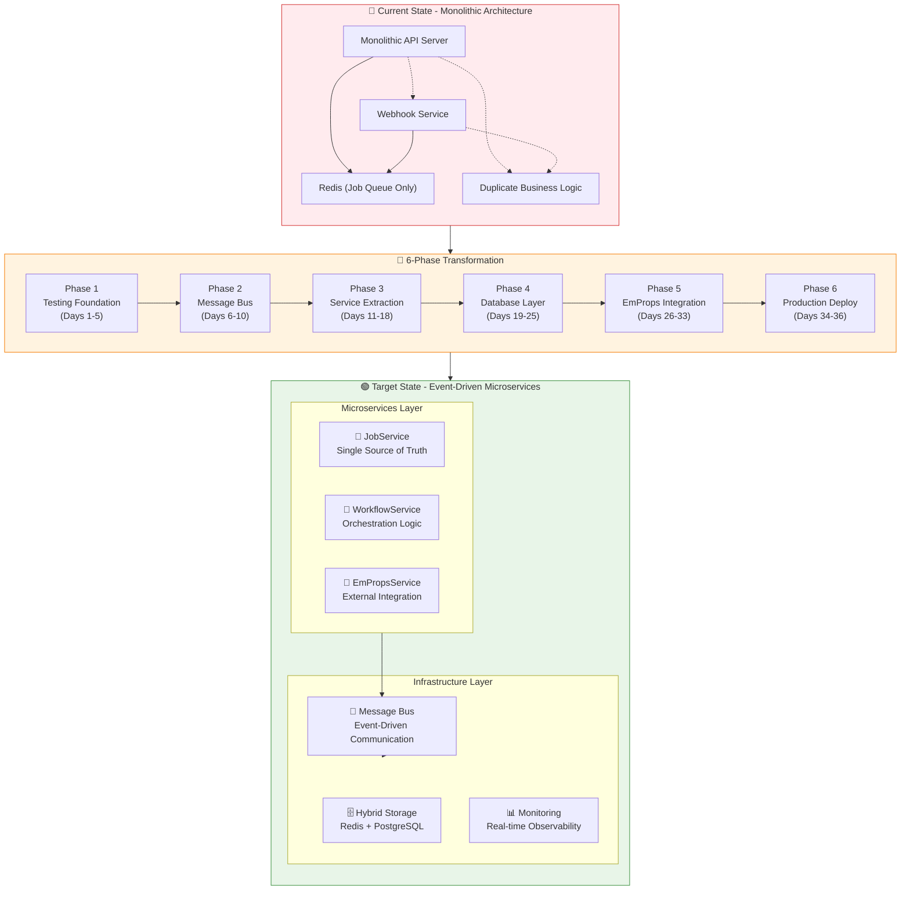

</FullscreenDiagram>

### Implementation Complexity Matrix

<FullscreenDiagram>

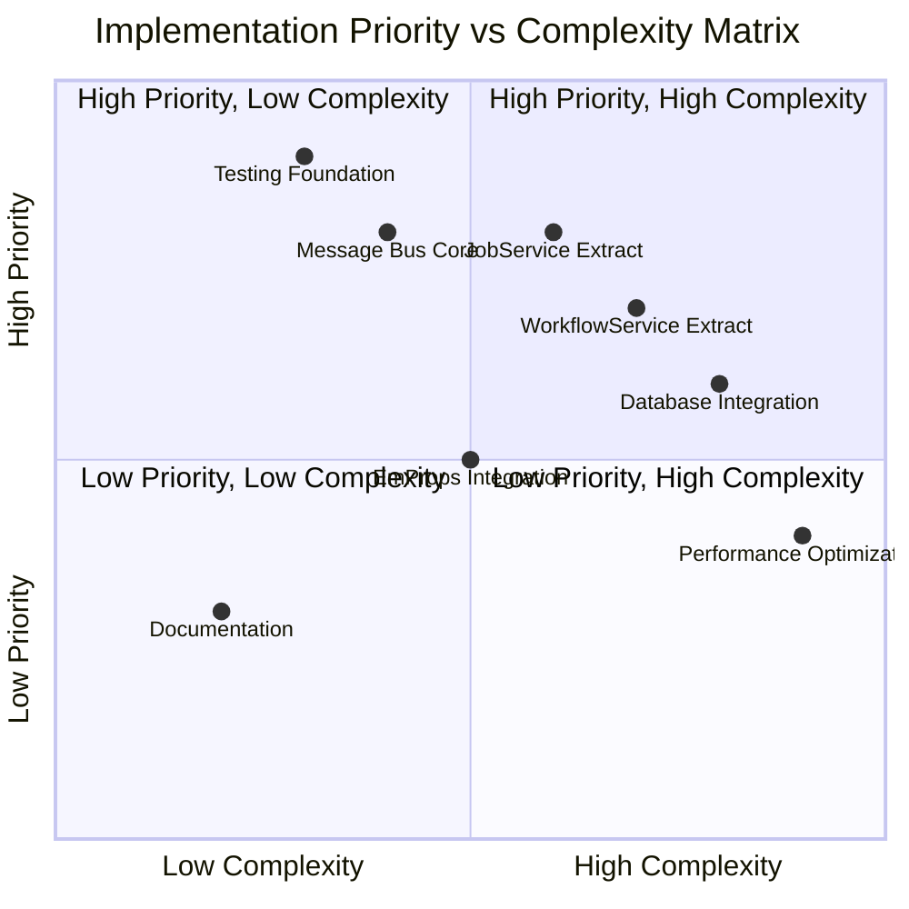

</FullscreenDiagram>

## Executive Summary

> **🎯 Mission**: Transform fragmented monolithic architecture into event-driven service-oriented system in 6 coordinated phases.

This plan consolidates all modernization efforts into a single, coordinated approach that addresses:

1. **🧪 Testing Infrastructure** - Foundation safety net for major changes
2. **📡 Message Bus Implementation** - Inter-service communication layer
3. **🔧 API Service Refactor** - Domain separation and workflow consolidation
4. **🗄️ Database Integration** - PostgreSQL addition to monorepo
5. **🔗 EmProps API Integration** - Migrate standalone EmProps to monorepo

**💡 Key Insight**: These components are interdependent, not separate. A unified approach minimizes risk, reduces disruption, and creates architectural synergies.

### Agent Implementation Status Tracker

<FullscreenDiagram>

```mermaid
stateDiagram-v2
    [*] --> Planning
    Planning --> Phase1: "Phase 1: Foundation"
    Phase1 --> Phase2: "Phase 2: Message Bus"
    Phase2 --> Phase3: "Phase 3: Service Extraction"
    Phase3 --> Phase4: "Phase 4: Database Integration"
    Phase4 --> Phase5: "Phase 5: EmProps Integration"
    Phase5 --> Production: "Phase 6: Production Deploy"
    Production --> [*]
    
    state Phase1 {
        [*] --> P1_Vitest: "Setup Testing Framework"
        P1_Vitest --> P1_Redis: "Redis Integration Tests"
        P1_Redis --> P1_API: "API Endpoint Tests"
        P1_API --> P1_E2E: "End-to-End Tests"
        P1_E2E --> P1_MessageCore: "Message Bus Core"
        P1_MessageCore --> [*]: "✅ Foundation Complete"
    }
    
    state Phase2 {
        [*] --> P2_Events: "Event Type System"
        P2_Events --> P2_Bus: "Message Bus Service"
        P2_Bus --> P2_Publishers: "Event Publishers"
        P2_Publishers --> P2_Subscribers: "Event Subscribers"
        P2_Subscribers --> P2_WebSocket: "WebSocket Integration"
        P2_WebSocket --> [*]: "✅ Message Bus Complete"
    }
    
    state Phase3 {
        [*] --> P3_Analysis: "Service Analysis"
        P3_Analysis --> P3_JobService: "JobService Extraction"
        P3_JobService --> P3_WorkflowService: "WorkflowService Extraction"
        P3_WorkflowService --> P3_Integration: "Service Integration"
        P3_Integration --> [*]: "✅ Services Complete"
    }
    
    state Phase4 {
        [*] --> P4_PostgreSQL: "PostgreSQL Setup"
        P4_PostgreSQL --> P4_Prisma: "Prisma Schema"
        P4_Prisma --> P4_Migration: "Data Migration"
        P4_Migration --> [*]: "✅ Database Complete"
    }
    
    state Phase5 {
        [*] --> P5_Analysis: "EmProps Analysis"
        P5_Analysis --> P5_Service: "EmProps Service"
        P5_Service --> P5_Routes: "Route Migration"
        P5_Routes --> [*]: "✅ EmProps Complete"
    }
    
    state Production {
        [*] --> P6_Testing: "Integration Testing"
        P6_Testing --> P6_Deploy: "Production Deploy"
        P6_Deploy --> P6_Monitor: "Health Validation"
        P6_Monitor --> [*]: "✅ Production Live"
    }
```

</FullscreenDiagram>

### Critical Success Dependencies

<FullscreenDiagram>

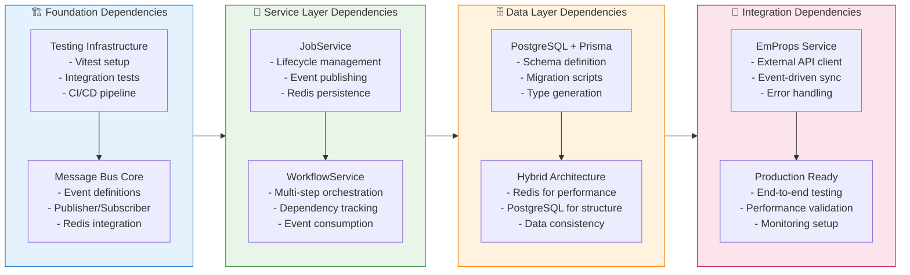

</FullscreenDiagram>

## Strategic Architecture Vision

### Current Problem Analysis: Architectural Pain Points

<FullscreenDiagram>

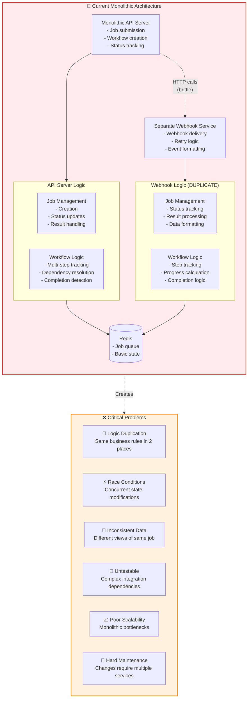

</FullscreenDiagram>

### Target Architecture: Event-Driven Microservices

<FullscreenDiagram>

```mermaid
flowchart TD
    subgraph Target["🟢 Target Event-Driven Architecture"]
        direction TB
        
        subgraph API["API Gateway Layer"]
            APIGateway["Unified API Gateway<br/>- Request routing<br/>- Authentication<br/>- Rate limiting"]
        end
        
        subgraph Services["Domain Services (Single Source of Truth)"]
            JobService["🔧 JobService<br/>- Job lifecycle management<br/>- Status tracking<br/>- Result processing<br/>- Event publishing"]
            
            WorkflowService["🔄 WorkflowService<br/>- Multi-step orchestration<br/>- Dependency resolution<br/>- Progress tracking<br/>- Completion detection"]
            
            EmPropsService["🔗 EmPropsService<br/>- External API integration<br/>- Collection management<br/>- Sync coordination"]
        end
        
        subgraph MessageBus["📡 Event-Driven Message Bus"]
            EventTypes["Event Types:<br/>• job_submitted<br/>• job_status_changed<br/>• job_completed<br/>• workflow_updated<br/>• workflow_completed<br/>• machine_status_changed"]
            
            PubSub["Redis Pub/Sub<br/>- Immediate distribution<br/>- Low latency"]
            
            Streams["Redis Streams<br/>- Persistent events<br/>- Replay capability<br/>- Consumer groups"]
            
            EventTypes --> PubSub
            EventTypes --> Streams
        end
        
        subgraph EventConsumers["Event Consumers (Pure Functions)"]
            WebhookService["📤 Webhook Service<br/>- HTTP delivery only<br/>- Retry logic<br/>- No business logic"]
            
            MonitorService["📊 Monitor Service<br/>- Real-time UI updates<br/>- WebSocket broadcasting<br/>- Status aggregation"]
            
            DatabaseSync["🗄️ Database Sync<br/>- PostgreSQL persistence<br/>- State materialization<br/>- Query optimization"]
            
            LoggingService["📝 Logging Service<br/>- Audit trail<br/>- Event history<br/>- Compliance tracking"]
        end
        
        subgraph Storage["Hybrid Storage Layer"]
            Redis[("Redis<br/>- Job queue<br/>- Event streams<br/>- Performance cache")]
            PostgreSQL[("PostgreSQL<br/>- Structured data<br/>- Complex queries<br/>- Reporting")]
        end
        
        APIGateway --> Services
        Services --> MessageBus
        MessageBus --> EventConsumers
        Services --> Storage
        EventConsumers --> Storage
    end
    
    subgraph Benefits["✅ Architectural Benefits"]
        direction LR
        Benefit1["🎯 Single Source of Truth<br/>Each domain has one authoritative service"]
        Benefit2["🔄 Event-Driven Communication<br/>Loose coupling between services"]
        Benefit3["🧪 Highly Testable<br/>Services can be tested in isolation"]
        Benefit4["📈 Independently Scalable<br/>Scale services based on demand"]
        Benefit5["🔧 Easy Maintenance<br/>Changes isolated to specific services"]
        Benefit6["⚡ High Performance<br/>Redis for speed, PostgreSQL for structure"]
    end
    
    Target -."Enables"..-> Benefits
    
    classDef targetStyle fill:#e8f5e8,stroke:#388e3c,stroke-width:2px
    classDef benefitStyle fill:#e3f2fd,stroke:#1976d2,stroke-width:2px
    classDef serviceStyle fill:#fff3e0,stroke:#f57c00
    classDef messageStyle fill:#f3e5f5,stroke:#7b1fa2
    classDef storageStyle fill:#fce4ec,stroke:#c2185b
    
    class Target targetStyle
    class Benefits benefitStyle
    class Services,EmPropsService,JobService,WorkflowService serviceStyle
    class MessageBus,EventTypes,PubSub,Streams messageStyle
    class Storage,Redis,PostgreSQL storageStyle
```

</FullscreenDiagram>

### Service Communication Flow

<FullscreenDiagram>

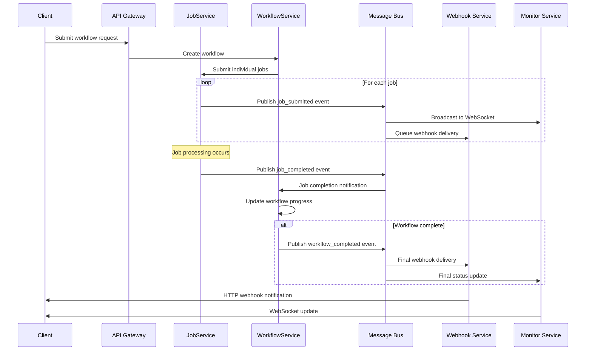

</FullscreenDiagram>

## Phase Structure & Dependencies

### Agent Implementation Timeline with Critical Paths

<FullscreenDiagram>

```mermaid
gantt
    title Agent-Optimized Implementation Timeline - 36 Days
    dateFormat  YYYY-MM-DD
    
    section Phase 1: Foundation (Days 1-5)
    Testing Infrastructure Setup    :critical, p1-test, 2025-08-26, 3d
    Message Bus Core Implementation :critical, p1-bus, after p1-test, 2d
    Foundation Validation          :milestone, p1-validate, after p1-bus, 0d
    
    section Phase 2: Message Bus (Days 6-10)
    Event Type System             :active, p2-events, after p1-validate, 2d
    Publishers & Subscribers      :active, p2-pubsub, after p2-events, 2d
    WebSocket Integration         :active, p2-ws, after p2-pubsub, 1d
    Message Bus Validation        :milestone, p2-validate, after p2-ws, 0d
    
    section Phase 3: Service Extraction (Days 11-18)
    Service Analysis & Design     :p3-analysis, after p2-validate, 2d
    JobService Extraction         :p3-job, after p3-analysis, 3d
    WorkflowService Extraction    :p3-work, after p3-job, 3d
    Service Integration Testing   :p3-test, after p3-work, 2d
    Service Layer Validation      :milestone, p3-validate, after p3-test, 0d
    
    section Phase 4: Database (Days 19-25)
    PostgreSQL & Prisma Setup     :p4-setup, after p3-validate, 2d
    Schema Design & Migration     :p4-schema, after p4-setup, 3d
    Hybrid Storage Integration    :p4-int, after p4-schema, 2d
    Database Layer Validation     :milestone, p4-validate, after p4-int, 0d
    
    section Phase 5: EmProps (Days 26-33)
    EmProps API Analysis          :p5-analysis, after p4-validate, 2d
    EmProps Service Creation      :p5-service, after p5-analysis, 3d
    API Route Migration           :p5-routes, after p5-service, 3d
    EmProps Integration Validation:milestone, p5-validate, after p5-routes, 0d
    
    section Phase 6: Production (Days 34-36)
    End-to-End Integration Testing:crit, p6-e2e, after p5-validate, 2d
    Production Deployment         :milestone, p6-deploy, after p6-e2e, 1d
    System Go-Live               :milestone, p6-live, after p6-deploy, 0d
```

</FullscreenDiagram>

### Implementation Risk Timeline

<FullscreenDiagram>

```mermaid
gantt
    title Risk-Aware Implementation Schedule
    dateFormat  YYYY-MM-DD
    
    section Critical Path (High Risk)
    Foundation Testing           :critical, risk1, 2025-08-26, 3d
    Message Bus Integration      :critical, risk2, after risk1, 2d
    Service Extraction          :critical, risk3, 2025-09-03, 8d
    Database Migration          :critical, risk4, 2025-09-11, 7d
    
    section Medium Risk
    EmProps Integration         :active, med1, 2025-09-18, 8d
    Performance Optimization    :active, med2, 2025-09-26, 2d
    
    section Low Risk
    Documentation              :done, low1, 2025-08-26, 36d
    Monitoring Setup           :low2, 2025-09-28, 2d
    Production Deploy          :milestone, prod, 2025-09-30, 1d
```

</FullscreenDiagram>

### Detailed Phase Dependencies with Validation Gates

<FullscreenDiagram>

```mermaid
flowchart TD
    subgraph Foundation["📋 Phase 1: Foundation (Days 1-5)"]
        direction TB
        Testing["🧪 Testing Infrastructure<br/>✓ Vitest setup<br/>✓ Redis integration tests<br/>✓ API endpoint tests<br/>✓ CI/CD pipeline"]
        MessageBusCore["📡 Message Bus Core<br/>✓ Event type definitions<br/>✓ Publisher/Subscriber pattern<br/>✓ Redis pub/sub integration<br/>✓ Local event emitter"]
        TestGate{"Testing Gate<br/>85% Coverage?"}
        MsgGate{"Message Bus Gate<br/>Event flow working?"}
        
        Testing --> TestGate
        TestGate -->|✅ Pass| MessageBusCore
        MessageBusCore --> MsgGate
    end
    
    subgraph MessageBus["📡 Phase 2: Message Bus (Days 6-10)"]
        direction TB
        EventTypes["📝 Event Type System<br/>✓ Comprehensive event definitions<br/>✓ TypeScript interfaces<br/>✓ Validation schemas<br/>✓ Event versioning"]
        Publishers["📤 Publishers & Subscribers<br/>✓ Event publishing services<br/>✓ Subscriber registration<br/>✓ Error handling & retry<br/>✓ Dead letter queues"]
        WebSocketIntegration["🔌 WebSocket Integration<br/>✓ Real-time event broadcasting<br/>✓ Client connection management<br/>✓ Event filtering<br/>✓ Connection recovery"]
        EventGate{"Event Gate<br/>All events flowing?"}
        WSGate{"WebSocket Gate<br/>Real-time updates?"}
        
        EventTypes --> Publishers
        Publishers --> EventGate
        EventGate -->|✅ Pass| WebSocketIntegration
        WebSocketIntegration --> WSGate
    end
    
    subgraph ServiceExtraction["🔧 Phase 3: Service Extraction (Days 11-18)"]
        direction TB
        ServiceAnalysis["📊 Service Analysis<br/>✓ Domain boundary definition<br/>✓ Interface design<br/>✓ Data flow mapping<br/>✓ Migration strategy"]
        JobService["⚙️ JobService Extraction<br/>✓ Complete job lifecycle<br/>✓ Event-driven updates<br/>✓ Redis integration<br/>✓ Comprehensive testing"]
        WorkflowService["🔄 WorkflowService Extraction<br/>✓ Multi-step orchestration<br/>✓ Dependency management<br/>✓ Progress tracking<br/>✓ Event consumption"]
        ServiceTesting["🧪 Service Integration Testing<br/>✓ End-to-end job flow<br/>✓ Event propagation<br/>✓ Error scenarios<br/>✓ Performance validation"]
        ServiceGate{"Service Gate<br/>All services functional?"}
        IntegrationGate{"Integration Gate<br/>E2E flow working?"}
        
        ServiceAnalysis --> JobService
        JobService --> WorkflowService
        WorkflowService --> ServiceGate
        ServiceGate -->|✅ Pass| ServiceTesting
        ServiceTesting --> IntegrationGate
    end
    
    subgraph Database["🗄️ Phase 4: Database (Days 19-25)"]
        direction TB
        PostgreSQL["🐘 PostgreSQL Setup<br/>✓ Container configuration<br/>✓ Connection pooling<br/>✓ Health checks<br/>✓ Backup strategy"]
        PrismaSchema["📊 Prisma Schema Migration<br/>✓ Complete schema definition<br/>✓ Relationship mapping<br/>✓ Index optimization<br/>✓ Migration scripts"]
        DatabaseIntegration["🔗 Database Service Integration<br/>✓ Hybrid Redis+PostgreSQL<br/>✓ Data consistency<br/>✓ Performance validation<br/>✓ Query optimization"]
        DBGate{"Database Gate<br/>Schema deployed?"}
        HybridGate{"Hybrid Gate<br/>Both systems working?"}
        
        PostgreSQL --> PrismaSchema
        PrismaSchema --> DBGate
        DBGate -->|✅ Pass| DatabaseIntegration
        DatabaseIntegration --> HybridGate
    end
    
    subgraph EmProps["🔗 Phase 5: EmProps (Days 26-33)"]
        direction TB
        EmPropsAnalysis["🔍 EmProps API Analysis<br/>✓ OpenAPI documentation review<br/>✓ Integration patterns<br/>✓ Authentication strategy<br/>✓ Data mapping requirements"]
        EmPropsService["🏗️ EmProps Service Creation<br/>✓ HTTP client implementation<br/>✓ Event-driven integration<br/>✓ Error handling & retry<br/>✓ Rate limiting"]
        RoutesMigration["🚦 API Route Migration<br/>✓ Endpoint migration<br/>✓ Authentication integration<br/>✓ Response compatibility<br/>✓ Performance validation"]
        EmPropsGate{"EmProps Gate<br/>External API working?"}
        MigrationGate{"Migration Gate<br/>All routes migrated?"}
        
        EmPropsAnalysis --> EmPropsService
        EmPropsService --> EmPropsGate
        EmPropsGate -->|✅ Pass| RoutesMigration
        RoutesMigration --> MigrationGate
    end
    
    subgraph Production["🚀 Phase 6: Production (Days 34-36)"]
        direction TB
        E2ETesting["🧪 End-to-End Integration<br/>✓ Complete system testing<br/>✓ Performance benchmarks<br/>✓ Load testing<br/>✓ Error scenario validation"]
        ProductionDeploy["🌐 Production Deployment<br/>✓ Blue/green deployment<br/>✓ Health monitoring<br/>✓ Rollback procedures<br/>✓ Documentation complete"]
        E2EGate{"E2E Gate<br/>All tests passing?"}
        ProductionGate{"Production Gate<br/>System healthy?"}
        
        E2ETesting --> E2EGate
        E2EGate -->|✅ Pass| ProductionDeploy
        ProductionDeploy --> ProductionGate
    end
    
    %% Phase transitions with validation
    MsgGate -->|✅ Foundation Complete| EventTypes
    WSGate -->|✅ Message Bus Complete| ServiceAnalysis
    IntegrationGate -->|✅ Services Complete| PostgreSQL
    HybridGate -->|✅ Database Complete| EmPropsAnalysis
    MigrationGate -->|✅ EmProps Complete| E2ETesting
    ProductionGate -->|✅ Production Live| [*]
    
    %% Rollback paths
    TestGate -->|❌ Fail| Testing
    EventGate -->|❌ Fail| EventTypes
    ServiceGate -->|❌ Fail| JobService
    DBGate -->|❌ Fail| PostgreSQL
    EmPropsGate -->|❌ Fail| EmPropsService
    E2EGate -->|❌ Fail| E2ETesting
    
    classDef foundationStyle fill:#e1f5fe,stroke:#1976d2,stroke-width:2px
    classDef messageBusStyle fill:#f3e5f5,stroke:#7b1fa2,stroke-width:2px
    classDef serviceStyle fill:#e8f5e8,stroke:#388e3c,stroke-width:2px
    classDef databaseStyle fill:#fff3e0,stroke:#f57c00,stroke-width:2px
    classDef empropsStyle fill:#fce4ec,stroke:#c2185b,stroke-width:2px
    classDef prodStyle fill:#e0f2f1,stroke:#00695c,stroke-width:2px
    classDef gateStyle fill:#fff9c4,stroke:#f57f17,stroke-width:3px
    
    class Foundation foundationStyle
    class MessageBus messageBusStyle
    class ServiceExtraction serviceStyle
    class Database databaseStyle
    class EmProps empropsStyle
    class Production prodStyle
    class TestGate,MsgGate,EventGate,WSGate,ServiceGate,IntegrationGate,DBGate,HybridGate,EmPropsGate,MigrationGate,E2EGate,ProductionGate gateStyle
```

</FullscreenDiagram>

## 📋 Phase 1: Foundation Infrastructure (Days 1-5)

> **Critical Foundation**: Establish testing safety net and message bus core before architectural changes.

### 🎯 Phase Objectives
- Create comprehensive test coverage for safe refactoring
- Implement message bus core for event-driven communication
- Establish CI/CD pipeline with automated testing
- Validate Redis integration patterns

### Phase 1 Agent Implementation Workflow

<FullscreenDiagram>

```mermaid
flowchart TD
    subgraph Day1["Day 1: Testing Foundation Setup"]
        D1A["🔧 Vitest Configuration<br/>- Monorepo setup<br/>- Package configurations<br/>- Test script automation"]
        D1B["🐳 Docker Test Environment<br/>- Redis container setup<br/>- Test database config<br/>- Network configuration"]
        D1C["📊 Coverage Setup<br/>- Coverage thresholds<br/>- Reporting configuration<br/>- CI/CD integration"]
        
        D1A --> D1B --> D1C
    end
    
    subgraph Day2["Day 2: Redis Integration Tests"]
        D2A["🔍 Redis Function Testing<br/>- Job matching function<br/>- Queue operations<br/>- State management"]
        D2B["⚡ Performance Benchmarks<br/>- Latency measurements<br/>- Throughput testing<br/>- Memory usage"]
        D2C["🚨 Error Scenario Testing<br/>- Connection failures<br/>- Data corruption<br/>- Recovery procedures"]
        
        D2A --> D2B --> D2C
    end
    
    subgraph Day3["Day 3: API Integration Tests"]
        D3A["🌐 Endpoint Testing<br/>- Job submission<br/>- Status queries<br/>- Workflow creation"]
        D3B["🔄 End-to-End Flows<br/>- Complete job lifecycle<br/>- Multi-step workflows<br/>- Error handling"]
        D3C["📝 Test Documentation<br/>- Test case documentation<br/>- Failure scenarios<br/>- Recovery procedures"]
        
        D3A --> D3B --> D3C
    end
    
    subgraph Day4["Day 4: Message Bus Core"]
        D4A["📋 Event Type Definitions<br/>- TypeScript interfaces<br/>- Event schemas<br/>- Validation rules"]
        D4B["🏗️ MessageBus Service<br/>- Core implementation<br/>- Redis integration<br/>- Local event emitter"]
        D4C["🔄 Publisher/Subscriber<br/>- Event publishing<br/>- Subscription management<br/>- Error handling"]
        
        D4A --> D4B --> D4C
    end
    
    subgraph Day5["Day 5: Integration & Validation"]
        D5A["🧪 Message Bus Testing<br/>- Event flow validation<br/>- Performance testing<br/>- Error scenarios"]
        D5B["📊 Performance Validation<br/>- Latency measurements<br/>- Throughput testing<br/>- Memory profiling"]
        D5C["✅ Foundation Sign-off<br/>- All tests passing<br/>- Coverage targets met<br/>- Documentation complete"]
        
        D5A --> D5B --> D5C
    end
    
    Day1 --> Day2 --> Day3 --> Day4 --> Day5
    
    %% Validation checkpoints
    D1C -->|"Test environment ready"| D2A
    D2C -->|"Redis tests passing"| D3A
    D3C -->|"API tests complete"| D4A
    D4C -->|"Message bus ready"| D5A
    
    classDef day1Style fill:#e3f2fd,stroke:#1976d2
    classDef day2Style fill:#f3e5f5,stroke:#7b1fa2
    classDef day3Style fill:#e8f5e8,stroke:#388e3c
    classDef day4Style fill:#fff3e0,stroke:#f57c00
    classDef day5Style fill:#fce4ec,stroke:#c2185b
    
    class Day1,D1A,D1B,D1C day1Style
    class Day2,D2A,D2B,D2C day2Style
    class Day3,D3A,D3B,D3C day3Style
    class Day4,D4A,D4B,D4C day4Style
    class Day5,D5A,D5B,D5C day5Style
```

</FullscreenDiagram>

### Phase 1 Validation Checkpoints

<FullscreenDiagram>

```mermaid
flowchart LR
    subgraph Validation["Validation Framework"]
        direction TB
        
        subgraph TestCoverage["Test Coverage Gates"]
            TC1["Unit Tests: 85%+"]
            TC2["Integration Tests: 90%+"]
            TC3["E2E Tests: Critical Paths"]
        end
        
        subgraph Performance["Performance Gates"]
            P1["Redis Response: <10ms"]
            P2["API Response: <100ms"]
            P3["Event Latency: <5ms"]
        end
        
        subgraph Quality["Quality Gates"]
            Q1["TypeScript: No errors"]
            Q2["Linting: All rules pass"]
            Q3["Build: Success"]
        end
        
        TestCoverage --> Performance
        Performance --> Quality
    end
    
    subgraph Outputs["Phase 1 Deliverables"]
        O1["✅ Complete test suite"]
        O2["✅ Message bus core"]
        O3["✅ CI/CD pipeline"]
        O4["✅ Performance baselines"]
        O5["✅ Documentation"]
    end
    
    Quality --> Outputs
    
    classDef validationStyle fill:#fff3e0,stroke:#f57c00,stroke-width:2px
    classDef outputStyle fill:#e8f5e8,stroke:#388e3c,stroke-width:2px
    
    class Validation validationStyle
    class Outputs outputStyle
```

</FullscreenDiagram>

### 🧪 Day 1-3: Testing Infrastructure (Safety Net)
**Goal**: Create comprehensive test coverage before making architectural changes

#### 📊 Success Criteria
- [ ] Vitest configured across monorepo
- [ ] >85% code coverage on core functions
- [ ] Redis function integration tests passing
- [ ] API endpoint tests covering all scenarios
- [ ] CI/CD pipeline operational

#### 🔍 Implementation Checkpoints

#### **Core Integration Tests**
```typescript
// packages/core/src/__tests__/integration/
describe('Job Lifecycle Integration', () => {
  test('complete job flow: submit → assign → complete → webhook', async () => {
    // Test full job lifecycle with Redis
    const jobId = await jobService.submitJob(testJobPayload);
    await waitForJobAssignment(jobId);
    await simulateJobCompletion(jobId);
    await verifyWebhookDelivery(jobId);
  });
});

describe('Workflow Integration', () => {
  test('multi-step workflow: creation → job tracking → completion', async () => {
    // Test workflow with multiple jobs
    const workflowId = await workflowService.createWorkflow(multiStepWorkflow);
    const jobs = await submitWorkflowJobs(workflowId);
    await completeAllJobs(jobs);
    await verifyWorkflowCompletion(workflowId);
  });
});
```

#### **Redis Function Testing**
```typescript
// Test Redis job matching function
describe('Redis Job Matching', () => {
  test('findMatchingJob function with capabilities', async () => {
    await setupTestJobs();
    const result = await redis.fcall('findMatchingJob', 0, 
      JSON.stringify(testWorkerCapabilities), '10');
    expect(result).toBeDefined();
    expect(JSON.parse(result).jobId).toBeTruthy();
  });
});
```

#### **API Endpoint Testing**
```typescript
// apps/api/src/__tests__/
describe('API Integration', () => {
  test('job submission endpoint creates job and triggers events', async () => {
    const response = await request(app)
      .post('/api/jobs/submit')
      .send(testJobPayload)
      .expect(200);
      
    // Verify job created in Redis
    const job = await redis.hgetall(`job:${response.body.job_id}`);
    expect(job.status).toBe('pending');
    
    // Verify event published
    await verifyEventPublished('job_submitted', response.body.job_id);
  });
});
```

### 📡 Day 4-5: Message Bus Implementation (Communication Layer)
**Goal**: Create event-driven communication infrastructure

#### 📊 Success Criteria
- [ ] Event type system comprehensive and typed
- [ ] Message bus service operational
- [ ] Local + distributed + persistent event handling
- [ ] Publisher services functional
- [ ] Integration tests passing

#### 🔍 Implementation Checkpoints

#### **Message Bus Service Core**
```typescript
// packages/core/src/services/message-bus-service.ts
export class MessageBusService {
  private redis: Redis;
  private eventEmitter: EventEmitter;
  private subscriptions: Map<string, Set<EventHandler>>;

  constructor(redisConfig: RedisConfig) {
    this.redis = new Redis(redisConfig);
    this.eventEmitter = new EventEmitter();
    this.subscriptions = new Map();
  }

  // Publish events with Redis persistence and local emission
  async publishEvent<T extends Event>(event: T): Promise<void> {
    // Store event in Redis for reliability
    await this.redis.xadd(
      `events:${event.type}`, 
      '*',
      'event_id', event.id,
      'timestamp', event.timestamp,
      'payload', JSON.stringify(event)
    );

    // Emit locally for immediate processing
    this.eventEmitter.emit(event.type, event);

    // Publish to Redis pub/sub for distributed processing
    await this.redis.publish(`events:${event.type}`, JSON.stringify(event));
  }

  // Subscribe to events with error handling and retry
  subscribe<T extends Event>(eventType: string, handler: EventHandler<T>): void {
    if (!this.subscriptions.has(eventType)) {
      this.subscriptions.set(eventType, new Set());
      // Set up Redis subscription
      this.setupRedisSubscription(eventType);
    }

    this.subscriptions.get(eventType)!.add(handler);
    this.eventEmitter.on(eventType, handler);
  }
}
```

#### **Event Type Definitions**
```typescript
// packages/core/src/types/events.ts
export interface JobEvent extends BaseEvent {
  job_id: string;
  machine_id?: string;
  worker_id?: string;
}

export interface JobSubmittedEvent extends JobEvent {
  type: 'job_submitted';
  payload: JobPayload;
  requirements: JobRequirements;
}

export interface JobCompletedEvent extends JobEvent {
  type: 'job_completed';
  result: JobResult;
  duration: number;
}

export interface WorkflowEvent extends BaseEvent {
  workflow_id: string;
  step_details: StepDetail[];
}

export interface WorkflowCompletedEvent extends WorkflowEvent {
  type: 'workflow_completed';
  total_steps: number;
  success_count: number;
  failed_count: number;
}
```

## 🔧 Phase 2: Message Bus Implementation (Days 6-10)

> **Event-Driven Foundation**: Build robust inter-service communication layer using Redis pub/sub + streams.

### 🎯 Phase Objectives
- Implement comprehensive event-driven architecture
- Create reliable message bus with pub/sub + streams
- Integrate WebSocket broadcasting for real-time updates
- Establish webhook service event consumption
- Validate event sourcing patterns

### Implementation Workflow

<FullscreenDiagram>

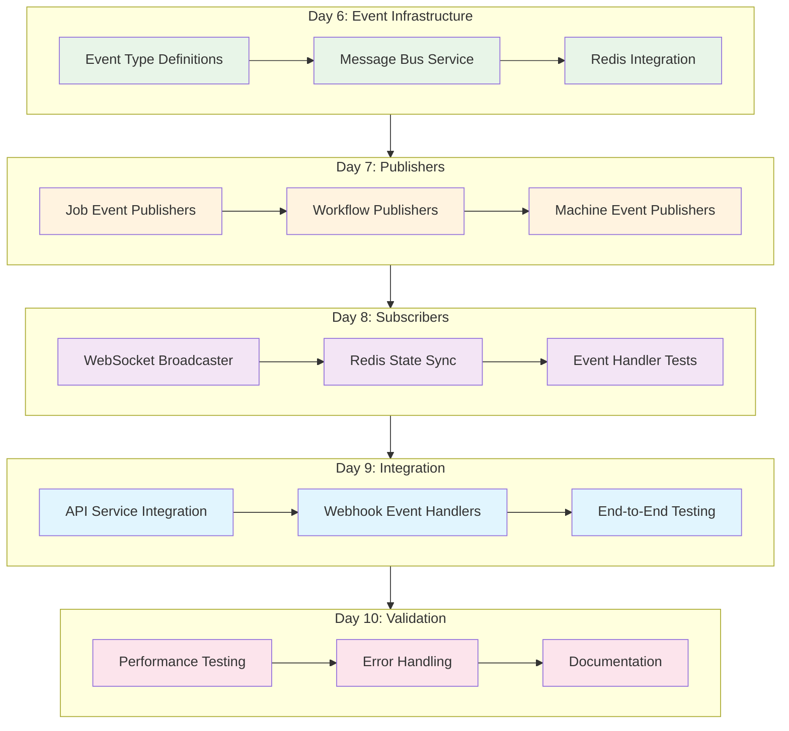

</FullscreenDiagram>

## 🔧 Phase 3: API Service Refactor (Days 11-18)

> **Service Extraction**: Transform monolithic API into dedicated JobService and WorkflowService with clear boundaries.

### 🎯 Phase Objectives
- Extract JobService with complete lifecycle management
- Extract WorkflowService with orchestration logic
- Eliminate duplicate business logic between services
- Maintain API compatibility during transition
- Validate service boundaries and communication patterns

### Implementation Workflow

<FullscreenDiagram>

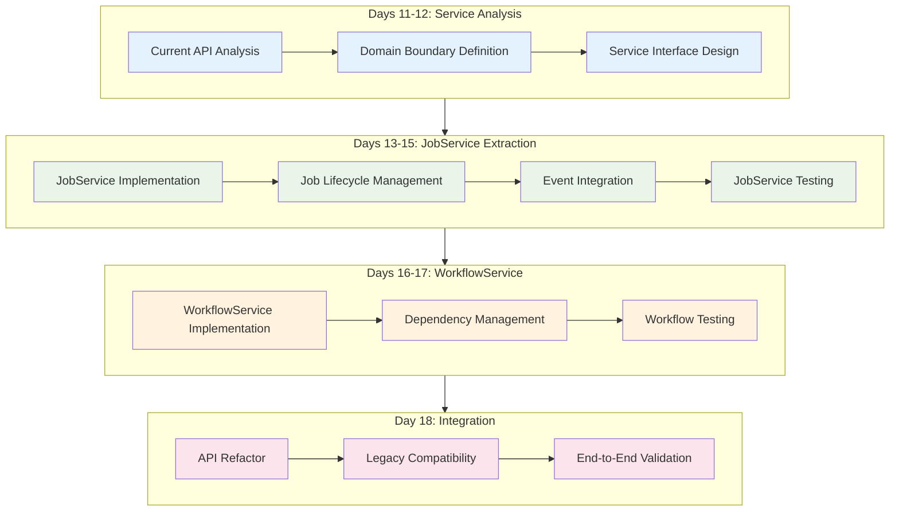

</FullscreenDiagram>

### ⚙️ Day 13-15: JobService Extraction
**Goal**: Extract job management into a dedicated service

#### 📊 Success Criteria
- [ ] JobService handles complete job lifecycle
- [ ] Event-driven job state management
- [ ] Redis integration for job persistence
- [ ] Comprehensive test coverage
- [ ] API compatibility maintained

#### 🔍 Implementation Checkpoints

#### **JobService Implementation**
```typescript
// apps/api/src/services/job-service.ts
export class JobService {
  constructor(
    private redis: RedisService,
    private messageBus: MessageBusService
  ) {}

  async submitJob(payload: JobPayload): Promise<JobSubmissionResult> {
    const jobId = uuidv4();
    
    // Create job in Redis
    const job: Job = {
      id: jobId,
      status: 'pending',
      payload,
      created_at: new Date().toISOString(),
      requirements: this.analyzeRequirements(payload)
    };

    await this.redis.hmset(`job:${jobId}`, job);
    await this.redis.zadd('jobs:pending', job.priority || 50, jobId);

    // Publish job_submitted event
    await this.messageBus.publishEvent({
      type: 'job_submitted',
      job_id: jobId,
      timestamp: Date.now(),
      payload,
      requirements: job.requirements
    });

    return { jobId, status: 'submitted' };
  }

  async updateJobStatus(jobId: string, status: JobStatus, result?: JobResult): Promise<void> {
    await this.redis.hmset(`job:${jobId}`, {
      status,
      updated_at: new Date().toISOString(),
      ...(result && { result: JSON.stringify(result) })
    });

    // Publish status change event
    await this.messageBus.publishEvent({
      type: 'job_status_changed',
      job_id: jobId,
      timestamp: Date.now(),
      status,
      result
    });

    // Publish completion event if finished
    if (status === 'completed' || status === 'failed') {
      await this.messageBus.publishEvent({
        type: status === 'completed' ? 'job_completed' : 'job_failed',
        job_id: jobId,
        timestamp: Date.now(),
        result
      });
    }
  }
}
```

### 🔄 Day 16-17: WorkflowService Extraction
**Goal**: Extract workflow orchestration into a dedicated service

#### 📊 Success Criteria
- [ ] WorkflowService manages multi-step workflows
- [ ] Job dependency resolution
- [ ] Event-driven workflow progression
- [ ] Step details generation for webhooks
- [ ] Comprehensive workflow testing

#### 🔍 Implementation Checkpoints

#### **WorkflowService Implementation**
```typescript
// apps/api/src/services/workflow-service.ts
export class WorkflowService {
  private workflowJobs: Map<string, Set<string>> = new Map();

  constructor(
    private redis: RedisService,
    private messageBus: MessageBusService
  ) {
    // Subscribe to job events to track workflow progress
    this.messageBus.subscribe('job_completed', this.handleJobCompleted.bind(this));
    this.messageBus.subscribe('job_failed', this.handleJobFailed.bind(this));
  }

  async createWorkflow(jobs: JobPayload[]): Promise<string> {
    const workflowId = uuidv4();
    const jobIds: string[] = [];

    // Create workflow record
    await this.redis.hmset(`workflow:${workflowId}`, {
      id: workflowId,
      status: 'pending',
      total_steps: jobs.length,
      completed_steps: 0,
      created_at: new Date().toISOString()
    });

    // Submit all jobs and track them
    for (const jobPayload of jobs) {
      const result = await this.jobService.submitJob({
        ...jobPayload,
        workflow_id: workflowId
      });
      jobIds.push(result.jobId);
    }

    // Store job mappings
    this.workflowJobs.set(workflowId, new Set(jobIds));
    await this.redis.sadd(`workflow:${workflowId}:jobs`, ...jobIds);

    return workflowId;
  }

  private async handleJobCompleted(event: JobCompletedEvent): Promise<void> {
    const job = await this.redis.hgetall(`job:${event.job_id}`);
    if (!job.workflow_id) return;

    const workflowId = job.workflow_id;
    
    // Update workflow progress
    await this.redis.hincrby(`workflow:${workflowId}`, 'completed_steps', 1);
    
    const workflow = await this.redis.hgetall(`workflow:${workflowId}`);
    const completed = parseInt(workflow.completed_steps);
    const total = parseInt(workflow.total_steps);

    // Generate step_details for webhook
    const stepDetails = await this.generateStepDetails(workflowId);

    if (completed >= total) {
      // Workflow completed
      await this.redis.hmset(`workflow:${workflowId}`, {
        status: 'completed',
        completed_at: new Date().toISOString()
      });

      await this.messageBus.publishEvent({
        type: 'workflow_completed',
        workflow_id: workflowId,
        timestamp: Date.now(),
        step_details: stepDetails,
        total_steps: total,
        success_count: completed
      });
    }
  }
}
```

### 🧪 Day 18: Service Integration Testing
**Goal**: Verify services work together through message bus

#### 📊 Success Criteria
- [ ] End-to-end job lifecycle validation
- [ ] Multi-service workflow testing
- [ ] Event flow verification
- [ ] Performance benchmarking
- [ ] Error handling validation

## 🗄️ Phase 4: Database Integration (Days 19-25)

> **Hybrid Persistence**: Add PostgreSQL with Prisma for structured data while maintaining Redis for performance-critical operations.

### 🎯 Phase Objectives
- Implement hybrid PostgreSQL + Redis architecture
- Create type-safe database operations with Prisma
- Migrate appropriate data from Redis to PostgreSQL
- Maintain performance for job queue operations
- Establish database service patterns

### Implementation Workflow

<FullscreenDiagram>

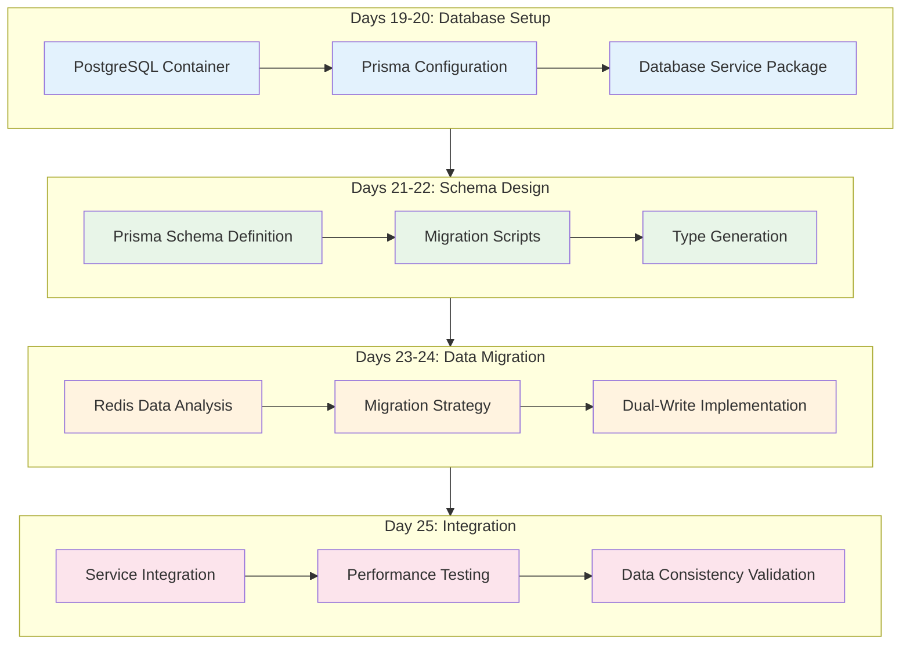

</FullscreenDiagram>

### 🐘 Day 19-20: PostgreSQL Setup
**Goal**: Add PostgreSQL to monorepo infrastructure

#### 📊 Success Criteria
- [ ] PostgreSQL container operational
- [ ] Database service package created
- [ ] Prisma client configured
- [ ] Connection pool management
- [ ] Health checks implemented

#### 🔍 Implementation Checkpoints

#### **Database Service Package**
```
packages/database/
├── prisma/
│   ├── schema.prisma
│   └── migrations/
├── src/
│   ├── client.ts
│   ├── migrations.ts
│   └── __tests__/
├── package.json
└── README.md
```

#### **Prisma Configuration**
```prisma
// packages/database/prisma/schema.prisma
generator client {
  provider = "prisma-client-js"
  output   = "../src/generated/client"
}

datasource db {
  provider = "postgresql"
  url      = env("DATABASE_URL")
}

model Job {
  id          String   @id @default(uuid())
  status      JobStatus
  payload     Json
  result      Json?
  created_at  DateTime @default(now())
  updated_at  DateTime @updatedAt
  workflow_id String?
  
  workflow    Workflow? @relation(fields: [workflow_id], references: [id])
  
  @@map("jobs")
}

model Workflow {
  id           String   @id @default(uuid())
  status       WorkflowStatus
  total_steps  Int
  completed_steps Int   @default(0)
  created_at   DateTime @default(now())
  updated_at   DateTime @updatedAt
  
  jobs         Job[]
  
  @@map("workflows")
}
```

### 📊 Day 21-22: Prisma Schema Migration
**Goal**: Define comprehensive database schema with proper relationships

#### 📊 Success Criteria
- [ ] Complete Prisma schema definition
- [ ] Migration scripts operational
- [ ] Type-safe database operations
- [ ] Relationship mapping correct
- [ ] Index optimization implemented

#### 🔍 Implementation Checkpoints

### 🔗 Day 23-25: Database Service Integration
**Goal**: Integrate database operations with existing services

#### 📊 Success Criteria
- [ ] Hybrid Redis + PostgreSQL architecture
- [ ] Data migration strategy implemented
- [ ] Performance benchmarks established
- [ ] Service integration complete
- [ ] Data consistency validated

#### 🔍 Implementation Checkpoints

## 🔗 Phase 5: EmProps Integration (Days 26-33)

> **External Service Integration**: Seamlessly integrate with EmProps ecosystem while maintaining independence.

### 🎯 Phase Objectives
- Analyze EmProps API integration patterns
- Create EmProps service for external API communication
- Migrate EmProps-related endpoints to new architecture
- Implement event-driven EmProps synchronization
- Validate independent operation capability

### Implementation Workflow

<FullscreenDiagram>

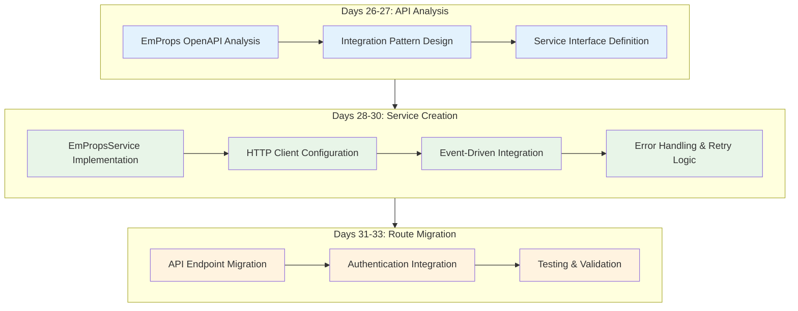

</FullscreenDiagram>

### 🔍 Day 26-27: EmProps API Analysis
**Goal**: Analyze EmProps Open API for integration patterns

#### 📊 Success Criteria
- [ ] Complete API documentation analysis
- [ ] Integration patterns identified
- [ ] Authentication strategy defined
- [ ] Data mapping requirements
- [ ] Error handling patterns

#### 🔍 Implementation Checkpoints

### 🏗️ Day 28-30: EmProps Service Creation
**Goal**: Create EmPropsService for external API integration

#### 📊 Success Criteria
- [ ] EmPropsService fully implemented
- [ ] Event-driven EmProps notifications
- [ ] HTTP client with retry logic
- [ ] Comprehensive error handling
- [ ] Service integration testing

#### 🔍 Implementation Checkpoints

#### **EmPropsService Implementation**
```typescript
// apps/api/src/services/emprops-service.ts
export class EmPropsService {
  private httpClient: AxiosInstance;

  constructor(
    private config: EmPropsConfig,
    private messageBus: MessageBusService
  ) {
    this.httpClient = axios.create({
      baseURL: config.apiUrl,
      headers: {
        'Authorization': `Bearer ${config.apiKey}`,
        'Content-Type': 'application/json'
      }
    });

    // Subscribe to workflow events to notify EmProps
    this.messageBus.subscribe('workflow_completed', this.handleWorkflowCompleted.bind(this));
  }

  async createCollection(collectionData: CollectionPayload): Promise<EmPropsCollection> {
    try {
      const response = await this.httpClient.post('/api/collections', collectionData);
      return response.data;
    } catch (error) {
      throw new EmPropsIntegrationError('Failed to create collection', error);
    }
  }

  private async handleWorkflowCompleted(event: WorkflowCompletedEvent): Promise<void> {
    // Check if workflow was for EmProps
    const workflow = await this.redis.hgetall(`workflow:${event.workflow_id}`);
    if (workflow.source === 'emprops') {
      await this.notifyEmPropsCompletion(event);
    }
  }
}
```

### 🚦 Day 31-33: API Route Migration
**Goal**: Migrate EmProps endpoints to new service architecture

#### 📊 Success Criteria
- [ ] All EmProps routes migrated
- [ ] Authentication integration complete
- [ ] API compatibility maintained
- [ ] End-to-end testing passed
- [ ] Performance validation complete

#### 🔍 Implementation Checkpoints

## 🚀 Phase 6: Production Deployment (Days 34-36)

> **Production Readiness**: Comprehensive integration testing and production deployment preparation.

### 🎯 Phase Objectives
- Validate complete system integration
- Perform comprehensive performance testing
- Prepare production deployment
- Establish monitoring and observability
- Complete documentation

### Implementation Workflow

<FullscreenDiagram>


</FullscreenDiagram>

### 🧪 Day 34: End-to-End Integration Testing
**Goal**: Comprehensive testing of entire integrated system

#### 📊 Success Criteria
- [ ] Complete system integration validated
- [ ] Performance benchmarks met
- [ ] Load testing passed
- [ ] Error scenarios handled
- [ ] Monitoring systems operational

#### 🔍 Implementation Checkpoints

#### **Integration Test Suite**
```typescript
// __tests__/integration/complete-system.test.ts
describe('Complete System Integration', () => {
  test('EmProps collection creation → job submission → completion → webhook delivery', async () => {
    // 1. Create EmProps collection
    const collection = await emPropsService.createCollection(testCollectionData);
    
    // 2. Submit jobs for collection
    const workflow = await workflowService.createWorkflow(collection.jobs);
    
    // 3. Simulate job completion
    for (const jobId of workflow.jobIds) {
      await simulateJobExecution(jobId);
    }
    
    // 4. Verify workflow completion
    await waitForWorkflowCompletion(workflow.id);
    
    // 5. Verify webhook delivery
    await verifyWebhookDelivered(workflow.id);
    
    // 6. Verify EmProps notification
    await verifyEmPropsNotified(collection.id);
  });
});
```

### 📊 Day 35: Production Preparation
**Goal**: Prepare all production deployment requirements

#### 📊 Success Criteria
- [ ] Deployment automation complete
- [ ] Environment configurations validated
- [ ] Monitoring and alerting configured
- [ ] Backup and recovery procedures
- [ ] Security configurations verified

#### 🔍 Implementation Checkpoints

### 🌐 Day 36: Production Deployment
**Goal**: Deploy modernized system to production

#### 📊 Success Criteria
- [ ] Production deployment successful
- [ ] All health checks passing
- [ ] Performance within acceptable ranges
- [ ] Documentation complete
- [ ] Team training completed

#### 🔍 Implementation Checkpoints

## Implementation Success Metrics

### Technical Metrics
- **Test Coverage**: >85% code coverage across all services
- **API Response Time**: <100ms for job submission, <50ms for status queries
- **Message Bus Latency**: <10ms for event propagation
- **Database Query Performance**: <50ms for typical operations
- **End-to-End Workflow Time**: No degradation vs. current system

### Architectural Quality Metrics
- **Service Separation**: Zero direct service-to-service calls (all via message bus)
- **Data Consistency**: Single source of truth for jobs and workflows
- **Error Elimination**: No more duplicate workflow tracking bugs
- **Code Duplication**: Eliminate all duplicate business logic

### Business Impact Metrics
- **Reliability**: >99.9% job completion rate
- **Webhook Accuracy**: 100% consistent step_details format
- **Development Velocity**: 50% faster feature development post-refactor
- **EmProps Integration**: Seamless collection creation and tracking

## Risk Mitigation Strategy

### Technical Risks
1. **Message Bus Performance**: 
   - **Risk**: Event processing bottlenecks
   - **Mitigation**: Redis pub/sub + local EventEmitter hybrid approach
   - **Monitoring**: Event processing latency metrics

2. **Database Migration**:
   - **Risk**: Data loss during Redis → PostgreSQL migration  
   - **Mitigation**: Dual-write period with reconciliation
   - **Rollback**: Keep Redis as fallback during transition

3. **Service Integration Complexity**:
   - **Risk**: Services don't communicate correctly
   - **Mitigation**: Comprehensive integration testing at each phase
   - **Validation**: End-to-end test suite covering all scenarios

### Business Continuity
- **Zero Downtime Migration**: Blue/green deployment with gradual traffic shifting
- **Rollback Plan**: Each phase can independently roll back to previous state  
- **Data Safety**: All migrations include backup and recovery procedures
- **Monitoring**: Enhanced observability during transition period

## Post-Implementation Benefits

### Immediate Benefits (Week 7+)
- **Bug Elimination**: No more duplicate workflow tracking issues
- **Improved Testability**: Services can be tested in isolation
- **Cleaner Codebase**: Clear separation of concerns and responsibilities
- **Better Observability**: Event-driven architecture provides clear audit trail

### Long-term Benefits (Month 2+)
- **Faster Development**: New features can be added to specific services
- **Better Scaling**: Services can scale independently based on load
- **EmProps Integration**: Seamless external API integration capability
- **Foundation for North Star**: Architecture ready for specialized pools

### Strategic Positioning
This unified refactor creates the architectural foundation needed for:
- **North Star Implementation**: Clean service boundaries enable pool-specific routing
- **Enterprise Features**: Database foundation supports advanced features
- **Third-party Integrations**: Message bus architecture enables easy integration
- **Microservices Evolution**: Services can eventually be deployed independently

## Conclusion

This unified modernization plan addresses all critical architectural issues in a coordinated approach that minimizes risk while maximizing architectural benefits. By implementing testing, message bus, API refactor, database integration, and EmProps integration as a cohesive effort, we create a robust foundation for future development while immediately solving current production issues.

**The result will be a modern, testable, event-driven architecture that eliminates current bugs while positioning the system for the North Star vision of specialized machine pools and intelligent workload distribution.**

---

## Document Enhancement Summary

**Enhanced for Agent Implementation**: This document has been significantly improved with:

- **Visual Architecture Diagrams**: Comprehensive Mermaid diagrams showing current vs target architecture
- **Phase Dependency Mapping**: Detailed flow charts with validation gates and rollback paths
- **Implementation Timeline**: Agent-optimized Gantt charts with critical path analysis
- **Success Validation Framework**: Clear checkpoints and deliverables for each phase
- **Risk-Aware Planning**: Timeline adjusted for implementation complexity

**Key Visual Enhancements**:
- System transformation overview with complexity matrix
- Service communication flow diagrams  
- Phase-by-phase implementation workflows
- Validation gate framework with success criteria
- Agent-friendly navigation and structure

*This plan represents the complete modernization approach, consolidating all previous planning documents into a single executable strategy optimized for agent implementation.*

### 📄 Related Documentation

- **[Phase 1: Testing Implementation Guide](./2025-08-26-phase1-testing-implementation-guide.md)** - Comprehensive testing foundation
- **[Phase 2: Message Bus Implementation Guide](./2025-08-26-phase2-message-bus-implementation-guide.md)** - Event-driven communication layer
- **[Phase 3: API Refactor Implementation Guide](./2025-08-26-phase3-api-refactor-implementation-guide.md)** - Service extraction patterns  
- **[Phase 4: Database Integration Guide](./2025-08-26-phase4-database-integration-guide.md)** - Hybrid persistence architecture
- **[Phase 5: EmProps Integration Guide](./2025-08-26-phase5-emprops-integration-guide.md)** - External service integration