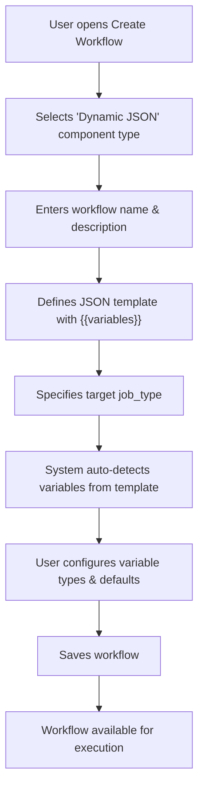
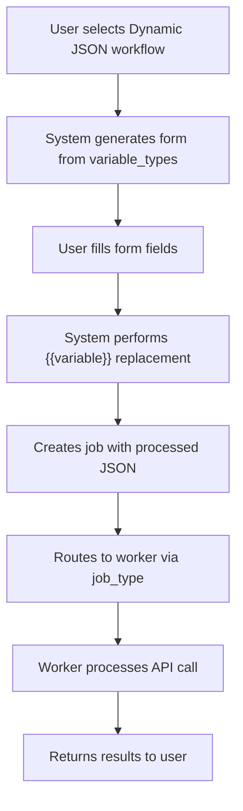
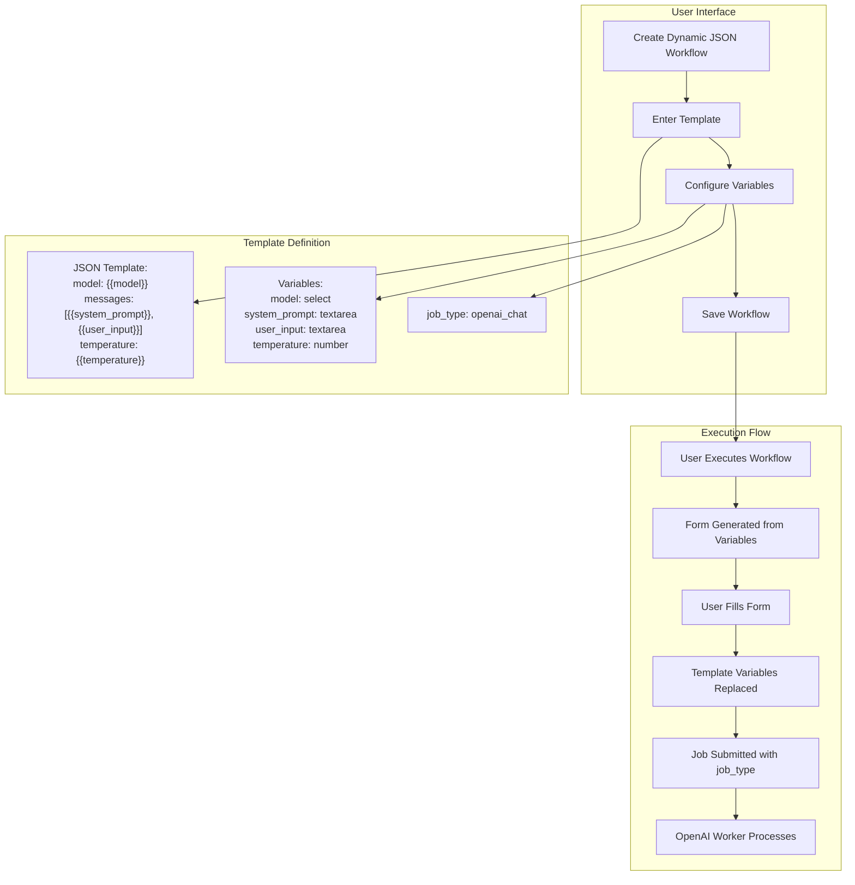

# Dynamic JSON Workflow Component Design

**Date**: September 3, 2025  
**Status**: Design Phase  
**Context**: EmProps Job Queue System - New Component Type for API Integration

## Context for Implementation

### Current System Overview
The EmProps Job Queue System is a distributed AI workload broker designed for elastic scaling across ephemeral machines (SALAD, vast.ai). The system consists of:

- **Redis-based job broker**: Atomic job matching and claiming via Redis Functions
- **Pull-based workers**: Workers request jobs they can handle based on capabilities
- **WebSocket monitoring**: Real-time job progress and machine status via apps/monitor
- **Component Library**: ECLI system for managing workflow definitions via packages/component-library
- **Current Architecture**: apps/api (lightweight orchestration), apps/worker (Redis-direct with connectors), apps/machines/basic_machine (PM2-managed containers)

### Key Existing Patterns
- **Job Routing**: `job_type` field routes to appropriate worker connectors (e.g., `openai_text` → OpenAITextConnector)
- **Worker Selection**: Redis function `findMatchingJob` handles capability-based routing
- **API Keys**: Per-user storage in api_key table + environment fallbacks, distributed across machines
- **Component Types**: `comfy_workflow` (ComfyUI graphs), `fetch_api` (direct API), `direct_job` (job queue), `basic` (credits only)

### Current Pain Points Being Solved
1. **ECLI Complexity**: Current workflows require managing form.json, inputs.json, workflow.json files
2. **ComfyUI Dependency**: API-only workflows forced into ComfyUI node graph format
3. **File Management**: Version control and sync issues with multiple config files
4. **Learning Curve**: Users must understand ComfyUI internals for simple API calls

### Integration Points
- **Database**: Existing `workflow` table with flexible JSONB `data` field (no schema changes needed)
- **Job Queue**: Existing Redis job submission via apps/worker/src/redis-direct-worker-client.ts
- **Connectors**: Pattern established in apps/worker/src/connectors/ (OpenAITextConnector, etc.)
- **UI**: EmProps frontend already handles dynamic form generation from workflow.data.form

### Implementation Context
This feature is being fast-tracked on master branch to avoid complexity from ongoing p2b_perm refactor. The design leverages existing infrastructure patterns while eliminating file management complexity for API-based workflows.

## Overview

The Dynamic JSON Workflow Component is a new component type designed to eliminate the complexity of file management for simple API-based workflows. Instead of requiring ECLI (EmpropsComfyLifeImage) files and complex node graphs, this component type allows users to define API workflows using JSON templates with variable substitution.

### What Problem Does This Solve?

Current workflow creation requires:
1. Creating ECLI files with ComfyUI node graphs
2. Managing complex dependencies and node relationships  
3. Understanding ComfyUI's internal structure
4. File uploads and version management

The Dynamic JSON Component simplifies this to:
1. Define a JSON template with `{{variable}}` placeholders
2. Specify the target `job_type` for worker routing
3. Let the system auto-generate form fields from template variables
4. Submit jobs directly without file management

## Architecture Comparison

### Current ComfyUI Component Type
- **File Dependency**: Requires ECLI file upload
- **Form Generation**: Static, pre-defined based on ECLI analysis
- **Job Routing**: Based on ComfyUI capabilities (`comfyui` job type)
- **Template Processing**: Complex node graph execution
- **Storage**: Files stored in database, managed lifecycles

### New Dynamic JSON Component Type
- **File Dependency**: None - pure JSON template
- **Form Generation**: Dynamic, auto-generated from `{{variables}}`
- **Job Routing**: User-specified `job_type` field
- **Template Processing**: Simple string replacement
- **Storage**: JSON template stored inline in workflow record

## Database Schema Changes

The existing `workflow` table requires minimal changes to support this new component type:

```sql
-- Existing schema supports this with no changes needed
-- component_type can be 'comfyui' or 'dynamic_json' 
-- template_data JSONB field stores the JSON template
-- Additional metadata in existing fields
```

### Template Data Structure

For `dynamic_json` component type, the `template_data` field contains:

```json
{
  "job_type": "openai_chat",
  "template": {
    "model": "{{model}}",
    "messages": [
      {
        "role": "system", 
        "content": "{{system_prompt}}"
      },
      {
        "role": "user",
        "content": "{{user_input}}"
      }
    ],
    "temperature": "{{temperature}}",
    "max_tokens": "{{max_tokens}}"
  },
  "variable_types": {
    "model": { "type": "select", "options": ["gpt-4", "gpt-3.5-turbo"], "default": "gpt-4" },
    "system_prompt": { "type": "textarea", "default": "You are a helpful assistant." },
    "user_input": { "type": "textarea", "required": true },
    "temperature": { "type": "number", "min": 0, "max": 2, "default": 0.7 },
    "max_tokens": { "type": "number", "min": 1, "max": 4000, "default": 1000 }
  }
}
```

## User Experience Flow

### 1. Workflow Creation


### 2. Workflow Execution


## Technical Implementation

### Frontend Changes

#### New Component Type Registration
```typescript
// Add to existing component type definitions
export const COMPONENT_TYPES = {
  COMFYUI: 'comfyui',
  DYNAMIC_JSON: 'dynamic_json'
} as const;
```

#### Dynamic Form Generation
```typescript
interface VariableDefinition {
  type: 'text' | 'textarea' | 'number' | 'select' | 'checkbox';
  required?: boolean;
  default?: any;
  min?: number;
  max?: number;
  options?: string[];
}

interface DynamicJsonTemplate {
  job_type: string;
  template: Record<string, any>;
  variable_types: Record<string, VariableDefinition>;
}

function generateFormFromTemplate(templateData: DynamicJsonTemplate) {
  // Extract variables from template using regex: /\{\{(\w+)\}\}/g
  // Cross-reference with variable_types for form field generation
  // Return React form components
}
```

#### Template Variable Extraction
```typescript
function extractVariablesFromTemplate(template: any): string[] {
  const variables = new Set<string>();
  const variableRegex = /\{\{(\w+)\}\}/g;
  
  const extractFromValue = (value: any) => {
    if (typeof value === 'string') {
      let match;
      while ((match = variableRegex.exec(value)) !== null) {
        variables.add(match[1]);
      }
    } else if (typeof value === 'object' && value !== null) {
      Object.values(value).forEach(extractFromValue);
    }
  };
  
  extractFromValue(template);
  return Array.from(variables);
}
```

### Backend Changes

#### Workflow Processing Service
```typescript
class DynamicJsonWorkflowProcessor {
  processWorkflow(workflow: Workflow, userInputs: Record<string, any>) {
    if (workflow.component_type !== 'dynamic_json') {
      throw new Error('Invalid component type for dynamic JSON processing');
    }
    
    const templateData = workflow.template_data as DynamicJsonTemplate;
    const processedTemplate = this.replaceVariables(templateData.template, userInputs);
    
    return {
      job_type: templateData.job_type,
      payload: processedTemplate
    };
  }
  
  private replaceVariables(template: any, variables: Record<string, any>): any {
    const templateStr = JSON.stringify(template);
    let processed = templateStr;
    
    Object.entries(variables).forEach(([key, value]) => {
      const placeholder = `{{${key}}}`;
      processed = processed.replace(new RegExp(placeholder, 'g'), JSON.stringify(value).slice(1, -1));
    });
    
    return JSON.parse(processed);
  }
}
```

#### Job Submission Integration
```typescript
// Modify existing job submission endpoint
app.post('/api/workflows/:id/execute', async (req, res) => {
  const workflow = await getWorkflow(req.params.id);
  
  if (workflow.component_type === 'dynamic_json') {
    const processor = new DynamicJsonWorkflowProcessor();
    const { job_type, payload } = processor.processWorkflow(workflow, req.body.inputs);
    
    const job = await submitJob({
      job_type,
      payload,
      user_id: req.user.id,
      workflow_id: workflow.id
    });
    
    res.json({ job_id: job.id });
  } else {
    // Existing ComfyUI processing logic
    handleComfyUIWorkflow(workflow, req.body);
  }
});
```

### Worker Routing Changes

No changes needed to the core worker routing system. The `job_type` field in the job payload will route to appropriate workers:

- `job_type: "openai_chat"` → Routes to OpenAI-capable workers
- `job_type: "claude_api"` → Routes to Anthropic-capable workers  
- `job_type: "custom_api"` → Routes to generic API workers
- `job_type: "comfyui"` → Routes to ComfyUI workers (existing)

The existing Redis function `findMatchingJob` already handles job type routing based on worker capabilities.

## Implementation Examples

### Example 1: OpenAI Chat Completion

<FullscreenDiagram>



</FullscreenDiagram>

```json
{
  "job_type": "openai_chat",
  "template": {
    "model": "{{model}}",
    "messages": [
      {
        "role": "system",
        "content": "{{system_prompt}}"
      },
      {
        "role": "user", 
        "content": "{{user_input}}"
      }
    ],
    "temperature": "{{temperature}}",
    "max_tokens": "{{max_tokens}}"
  },
  "variable_types": {
    "model": { 
      "type": "select", 
      "options": ["gpt-4o", "gpt-4o-mini", "gpt-3.5-turbo"],
      "default": "gpt-4o"
    },
    "system_prompt": { 
      "type": "textarea",
      "default": "You are a helpful assistant.",
      "required": true
    },
    "user_input": { 
      "type": "textarea", 
      "required": true 
    },
    "temperature": { 
      "type": "number", 
      "min": 0, 
      "max": 2, 
      "default": 0.7 
    },
    "max_tokens": { 
      "type": "number", 
      "min": 1, 
      "max": 4000, 
      "default": 1000 
    }
  }
}
```

### Example 2: Claude API Integration

```json
{
  "job_type": "claude_api",
  "template": {
    "model": "{{model}}",
    "max_tokens": "{{max_tokens}}",
    "messages": [
      {
        "role": "user",
        "content": "{{prompt}}"
      }
    ]
  },
  "variable_types": {
    "model": {
      "type": "select",
      "options": ["claude-3-5-sonnet-20241022", "claude-3-haiku-20240307"],
      "default": "claude-3-5-sonnet-20241022"
    },
    "prompt": {
      "type": "textarea",
      "required": true
    },
    "max_tokens": {
      "type": "number",
      "min": 1,
      "max": 8000,
      "default": 1000
    }
  }
}
```

### Example 3: Custom API Webhook

```json
{
  "job_type": "custom_webhook",
  "template": {
    "url": "{{webhook_url}}",
    "method": "POST",
    "headers": {
      "Authorization": "Bearer {{api_key}}",
      "Content-Type": "application/json"
    },
    "body": {
      "text": "{{input_text}}",
      "options": {
        "format": "{{output_format}}",
        "priority": "{{priority}}"
      }
    }
  },
  "variable_types": {
    "webhook_url": {
      "type": "text",
      "required": true
    },
    "api_key": {
      "type": "text",
      "required": true
    },
    "input_text": {
      "type": "textarea", 
      "required": true
    },
    "output_format": {
      "type": "select",
      "options": ["json", "xml", "csv"],
      "default": "json"
    },
    "priority": {
      "type": "select",
      "options": ["low", "medium", "high"],
      "default": "medium"
    }
  }
}
```

## Benefits of This Approach

### 1. **Simplified Workflow Creation**
- No file uploads or management required
- No understanding of ComfyUI node graphs needed
- Direct JSON template editing with familiar syntax

### 2. **Flexible Worker Routing** 
- Jobs route based on `job_type`, not component capabilities
- Can target any worker type: OpenAI, Claude, custom APIs, etc.
- Existing Redis routing infrastructure handles everything

### 3. **Auto-Generated Forms**
- Form fields automatically generated from template variables
- Type-safe input validation based on `variable_types`
- Rich form controls: selects, numbers, textareas, etc.

### 4. **Developer-Friendly**
- Template variables use familiar `{{mustache}}` syntax
- JSON structure is intuitive and readable
- Easy to version control and modify templates

### 5. **Minimal Infrastructure Changes**
- Uses existing workflow table structure
- Leverages existing job queue and worker routing
- No new microservices or databases required

### 6. **Type Safety and Validation**
- Variable type definitions provide frontend validation
- Backend validates against defined schemas
- Prevents runtime errors from invalid inputs

## Implementation Phases

### Phase 1: Core Infrastructure (Week 1)
- [ ] Add `dynamic_json` component type support
- [ ] Implement template variable extraction logic
- [ ] Create `DynamicJsonWorkflowProcessor` service
- [ ] Update job submission endpoint

### Phase 2: Frontend Integration (Week 2)
- [ ] Build dynamic form generation system
- [ ] Create component type selection UI
- [ ] Implement template editor with preview
- [ ] Add variable configuration interface

### Phase 3: Worker Integration (Week 3)
- [ ] Ensure OpenAI worker handles `openai_chat` job type
- [ ] Add Claude API worker for `claude_api` job type
- [ ] Create generic webhook worker for `custom_webhook` type
- [ ] Test end-to-end job routing

### Phase 4: Production Readiness (Week 4)
- [ ] Add comprehensive error handling
- [ ] Implement template validation
- [ ] Create migration scripts for existing workflows
- [ ] Write documentation and examples

## Technical Considerations

### Security
- **Input Sanitization**: All user inputs must be sanitized before template replacement
- **Template Validation**: Validate JSON template structure before saving
- **Variable Bounds**: Enforce min/max values for numeric inputs
- **API Key Security**: Handle sensitive variables (API keys) with proper encryption

### Performance
- **Template Caching**: Cache parsed templates to avoid repeated processing
- **Variable Extraction**: Optimize regex-based variable extraction for large templates
- **Form Generation**: Memoize form components based on template hash

### Error Handling
- **Template Errors**: Clear error messages for invalid JSON templates
- **Variable Mismatches**: Validate all required variables are provided
- **Worker Failures**: Proper job failure handling for API timeouts/errors

### Future Extensibility
- **Advanced Variable Types**: Support for file uploads, date pickers, etc.
- **Conditional Logic**: Simple if/else logic in templates
- **Template Libraries**: Shared template marketplace
- **Version Control**: Template versioning and rollback capabilities

## Success Metrics

- **Adoption Rate**: % of new workflows using `dynamic_json` vs `comfyui`
- **Creation Time**: Average time to create workflow (should be 10x faster)
- **Error Rate**: Runtime errors in dynamic JSON workflows vs ComfyUI
- **User Satisfaction**: Feedback scores for workflow creation experience

This design provides a clear path toward the North Star Architecture goal of specialized machine pools by enabling more flexible job routing while dramatically simplifying the workflow creation experience for API-based use cases.