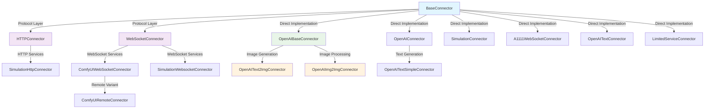
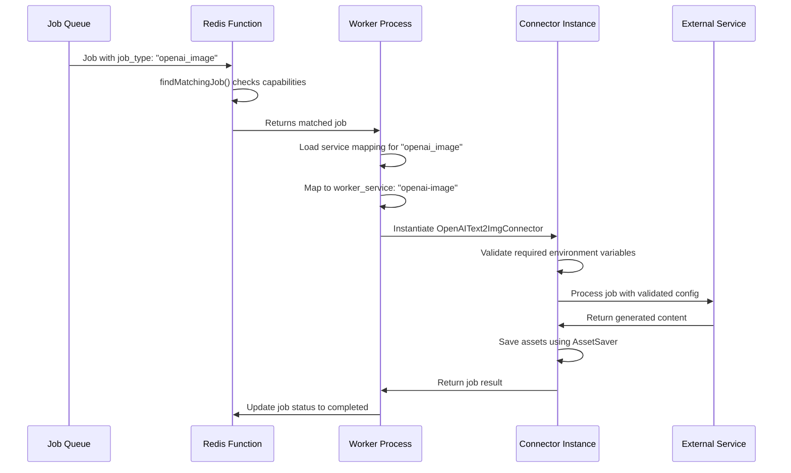

# 2025-09-04 - Connector Architecture & Inheritance Hierarchy

**Date**: September 4, 2025  
**Status**: Documentation  
**Context**: EMP Job Queue System - Complete Connector Architecture Reference

## Architecture Overview

The EMP Job Queue system uses a hierarchical connector architecture that provides specialized functionality for different types of services while maintaining consistent patterns for job processing, health checking, and asset management.

## Inheritance Hierarchy

<FullscreenDiagram>



</FullscreenDiagram>

## Core Architecture Layers

### 1. Base Layer - BaseConnector
**Location**: `apps/worker/src/connectors/base-connector.ts`

**Core Responsibilities**:
- Redis connection management
- Health checking infrastructure
- Job lifecycle management
- Status reporting to Redis
- Progress callback handling
- Error handling and retry logic

**Key Features**:
- Abstract `processJobImpl()` method for service-specific logic
- Standardized status reporting (`idle`, `active`, `error`, `offline`)
- Environment variable validation
- Connector configuration management

### 2. Protocol Layer

#### HTTPConnector
**Location**: `apps/worker/src/connectors/protocol/http-connector.ts`

**Inheritance**: `HTTPConnector extends BaseConnector`

**Specialized Features**:
- HTTP client management with retry logic
- Request/response handling
- Timeout management
- Error status code handling

**Used By**:
- `SimulationHttpConnector`

#### WebSocketConnector  
**Location**: `apps/worker/src/connectors/protocol/websocket-connector.ts`

**Inheritance**: `WebSocketConnector extends BaseConnector`

**Specialized Features**:
- WebSocket connection management
- Message queue handling
- Connection retry logic
- Ping/pong heartbeat

**Used By**:
- `ComfyUIWebSocketConnector`
- `SimulationWebsocketConnector`

### 3. Service-Specific Layer

#### OpenAI Family

##### OpenAIBaseConnector
**Location**: `apps/worker/src/connectors/openai-base-connector.ts`

**Inheritance**: `OpenAIBaseConnector extends BaseConnector`

**Core Features**:
- ✅ **AssetSaver Integration** - Cloud storage for generated content
- ✅ **Azure Blob Storage** - Primary cloud storage provider
- ✅ **CDN Integration** - Automatic CDN propagation waiting
- ✅ **Intelligent Logging** - Enhanced progress reporting
- ✅ **Job Resolution Polling** - Background job tracking
- OpenAI SDK client management
- Token usage tracking
- Rate limiting handling

**Asset Management Features**:
```typescript
// Cloud Storage Integration
private async saveAssetToCloud(
  base64Data: string,
  jobId: string, 
  jobData: any,
  assetType: 'image' | 'video' | 'audio' | 'text' = 'image',
  format: string = 'png'
): Promise<{ filePath: string; fileName: string; fileUrl: string; cdnUrl?: string }>

// Azure Blob Storage
private async uploadToAzure(
  buffer: Buffer,
  containerName: string, 
  blobName: string,
  contentType: string
): Promise<boolean>

// CDN Verification
private async waitForCDNAvailability(
  cdnUrl: string,
  maxAttempts: number = 30,
  intervalMs: number = 2000  
): Promise<boolean>
```

##### OpenAIText2ImgConnector
**Location**: `apps/worker/src/connectors/openai-text2img-connector.ts`

**Inheritance**: `OpenAIText2ImgConnector extends OpenAIBaseConnector`

**Features**:
- ✅ **AssetSaver Integration** - Inherits cloud storage capabilities
- ✅ **Background Polling** - Primary approach using `pollForJobResolution()`
- ✅ **Streaming Fallback** - Traditional streaming with partial images
- ✅ **Non-streaming Fallback** - Direct DALL-E API as final fallback
- Text-to-image generation
- Multiple output formats (PNG, WebP)
- Quality control (standard, high)

**Processing Approaches** (in priority order):
1. **Background Polling** - Uses OpenAI Responses API with job polling
2. **Traditional Streaming** - Receives partial images during generation
3. **Direct API Fallback** - Uses DALL-E API directly for final attempt

## Service Mapping System

### Configuration File Structure
**Location**: `apps/machine/src/config/service-mapping.json`

The service mapping system connects job types to worker services and manages connector configuration through a structured JSON file:

```mermaid
graph LR
    JOB[Job with job_type] --> |1. Route| WORKER[Worker Type]
    WORKER --> |2. Load| CONNECTOR[Connector Class]
    CONNECTOR --> |3. Configure| SERVICE[Service Instance]
    SERVICE --> |4. Validate| ENV[Environment Variables]
    ENV --> |5. Initialize| READY[Ready to Process]
    
    style JOB fill:#e3f2fd
    style WORKER fill:#f3e5f5
    style CONNECTOR fill:#e8f5e8
    style SERVICE fill:#fff3e0
    style ENV fill:#fce4ec
    style READY fill:#e0f2f1
```

<FullscreenDiagram>



</FullscreenDiagram>

### Service Mapping Structure

#### 1. Worker Configuration
```json
{
  "workers": {
    "openai": {
      "services": ["openai-text", "openai-image", "openai-img2img"],
      "is_gpu_bound": false,
      "required_env": ["OPENAI_API_KEY", "OPENAI_IMAGE_MODEL", "CLOUD_STORAGE_PROVIDER"],
      "job_service_required_map": [
        {
          "job_service_required": "openai_text",
          "worker_service": "openai-text"
        },
        {
          "job_service_required": "openai_image",
          "worker_service": "openai-image"
        },
        {
          "job_service_required": "openai_img2img",
          "worker_service": "openai-img2img"
        }
      ]
    }
  }
}
```

**Key Fields**:
- **`services`**: Array of service instances this worker can provide
- **`is_gpu_bound`**: Whether worker requires GPU resources
- **`required_env`**: Environment variables needed for worker startup
- **`job_service_required_map`**: Maps job types to specific service instances

#### 2. Connector Registry
```json
{
  "connectors": {
    "OpenAIText2ImgConnector": {
      "path": "./redis-direct-worker.js",
      "description": "OpenAI text-to-image generation API connector"
    },
    "OpenAIImg2ImgConnector": {
      "path": "./redis-direct-worker.js", 
      "description": "OpenAI image-to-image generation API connector"
    }
  }
}
```

**Purpose**: Maps connector class names to their implementation files for dynamic loading.

#### 3. Service Definitions
```json
{
  "services": {
    "openai-image": {
      "connector": "OpenAIText2ImgConnector",
      "type": "external",
      "installer": null,
      "installer_filename": null,
      "is_gpu_bound": false,
      "build_stage": "base",
      "required_env": ["OPENAI_API_KEY", "OPENAI_IMAGE_MODEL", "CLOUD_STORAGE_PROVIDER"],
      "description": "OpenAI image generation API connector",
      "api_config": {
        "base_url": "${OPENAI_BASE_URL:-https://api.openai.com/v1}",
        "timeout": "${OPENAI_TIMEOUT:-60}",
        "max_retries": "${OPENAI_MAX_RETRIES:-3}",
        "image_models": "${OPENAI_IMAGE_MODELS:-dall-e-3,dall-e-2}"
      },
      "telemetry_logs": [
        {
          "path": "/workspace/logs/openai-sdk-*.log",
          "name": "openai-sdk-main",
          "description": "OpenAI SDK comprehensive logs with API requests, responses, and errors"
        }
      ]
    }
  }
}
```

**Key Configuration Sections**:
- **`connector`**: Which connector class to instantiate
- **`type`**: `"internal"` (needs installation) or `"external"` (API service)
- **`required_env`**: Environment variables needed for this specific service
- **`api_config`**: Service-specific configuration with environment variable substitution
- **`telemetry_logs`**: Log file patterns for monitoring and debugging

## Environment Variable System

### Variable Substitution Pattern
The service mapping uses `${VAR_NAME:-default_value}` syntax for environment variable substitution:

```json
{
  "api_config": {
    "base_url": "${OPENAI_BASE_URL:-https://api.openai.com/v1}",
    "timeout": "${OPENAI_TIMEOUT:-60}",
    "max_retries": "${OPENAI_MAX_RETRIES:-3}"
  }
}
```

**Syntax**:
- `${VAR_NAME}`: Required variable (startup fails if missing)
- `${VAR_NAME:-default}`: Optional variable with default value

### Environment Variable Categories

#### 1. Service API Configuration
```bash
# OpenAI Services
OPENAI_API_KEY=sk-...
OPENAI_BASE_URL=https://api.openai.com/v1
OPENAI_IMAGE_MODEL=dall-e-3
OPENAI_TIMEOUT=60
OPENAI_MAX_RETRIES=3

# ComfyUI Services  
COMFYUI_BASE_PORT=8188
COMFYUI_INSTANCES_PER_GPU=1
```

#### 2. Cloud Storage Configuration
```bash
# Required for AssetSaver integration
CLOUD_STORAGE_PROVIDER=azure
CLOUD_STORAGE_CONTAINER=your-container-name
CLOUD_CDN_URL=your-cdn-domain.com

# Azure-specific
AZURE_STORAGE_ACCOUNT=your-account-name
AZURE_STORAGE_KEY=your-access-key
```

#### 3. Worker & Machine Configuration
```bash
# Machine capabilities
NUM_GPUS=2
COMFYUI_BRANCH=main
SIMULATION_TEST_MODE=true

# Worker behavior
OPENAI_MAX_CONCURRENT_JOBS=3
HTTP_TIMEOUT_SECONDS=30
```

### Environment Variable Validation

#### Connector-Level Validation
Each connector class implements `getRequiredEnvVars()`:

```typescript
export class OpenAIText2ImgConnector extends OpenAIBaseConnector {
  static getRequiredEnvVars(): Record<string, string> {
    return {
      ...super.getRequiredEnvVars(), // Inherit from parent
      ...OpenAIBaseConnector.getBaseOpenAIEnvVars(), // OpenAI common vars
      OPENAI_IMAGE_MODEL: '${OPENAI_IMAGE_MODEL:-dall-e-3}',
      OPENAI_IMAGE_SIZE: '${OPENAI_IMAGE_SIZE:-1024x1024}',
      CLOUD_STORAGE_PROVIDER: '${CLOUD_STORAGE_PROVIDER}', // Required
    };
  }
}
```

#### Service Mapping Validation  
The `required_env` arrays in service mapping are checked during worker startup:

```json
{
  "required_env": ["OPENAI_API_KEY", "CLOUD_STORAGE_PROVIDER"],
  "api_config": {
    "api_key": "${OPENAI_API_KEY}",
    "storage_provider": "${CLOUD_STORAGE_PROVIDER}"
  }
}
```

### Job Routing Flow

<FullscreenDiagram>



</FullscreenDiagram>

## Supporting Libraries & Services

### AssetSaver Service
**Location**: `apps/worker/src/connectors/asset-saver.ts`

**Core Functionality**:
- Multi-cloud storage abstraction
- Azure Blob Storage implementation
- CDN integration and verification
- Base64/Buffer handling
- Content-type detection

**Environment Variable Requirements**:
```bash
CLOUD_STORAGE_PROVIDER=azure          # Required: Storage provider
CLOUD_STORAGE_CONTAINER=your-bucket   # Required: Container/bucket name  
CLOUD_CDN_URL=cdn.domain.com         # Optional: CDN domain for faster access
AZURE_STORAGE_ACCOUNT=account-name    # Required for Azure
AZURE_STORAGE_KEY=access-key          # Required for Azure
```

**Usage Pattern**:
```typescript
import { AssetSaver } from './asset-saver.js';

// Save generated content to cloud storage
const result = await AssetSaver.saveAssetToCloud(
  base64Data,
  jobId, 
  jobData,
  'image/png'
);
// Returns: { filePath, fileName, fileUrl, cdnUrl }
```

## Best Practices for New Connectors

### 1. Environment Variable Design
```typescript
static getRequiredEnvVars(): Record<string, string> {
  return {
    // Required variables (no default)
    API_KEY: '${SERVICE_API_KEY}',
    
    // Optional with defaults
    BASE_URL: '${SERVICE_BASE_URL:-https://api.service.com}',
    TIMEOUT: '${SERVICE_TIMEOUT:-30}',
    
    // Inherit from parent classes
    ...super.getRequiredEnvVars(),
    
    // Include cloud storage if using AssetSaver
    CLOUD_STORAGE_PROVIDER: '${CLOUD_STORAGE_PROVIDER}',
    CLOUD_STORAGE_CONTAINER: '${CLOUD_STORAGE_CONTAINER}'
  };
}
```

### 2. Service Mapping Registration
Add to `service-mapping.json`:
```json
{
  "workers": {
    "your-service": {
      "services": ["your-service"],
      "required_env": ["SERVICE_API_KEY", "CLOUD_STORAGE_PROVIDER"],
      "job_service_required_map": [{
        "job_service_required": "your_job_type", 
        "worker_service": "your-service"
      }]
    }
  },
  "connectors": {
    "YourServiceConnector": {
      "path": "./redis-direct-worker.js",
      "description": "Your service connector description"
    }
  },
  "services": {
    "your-service": {
      "connector": "YourServiceConnector",
      "type": "external",
      "required_env": ["SERVICE_API_KEY"],
      "api_config": {
        "base_url": "${SERVICE_BASE_URL:-https://default-api.com}",
        "timeout": "${SERVICE_TIMEOUT:-30}",
        "api_key": "${SERVICE_API_KEY}"
      }
    }
  }
}
```

### 3. Asset Management Integration
For connectors that generate files:
```typescript
import { AssetSaver } from './asset-saver.js';

async processJobImpl(jobData: JobData): Promise<JobResult> {
  // Generate content
  const generatedContent = await this.generateContent(jobData);
  
  // Save to cloud storage (if enabled)
  if (jobData.payload.save_assets !== false) {
    const savedAsset = await AssetSaver.saveAssetToCloud(
      base64Data,
      jobData.id,
      jobData,
      'image/png' // MIME type
    );
    
    // Don't return URLs directly - they're saved automatically
    // Client can construct URLs from job metadata if needed
  }
  
  return {
    success: true,
    data: {
      // Metadata only, not file URLs
      format: 'png',
      size: '1024x1024'
    }
  };
}
```

## OpenAI Responses Connector (IMPLEMENTED)

The `openai_responses` connector for dynamic_json payloads has been implemented following the HTTPConnector pattern:

**Location**: `apps/worker/src/connectors/openai-responses-connector.ts`

**Inheritance**: `OpenAIResponsesConnector extends HTTPConnector`

### Features Implemented

✅ **Direct HTTP API Integration** - No OpenAI SDK, uses pure HTTP calls
✅ **Dynamic JSON Payload Support** - Accepts any JSON structure from dynamic_json
✅ **Background Job Polling** - Submits to `/responses` and polls for completion
✅ **AssetSaver Integration** - Saves response text to Azure cloud storage
✅ **Configurable API Keys** - Each machine can have different OPENAI_API_KEY

### API Integration Pattern
```bash
# Submit Job
curl https://api.openai.com/v1/responses \
  -H "Content-Type: application/json" \
  -H "Authorization: Bearer $OPENAI_API_KEY" \
  -d '{"model": "gpt-4.1", "input": [...]}'

# Poll for Completion  
curl https://api.openai.com/v1/responses/resp_123 \
  -H "Authorization: Bearer $OPENAI_API_KEY"
```

### Implementation Architecture
```typescript
export class OpenAIResponsesConnector extends HTTPConnector {
  static getRequiredEnvVars(): Record<string, string> {
    return {
      OPENAI_API_KEY: '${OPENAI_API_KEY}',
      OPENAI_BASE_URL: '${OPENAI_BASE_URL:-https://api.openai.com/v1}',
      CLOUD_STORAGE_PROVIDER: '${CLOUD_STORAGE_PROVIDER}',
      CLOUD_STORAGE_CONTAINER: '${CLOUD_STORAGE_CONTAINER}'
    };
  }
  
  // Core functionality:
  // 1. HTTP request to /responses endpoint
  // 2. Extract response_id from submission  
  // 3. Poll /responses/{id} every 5 seconds (max 60 attempts)
  // 4. Extract text content from response.output[].content[]
  // 5. Save to cloud storage using AssetSaver
  // 6. Return job metadata (no direct file URLs)
}
```

### Service Mapping Configuration
```json
{
  "workers": {
    "openai": {
      "services": ["openai-text", "openai-image", "openai-img2img", "openai-responses"],
      "job_service_required_map": [
        {
          "job_service_required": "openai_responses",
          "worker_service": "openai-responses"  
        }
      ]
    }
  },
  "connectors": {
    "OpenAIResponsesConnector": {
      "path": "./redis-direct-worker.js",
      "description": "OpenAI Responses API connector for dynamic JSON payloads"
    }
  },
  "services": {
    "openai-responses": {
      "connector": "OpenAIResponsesConnector",
      "type": "external",
      "required_env": ["OPENAI_API_KEY", "CLOUD_STORAGE_PROVIDER"],
      "api_config": {
        "base_url": "${OPENAI_BASE_URL:-https://api.openai.com/v1}",
        "timeout": "${OPENAI_TIMEOUT_SECONDS:-60}",
        "max_concurrent_jobs": "${OPENAI_RESPONSES_MAX_CONCURRENT_JOBS:-5}"
      }
    }
  }
}
```

### Usage Example
**Job Submission**:
```json
{
  "job_type": "openai_responses",
  "payload": {
    "model": "gpt-4.1",
    "input": [
      {
        "role": "user",
        "content": [
          {"type": "input_text", "text": "what is in this image?"},
          {"type": "input_image", "image_url": "https://example.com/image.jpg"}
        ]
      }
    ]
  }
}
```

**Processing Flow**:
1. **Job Submission** → POST to `https://api.openai.com/v1/responses`
2. **Response Extraction** → Get `response_id` from API response
3. **Polling Loop** → GET `/responses/{id}` every 5s until `status: "completed"`
4. **Content Processing** → Extract `output[].content[].text` fields
5. **Cloud Storage** → Save response text to Azure using AssetSaver
6. **Job Completion** → Return metadata without direct file URLs

### Environment Variables
```bash
# Required
OPENAI_API_KEY=sk-...                    # Per-machine API key configuration
CLOUD_STORAGE_PROVIDER=azure            # For AssetSaver integration

# Optional  
OPENAI_BASE_URL=https://api.openai.com/v1
OPENAI_TIMEOUT_SECONDS=60
OPENAI_RESPONSES_MAX_CONCURRENT_JOBS=5
CLOUD_STORAGE_CONTAINER=your-container
```

### Integration with Dynamic JSON
The connector seamlessly handles dynamic_json payloads by:
- Accepting `payload.dynamic_json` or direct payload structure
- Adding default `model: "gpt-4.1"` if not specified
- Passing JSON structure directly to OpenAI Responses API
- Supporting any OpenAI-compatible request format

This enables dynamic JSON workflow components to route to OpenAI services with full flexibility while maintaining the specialized machine pool architecture.

This architecture provides clear separation of concerns while maintaining consistency across all connector types, with environment variables properly validated and service mappings providing flexible job routing.