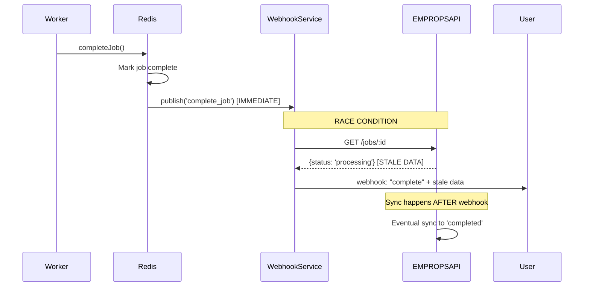
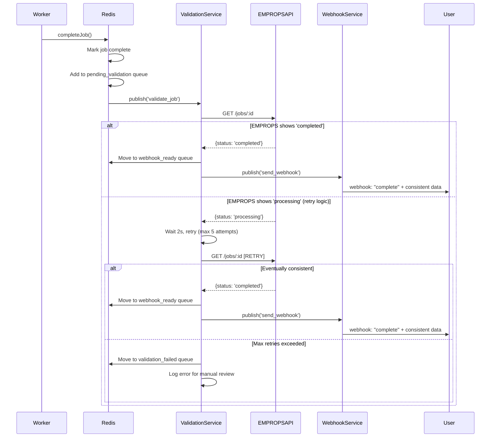

# Job Completion Validation System Analysis

**Date**: September 10, 2025  
**Issue**: Webhook race condition causing inconsistent job status data  
**Context**: Production webhook sent "workflow complete" with `status: 'processing'` and `completed_at: null`

## Problem Overview

A user received a webhook notification claiming a workflow was complete, but the job data contained:
- `status: 'processing'`
- `completed_at: null` 
- `progress: 30`

This inconsistency indicates a race condition between job completion in Redis and EMPROPS API synchronization.

## Root Cause Analysis

### Investigation Results
- **Job ID**: `933add51-b79b-4f50-b204-11aa548fe5cd` (workflow_id)
- **Redis Job**: `job-test-ee01b97a-1790-4d13-a279-f01c5aa2b128`
- **Actual Status**: Job completed successfully in Redis at `2025-09-10T14:30:16.898Z`
- **Issue**: EMPROPS API had stale `processing` status when webhook was triggered

### Timeline Reconstruction
1. **14:30:16** - Job completes in Redis, triggers immediate webhook
2. **14:30:16** - Webhook service queries EMPROPS API for job data
3. **14:30:16** - EMPROPS API returns stale `processing` status (sync lag)
4. **14:30:16** - Webhook sent with inconsistent data

## Current System Flow (Broken)

<FullscreenDiagram>



</FullscreenDiagram>

## Proposed Solution: Job Validation System

### New System Flow (Fixed)

<FullscreenDiagram>



</FullscreenDiagram>

## Implementation Details

### New Redis Queues
```typescript
// New queues for job validation process
const REDIS_QUEUES = {
  pending_validation: 'jobs:pending_validation',  // Jobs awaiting validation
  webhook_ready: 'jobs:webhook_ready',            // Jobs ready for webhook
  validation_failed: 'jobs:validation_failed'     // Jobs with validation issues
}
```

### Validation Service Logic
```typescript
class JobValidationService {
  async validateJobCompletion(jobId: string): Promise<void> {
    const maxRetries = 5;
    const retryDelay = 2000; // 2 seconds
    
    for (let attempt = 1; attempt <= maxRetries; attempt++) {
      try {
        const empropsJob = await empropsApi.getJob(jobId);
        
        if (empropsJob.status === 'completed' && empropsJob.completed_at) {
          // Success: EMPROPS is synchronized
          await redis.moveJobToWebhookReady(jobId);
          await redis.publish('send_webhook', { jobId });
          return;
        }
        
        if (attempt === maxRetries) {
          // Failed: Move to failed queue for manual review
          await redis.moveJobToValidationFailed(jobId, {
            reason: 'EMPROPS_SYNC_TIMEOUT',
            lastStatus: empropsJob.status,
            attempts: maxRetries
          });
          logger.error(`Job ${jobId} validation failed after ${maxRetries} attempts`);
          return;
        }
        
        // Retry: Wait and try again
        logger.warn(`Job ${jobId} validation attempt ${attempt}/${maxRetries}: EMPROPS status '${empropsJob.status}', retrying...`);
        await new Promise(resolve => setTimeout(resolve, retryDelay));
        
      } catch (error) {
        logger.error(`Job ${jobId} validation attempt ${attempt} error:`, error);
        if (attempt === maxRetries) {
          await redis.moveJobToValidationFailed(jobId, {
            reason: 'EMPROPS_API_ERROR',
            error: error.message,
            attempts: maxRetries
          });
        }
      }
    }
  }
}
```

### Modified Completion Flow
```typescript
// packages/core/src/redis-service.ts - completeJob method
async completeJob(jobId: string, result: any): Promise<void> {
  // Mark job complete in Redis
  await this.redis.hset(`job:${jobId}`, {
    status: 'completed',
    completed_at: new Date().toISOString(),
    result: JSON.stringify(result)
  });
  
  // OLD: Immediate webhook (causes race condition)
  // await this.publishMessage('complete_job', { jobId });
  
  // NEW: Add to validation queue
  await this.redis.lpush('jobs:pending_validation', jobId);
  await this.publishMessage('validate_job', { jobId });
}
```

## Benefits of New System

### 1. **Eliminates Race Conditions**
- Validation step ensures EMPROPS API is synchronized before webhooks
- Consistent data in all webhook notifications

### 2. **Retry Logic for Resilience**
- Handles temporary EMPROPS API lag gracefully
- Configurable retry attempts and delays

### 3. **Failure Handling**
- Failed validations moved to dedicated queue for manual review
- Detailed logging for debugging synchronization issues

### 4. **Monitoring and Observability**
- Clear separation between job completion and webhook readiness
- Metrics on validation success/failure rates
- Queue depth monitoring for each stage

## Migration Strategy

### Phase 1: Add Validation Service
1. Create `JobValidationService` class
2. Add new Redis queues
3. Implement validation logic with retry mechanism

### Phase 2: Modify Completion Flow
1. Update `completeJob()` to use validation queue
2. Add validation event handlers
3. Test with shadow mode (parallel validation without affecting current flow)

### Phase 3: Switch to New Flow
1. Enable new validation-first completion flow
2. Monitor validation success rates
3. Adjust retry parameters based on production data

### Phase 4: Cleanup
1. Remove old direct webhook triggers
2. Add alerting for validation_failed queue
3. Document operational procedures for failed validations

## Monitoring Requirements

### Key Metrics
- **Validation Success Rate**: % of jobs passing validation on first attempt
- **Validation Retry Rate**: Average retries needed per job
- **Validation Failure Rate**: % of jobs requiring manual intervention
- **Webhook Delivery Latency**: Time from job completion to webhook delivery

### Alerting
- Alert when `validation_failed` queue exceeds threshold
- Alert when validation success rate drops below 95%
- Alert when average validation time exceeds 30 seconds

## Related Files

### Core Implementation
- `packages/core/src/redis-service.ts:281-350` - `completeJob` method
- `packages/core/src/enhanced-message-handler.ts:270-297` - `handleJobComplete` method

### Webhook Processing  
- `apps/webhook-service/src/webhook-processor.ts:482-585` - `checkWorkflowCompletion`
- `packages/core/src/services/webhook-notification-service.ts:696-705` - Fallback logic fix

### Configuration
- Environment variables for retry counts and delays
- Redis queue configuration and monitoring

This validation system ensures webhook data consistency by introducing a validation phase that confirms EMPROPS API synchronization before triggering user notifications.