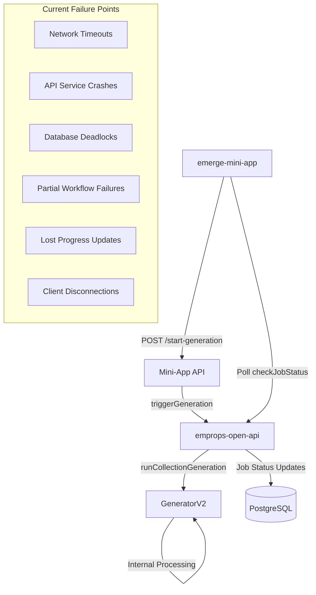
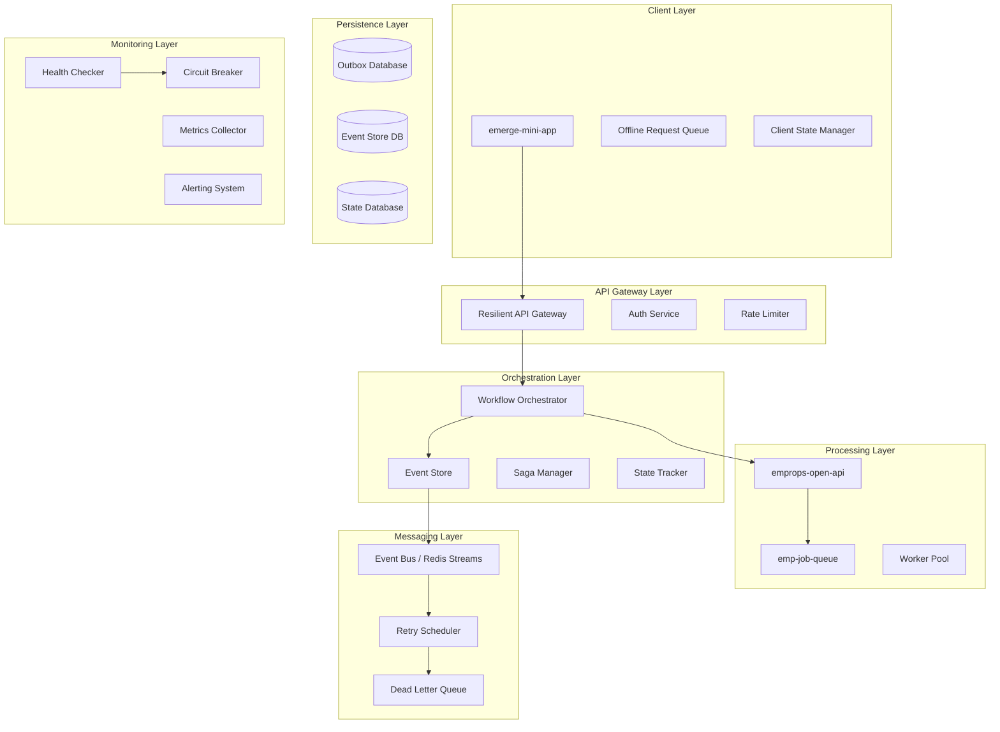
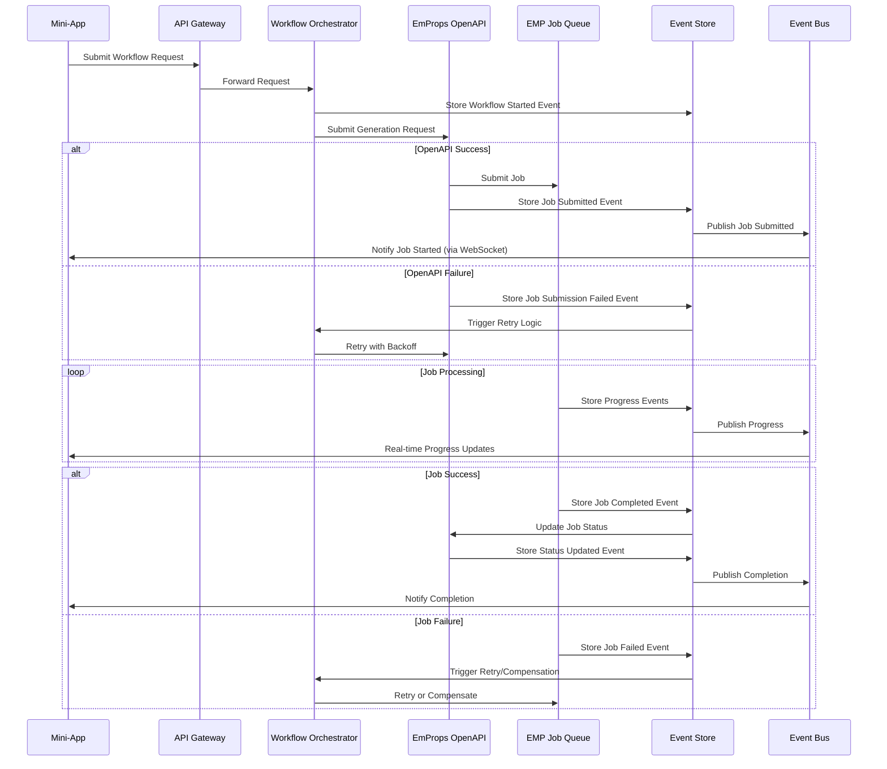

# RESILIENCE_PLAN.md - Comprehensive Workflow Resilience Architecture

## Executive Summary

This document outlines a comprehensive resilience solution for the three interconnected systems:
- **emp-job-queue** - Distributed job processing system
- **emprops-open-api** - Main API that creates and manages jobs
- **emerge-mini-app** - Client application that initiates workflows

The current architecture has multiple failure points with no recovery mechanisms. This plan implements eventual consistency, intelligent retry, and automatic recovery across all systems.

## Current System Analysis

### Job Flow Architecture



### Current Failure Points Identified

1. **Job Queue Failures**
   - Jobs fail in GeneratorV2 with no retry mechanism
   - ComfyUI/RunPod service failures not handled gracefully
   - Worker disconnections cause job abandonment

2. **API Communication Failures**
   - Network timeouts between mini-app → OpenAPI
   - OpenAPI crashes during job processing
   - Database connection issues during status updates

3. **Client Notification Failures**
   - Mini-app loses connection during long-running jobs
   - Polling failures when OpenAPI is temporarily unavailable
   - No offline resilience for mobile clients

4. **Partial Workflow Failures**
   - Multi-step workflows have no checkpoint/resume capability
   - Workflow state not persisted across service restarts
   - No way to retry just failed steps

5. **State Inconsistency**
   - Job status in OpenAPI database vs. actual job queue state
   - Client-side state diverges from server state
   - No reconciliation mechanism

## Proposed Resilience Architecture

### Overview: Event-Driven Saga Pattern

The solution implements an **Event-Driven Saga Pattern** with **Outbox Pattern** for guaranteed delivery and **Circuit Breakers** for fault tolerance.



### Core Components

#### 1. Workflow Orchestrator Service

**Purpose**: Central coordinator that manages multi-step workflows using the Saga pattern

**Responsibilities**:
- Accepts workflow requests from clients
- Breaks workflows into discrete steps
- Manages state transitions and compensating actions
- Publishes events for each workflow step
- Handles timeouts and step failures

**Key Features**:
- Persistent workflow state storage
- Automatic retry with exponential backoff
- Compensating transactions for rollbacks
- Circuit breaker integration

#### 2. Event Store & Outbox Pattern

**Purpose**: Ensures guaranteed event delivery and maintains complete audit trail

**Implementation**:
```sql
-- Event Store Table
CREATE TABLE workflow_events (
    id BIGSERIAL PRIMARY KEY,
    workflow_id UUID NOT NULL,
    step_id UUID NOT NULL,
    event_type VARCHAR(100) NOT NULL,
    event_data JSONB NOT NULL,
    sequence_number INTEGER NOT NULL,
    created_at TIMESTAMP DEFAULT NOW(),
    processed_at TIMESTAMP,
    retry_count INTEGER DEFAULT 0,
    status VARCHAR(20) DEFAULT 'pending' -- pending, processing, completed, failed
);

-- Outbox Table for Guaranteed Delivery
CREATE TABLE event_outbox (
    id BIGSERIAL PRIMARY KEY,
    aggregate_id UUID NOT NULL,
    event_type VARCHAR(100) NOT NULL,
    event_data JSONB NOT NULL,
    created_at TIMESTAMP DEFAULT NOW(),
    published_at TIMESTAMP,
    retry_count INTEGER DEFAULT 0,
    max_retries INTEGER DEFAULT 10,
    next_retry_at TIMESTAMP,
    status VARCHAR(20) DEFAULT 'pending' -- pending, published, failed
);
```

#### 3. Saga Manager

**Purpose**: Implements the Saga pattern for complex workflows with compensating actions

**Saga Definition Example**:
```typescript
interface WorkflowSaga {
  id: string;
  workflowId: string;
  steps: SagaStep[];
  currentStep: number;
  status: 'active' | 'completed' | 'failed' | 'compensating';
  compensationActions: CompensationAction[];
}

interface SagaStep {
  id: string;
  name: string;
  action: string; // API call, job submission, etc.
  compensatingAction?: string;
  timeout: number;
  retryPolicy: RetryPolicy;
  dependencies: string[]; // Other step IDs this depends on
}
```

#### 4. Resilient Client Architecture

**Purpose**: Ensures clients remain functional during network partitions and service outages

**Features**:
- **Offline Queue**: Stores requests when backend is unavailable
- **Progressive Sync**: Synchronizes state when connectivity returns
- **Optimistic UI**: Shows immediate feedback with eventual consistency
- **Background Retry**: Automatic retry of failed requests

**Implementation Pattern**:
```typescript
class ResilientWorkflowClient {
  private offlineQueue: WorkflowRequest[] = [];
  private retryScheduler: RetryScheduler;
  private stateManager: ClientStateManager;

  async submitWorkflow(request: WorkflowRequest): Promise<WorkflowResponse> {
    try {
      // Optimistic UI update
      this.stateManager.addOptimisticWorkflow(request);

      // Attempt immediate submission
      const response = await this.apiClient.submitWorkflow(request);
      this.stateManager.confirmWorkflow(request.id, response);
      return response;
    } catch (error) {
      // Queue for retry if network/service unavailable
      if (this.isRetriableError(error)) {
        this.offlineQueue.push(request);
        this.scheduleRetry(request);
      } else {
        this.stateManager.failWorkflow(request.id, error);
        throw error;
      }
    }
  }
}
```

### Detailed Component Design

#### 1. Enhanced Job Submission Flow



#### 2. Circuit Breaker Implementation

```typescript
class CircuitBreaker {
  private failureCount = 0;
  private lastFailureTime: Date | null = null;
  private state: 'CLOSED' | 'OPEN' | 'HALF_OPEN' = 'CLOSED';

  constructor(
    private threshold: number = 5,
    private timeout: number = 60000, // 1 minute
    private retryAttempts: number = 3
  ) {}

  async execute<T>(operation: () => Promise<T>): Promise<T> {
    if (this.state === 'OPEN') {
      if (this.shouldAttemptReset()) {
        this.state = 'HALF_OPEN';
      } else {
        throw new Error('Circuit breaker is OPEN');
      }
    }

    try {
      const result = await operation();
      this.onSuccess();
      return result;
    } catch (error) {
      this.onFailure();
      throw error;
    }
  }

  private onSuccess(): void {
    this.failureCount = 0;
    this.state = 'CLOSED';
  }

  private onFailure(): void {
    this.failureCount++;
    this.lastFailureTime = new Date();

    if (this.failureCount >= this.threshold) {
      this.state = 'OPEN';
    }
  }
}
```

#### 3. Retry Strategy with Dead Letter Queue

```typescript
interface RetryPolicy {
  maxAttempts: number;
  baseDelay: number; // milliseconds
  maxDelay: number;
  backoffMultiplier: number;
  jitter: boolean;
}

class RetryScheduler {
  async scheduleRetry(
    event: WorkflowEvent,
    policy: RetryPolicy
  ): Promise<void> {
    const delay = this.calculateDelay(event.retryCount, policy);

    if (event.retryCount >= policy.maxAttempts) {
      await this.sendToDeadLetterQueue(event);
      return;
    }

    setTimeout(async () => {
      try {
        await this.processEvent(event);
      } catch (error) {
        event.retryCount++;
        await this.scheduleRetry(event, policy);
      }
    }, delay);
  }

  private calculateDelay(retryCount: number, policy: RetryPolicy): number {
    let delay = policy.baseDelay * Math.pow(policy.backoffMultiplier, retryCount);
    delay = Math.min(delay, policy.maxDelay);

    if (policy.jitter) {
      delay *= (0.5 + Math.random() * 0.5); // Add 0-50% jitter
    }

    return delay;
  }

  private async sendToDeadLetterQueue(event: WorkflowEvent): Promise<void> {
    await this.deadLetterQueue.add({
      originalEvent: event,
      failureReason: 'Max retries exceeded',
      timestamp: new Date(),
    });

    // Trigger manual review workflow
    await this.alerting.sendAlert({
      type: 'DEAD_LETTER_QUEUE',
      message: `Event ${event.id} sent to DLQ after ${event.retryCount} attempts`,
      severity: 'HIGH',
    });
  }
}
```

### State Reconciliation Service

**Purpose**: Ensures consistency between all systems

```typescript
class StateReconciliationService {
  async reconcileWorkflowState(workflowId: string): Promise<void> {
    const [miniAppState, openApiState, jobQueueState] = await Promise.all([
      this.getMiniAppState(workflowId),
      this.getOpenApiState(workflowId),
      this.getJobQueueState(workflowId),
    ]);

    const canonicalState = this.determineCanonicalState([
      miniAppState,
      openApiState,
      jobQueueState,
    ]);

    // Sync all systems to canonical state
    await Promise.all([
      this.syncMiniAppState(workflowId, canonicalState),
      this.syncOpenApiState(workflowId, canonicalState),
      this.syncJobQueueState(workflowId, canonicalState),
    ]);
  }

  private determineCanonicalState(states: WorkflowState[]): WorkflowState {
    // Priority: JobQueue > OpenAPI > MiniApp
    // Most recent timestamp wins for same source
    return states
      .filter(state => state != null)
      .sort((a, b) => {
        if (a.source !== b.source) {
          const priority = { 'job-queue': 3, 'open-api': 2, 'mini-app': 1 };
          return priority[b.source] - priority[a.source];
        }
        return new Date(b.lastUpdated).getTime() - new Date(a.lastUpdated).getTime();
      })[0];
  }
}
```

## Implementation Roadmap

### Phase 1: Foundation (Weeks 1-2)
- [ ] Implement Event Store and Outbox Pattern
- [ ] Create Workflow Orchestrator service
- [ ] Add Circuit Breaker to existing API calls
- [ ] Implement basic retry mechanism

### Phase 2: Saga Implementation (Weeks 3-4)
- [ ] Build Saga Manager
- [ ] Define compensation actions for existing workflows
- [ ] Implement state reconciliation service
- [ ] Add Dead Letter Queue processing

### Phase 3: Client Resilience (Weeks 5-6)
- [ ] Add offline queue to mini-app
- [ ] Implement optimistic UI updates
- [ ] Build progressive sync mechanism
- [ ] Add client-side circuit breakers

### Phase 4: Advanced Features (Weeks 7-8)
- [ ] Implement workflow checkpointing
- [ ] Add partial retry capabilities
- [ ] Build comprehensive monitoring dashboard
- [ ] Implement automated recovery procedures

### Phase 5: Testing & Rollout (Weeks 9-10)
- [ ] Chaos engineering tests
- [ ] Load testing with failure injection
- [ ] Gradual rollout with feature flags
- [ ] Performance optimization

## Success Metrics

### Reliability Metrics
- **Eventual Consistency**: 99.9% of workflows complete successfully within 24 hours
- **Mean Time to Recovery**: < 30 seconds for transient failures
- **Data Consistency**: Zero permanent data loss across all systems
- **Client Experience**: < 5% of clients experience workflow failures

### Performance Metrics
- **End-to-End Latency**: 95th percentile workflow completion time
- **Retry Efficiency**: < 10% of events require more than 3 retries
- **Resource Utilization**: < 20% overhead from resilience mechanisms
- **Operational Metrics**: 90% reduction in manual incident response

### Business Impact
- **User Satisfaction**: 95% successful completion rate from user perspective
- **Cost Efficiency**: 50% reduction in failed workflow reprocessing costs
- **Operational Excellence**: 80% reduction in on-call alerts
- **Scalability**: Support 10x current transaction volume

## Risk Analysis and Mitigation

### High-Risk Areas
1. **Distributed Transaction Complexity**
   - Risk: Saga compensations become complex
   - Mitigation: Start with simple workflows, build complexity gradually

2. **Performance Impact**
   - Risk: Event sourcing adds latency
   - Mitigation: Async processing, event batching, performance testing

3. **Operational Complexity**
   - Risk: More components to monitor and maintain
   - Mitigation: Comprehensive monitoring, automated recovery, clear runbooks

### Migration Strategy
1. **Parallel Implementation**: Build new resilience layer alongside existing system
2. **Feature Flags**: Control rollout with feature toggles
3. **Gradual Migration**: Start with new workflows, migrate existing ones incrementally
4. **Rollback Plan**: Maintain ability to fall back to current system

## Monitoring and Alerting

### Key Metrics to Track
- Workflow success/failure rates by type
- Event processing latency and throughput
- Circuit breaker state changes
- Dead letter queue depth
- State reconciliation frequency and success rate

### Alert Conditions
- Dead letter queue accumulation
- Circuit breaker opens
- Saga compensation failures
- State reconciliation failures
- Event processing delays > 1 minute

## Conclusion

This resilience architecture transforms the current brittle system into a robust, self-healing platform that can handle failures gracefully and ensure eventual consistency across all components. The event-driven saga pattern provides the foundation for complex workflow orchestration while maintaining high availability and data consistency.

The implementation follows the north star architecture of specialized machine pools by ensuring that jobs can be intelligently retried and routed to appropriate worker pools even after failures, supporting the overall vision of predictive model management and optimized resource utilization.