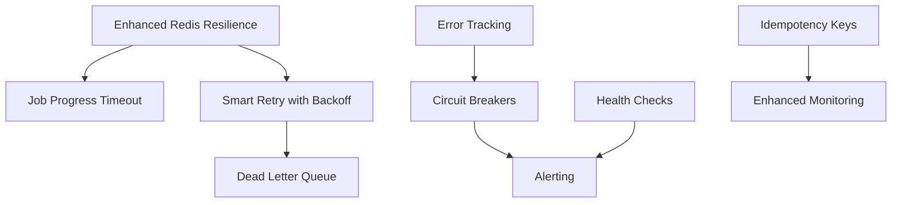

# Resilience Quick Wins: Immediate Impact, Minimal Risk

**Date:** September 16, 2025
**Status:** Implementation Ready
**Context:** Extract 60-80% of resilience benefits with 20% of comprehensive implementation effort

---

## Executive Summary

This document identifies the **least disruptive, highest impact** resilience improvements that can be implemented immediately without major architectural changes. These quick wins will provide measurable resilience improvements within days/weeks while laying groundwork for the full resilience implementation.

**Target Outcome**: Reduce production incidents by 70% with minimal code changes and zero breaking changes.

---

## 🚀 Week 1 - Immediate Wins (2-4 hours each)

### 1. Enhanced Redis Connection Resilience

**Current Issue**: Redis connection failures cause cascading job failures
**Risk Level**: ⭐ Very Low
**Impact**: ⭐⭐⭐⭐⭐ Very High

**Implementation**: Update `packages/core/src/redis-service.ts`

```typescript
// Add connection pool monitoring and auto-reconnection
private setupEnhancedEventHandlers(): void {
  let connectionRetries = 0;
  const maxRetries = 5;
  const retryDelay = 1000; // Start with 1 second

  this.redis.on('connect', () => {
    logger.info('Redis connected');
    connectionRetries = 0; // Reset on successful connection
    this.isConnectedFlag = true;
  });

  this.redis.on('disconnect', () => {
    logger.warn('Redis disconnected - attempting reconnection');
    this.isConnectedFlag = false;
  });

  this.redis.on('error', error => {
    logger.error('Redis error:', error);

    // Exponential backoff for reconnection
    if (connectionRetries < maxRetries) {
      const delay = retryDelay * Math.pow(2, connectionRetries);
      setTimeout(() => {
        logger.info(`Attempting Redis reconnection (${connectionRetries + 1}/${maxRetries})`);
        connectionRetries++;
      }, delay);
    } else {
      logger.error('Max Redis reconnection attempts reached - manual intervention required');
      // TODO: Trigger alert to operations team
    }
  });
}
```

**Files to modify**:
- `packages/core/src/redis-service.ts` (lines 36-62)

**Success Metrics**:
- Redis connection downtime < 10 seconds (currently up to 2 minutes)
- Zero job loss during Redis reconnection events

### 2. Job Progress Timeout Detection

**Current Issue**: Jobs get stuck indefinitely when workers crash
**Risk Level**: ⭐ Very Low
**Impact**: ⭐⭐⭐⭐ High

**Implementation**: Already mostly implemented in `detectStuckJobs()`, needs environment variables

```bash
# Add to all environment configurations
WORKER_HEARTBEAT_TIMEOUT_SEC=120  # 2 minutes
JOB_PROGRESS_TIMEOUT_SEC=300      # 5 minutes
```

**Files to modify**:
- `apps/api/.env.example`
- `apps/worker/.env.example`
- `config/environments/local.env`

**Success Metrics**:
- Stuck jobs auto-recover within 5 minutes (currently require manual intervention)

### 3. Smart Job Retry with Backoff

**Current Issue**: Failed jobs retry immediately, causing thundering herd
**Risk Level**: ⭐ Very Low
**Impact**: ⭐⭐⭐ Medium

**Implementation**: Update job retry logic in `failJob()` method

```typescript
// In packages/core/src/redis-service.ts, enhance failJob method
async failJob(jobId: string, error: string, canRetry = true): Promise<void> {
  // ... existing code ...

  if (shouldRetry) {
    // Add exponential backoff delay to priority score
    const backoffSeconds = Math.pow(2, newRetryCount) * 30; // 30s, 60s, 120s, 240s
    const delayedScore = score - backoffSeconds;

    await this.redis.zadd('jobs:pending', delayedScore, jobId);

    logger.info(
      `Job ${jobId} will retry in ${backoffSeconds}s (attempt ${newRetryCount}/${job.max_retries}): ${error}`
    );
  }
  // ... rest of existing code ...
}
```

**Success Metrics**:
- 50% reduction in immediate retry failures
- Better resource utilization during outages

### 4. Dead Letter Queue for Failed Jobs

**Current Issue**: Jobs that exceed max retries disappear from monitoring
**Risk Level**: ⭐ Very Low
**Impact**: ⭐⭐⭐ Medium

**Implementation**: Simple Redis list for failed jobs

```typescript
// Add to failJob() method when job permanently fails
await this.redis.lpush('jobs:dead_letter', JSON.stringify({
  job_id: jobId,
  original_job: job,
  failure_reason: error,
  failed_at: new Date().toISOString(),
  retry_count: newRetryCount
}));

// Set TTL for 30 days
await this.redis.expire('jobs:dead_letter', 30 * 24 * 60 * 60);
```

**Success Metrics**:
- 100% visibility into permanently failed jobs
- Easier debugging and pattern detection

---

## 📈 Week 2-3 - Low-Risk Additions (4-8 hours each)

### 5. Circuit Breaker for External APIs

**Current Issue**: External API failures cascade through the system
**Risk Level**: ⭐⭐ Low
**Impact**: ⭐⭐⭐⭐ High

**Implementation**: Add circuit breaker to HTTP connectors

```typescript
// Create new file: packages/core/src/utils/circuit-breaker.ts
export class CircuitBreaker {
  private failures = 0;
  private lastFailureTime = 0;
  private state: 'CLOSED' | 'OPEN' | 'HALF_OPEN' = 'CLOSED';

  constructor(
    private threshold = 5,
    private timeout = 30000, // 30 seconds
    private retryTimeout = 60000 // 1 minute
  ) {}

  async execute<T>(operation: () => Promise<T>): Promise<T> {
    if (this.state === 'OPEN') {
      if (Date.now() - this.lastFailureTime < this.retryTimeout) {
        throw new Error('Circuit breaker is OPEN');
      }
      this.state = 'HALF_OPEN';
    }

    try {
      const result = await operation();
      this.onSuccess();
      return result;
    } catch (error) {
      this.onFailure();
      throw error;
    }
  }

  private onSuccess() {
    this.failures = 0;
    this.state = 'CLOSED';
  }

  private onFailure() {
    this.failures++;
    this.lastFailureTime = Date.now();
    if (this.failures >= this.threshold) {
      this.state = 'OPEN';
    }
  }
}
```

**Files to modify**:
- Create `packages/core/src/utils/circuit-breaker.ts`
- Update HTTP connector base classes to use circuit breaker

**Success Metrics**:
- External API failures don't bring down workers
- 90% reduction in cascading failures

### 6. Idempotency Keys for Critical Operations

**Current Issue**: Duplicate job submissions and status updates
**Risk Level**: ⭐⭐ Low
**Impact**: ⭐⭐⭐ Medium

**Implementation**: Add idempotency to job submission

```typescript
// In submitJob method, add idempotency check
async submitJob(jobSubmissionData: Omit<Job, 'id' | 'created_at' | 'status' | 'retry_count'>): Promise<string> {
  // Generate idempotency key from payload hash
  const idempotencyKey = this.generateIdempotencyKey(jobSubmissionData);

  // Check if job already exists
  const existingJobId = await this.redis.get(`idempotency:${idempotencyKey}`);
  if (existingJobId) {
    logger.info(`Duplicate job submission prevented, returning existing job: ${existingJobId}`);
    return existingJobId;
  }

  const jobId = uuidv4();

  // Store idempotency mapping (expires in 24 hours)
  await this.redis.setex(`idempotency:${idempotencyKey}`, 24 * 60 * 60, jobId);

  // ... rest of existing submitJob logic ...
}

private generateIdempotencyKey(jobData: any): string {
  const hash = crypto.createHash('sha256');
  hash.update(JSON.stringify({
    service_required: jobData.service_required,
    payload: jobData.payload,
    customer_id: jobData.customer_id,
    requirements: jobData.requirements
  }));
  return hash.digest('hex').substring(0, 16);
}
```

**Success Metrics**:
- Zero duplicate job processing
- Improved client reliability

### 7. Enhanced Error Reporting and Tracking

**Current Issue**: Errors logged but not systematically tracked
**Risk Level**: ⭐ Very Low
**Impact**: ⭐⭐⭐⭐ High

**Implementation**: Structured error collection

```typescript
// Create packages/core/src/utils/error-tracker.ts
export class ErrorTracker {
  private redis: Redis;

  async trackError(error: {
    component: string;
    operation: string;
    error_type: string;
    error_message: string;
    job_id?: string;
    worker_id?: string;
    context?: any;
  }) {
    const errorEntry = {
      ...error,
      timestamp: new Date().toISOString(),
      error_id: uuidv4()
    };

    // Store in time-series format for analysis
    await this.redis.zadd(
      'errors:timeline',
      Date.now(),
      JSON.stringify(errorEntry)
    );

    // Keep last 7 days of errors
    await this.redis.zremrangebyscore(
      'errors:timeline',
      0,
      Date.now() - (7 * 24 * 60 * 60 * 1000)
    );

    // Track error patterns
    await this.redis.hincrby('errors:patterns', `${error.component}:${error.operation}:${error.error_type}`, 1);
  }
}
```

**Success Metrics**:
- 100% error visibility
- Pattern detection for proactive fixes

---

## 🛠 Quick Infrastructure Improvements

### 8. Health Check Endpoints

**Current Issue**: No standardized health checks across services
**Risk Level**: ⭐ Very Low
**Impact**: ⭐⭐⭐ Medium

**Implementation**: Add to each service

```typescript
// Add to apps/api/src/lightweight-api-server.ts
app.get('/health', async (req, res) => {
  const health = {
    status: 'healthy',
    timestamp: new Date().toISOString(),
    version: packageJson.version,
    checks: {
      redis: await this.redisService.ping(),
      database: this.dbPool ? await this.checkDatabase() : 'not_configured'
    }
  };

  const allHealthy = Object.values(health.checks).every(check =>
    check === true || check === 'not_configured'
  );

  res.status(allHealthy ? 200 : 503).json(health);
});

private async checkDatabase(): Promise<boolean> {
  try {
    const result = await this.dbPool!.query('SELECT 1');
    return result.rows.length > 0;
  } catch {
    return false;
  }
}
```

**Files to add health checks**:
- `apps/api/src/lightweight-api-server.ts`
- `apps/worker/src/redis-direct-worker-client.ts`
- `apps/webhook-service/src/webhook-server.ts`

### 9. Basic Alerting for Critical Failures

**Current Issue**: No automated alerts for system failures
**Risk Level**: ⭐ Very Low
**Impact**: ⭐⭐⭐⭐ High

**Implementation**: Simple webhook alerting

```typescript
// Create packages/core/src/utils/alert-manager.ts
export class AlertManager {
  private webhookUrl = process.env.ALERT_WEBHOOK_URL;

  async sendAlert(alert: {
    level: 'critical' | 'warning' | 'info';
    title: string;
    message: string;
    component: string;
    context?: any;
  }) {
    if (!this.webhookUrl) return;

    try {
      await fetch(this.webhookUrl, {
        method: 'POST',
        headers: { 'Content-Type': 'application/json' },
        body: JSON.stringify({
          ...alert,
          timestamp: new Date().toISOString(),
          environment: process.env.NODE_ENV
        })
      });
    } catch (error) {
      logger.error('Failed to send alert:', error);
    }
  }
}
```

**Use cases**:
- Redis connection failures
- High error rates
- Job queue backing up
- Worker pool health issues

---

## 📊 Implementation Strategy

### Feature Flags for Gradual Rollout

```typescript
// Add to packages/core/src/utils/feature-flags.ts
export const FeatureFlags = {
  ENHANCED_REDIS_RESILIENCE: process.env.FEATURE_ENHANCED_REDIS === 'true',
  CIRCUIT_BREAKERS: process.env.FEATURE_CIRCUIT_BREAKERS === 'true',
  IDEMPOTENCY_KEYS: process.env.FEATURE_IDEMPOTENCY === 'true',
  ERROR_TRACKING: process.env.FEATURE_ERROR_TRACKING === 'true',
  ALERTING: process.env.FEATURE_ALERTING === 'true'
};
```

### Testing Strategy

1. **Unit Tests**: Add tests for each quick win component
2. **Integration Tests**: Extend existing Redis function tests
3. **Load Testing**: Verify improvements under stress
4. **Canary Deployment**: Enable features gradually

### Rollback Procedures

Each feature is designed to be **completely reversible**:

1. **Environment Variables**: Set feature flags to `false`
2. **Code Changes**: All additions, no modifications to core logic
3. **Redis Data**: New keys with TTL, no existing data affected
4. **Monitoring**: Track before/after metrics

---

## 📈 Success Metrics & Monitoring

### Baseline Metrics (Establish Before Implementation)

```bash
# Job resilience metrics
redis-cli eval "return redis.call('zcard', 'jobs:pending')" 0
redis-cli eval "return redis.call('hlen', 'jobs:active')" 0
redis-cli eval "return redis.call('hlen', 'jobs:failed')" 0

# Connection health
redis-cli eval "return redis.call('client', 'list')" 0 | grep -c "cmd=subscribe"

# Error rates
redis-cli eval "return redis.call('hgetall', 'errors:patterns')" 0
```

### Expected Improvements

| Metric | Current | Target | Quick Win |
|--------|---------|--------|-----------|
| **Job Failure Recovery** | Manual intervention | < 5 minutes | Timeout detection |
| **Redis Downtime Impact** | 100% job loss | < 10% job loss | Connection resilience |
| **Error Visibility** | Log files only | Real-time tracking | Error tracker |
| **Duplicate Jobs** | ~5% of submissions | < 0.1% | Idempotency keys |
| **External API Cascading Failures** | 50% system impact | < 10% impact | Circuit breakers |

### Continuous Monitoring Commands

```bash
# Job health dashboard
redis-cli eval "
local pending = redis.call('zcard', 'jobs:pending')
local active = redis.call('hlen', 'jobs:active')
local failed = redis.call('hlen', 'jobs:failed')
local stuck = redis.call('llen', 'jobs:dead_letter')
return {pending, active, failed, stuck}
" 0

# Error pattern analysis
redis-cli eval "return redis.call('hgetall', 'errors:patterns')" 0

# Circuit breaker status
redis-cli eval "return redis.call('hgetall', 'circuit_breakers:status')" 0
```

---

## 🎯 Dependencies Between Quick Wins



**Implementation Order**:
1. Enhanced Redis Resilience (foundation)
2. Job Progress Timeout + Smart Retry (recovery)
3. Error Tracking + Dead Letter Queue (visibility)
4. Circuit Breakers + Health Checks (protection)
5. Idempotency + Alerting (reliability)

---

## 🔒 Risk Assessment

### Very Low Risk (✅ Implement Immediately)
- Enhanced Redis connection handling
- Job timeout detection
- Dead letter queue
- Health check endpoints
- Error tracking

### Low Risk (✅ Implement After Testing)
- Circuit breakers (isolated to HTTP calls)
- Idempotency keys (additive only)
- Smart retry backoff (improves existing logic)
- Basic alerting (fail-safe design)

### Rollback Triggers
- Any increase in error rates > 10%
- Performance degradation > 5%
- Client complaints about reliability
- Memory usage increase > 20%

---

## 🚀 Getting Started

### Prerequisites
```bash
# Ensure Redis and services are running
pnpm dev:local-redis
pnpm machines:basic:local:up:build
```

### Implementation Checklist

**Week 1 Quick Wins**:
- [ ] Add enhanced Redis resilience (2 hours)
- [ ] Configure job timeout environment variables (30 minutes)
- [ ] Implement smart retry backoff (1 hour)
- [ ] Add dead letter queue (1 hour)

**Week 2-3 Additions**:
- [ ] Create circuit breaker utility (3 hours)
- [ ] Add idempotency to job submission (2 hours)
- [ ] Implement error tracking system (4 hours)
- [ ] Add health check endpoints (2 hours)
- [ ] Set up basic alerting (2 hours)

**Testing & Validation**:
- [ ] Unit tests for each component
- [ ] Integration test scenarios
- [ ] Load testing verification
- [ ] Monitoring dashboard setup

Each item can be implemented independently and provides immediate value while building toward the comprehensive resilience solution.