# ComfyUI Machine Startup Flow

This document details the complete startup sequence for ComfyUI machines, with numbered steps for OTEL tracing and failure point identification.

## Overview

The ComfyUI machine startup involves multiple phases: container initialization, environment setup, PM2 ecosystem generation, service startup, component installation, and worker connection. Each step is numbered for precise OTEL event tracking.

```mermaid
graph TD
    %% Container & Environment Phase
    A["`**STEP 1:** Container Start`"] --> B["`**STEP 2:** entrypoint-base.sh`"]
    B --> C["`**STEP 3:** Environment Loading`"]
    C --> D["`**STEP 4:** Directory Setup`"]
    D --> E["`**STEP 5:** Service Manager Setup`"]
    
    %% PM2 Generation Phase
    E --> F["`**STEP 6:** PM2 Ecosystem Generation`"]
    F --> G["`**STEP 7:** Enhanced Generator Call`"]
    G --> H["`**STEP 8:** Service Mapping Load`"]
    H --> I["`**STEP 9:** Hardware Detection`"]
    I --> J["`**STEP 10:** PM2 Config Output`"]
    
    %% Service Startup Phase
    J --> K["`**STEP 11:** PM2 Daemon Start`"]
    K --> L["`**STEP 12:** Health Server Start`"]
    L --> M["`**STEP 13:** ComfyUI Service Start`"]
    
    %% Component Installation Phase
    M --> N["`**STEP 14:** ComfyUI Installer Init`"]
    N --> O["`**STEP 15:** Component Manager Init`"]
    O --> P["`**STEP 16:** API Discovery Call`"]
    P --> Q["`**STEP 17:** Custom Nodes Installation`"]
    Q --> R["`**STEP 18:** Models Installation`"]
    
    %% ComfyUI Ready Phase
    R --> S["`**STEP 19:** ComfyUI Server Start`"]
    S --> T["`**STEP 20:** Worker Connection`"]
    T --> U["`**STEP 21:** Machine Ready`"]
    
    %% Styling
    classDef containerPhase fill:#e1f5fe,stroke:#01579b,stroke-width:2px
    classDef pm2Phase fill:#f3e5f5,stroke:#4a148c,stroke-width:2px
    classDef servicePhase fill:#e8f5e8,stroke:#1b5e20,stroke-width:2px
    classDef componentPhase fill:#fff3e0,stroke:#e65100,stroke-width:2px
    classDef readyPhase fill:#f1f8e9,stroke:#33691e,stroke-width:2px
    
    class A,B,C,D,E containerPhase
    class F,G,H,I,J pm2Phase
    class K,L,M servicePhase
    class N,O,P,Q,R componentPhase
    class S,T,U readyPhase
```

<FullscreenDiagram>



</FullscreenDiagram>

## Detailed Step Breakdown

### Phase 1: Container & Environment (Steps 1-5)

#### Step 1: Container Start
- **File**: `Docker container initialization`
- **OTEL Event**: `machine.container.start`
- **Function**: Container creation and initial setup
- **Critical Dependencies**: Docker environment, base image layers
- **Failure Indicators**: Container fails to start, missing base dependencies

#### Step 2: Entrypoint Script Launch
- **File**: `/scripts/entrypoint-base.sh`
- **OTEL Event**: `machine.entrypoint.start`
- **Function**: Main entry point script execution
- **Critical Dependencies**: Script permissions, bash environment
- **Failure Indicators**: Script execution errors, permission denied

#### Step 3: Environment Loading
- **File**: `entrypoint-base.sh:setup_environment()`
- **OTEL Event**: `machine.environment.load`
- **Function**: Load `.env.local-dev` + `.env.secret.local-dev`, set core variables
- **Critical Dependencies**: Environment files exist, variable parsing
- **Failure Indicators**: Missing env files, malformed variables

#### Step 4: Directory Setup
- **File**: `entrypoint-base.sh:setup_directories()`
- **OTEL Event**: `machine.directories.setup`
- **Function**: Create workspace, logs, PM2 directories with correct permissions
- **Critical Dependencies**: Filesystem permissions, disk space
- **Failure Indicators**: Permission errors, disk full

#### Step 5: Service Manager Setup
- **File**: `entrypoint-base.sh:setup_service_manager()`
- **OTEL Event**: `machine.service_manager.setup`
- **Function**: Verify service manager files, set paths
- **Critical Dependencies**: Service manager code copied correctly
- **Failure Indicators**: Missing service manager files

### Phase 2: PM2 Ecosystem Generation (Steps 6-10)

#### Step 6: PM2 Ecosystem Generation
- **File**: `src/index-pm2.js:generatePM2EcosystemConfig()`
- **OTEL Event**: `machine.pm2.generation.start`
- **Function**: Initiate PM2 config generation process
- **Critical Dependencies**: Worker-driven generator exists
- **Failure Indicators**: Generator script missing or corrupted

#### Step 7: Enhanced Generator Call
- **File**: `generate-pm2-ecosystem-worker-driven.js`
- **OTEL Event**: `machine.pm2.enhanced_generator.start`
- **Function**: Call EnhancedPM2EcosystemGenerator
- **Critical Dependencies**: Import paths correct, generator class available
- **Failure Indicators**: Module import errors, class instantiation failures

#### Step 8: Service Mapping Load
- **File**: `enhanced-pm2-ecosystem-generator.js:loadServiceMapping()`
- **OTEL Event**: `machine.pm2.service_mapping.load`
- **Function**: Load service-mapping.json, parse worker configurations
- **Critical Dependencies**: service-mapping.json exists and valid
- **Failure Indicators**: File not found, JSON parse errors

#### Step 9: Hardware Detection
- **File**: `enhanced-pm2-ecosystem-generator.js:detectResources()`
- **OTEL Event**: `machine.pm2.hardware.detect`
- **Function**: Detect GPU count, apply GPU_MODE logic (mock vs actual)
- **Critical Dependencies**: Hardware detection logic, GPU_MODE environment
- **Failure Indicators**: GPU detection failures, mode logic errors

#### Step 10: PM2 Config Output
- **File**: `enhanced-pm2-ecosystem-generator.js:writeEcosystemConfig()`
- **OTEL Event**: `machine.pm2.config.write`
- **Function**: Generate `/workspace/pm2-ecosystem.config.cjs`
- **Critical Dependencies**: File write permissions, valid JSON structure
- **Failure Indicators**: File write failures, malformed config

### Phase 3: Service Startup (Steps 11-13)

#### Step 11: PM2 Daemon Start
- **File**: `src/index-pm2.js:startPM2Services()`
- **OTEL Event**: `machine.pm2.daemon.start`
- **Function**: Initialize PM2 daemon, verify connectivity
- **Critical Dependencies**: PM2 installation, process management permissions
- **Failure Indicators**: PM2 daemon startup failures, permission issues

#### Step 12: Health Server Start
- **File**: `src/index-pm2.js:startHealthServer()`
- **OTEL Event**: `machine.health_server.start`
- **Function**: Start HTTP health check server on port 9090
- **Critical Dependencies**: Port 9090 available, HTTP server libraries
- **Failure Indicators**: Port conflicts, server binding failures

#### Step 13: ComfyUI Service Start
- **File**: PM2 ecosystem: `comfyui-gpu0` process
- **OTEL Event**: `machine.comfyui.service.start`
- **Function**: Launch ComfyUI service process via PM2
- **Critical Dependencies**: ComfyUI binary, Python environment
- **Failure Indicators**: Process start failures, missing dependencies

### Phase 4: Component Installation (Steps 14-18)

#### Step 14: ComfyUI Installer Init
- **File**: `src/services/comfyui-installer.js:onStart()`
- **OTEL Event**: `machine.comfyui.installer.init`
- **Function**: Initialize ComfyUI installer service
- **Critical Dependencies**: ComfyUI base installation, installer permissions
- **Failure Indicators**: Installer initialization failures

#### Step 15: Component Manager Init
- **File**: `src/services/component-manager.js:constructor()`
- **OTEL Event**: `machine.component_manager.init`
- **Function**: Initialize component manager, parse component config
- **Critical Dependencies**: EMPROPS_API_URL configured, API client setup
- **Failure Indicators**: API client initialization failures

#### Step 16: API Discovery Call (Multi-Step Process)
- **File**: `component-manager.js:onStart()` → `emp-api-client.js`
- **OTEL Event**: `machine.api.discovery.call`
- **Function**: Three-step API discovery process:
  1. **Always call `/custom-nodes/defaults`** - Get default custom nodes with install_order
  2. **If COMPONENTS env set**: Call `/workflows/dependencies` for specific workflows  
  3. **If COLLECTIONS env set**: Call `/collections/dependencies` for specific collections
- **Critical Dependencies**: API server reachable at `EMPROPS_API_URL`, all endpoints respond correctly
- **Failure Indicators**: Network errors, API 404/500 responses, missing defaults endpoint

#### Step 17: Custom Nodes Installation (Ordered)
- **File**: `component-manager.js:installCustomNodes()` → `comfyui-installer.js:installCustomNode()`
- **OTEL Event**: `machine.custom_nodes.install`
- **Function**: Install custom nodes in `install_order` sequence (ascending, then null values by name)
- **Installation Order**: Defaults first (by install_order), then additional nodes, then unordered nodes
- **Critical Dependencies**: Git access, Python pip, internet connectivity, correct install sequence
- **Failure Indicators**: Git clone failures, pip install errors, dependency conflicts, order violations

#### Step 18: Models Installation
- **File**: `component-manager.js:installModels()`
- **OTEL Event**: `machine.models.install`
- **Function**: Download model files to appropriate directories
- **Critical Dependencies**: Download URLs accessible, sufficient disk space
- **Failure Indicators**: Download failures, insufficient disk space, corrupted files

### Phase 5: ComfyUI Ready (Steps 19-21)

#### Step 19: ComfyUI Server Start
- **File**: ComfyUI main process launch
- **OTEL Event**: `machine.comfyui.server.start`
- **Function**: Start ComfyUI web server on port 8188
- **Critical Dependencies**: All custom nodes loaded, models accessible
- **Failure Indicators**: Port binding failures, custom node import errors

#### Step 20: Worker Connection
- **File**: Redis worker process: `redis-worker-comfyui-gpu0`
- **OTEL Event**: `machine.worker.connection.start`
- **Function**: Worker connects to ComfyUI service and Redis
- **Critical Dependencies**: ComfyUI server ready, Redis connectivity
- **Failure Indicators**: Connection timeouts, service unavailable errors

#### Step 21: Machine Ready
- **File**: `src/index-pm2.js:main()` completion
- **OTEL Event**: `machine.ready.complete`
- **Function**: Machine signals full readiness to API
- **Critical Dependencies**: All services healthy, worker connected
- **Failure Indicators**: Health check failures, service degradation

## Common Failure Points

### 🔥 High-Risk Failure Points

1. **Step 16 - API Discovery Call**: API unreachable, authentication issues
2. **Step 17 - Custom Nodes Installation**: Git/pip dependency failures
3. **Step 19 - ComfyUI Server Start**: Custom node import errors
4. **Step 20 - Worker Connection**: Service timing issues

### 🟡 Medium-Risk Failure Points

1. **Step 8 - Service Mapping Load**: Configuration file issues
2. **Step 11 - PM2 Daemon Start**: Process management failures
3. **Step 13 - ComfyUI Service Start**: Resource allocation issues

### 🟢 Low-Risk Failure Points

1. **Steps 1-5**: Container and environment setup (usually reliable)
2. **Step 12 - Health Server**: Simple HTTP server (rarely fails)

## OTEL Implementation Strategy

### Event Naming Convention
```
machine.{phase}.{component}.{action}
```

Examples:
- `machine.pm2.generation.start`
- `machine.api.discovery.call`
- `machine.comfyui.server.start`

### Required Attributes
```javascript
{
  machine_id: process.env.MACHINE_ID,
  step_number: 16,
  step_name: "API Discovery Call",
  phase: "component_installation",
  gpu_mode: process.env.GPU_MODE,
  workers_config: process.env.WORKERS
}
```

### Failure Event Structure
```javascript
{
  event: "machine.step.failure",
  step_number: 16,
  step_name: "API Discovery Call", 
  error_type: "network_timeout",
  error_message: "Failed to reach EMPROPS_API_URL",
  retry_attempt: 1,
  duration_ms: 5000
}
```

## Local Development Debugging

### Quick Health Checks

1. **API Connectivity**: `curl http://host.docker.internal:8080/health`
2. **PM2 Status**: `docker exec container_name pm2 status`
3. **ComfyUI Logs**: `docker logs container_name | grep comfyui`
4. **Component Install**: Check for custom nodes in `/workspace/ComfyUI/custom_nodes/`

### Environment Variables to Verify

```bash
# Critical for component installation
EMPROPS_API_URL=http://host.docker.internal:8080
WORKERS=comfyui:1
GPU_MODE=mock

# Component specification (if using components)
COMPONENT_IDS=workflow-name-1,workflow-name-2
COLLECTION_IDS=collection-id-1
```

This startup flow enables precise failure identification and targeted debugging for ComfyUI machine deployment issues.