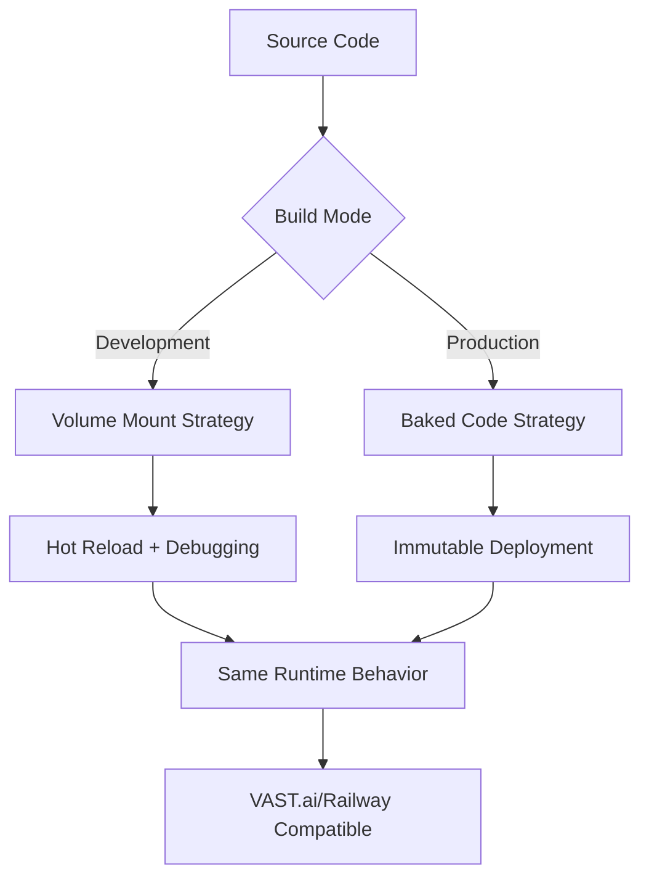

# Development → Production Debugging Strategy

## Executive Summary

This document outlines a comprehensive debugging strategy that seamlessly bridges development and production environments for the EMP Job Queue system. The strategy eliminates the friction between local debugging and production deployment while maintaining the immutable container philosophy required by ephemeral platforms like VAST.ai and Railway.

## The Challenge

### Current Pain Points
- **Code Sync Issues**: Development code differs from container code
- **Slow Debug Cycles**: Rebuild → Deploy → Test → Repeat
- **Production Debugging**: Limited visibility into production container issues
- **Platform Constraints**: VAST.ai/Railway require immutable containers (no volume mounting)

### Industry Reality Check
- ❌ **Anti-pattern**: Using volumes for application code in production
- ❌ **Anti-pattern**: SCP + volume mounting in production
- ✅ **Best Practice**: Immutable containers with baked-in code
- ✅ **Best Practice**: Fast development cycles with hot reload

## Strategic Architecture

### Core Principle: **Dual-Mode Containers**

The same container image works in both modes:



### Development Mode
- **Code Location**: Volume mounted from host
- **Debugging**: Node.js inspector enabled
- **Iteration Speed**: Instant (no rebuilds)
- **Use Case**: Local development, debugging

### Production Mode  
- **Code Location**: Baked into container during build
- **Debugging**: Structured logging + telemetry
- **Iteration Speed**: CI/CD pipeline speed
- **Use Case**: VAST.ai, Railway, production deployment

## Implementation Plan

### Phase 1: Container Architecture (30 minutes)

#### 1.1 Multi-Target Dockerfile
```dockerfile
# Base stage - common dependencies
FROM node:18-alpine AS base
WORKDIR /service-manager
COPY package*.json ./
RUN npm ci --only=production

# Development stage - no code copying (will be mounted)
FROM base AS development
ENV NODE_ENV=development
ENV DEVELOPMENT_MODE=true
# Install dev dependencies for debugging
RUN npm ci
EXPOSE 9229
# Code will be mounted at runtime

# Production stage - bake in code
FROM base AS production  
ENV NODE_ENV=production
ENV DEVELOPMENT_MODE=false
COPY src/ ./src/
COPY *.js ./
# Code is immutable in container
```

#### 1.2 Docker Compose Development Config
```yaml
# docker-compose.debug.yml
version: '3.8'
services:
  sim-4-debug:
    build:
      target: development  # Use development stage
    volumes:
      # Mount source code for hot reload
      - ./src:/service-manager/src:ro
      - ./package.json:/service-manager/package.json:ro
      # Mount any other dynamic files
      - ./tsconfig.json:/service-manager/tsconfig.json:ro
    ports:
      - "9229:9229"  # Node.js inspector
      - "9090:9090"  # Application port
    environment:
      NODE_OPTIONS: "--inspect=0.0.0.0:9229 --enable-source-maps"
      DEVELOPMENT_MODE: "true"
      # All other environment variables...
```

### Phase 2: IDE Integration (15 minutes)

#### 2.1 VS Code Launch Configuration
```json
// .vscode/launch.json
{
  "version": "0.2.0",
  "configurations": [
    {
      "name": "Debug Machine Container",
      "type": "node",
      "request": "attach",
      "address": "localhost", 
      "port": 9229,
      "localRoot": "${workspaceFolder}/apps/machine",
      "remoteRoot": "/service-manager",
      "sourceMaps": true,
      "restart": true,
      "trace": "verbose"
    }
  ]
}
```

#### 2.2 Development Workflow Scripts
```json
// package.json scripts
{
  "debug:machine": "docker-compose -f docker-compose.debug.yml up sim-4-debug",
  "debug:attach": "code --command vscode.debug.startDebugging 'Debug Machine Container'",
  "debug:full": "npm run debug:machine && npm run debug:attach",
  "prod:build": "docker build --target production -t emprops/machine:sim-4 .",
  "prod:test": "docker run --rm emprops/machine:sim-4"
}
```

### Phase 3: Seamless Production Transition (10 minutes)

#### 3.1 Runtime Mode Detection
```javascript
// src/lib/environment.js
export function getExecutionMode() {
  const isDevelopment = process.env.DEVELOPMENT_MODE === 'true';
  const hasVolumeMounts = fs.existsSync('/service-manager/src/.git'); // Git only in mounted code
  
  return {
    mode: isDevelopment ? 'development' : 'production',
    codeSource: hasVolumeMounts ? 'volume-mounted' : 'container-baked',
    debuggingEnabled: isDevelopment && process.env.NODE_OPTIONS?.includes('--inspect')
  };
}

// Usage in startup
const { mode, codeSource, debuggingEnabled } = getExecutionMode();
logger.info(`🚀 Starting in ${mode} mode`);
logger.info(`📁 Code source: ${codeSource}`);
if (debuggingEnabled) {
  logger.info(`🐛 Debugging enabled on port 9229`);
  logger.info(`🔗 Connect VS Code or Chrome DevTools to localhost:9229`);
}
```

#### 3.2 Production Build Validation
```bash
#!/bin/bash
# scripts/validate-production-build.sh

echo "🔍 Validating production build..."

# Build production container
docker build --target production -t emprops/machine:test-build .

# Test that it starts without volumes
docker run --rm --name test-container \
  -e WORKERS=simulation-websocket:1 \
  -e DISABLE_ENV_ENCRYPTION=true \
  emprops/machine:test-build timeout 30s node src/index-pm2.js

if [ $? -eq 0 ]; then
  echo "✅ Production build validation passed"
else 
  echo "❌ Production build validation failed"
  exit 1
fi
```

### Phase 4: VAST.ai/Railway Compatibility (5 minutes)

#### 4.1 Production Deployment
```bash
# Local: Build and test
npm run prod:build
npm run prod:test

# CI/CD: Push to registry
docker tag emprops/machine:sim-4 emprops/machine:v1.2.3
docker push emprops/machine:v1.2.3

# VAST.ai: Deploy immutable container
docker run --rm \
  -e HUB_REDIS_URL="redis://..." \
  -e WORKERS=simulation-websocket:4 \
  emprops/machine:v1.2.3
```

#### 4.2 Emergency Debugging on VAST.ai
```bash
# If production issues occur, you can still debug:

# 1. Upload debug build to VAST.ai
docker tag emprops/machine:debug emprops/machine:v1.2.3-debug  
docker push emprops/machine:v1.2.3-debug

# 2. Run with debugging enabled on VAST.ai
docker run --rm \
  -p 9229:9229 \
  -e NODE_OPTIONS="--inspect=0.0.0.0:9229" \
  emprops/machine:v1.2.3-debug

# 3. SSH tunnel for remote debugging
ssh -L 9229:localhost:9229 root@vast-instance
# Now connect VS Code debugger to localhost:9229
```

## Benefits

### Development Experience
- ⚡ **Instant Iteration**: Change code → save → immediate effect
- 🐛 **True Breakpoints**: Step through actual running code
- 🔍 **Live Inspection**: Variables, call stacks, memory state
- 🚀 **Fast Cycles**: No container rebuilds during active debugging

### Production Confidence  
- 🏗️ **Same Runtime**: Identical Node.js execution environment
- 🔒 **Immutable Deploys**: Production containers never change
- 📦 **Platform Agnostic**: Works on VAST.ai, Railway, K8s, anywhere
- 🎯 **No Production Surprises**: What you debug is what you deploy

### Operational Benefits
- ⏱️ **Reduced MTTR**: Faster diagnosis of production issues
- 🔧 **Better Tooling**: Proper debugger vs. console.log archaeology  
- 📊 **Clear Separation**: Development complexity isolated from production
- 🚢 **CI/CD Ready**: Automated build/test/deploy pipeline

## Implementation Timeline

### Week 1: Foundation (Current Priority)
- [ ] **Day 1**: Implement multi-target Dockerfile
- [ ] **Day 2**: Create docker-compose.debug.yml
- [ ] **Day 3**: Set up VS Code debugging configuration
- [ ] **Day 4**: Test development workflow end-to-end
- [ ] **Day 5**: Validate production build compatibility

### Week 2: Integration
- [ ] **Day 1**: Add runtime mode detection
- [ ] **Day 2**: Create npm scripts for common workflows  
- [ ] **Day 3**: Build production validation scripts
- [ ] **Day 4**: Test VAST.ai deployment pipeline
- [ ] **Day 5**: Document troubleshooting procedures

### Week 3: Optimization
- [ ] **Day 1**: Performance tune development containers
- [ ] **Day 2**: Add advanced debugging features (profiling, etc.)
- [ ] **Day 3**: Create debugging best practices guide
- [ ] **Day 4**: Train team on new workflow
- [ ] **Day 5**: Measure and document improvements

## Success Metrics

### Development Velocity
- **Iteration Speed**: < 5 seconds from code change to running effect
- **Debug Session Time**: 80% reduction in time-to-diagnosis
- **Container Build Frequency**: 90% reduction during active development

### Production Quality
- **Deployment Confidence**: 100% identical behavior dev → prod
- **Issue Resolution Time**: 50% faster production debugging
- **Platform Compatibility**: 100% success rate on VAST.ai/Railway

## Current Action Items

### Immediate (This Session)
1. **Solve simulation-websocket issue** using this debugging setup
2. **Implement multi-target Dockerfile** for machine container
3. **Create debug docker-compose** configuration
4. **Test end-to-end** with current ecosystem generation bug

### Next Session  
1. **Document findings** from debugging session
2. **Optimize container build times** for faster iteration
3. **Create team workflow guide** for adoption
4. **Plan rollout** to other machine profiles

## Conclusion

This strategy transforms debugging from a time-consuming, frustrating process into a fast, reliable workflow that maintains production compatibility. By investing 2-3 hours in setup, we eliminate hours of debugging friction and gain confidence in our deployment pipeline.

The key insight: **Use the right tool for the right environment** while maintaining identical runtime behavior. Development gets the full power of modern debugging tools, production gets the reliability of immutable containers, and the transition between them is seamless.

---

*This document represents a strategic shift toward development velocity without sacrificing production reliability. Implementation should be prioritized based on current debugging pain points and team capacity.*