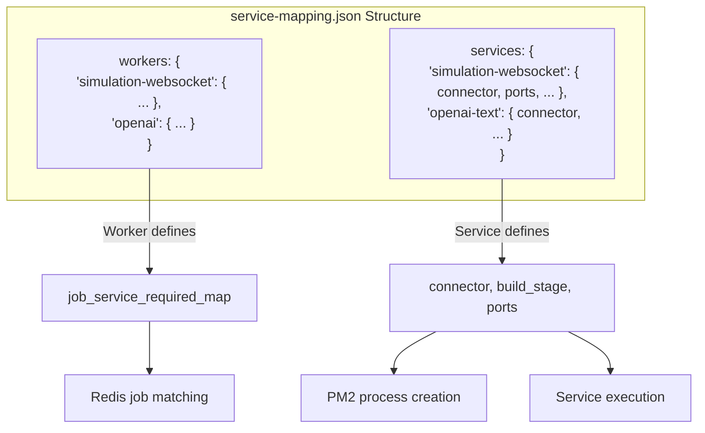
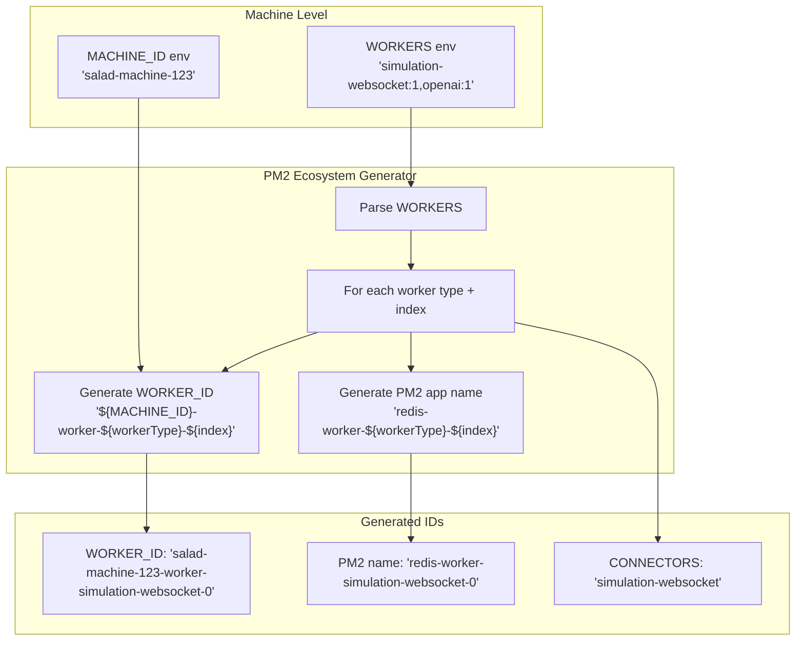
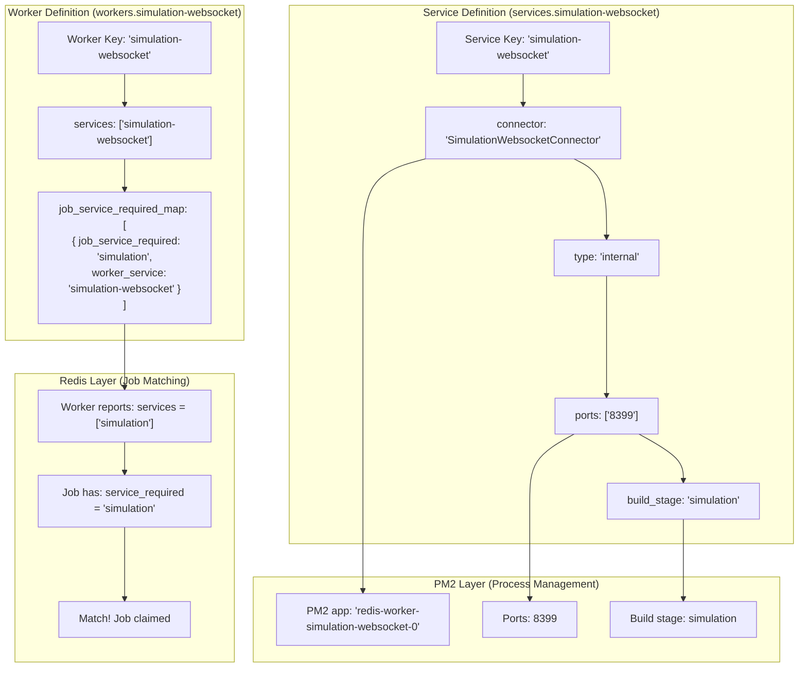
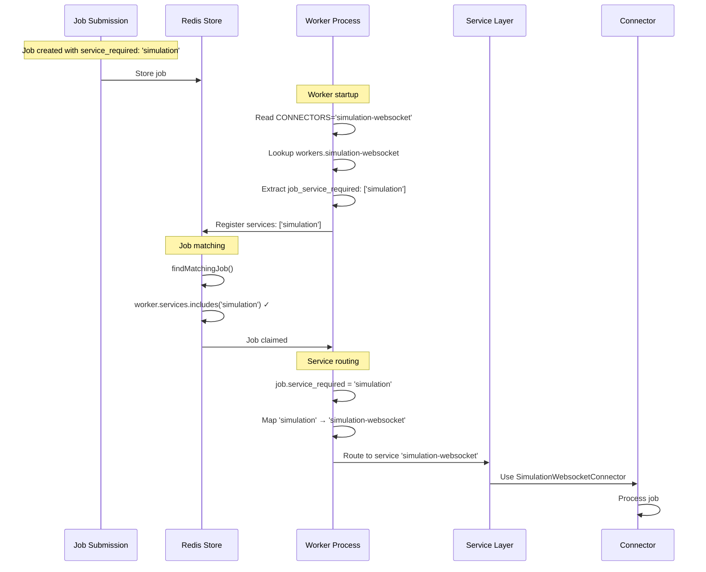
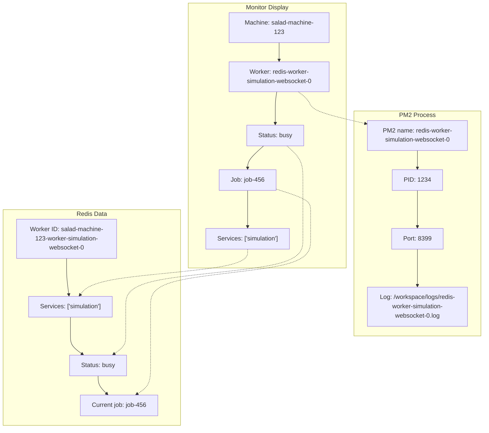

# Worker Service Mapping Architecture - Complete System Flow

## Core Concept: Two-Layer Architecture

**Layer 1: Worker Types** - Define what jobs they can accept
**Layer 2: Services** - Define how to actually process those jobs

<FullscreenDiagram>



</FullscreenDiagram>

## ID Generation Flow

<FullscreenDiagram>



</FullscreenDiagram>

## Worker Definition vs Service Definition

<FullscreenDiagram>



</FullscreenDiagram>

## Complete Job Processing Flow

<FullscreenDiagram>



</FullscreenDiagram>

## Service Mapping Examples

### simulation-websocket Worker

```json
// Worker definition
"simulation-websocket": {
  "services": ["simulation-websocket"],           // Internal service names  
  "job_service_required_map": [
    {
      "job_service_required": "simulation",       // What Redis matching uses
      "worker_service": "simulation-websocket"    // Maps back to service
    }
  ]
}

// Service definition  
"simulation-websocket": {
  "connector": "SimulationWebsocketConnector",
  "type": "internal",
  "ports": ["8399"],
  "build_stage": "simulation"
}
```

**Flow:**
1. **Redis matching**: Job `service_required: "simulation"` matches worker `services: ["simulation"]`
2. **Service routing**: Worker maps `"simulation"` → `"simulation-websocket"` service
3. **PM2 execution**: Service uses `SimulationWebsocketConnector` on port 8399

### openai Worker

```json
// Worker definition
"openai": {
  "services": ["openai-text", "openai-image", "openai-img2img"],
  "job_service_required_map": [
    { "job_service_required": "openai_text", "worker_service": "openai-text" },
    { "job_service_required": "openai_image", "worker_service": "openai-image" },
    { "job_service_required": "openai_img2img", "worker_service": "openai-img2img" }
  ]
}

// Service definitions
"openai-text": { "connector": "OpenAITextConnector", "type": "external" }
"openai-image": { "connector": "OpenAIImageConnector", "type": "external" }
"openai-img2img": { "connector": "OpenAIImg2ImgConnector", "type": "external" }
```

**Flow:**
1. **Redis matching**: Job `service_required: "openai_text"` matches worker `services: ["openai_text", "openai_image", "openai_img2img"]`
2. **Service routing**: Worker maps `"openai_text"` → `"openai-text"` service  
3. **PM2 execution**: Service uses `OpenAITextConnector` (external API)

## Status Monitoring & IDs

<FullscreenDiagram>



</FullscreenDiagram>

## Environment Variables by Layer

| Variable | Set By | Used By | Purpose | Example |
|----------|---------|---------|---------|---------|
| `MACHINE_ID` | Machine config | PM2 generator | Machine identification | `salad-machine-123` |
| `WORKERS` | Machine config | PM2 generator | Worker types for machine | `simulation-websocket:1,openai:1` |
| `WORKER_ID` | PM2 generator | Worker process | Unique worker instance | `salad-machine-123-worker-simulation-websocket-0` |
| `CONNECTORS` | PM2 generator | Worker process | Worker type | `simulation-websocket` |

## Key Architecture Insights

1. **Worker Types vs Services**: Worker types define job acceptance, services define job execution
2. **Two-Phase Mapping**: 
   - Phase 1: `job.service_required` → `worker.services` (Redis matching)
   - Phase 2: `job.service_required` → `worker_service` → connector (internal routing)
3. **ID Hierarchy**: `MACHINE_ID` → `WORKER_ID` → PM2 app name
4. **Service Independence**: Services can be reused by multiple worker types
5. **Monitor Complexity**: Shows Redis IDs for job tracking, PM2 names for process management