# System Architecture

This section provides comprehensive architectural diagrams and documentation for the EMP Job Queue system, covering both the current implementation and future evolution toward the North Star architecture.

## Quick Reference

- [Current Architecture](#current-architecture) - Production system as deployed today
- [Logging Infrastructure](#logging-infrastructure) - Structured logging and observability
- [Network Flow](#network-flow) - Data flow between components
- [Deployment Architecture](#deployment-architecture) - Container and service deployment
- [North Star Evolution](#north-star-evolution) - Future specialized pools architecture

## Current Architecture

```mermaid
graph TB
    %% External Users and Systems
    USER[🧑‍💻 Users]
    CLIENT[📱 Client Applications]
    WEBHOOK_RECEIVER[🔗 Webhook Receivers]
    
    %% Core Services
    subgraph "Core Infrastructure"
        API[🌐 API Server<br/>Port 3331]
        WEBHOOK[📨 Webhook Service<br/>Port 3332]
        MONITOR[📊 Monitor UI<br/>Port 3333]
        REDIS[(🗄️ Redis<br/>Job Queue + Functions)]
    end
    
    %% Machine Pool
    subgraph "Distributed Machine Pool"
        subgraph "Machine A (Railway/Vast.ai)"
            MA_HEALTH[⚕️ Health Server]
            MA_FLUENT[📋 Fluent Bit]
            MA_W1[👷 Worker comfyui-0]
            MA_W2[👷 Worker comfyui-1]
            MA_C1[🎨 ComfyUI Instance GPU0]
            MA_C2[🎨 ComfyUI Instance GPU1]
        end
        
        subgraph "Machine B (Railway/Vast.ai)"
            MB_HEALTH[⚕️ Health Server]
            MB_FLUENT[📋 Fluent Bit]
            MB_W1[👷 Worker simulation-0]
            MB_S1[🔬 Simulation Service]
        end
        
        subgraph "Machine C (Railway/Vast.ai)"
            MC_HEALTH[⚕️ Health Server]
            MC_FLUENT[📋 Fluent Bit]
            MC_W1[👷 Worker comfyui-remote-0]
            MC_EXT[🌐 External ComfyUI]
        end
    end
    
    %% Observability Stack
    subgraph "Observability"
        FLUENTD[📊 Fluentd Aggregator]
        DASH0[📈 Dash0 Platform]
    end
    
    %% User Interactions
    USER --> CLIENT
    CLIENT -->|HTTP/WebSocket| API
    USER -->|Browser| MONITOR
    
    %% Core Service Communications
    API <-->|Job Management| REDIS
    WEBHOOK <-->|Event Publishing| REDIS
    MONITOR <-->|Real-time Updates| API
    API -->|Webhook Delivery| WEBHOOK_RECEIVER
    
    %% Worker Communications
    MA_W1 <-->|Job Requests/Updates| REDIS
    MA_W2 <-->|Job Requests/Updates| REDIS
    MB_W1 <-->|Job Requests/Updates| REDIS
    MC_W1 <-->|Job Requests/Updates| REDIS
    
    %% Service Connections
    MA_W1 <-->|WebSocket/HTTP| MA_C1
    MA_W2 <-->|WebSocket/HTTP| MA_C2
    MB_W1 <-->|HTTP| MB_S1
    MC_W1 <-->|WebSocket/HTTP| MC_EXT
    
    %% Health Monitoring
    MA_HEALTH -->|Status Reports| REDIS
    MB_HEALTH -->|Status Reports| REDIS
    MC_HEALTH -->|Status Reports| REDIS
    
    %% Logging Flow
    MA_W1 -->|Structured Logs| MA_FLUENT
    MA_W2 -->|Structured Logs| MA_FLUENT
    MB_W1 -->|Structured Logs| MB_FLUENT
    MC_W1 -->|Structured Logs| MC_FLUENT
    
    MA_FLUENT -->|HTTP| FLUENTD
    MB_FLUENT -->|HTTP| FLUENTD
    MC_FLUENT -->|HTTP| FLUENTD
    FLUENTD -->|HTTPS| DASH0
    
    %% Styling
    classDef userClass fill:#e1f5fe,stroke:#01579b,stroke-width:2px
    classDef coreClass fill:#f3e5f5,stroke:#4a148c,stroke-width:2px
    classDef machineClass fill:#e8f5e8,stroke:#1b5e20,stroke-width:2px
    classDef workerClass fill:#fff3e0,stroke:#e65100,stroke-width:2px
    classDef serviceClass fill:#fce4ec,stroke:#880e4f,stroke-width:2px
    classDef observabilityClass fill:#f1f8e9,stroke:#33691e,stroke-width:2px
    
    class USER,CLIENT,WEBHOOK_RECEIVER userClass
    class API,WEBHOOK,MONITOR,REDIS coreClass
    class MA_HEALTH,MB_HEALTH,MC_HEALTH,MA_FLUENT,MB_FLUENT,MC_FLUENT machineClass
    class MA_W1,MA_W2,MB_W1,MC_W1 workerClass
    class MA_C1,MA_C2,MB_S1,MC_EXT serviceClass
    class FLUENTD,DASH0 observabilityClass
```

<FullscreenDiagram>

</FullscreenDiagram>

## Logging Infrastructure

```mermaid
graph TB
    %% Worker Layer
    subgraph "Workers (Per Machine)"
        W1[👷 ComfyUI Worker]
        W2[👷 Simulation Worker]
        W3[👷 Remote Worker]
    end
    
    %% Connector Layer
    subgraph "Connectors"
        C1[🔌 ComfyUI Connector<br/>ConnectorLogger]
        C2[🔌 Simulation Connector<br/>ConnectorLogger]
        C3[🔌 Remote Connector<br/>ConnectorLogger]
    end
    
    %% Local Logging
    subgraph "Machine Logging (Per Container)"
        FB[📋 Fluent Bit<br/>Port 9880]
        CONF[⚙️ fluent-bit-worker.conf<br/>• HTTP Input<br/>• Metadata Enrichment<br/>• Service Routing]
    end
    
    %% Aggregation
    subgraph "Central Aggregation"
        FD[📊 Fluentd<br/>Port 8888<br/>calyptia-fluentd.conf]
    end
    
    %% Observability
    subgraph "Production Observability"
        DASH0[📈 Dash0 Platform<br/>🔍 Log Analysis<br/>📊 Metrics & Alerts]
    end
    
    %% Log Flow
    W1 --> C1
    W2 --> C2
    W3 --> C3
    
    C1 -->|Structured JSON<br/>Job Lifecycle Events| FB
    C2 -->|Structured JSON<br/>Job Lifecycle Events| FB
    C3 -->|Structured JSON<br/>Job Lifecycle Events| FB
    
    FB -->|Enriched Logs<br/>+ Machine Metadata| FD
    FD -->|HTTPS JSON| DASH0
    
    %% Event Types
    subgraph "Logged Events"
        E1[📥 Job Received<br/>• Job ID<br/>• Input Size<br/>• Model]
        E2[▶️ Job Started<br/>• Processing Begin<br/>• Resource Allocation]
        E3[📊 Job Progress<br/>• Progress %<br/>• Current Step<br/>• ETA]
        E4[✅ Job Completed<br/>• Duration<br/>• Output Size<br/>• Success Metrics]
        E5[❌ Job Failed<br/>• Error Details<br/>• Failure Point<br/>• Retry Info]
        E6[⚕️ Health Checks<br/>• Service Status<br/>• Resource Usage<br/>• API Availability]
    end
    
    %% Metadata Enrichment
    subgraph "Metadata Enrichment (Fluent Bit)"
        M1[🏷️ Worker Context<br/>• machine_id<br/>• worker_id<br/>• service_type<br/>• connector_id]
        M2[🌐 Deployment Context<br/>• deployment_env<br/>• region<br/>• service_instance]
        M3[⏰ Log Metadata<br/>• log_source<br/>• processed_at<br/>• normalized_level]
    end
    
    %% Styling
    classDef workerClass fill:#fff3e0,stroke:#e65100,stroke-width:2px
    classDef connectorClass fill:#fce4ec,stroke:#880e4f,stroke-width:2px
    classDef loggingClass fill:#e8f5e8,stroke:#1b5e20,stroke-width:2px
    classDef aggregationClass fill:#f3e5f5,stroke:#4a148c,stroke-width:2px
    classDef observabilityClass fill:#f1f8e9,stroke:#33691e,stroke-width:2px
    classDef eventClass fill:#e1f5fe,stroke:#01579b,stroke-width:2px
    classDef metadataClass fill:#fafafa,stroke:#616161,stroke-width:1px
    
    class W1,W2,W3 workerClass
    class C1,C2,C3 connectorClass
    class FB,CONF loggingClass
    class FD aggregationClass
    class DASH0 observabilityClass
    class E1,E2,E3,E4,E5,E6 eventClass
    class M1,M2,M3 metadataClass
```

<FullscreenDiagram>

</FullscreenDiagram>

## Network Flow

<FullscreenDiagram>

</FullscreenDiagram>

## Deployment Architecture

```mermaid
graph TB
    %% Cloud Providers
    subgraph "Railway"
        subgraph "API Infrastructure"
            R_API[🌐 API Service]
            R_WEBHOOK[📨 Webhook Service]
            R_MONITOR[📊 Monitor Service]
            R_REDIS[(🗄️ Redis Database)]
            R_FLUENTD[📊 Fluentd Service]
        end
    end
    
    subgraph "Vast.ai / SALAD (Spot Instances)"
        subgraph "Machine Pool A"
            VA_CONTAINER[🐳 emp-machine:latest<br/>2x RTX 4090]
            subgraph "PM2 Processes"
                VA_HEALTH[⚕️ health-server]
                VA_FLUENT[📋 fluent-bit]
                VA_W1[👷 comfyui-gpu0]
                VA_W2[👷 comfyui-gpu1]
                VA_C1[🎨 ComfyUI :8188]
                VA_C2[🎨 ComfyUI :8189]
            end
        end
        
        subgraph "Machine Pool B"
            VB_CONTAINER[🐳 emp-machine:latest<br/>4x RTX 3080]
            subgraph "PM2 Processes "
                VB_HEALTH[⚕️ health-server]
                VB_FLUENT[📋 fluent-bit]
                VB_W1[👷 comfyui-gpu0]
                VB_W2[👷 comfyui-gpu1]
                VB_W3[👷 comfyui-gpu2]
                VB_W4[👷 comfyui-gpu3]
            end
        end
    end
    
    subgraph "External Services"
        EXT_COMFYUI[🌐 External ComfyUI<br/>Customer Infrastructure]
        DASH0[📈 Dash0<br/>Observability Platform]
    end
    
    %% Network Connections
    R_API <-->|TCP| R_REDIS
    R_WEBHOOK <-->|TCP| R_REDIS
    R_MONITOR <-->|HTTP/WS| R_API
    
    VA_W1 <-->|Redis Protocol| R_REDIS
    VA_W2 <-->|Redis Protocol| R_REDIS
    VB_W1 <-->|Redis Protocol| R_REDIS
    VB_W2 <-->|Redis Protocol| R_REDIS
    VB_W3 <-->|Redis Protocol| R_REDIS
    VB_W4 <-->|Redis Protocol| R_REDIS
    
    VA_W1 <-->|WebSocket| VA_C1
    VA_W2 <-->|WebSocket| VA_C2
    VB_W1 <-->|WebSocket| VB_C1
    VB_W2 <-->|WebSocket| VB_C2
    
    VA_FLUENT -->|HTTP:8888| R_FLUENTD
    VB_FLUENT -->|HTTP:8888| R_FLUENTD
    R_FLUENTD -->|HTTPS| DASH0
    
    %% Port Mappings
    VA_CONTAINER -.->|8200:8188| VA_C1
    VA_CONTAINER -.->|8201:8189| VA_C2
    
    %% Styling
    classDef railwayClass fill:#e8eaf6,stroke:#3f51b5,stroke-width:2px
    classDef vastClass fill:#e8f5e8,stroke:#4caf50,stroke-width:2px
    classDef containerClass fill:#fff3e0,stroke:#ff9800,stroke-width:2px
    classDef processClass fill:#fce4ec,stroke:#e91e63,stroke-width:2px
    classDef externalClass fill:#f1f8e9,stroke:#689f38,stroke-width:2px
    
    class R_API,R_WEBHOOK,R_MONITOR,R_REDIS,R_FLUENTD railwayClass
    class VA_CONTAINER,VB_CONTAINER vastClass
    class VA_HEALTH,VA_FLUENT,VA_W1,VA_W2,VA_C1,VA_C2 processClass
    class VB_HEALTH,VB_FLUENT,VB_W1,VB_W2,VB_W3,VB_W4,VB_C1,VB_C2 processClass
    class EXT_COMFYUI,DASH0 externalClass
```

<FullscreenDiagram>

</FullscreenDiagram>

## North Star Evolution

```mermaid
graph TB
    %% Current State
    subgraph "Current: Uniform Machines"
        CURRENT[🔄 Mixed Workloads<br/>• 1s text jobs<br/>• 10min video jobs<br/>• Resource contention<br/>• Model downloads]
    end
    
    %% Target State
    subgraph "Target: Specialized Pools"
        subgraph "Fast Lane Pool"
            FAST[⚡ CPU-Optimized<br/>• Text processing<br/>• Quick responses<br/>• 20-40GB storage<br/>• Pre-loaded models]
        end
        
        subgraph "Standard Pool"
            STANDARD[🎨 Balanced GPU<br/>• Image generation<br/>• Typical workflows<br/>• 80-120GB storage<br/>• Smart model caching]
        end
        
        subgraph "Heavy Pool"
            HEAVY[🚀 High-End GPU<br/>• Video processing<br/>• Complex workflows<br/>• 150-300GB storage<br/>• Specialized models]
        end
    end
    
    %% Intelligence Layer
    subgraph "Model Intelligence Service"
        PREDICTOR[🧠 Predictive Model Placement<br/>• Usage pattern analysis<br/>• Preemptive model loading<br/>• Cross-pool optimization]
        ROUTER[🎯 Multi-dimensional Job Router<br/>• Duration-based routing<br/>• Resource requirement matching<br/>• Load balancing]
    end
    
    %% Enhanced Observability
    subgraph "Advanced Observability"
        METRICS[📊 Pool Performance Metrics<br/>• Resource utilization<br/>• Queue efficiency<br/>• Model hit rates]
        ML_OPS[🔍 ML-Powered Operations<br/>• Anomaly detection<br/>• Capacity planning<br/>• Cost optimization]
    end
    
    %% Evolution Path
    CURRENT -->|Phase 1: Pool Separation| FAST
    CURRENT -->|Phase 1: Pool Separation| STANDARD  
    CURRENT -->|Phase 1: Pool Separation| HEAVY
    
    FAST --> PREDICTOR
    STANDARD --> PREDICTOR
    HEAVY --> PREDICTOR
    
    PREDICTOR --> ROUTER
    ROUTER --> METRICS
    METRICS --> ML_OPS
    
    %% Benefits
    subgraph "Benefits"
        BENEFIT1[🎯 95% optimal job routing]
        BENEFIT2[⚡ <10s wait times for 95% of jobs]
        BENEFIT3[📈 10x job volume capacity]
        BENEFIT4[💰 50% cost reduction]
    end
    
    ML_OPS --> BENEFIT1
    ML_OPS --> BENEFIT2
    ML_OPS --> BENEFIT3
    ML_OPS --> BENEFIT4
    
    %% Styling
    classDef currentClass fill:#ffebee,stroke:#c62828,stroke-width:2px
    classDef fastClass fill:#e8f5e8,stroke:#2e7d32,stroke-width:2px
    classDef standardClass fill:#e3f2fd,stroke:#1565c0,stroke-width:2px
    classDef heavyClass fill:#fce4ec,stroke:#ad1457,stroke-width:2px
    classDef intelligenceClass fill:#f3e5f5,stroke:#6a1b9a,stroke-width:2px
    classDef observabilityClass fill:#fff8e1,stroke:#f57f17,stroke-width:2px
    classDef benefitClass fill:#f1f8e9,stroke:#388e3c,stroke-width:2px
    
    class CURRENT currentClass
    class FAST fastClass
    class STANDARD standardClass
    class HEAVY heavyClass
    class PREDICTOR,ROUTER intelligenceClass
    class METRICS,ML_OPS observabilityClass
    class BENEFIT1,BENEFIT2,BENEFIT3,BENEFIT4 benefitClass
```

<FullscreenDiagram>

</FullscreenDiagram>

## Key Components

### Core Services
- **API Server**: Job submission, status tracking, WebSocket real-time updates
- **Webhook Service**: Event notifications to external systems  
- **Monitor UI**: Real-time dashboard for system observability
- **Redis**: Job queue, worker coordination, Redis Functions for atomic operations

### Worker Infrastructure  
- **Machine Pools**: Distributed across Railway, Vast.ai, SALAD for elastic scaling
- **PM2 Management**: Process management with automatic restarts and log rotation
- **Health Monitoring**: Continuous service health checks and status reporting

### Logging & Observability
- **ConnectorLogger**: Structured logging at the connector level
- **Fluent Bit**: Local log collection and metadata enrichment
- **Fluentd**: Central log aggregation and routing
- **Dash0**: Production observability platform

### Job Processing
- **Redis Functions**: Atomic job matching based on worker capabilities
- **Capability Matching**: Dynamic worker selection based on requirements
- **Progress Streaming**: Real-time job progress via WebSocket
- **Automatic Retry**: Failed job retry with exponential backoff

## Performance Characteristics

- **Job Throughput**: Currently 100+ concurrent jobs across distributed machines
- **Response Time**: <2s for job submission, real-time progress updates
- **Scalability**: Elastic scaling from 10→50→10 machines daily
- **Reliability**: 99.9% job completion rate with automatic retry
- **Observability**: Full job lifecycle tracking from submission to completion

## Next Steps

The architecture is designed for evolution toward specialized machine pools that will:
1. **Eliminate resource contention** between fast and slow jobs
2. **Reduce model download wait times** through predictive placement  
3. **Optimize resource utilization** with pool-specific configurations
4. **Scale to 10x job volume** while reducing operational costs

See [North Star Architecture](/north-star) for detailed evolution plans.