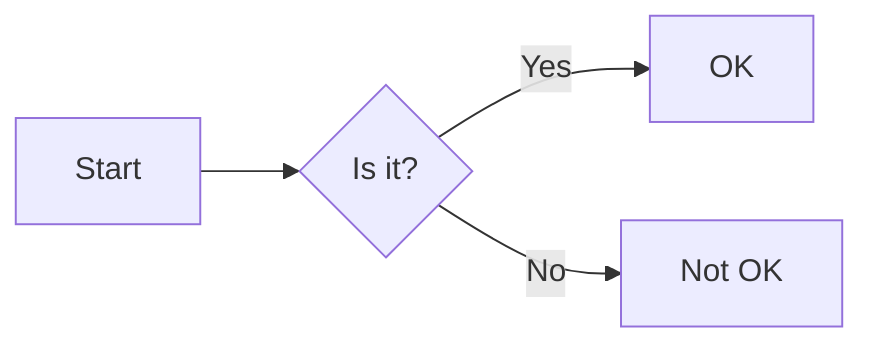
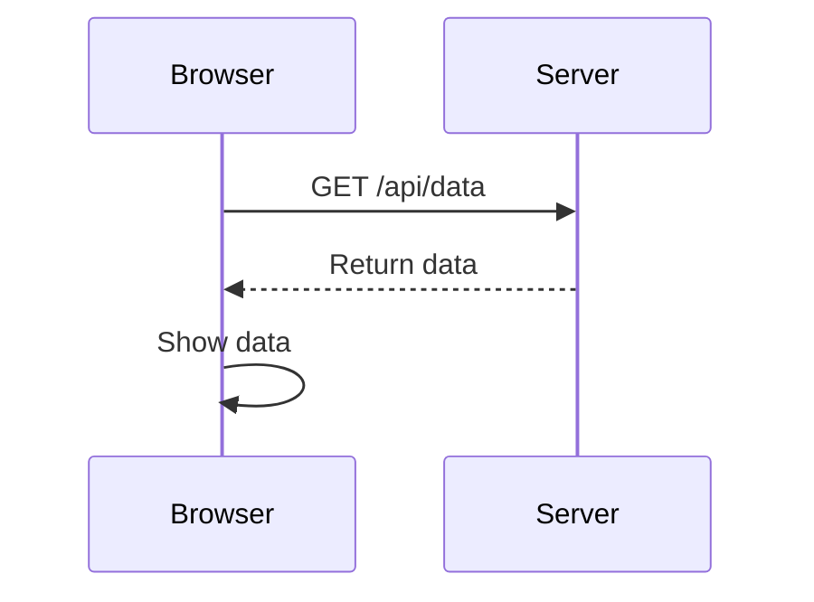
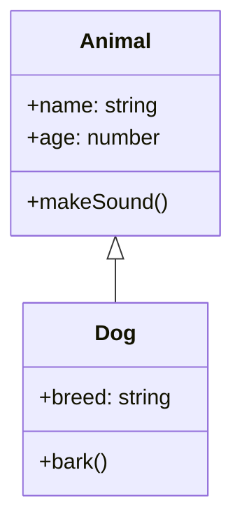
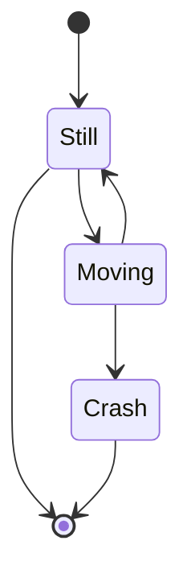

# Mermaid Examples

## Flowchart

<FullscreenDiagram>

</FullscreenDiagram>

## Sequence Diagram

<FullscreenDiagram>

</FullscreenDiagram>

## Class Diagram

<FullscreenDiagram>

</FullscreenDiagram>

## State Diagram

<FullscreenDiagram>

</FullscreenDiagram>
