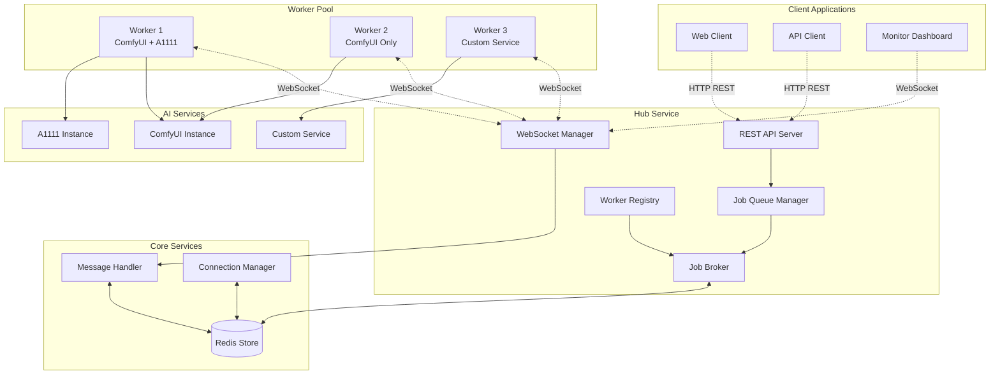
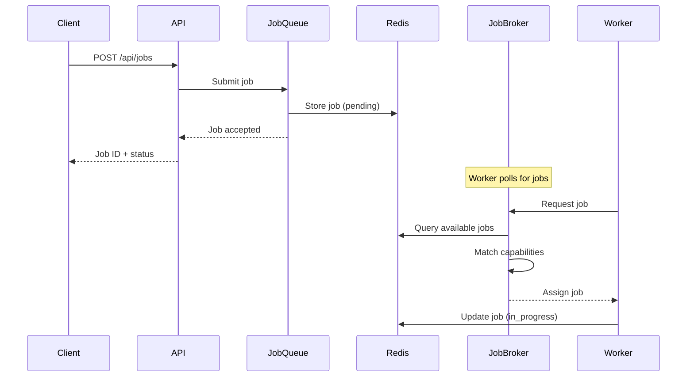
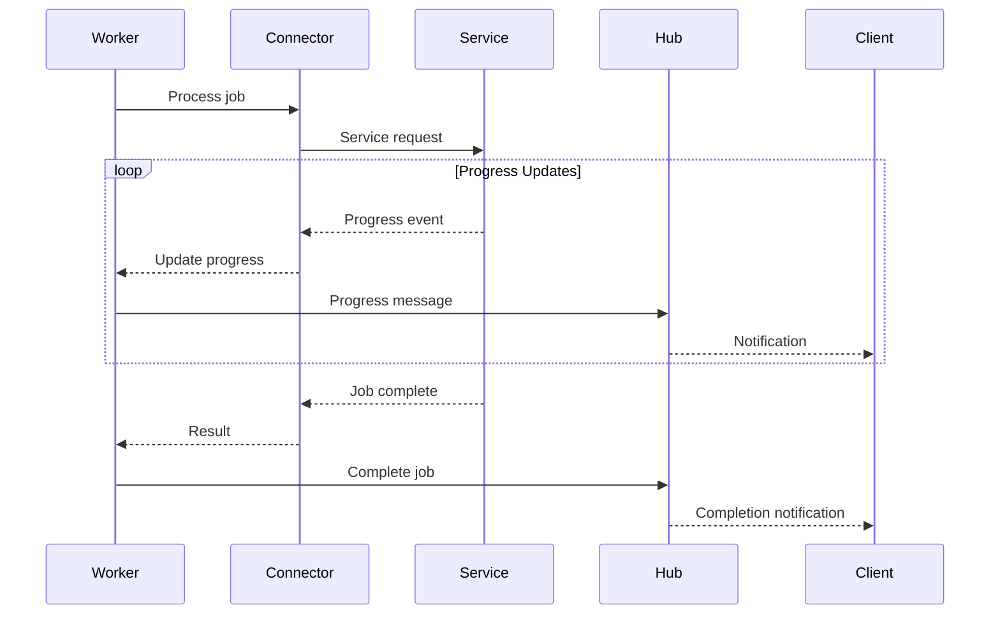
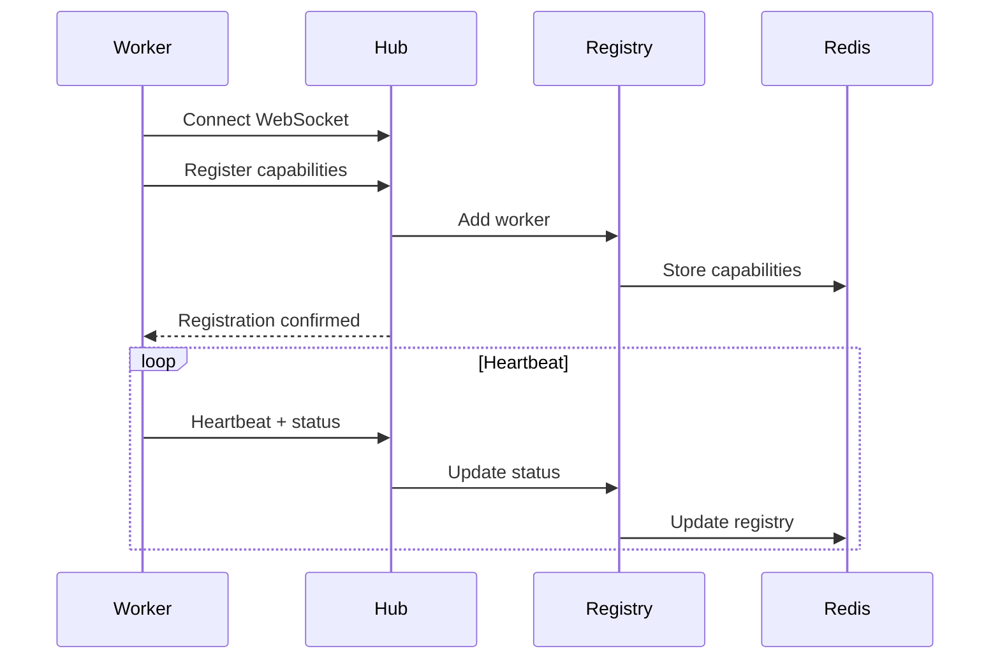

# System Architecture

The EmProps Job Queue is built on a pull-based architecture that ensures optimal resource utilization and provides sophisticated job-worker matching capabilities. This document explains the system's architecture, components, and their interactions.

## Architecture Overview

<FullscreenDiagram>



</FullscreenDiagram>

## Core Principles

### 1. Pull-Based Job Selection

Unlike traditional push-based systems, workers actively request jobs:

- **Worker Initiative**: Workers query the system: "What's the highest priority job I can handle?"
- **Capability Matching**: The system finds the best job for each worker's capabilities
- **True Priority**: Ensures highest priority jobs are processed first
- **Load Balancing**: Workers naturally balance load based on their availability

### 2. Multi-Dimensional Capability Matching

Jobs are matched to workers based on multiple criteria:

- **Service Type**: ComfyUI, A1111, custom services
- **Component Filtering**: Specific components (text-to-image-xl, upscaling)
- **Workflow Filtering**: Version-specific workflows
- **Hardware Requirements**: GPU memory, CPU cores, RAM
- **Customer Isolation**: Strict, loose, or no isolation
- **Geographic/Compliance**: Regional and compliance requirements
- **Performance Tiers**: Fast, balanced, quality processing

### 3. Real-Time Communication

All system components communicate via structured messages:

- **WebSocket Connections**: Low-latency, bi-directional communication
- **Message Types**: Strongly-typed messages for all operations
- **Event-Driven**: Reactive architecture with event-based updates
- **Reliable Delivery**: Message acknowledgment and retry mechanisms

## System Components

### Hub Service (Central Orchestrator)

The Hub Service acts as the central coordinator for all system operations.

#### REST API Server
- **Job Submission**: Accept jobs via HTTP POST
- **Status Queries**: Check job status and progress
- **System Monitoring**: Health checks and metrics
- **Worker Management**: Register and manage workers

```typescript
// Job submission endpoint
POST /api/jobs
{
  "type": "text_to_image",
  "priority": 75,
  "payload": { "prompt": "...", "steps": 20 },
  "requirements": {
    "service_type": "comfyui",
    "component": "text-to-image-xl",
    "hardware": { "gpu_memory_gb": 8 }
  }
}
```

#### WebSocket Manager
- **Worker Connections**: Maintain persistent connections with workers
- **Client Notifications**: Real-time updates to subscribed clients
- **Message Routing**: Route messages between components
- **Connection Health**: Monitor and manage connection status

#### Job Queue Manager
- **Priority Queuing**: Redis-based priority queue with FIFO within priorities
- **Job Lifecycle**: Manage job state transitions
- **Timeout Handling**: Automatic job timeout and retry logic
- **Queue Optimization**: Efficient job storage and retrieval

#### Worker Registry
- **Capability Tracking**: Maintain current worker capabilities
- **Status Monitoring**: Track worker health and availability
- **Load Balancing**: Distribute jobs based on worker capacity
- **Dynamic Updates**: Handle capability changes in real-time

#### Job Broker
- **Intelligent Matching**: Multi-dimensional job-worker matching
- **Scoring Algorithm**: Rank workers by suitability
- **Conflict Resolution**: Handle competing worker claims
- **Performance Optimization**: Minimize matching latency

### Worker System (Distributed Processors)

Workers are autonomous agents that process jobs using various AI services.

#### Base Worker
- **Job Processing Loop**: Continuously poll for and process jobs
- **Lifecycle Management**: Handle job states from assignment to completion
- **Error Handling**: Robust error recovery and reporting
- **Resource Management**: Monitor and report system resources

#### Connector Manager
- **Dynamic Loading**: Load connectors based on configuration
- **Health Monitoring**: Check connector status and availability
- **Resource Sharing**: Manage shared resources between connectors
- **Failover Logic**: Handle connector failures gracefully

#### Service Connectors
- **ComfyUI Connector**: WebSocket integration with ComfyUI
- **A1111 Connector**: HTTP API integration with Automatic1111
- **REST Async Connector**: Generic REST API with async operations
- **WebSocket Connector**: Generic WebSocket service integration
- **Simulation Connector**: Testing and development connector

#### Worker Client
- **Hub Communication**: WebSocket connection to hub
- **Message Handling**: Process incoming job assignments
- **Status Reporting**: Send heartbeats and progress updates
- **Reconnection Logic**: Automatic reconnection on network issues

### Core Services (Shared Infrastructure)

#### Redis Service
- **Job Storage**: Persistent job queue and metadata
- **Worker Registry**: Current worker capabilities and status
- **Message Routing**: Pub/sub for real-time notifications
- **Session Management**: WebSocket connection tracking
- **Caching**: Performance optimization and temporary data

#### Message Handler
- **Message Processing**: Parse and validate incoming messages
- **Type Safety**: Enforce message schema and types
- **Routing Logic**: Direct messages to appropriate handlers
- **Error Handling**: Graceful handling of malformed messages

#### Connection Manager
- **WebSocket Management**: Handle WebSocket lifecycle
- **Authentication**: Validate worker and client connections
- **Load Balancing**: Distribute connections across instances
- **Health Monitoring**: Track connection health and performance

## Data Flow

### Job Submission Flow

<FullscreenDiagram>



</FullscreenDiagram>

### Job Processing Flow

<FullscreenDiagram>



</FullscreenDiagram>

### Worker Registration Flow

<FullscreenDiagram>



</FullscreenDiagram>

## Scalability Considerations

### Horizontal Scaling

- **Multiple Hub Instances**: Load balance API and WebSocket connections
- **Worker Pool Scaling**: Add workers dynamically based on demand
- **Redis Clustering**: Distribute data across Redis cluster
- **Service Instances**: Scale AI services independently

### Performance Optimization

- **Connection Pooling**: Reuse Redis connections
- **Message Batching**: Batch operations for efficiency
- **Caching Strategies**: Cache frequently accessed data
- **Async Processing**: Non-blocking operations throughout

### Fault Tolerance

- **Graceful Degradation**: Continue operating with reduced capacity
- **Automatic Recovery**: Restart failed components automatically
- **Data Persistence**: Survive system restarts
- **Circuit Breakers**: Prevent cascade failures

## Security Architecture

### Authentication & Authorization
- **Worker Authentication**: Token-based worker registration
- **Client Authentication**: API key or JWT tokens
- **Role-Based Access**: Different permissions for different client types

### Network Security
- **TLS Encryption**: All external communications encrypted
- **Internal Networks**: Secure internal communication
- **Firewall Rules**: Restrict access to necessary ports only

### Data Protection
- **Customer Isolation**: Enforce customer data separation
- **Audit Logging**: Track all system operations
- **Data Retention**: Configurable data retention policies

## Next Steps

- Continue with [Job Lifecycle](./job-lifecycle) to understand job processing flow
- Review [Worker Selection](./worker-selection) for capability matching details
- Explore [Notifications](./notifications) for real-time communication patterns