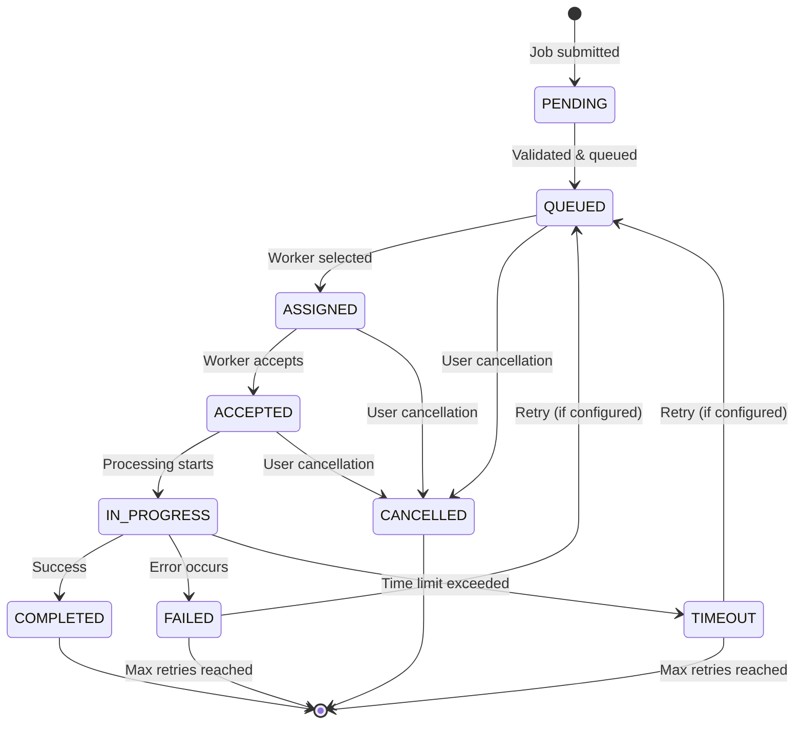
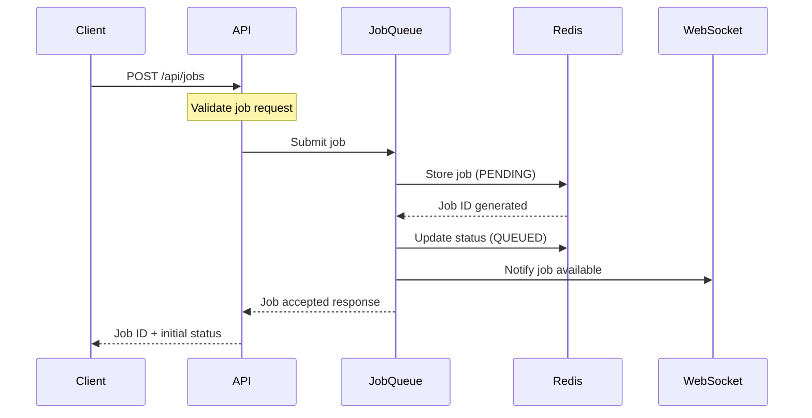
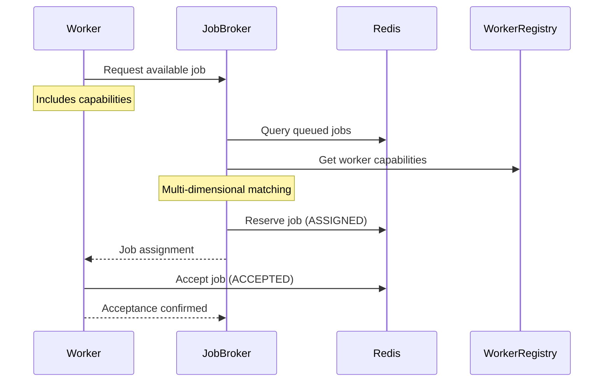
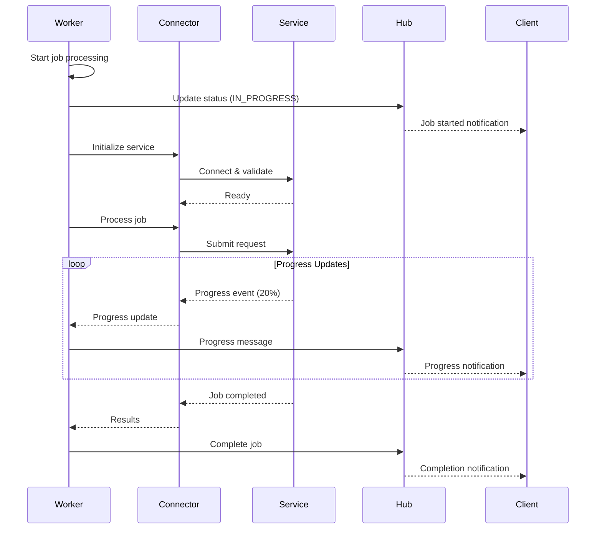
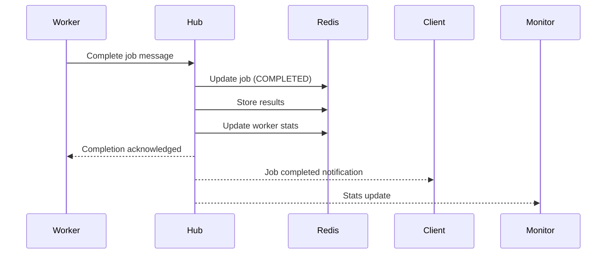
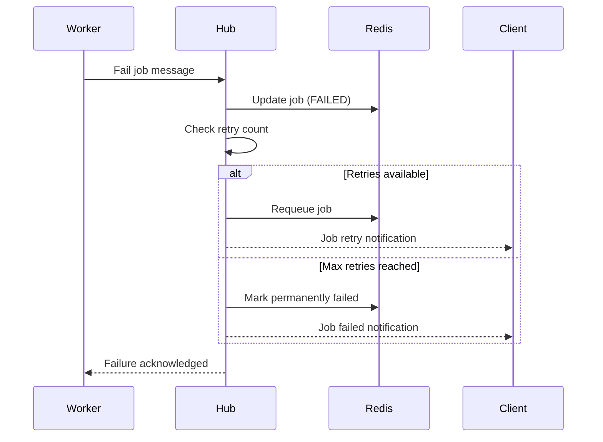
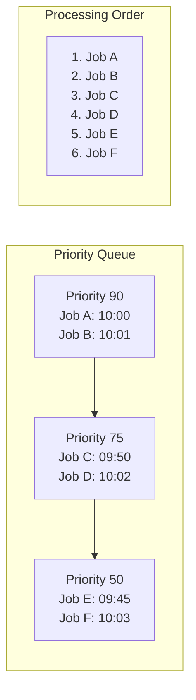

# Job Lifecycle

This document explains the complete lifecycle of a job in the EmProps Job Queue system, from initial submission through final completion or failure. Understanding this flow is crucial for integrating with the system and debugging issues.

## Job States

Jobs progress through several well-defined states during their lifecycle:

<FullscreenDiagram>



</FullscreenDiagram>

### Job Status Definitions

- **PENDING**: Job submitted but not yet validated or queued
- **QUEUED**: Job is in the priority queue waiting for a worker
- **ASSIGNED**: Job has been assigned to a worker but not yet accepted
- **ACCEPTED**: Worker has accepted the job and is preparing to process
- **IN_PROGRESS**: Job is actively being processed by the worker
- **COMPLETED**: Job finished successfully with results
- **FAILED**: Job failed due to an error (may be retried)
- **TIMEOUT**: Job exceeded time limits (may be retried)
- **CANCELLED**: Job was cancelled by user or system

## Complete Job Flow

### 1. Job Submission

The lifecycle begins when a client submits a job to the hub:

<FullscreenDiagram>



</FullscreenDiagram>

**Job Submission Request**:
```json
{
  "type": "text_to_image",
  "priority": 75,
  "payload": {
    "prompt": "a beautiful landscape with mountains",
    "steps": 30,
    "cfg_scale": 7.5,
    "width": 1024,
    "height": 1024
  },
  "requirements": {
    "service_type": "comfyui",
    "component": "text-to-image-xl",
    "hardware": {
      "gpu_memory_gb": 8
    },
    "quality_level": "quality",
    "timeout_minutes": 15
  },
  "customer_id": "customer-123",
  "max_retries": 3
}
```

**Job Acceptance Response**:
```json
{
  "job_id": "job-abc123",
  "status": "queued",
  "position": 3,
  "estimated_start": "2024-01-15T10:05:30Z",
  "created_at": "2024-01-15T10:03:15Z"
}
```

### 2. Worker Job Request (Pull-Based)

Workers actively poll the system for jobs they can handle:

<FullscreenDiagram>



</FullscreenDiagram>

**Worker Job Request**:
```json
{
  "type": "claim_job",
  "worker_id": "worker-gpu-01",
  "capabilities": {
    "services": ["comfyui", "a1111"],
    "components": ["text-to-image-xl", "upscaling"],
    "hardware": {
      "gpu_memory_gb": 16,
      "gpu_model": "RTX 4090"
    },
    "customer_access": {
      "isolation": "loose"
    }
  },
  "max_concurrent_jobs": 2,
  "current_load": 0.3
}
```

**Job Assignment Response**:
```json
{
  "type": "job_assigned",
  "job_id": "job-abc123",
  "job_type": "text_to_image",
  "priority": 75,
  "payload": { /* job payload */ },
  "requirements": { /* job requirements */ },
  "claim_timeout": 30000,
  "estimated_processing_time": 45
}
```

### 3. Job Processing

Once a worker accepts a job, it begins processing:

<FullscreenDiagram>



</FullscreenDiagram>

**Progress Update Message**:
```json
{
  "type": "update_job_progress",
  "job_id": "job-abc123",
  "worker_id": "worker-gpu-01",
  "status": "in_progress",
  "progress": 45,
  "message": "Generating image - step 14/30",
  "current_step": "sampling",
  "estimated_completion": "2024-01-15T10:08:30Z",
  "connector_details": {
    "service": "comfyui",
    "connected": true,
    "queue_position": 0
  }
}
```

### 4. Job Completion

When processing finishes successfully:

<FullscreenDiagram>



</FullscreenDiagram>

**Job Completion Message**:
```json
{
  "type": "complete_job",
  "job_id": "job-abc123",
  "worker_id": "worker-gpu-01",
  "status": "completed",
  "processing_time": 67.5,
  "result": {
    "success": true,
    "output_files": [
      "https://storage.example.com/results/job-abc123/image.png"
    ],
    "metadata": {
      "actual_steps": 30,
      "cfg_scale": 7.5,
      "seed": 1234567890,
      "model": "sdxl_base_1.0.safetensors"
    },
    "connector_info": {
      "connector_type": "comfyui",
      "service_version": "0.0.45",
      "processing_stats": {
        "gpu_memory_peak": 12.5,
        "total_time": 67.5,
        "sampling_time": 45.2
      }
    }
  }
}
```

### 5. Error Handling

When jobs fail, the system handles retries and notifications:

<FullscreenDiagram>



</FullscreenDiagram>

**Job Failure Message**:
```json
{
  "type": "fail_job",
  "job_id": "job-abc123",
  "worker_id": "worker-gpu-01",
  "error": "Service connection timeout",
  "retry": true,
  "error_details": {
    "error_type": "ServiceTimeoutError",
    "connector": "comfyui",
    "service_url": "http://localhost:8188",
    "timeout_seconds": 30,
    "attempts": 3
  },
  "processing_time": 120.0
}
```

## Job Priority and Queuing

### Priority Levels

Jobs are processed using a priority + FIFO system:

- **Priority Range**: 0-100 (higher number = higher priority)
- **Default Priority**: 50
- **System Jobs**: 90-100 (health checks, maintenance)
- **High Priority**: 70-89 (premium customers, urgent tasks)
- **Normal Priority**: 30-69 (standard processing)
- **Low Priority**: 0-29 (background tasks, testing)

### Queue Behavior

<FullscreenDiagram>



</FullscreenDiagram>

**Queue Position Calculation**:
1. Jobs are grouped by priority (highest first)
2. Within each priority, jobs are ordered by submission time (FIFO)
3. New jobs are inserted at the correct position
4. Queue position is recalculated on each job state change

## Timeout and Retry Logic

### Timeout Handling

Jobs have multiple timeout mechanisms:

- **Assignment Timeout**: Worker must accept within 30 seconds
- **Processing Timeout**: Configurable per job (default: 30 minutes)
- **Heartbeat Timeout**: Worker must send progress updates every 60 seconds
- **Connection Timeout**: WebSocket connections timeout after 5 minutes of inactivity

### Retry Configuration

```json
{
  "max_retries": 3,
  "retry_delays": [5, 15, 30],  // seconds between retries
  "retry_conditions": [
    "ServiceTimeoutError",
    "TemporaryServiceUnavailable",
    "NetworkError"
  ],
  "no_retry_conditions": [
    "InvalidJobParameters",
    "InsufficientResources",
    "AuthenticationError"
  ]
}
```

## Job Monitoring and Notifications

### Real-Time Updates

Clients can subscribe to job updates via WebSocket:

```json
{
  "type": "subscribe_job",
  "job_id": "job-abc123"
}
```

### Notification Types

- **Job Status Changes**: State transitions
- **Progress Updates**: Processing progress (0-100%)
- **Error Notifications**: Failures and retry attempts
- **Completion Notifications**: Results and metadata
- **Queue Position Updates**: Changes in queue position

### Webhook Support

For systems that prefer HTTP callbacks:

```json
{
  "webhook_url": "https://client.example.com/job-notifications",
  "events": ["status_change", "progress", "completion"],
  "authentication": {
    "type": "bearer_token",
    "token": "client-webhook-token"
  }
}
```

## Performance Considerations

### Job Processing Optimization

- **Batch Similar Jobs**: Group similar jobs for efficiency
- **Resource Preallocation**: Reserve resources before job assignment
- **Predictive Queuing**: Anticipate resource needs based on queue
- **Load Balancing**: Distribute jobs across available workers

### Monitoring Metrics

Key metrics for job lifecycle monitoring:

- **Average Queue Time**: Time from submission to assignment
- **Average Processing Time**: Time from start to completion
- **Success Rate**: Percentage of jobs completing successfully
- **Retry Rate**: Percentage of jobs requiring retries
- **Worker Utilization**: Percentage of time workers are busy
- **Queue Depth**: Number of jobs waiting in queue

## Next Steps

- Learn about [Worker Selection](./worker-selection) algorithms
- Understand [Notifications](./notifications) for real-time updates
- Review [WebSocket API](./websocket-api) for message formats
- Explore [Monitoring](./monitoring) for system observability