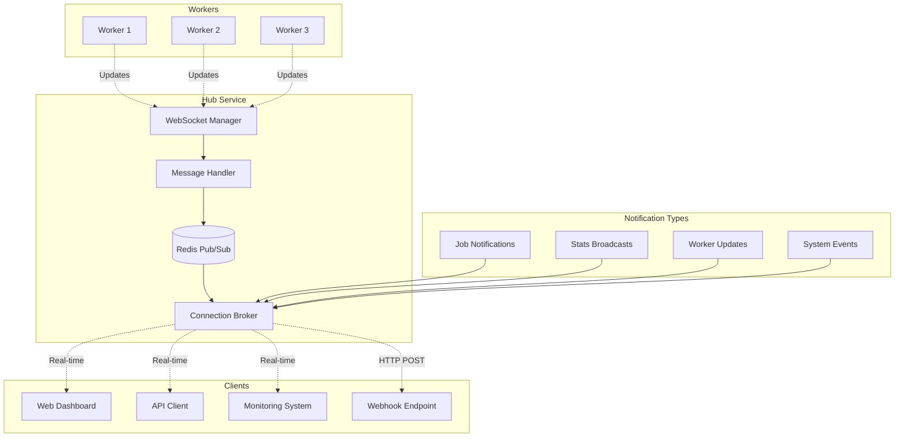

# Client and Monitor Notifications

The EmProps Job Queue system provides comprehensive real-time notification capabilities for clients and monitoring systems. This document explains how to subscribe to updates, the types of notifications available, and how to integrate notification systems into your applications.

## Notification Architecture

The notification system is built on WebSocket connections with structured message types, providing low-latency, real-time updates to all connected clients.

<FullscreenDiagram>



</FullscreenDiagram>

## Connection Types

The system supports different types of client connections:

### 1. Job Clients
Clients that submit jobs and want updates on their progress:

```javascript
const ws = new WebSocket('ws://hub.example.com:3002');

ws.onopen = () => {
  // Identify as job client
  ws.send(JSON.stringify({
    type: 'register_client',
    client_type: 'job_client',
    client_id: 'my-app-v1.0'
  }));
};
```

### 2. Monitoring Dashboards
Administrative interfaces that need system-wide visibility:

```javascript
const ws = new WebSocket('ws://hub.example.com:3002');

ws.onopen = () => {
  // Identify as monitor
  ws.send(JSON.stringify({
    type: 'register_client',
    client_type: 'monitor',
    client_id: 'admin-dashboard'
  }));
  
  // Subscribe to system stats
  ws.send(JSON.stringify({
    type: 'subscribe_stats',
    enabled: true
  }));
};
```

### 3. Worker Monitoring
Systems that track worker performance and health:

```javascript
const ws = new WebSocket('ws://hub.example.com:3002');

ws.onopen = () => {
  // Subscribe to worker updates
  ws.send(JSON.stringify({
    type: 'subscribe_worker_updates',
    enabled: true,
    worker_filters: {
      services: ['comfyui'],
      status: ['idle', 'busy']
    }
  }));
};
```

## Job Notifications

### Job-Specific Subscriptions

Subscribe to updates for specific jobs:

```javascript
// Subscribe to a specific job
ws.send(JSON.stringify({
  type: 'subscribe_job',
  job_id: 'job-abc123',
  timestamp: Date.now()
}));

// Confirmation response
{
  "type": "job_notifications_subscribed",
  "job_id": "job-abc123",
  "timestamp": 1705312345000
}
```

### Job Status Updates

Receive real-time job status changes:

```javascript
// Job accepted notification
{
  "type": "job_accepted",
  "job_id": "job-abc123",
  "status": "queued",
  "position": 3,
  "estimated_start": "2024-01-15T10:05:30Z",
  "notified_workers": 5,
  "timestamp": 1705312345000
}

// Job assigned notification
{
  "type": "job_assigned",
  "job_id": "job-abc123",
  "worker_id": "worker-gpu-01",
  "status": "assigned",
  "estimated_completion": "2024-01-15T10:08:30Z",
  "timestamp": 1705312380000
}

// Job progress notification
{
  "type": "job_update",
  "job_id": "job-abc123",
  "status": "in_progress",
  "progress": 45,
  "message": "Generating image - step 14/30",
  "current_step": "sampling",
  "worker_id": "worker-gpu-01",
  "estimated_completion": "2024-01-15T10:08:15Z",
  "timestamp": 1705312395000
}

// Job completion notification
{
  "type": "job_completed",
  "job_id": "job-abc123",
  "status": "completed",
  "worker_id": "worker-gpu-01",
  "processing_time": 67.5,
  "result": {
    "success": true,
    "output_files": ["https://storage.example.com/results/job-abc123/image.png"],
    "metadata": {
      "steps": 30,
      "cfg_scale": 7.5,
      "seed": 1234567890
    }
  },
  "timestamp": 1705312445000
}
```

### Bulk Job Subscriptions

Subscribe to all jobs for a customer or job type:

```javascript
// Subscribe to all jobs for a customer
ws.send(JSON.stringify({
  type: 'subscribe_job_notifications',
  enabled: true,
  filters: {
    customer_id: 'customer-123',
    job_types: ['text_to_image', 'upscaling']
  }
}));

// Subscribe to high-priority jobs
ws.send(JSON.stringify({
  type: 'subscribe_job_notifications',
  enabled: true,
  filters: {
    priority_min: 80,
    status: ['queued', 'in_progress']
  }
}));
```

## System Statistics

### Stats Subscription

Monitor system-wide statistics:

```javascript
// Subscribe to stats broadcasts
ws.send(JSON.stringify({
  type: 'subscribe_stats',
  enabled: true,
  interval_seconds: 5  // Update frequency
}));

// Confirmation
{
  "type": "subscription_confirmed",
  "subscription_type": "stats",
  "update_interval": 5,
  "timestamp": 1705312345000
}
```

### Stats Broadcast Format

Comprehensive system statistics sent periodically:

```javascript
{
  "type": "stats_broadcast",
  "message_id": "stats-msg-12345",
  "connections": {
    "clients": ["client-1", "client-2"],
    "workers": ["worker-gpu-01", "worker-gpu-02"],
    "monitors": ["admin-dashboard"]
  },
  "workers": {
    "worker-gpu-01": {
      "status": "busy",
      "connection_status": "connected",
      "is_accepting_jobs": true,
      "supported_job_types": ["text_to_image", "upscaling"],
      "capabilities": {
        "services": ["comfyui"],
        "gpu_memory_gb": 16,
        "concurrent_jobs": 2
      },
      "connected_at": "2024-01-15T09:30:00Z",
      "jobs_processed": 45,
      "last_heartbeat": "2024-01-15T10:04:55Z",
      "current_job_id": "job-abc123"
    }
  },
  "subscriptions": {
    "stats": ["admin-dashboard", "monitor-1"],
    "job_notifications": ["client-1", "client-2"],
    "jobs": {
      "job-abc123": ["client-1"]
    }
  },
  "system": {
    "queues": {
      "priority": 2,
      "standard": 15,
      "total": 17
    },
    "jobs": {
      "total": 1247,
      "status": {
        "pending": 0,
        "queued": 17,
        "active": 3,
        "completed": 1205,
        "failed": 22
      },
      "active_jobs": [
        {
          "id": "job-abc123",
          "job_type": "text_to_image",
          "status": "in_progress",
          "priority": 75,
          "worker_id": "worker-gpu-01",
          "created_at": "2024-01-15T10:03:15Z",
          "progress": 45
        }
      ],
      "pending_jobs": [
        {
          "id": "job-def456",
          "job_type": "upscaling",
          "status": "queued",
          "priority": 80,
          "created_at": "2024-01-15T10:04:20Z"
        }
      ]
    },
    "workers": {
      "total": 3,
      "status": {
        "idle": 2,
        "working": 1
      },
      "active_workers": [
        {
          "id": "worker-gpu-01",
          "status": "busy",
          "connected_at": "2024-01-15T09:30:00Z",
          "jobs_processed": 45,
          "last_heartbeat": "2024-01-15T10:04:55Z",
          "current_job_id": "job-abc123"
        }
      ]
    }
  },
  "timestamp": 1705312500000
}
```

## Worker Notifications

### Worker Status Updates

Monitor worker connections and status changes:

```javascript
// Worker connected
{
  "type": "worker_registered",
  "worker_id": "worker-gpu-03",
  "capabilities": {
    "services": ["comfyui", "a1111"],
    "hardware": {
      "gpu_memory_gb": 16,
      "gpu_model": "RTX 4090"
    }
  },
  "status": "idle",
  "timestamp": 1705312345000
}

// Worker status change
{
  "type": "worker_status",
  "worker_id": "worker-gpu-01",
  "previous_status": "idle",
  "new_status": "busy",
  "current_job_id": "job-abc123",
  "system_info": {
    "cpu_usage": 45,
    "memory_usage": 60,
    "gpu_usage": 85,
    "gpu_memory_usage": 12.5
  },
  "timestamp": 1705312380000
}

// Worker disconnected
{
  "type": "worker_disconnected",
  "worker_id": "worker-gpu-02",
  "reason": "connection_timeout",
  "jobs_affected": ["job-def456"],
  "reconnect_expected": true,
  "timestamp": 1705312400000
}
```

### Worker Performance Metrics

Real-time performance monitoring:

```javascript
{
  "type": "worker_performance_update",
  "worker_id": "worker-gpu-01",
  "metrics": {
    "jobs_completed_last_hour": 8,
    "average_job_time": 67.5,
    "success_rate": 0.96,
    "current_load": 0.8,
    "hardware_utilization": {
      "cpu": 45,
      "memory": 60,
      "gpu": 85,
      "gpu_memory": 78
    },
    "connector_status": {
      "comfyui": {
        "status": "active",
        "queue_length": 0,
        "response_time_ms": 150
      }
    }
  },
  "timestamp": 1705312500000
}
```

## System Events

### Queue Management Notifications

Monitor queue state changes:

```javascript
{
  "type": "queue_status_update",
  "queue_metrics": {
    "total_jobs": 17,
    "priority_jobs": 2,
    "average_wait_time": 45.2,
    "oldest_job_age": 120,
    "throughput_jobs_per_minute": 2.3
  },
  "capacity_info": {
    "total_workers": 3,
    "available_workers": 2,
    "estimated_capacity": 6,
    "bottlenecks": ["gpu_memory"]
  },
  "timestamp": 1705312500000
}
```

### System Health Alerts

Critical system events and alerts:

```javascript
{
  "type": "system_alert",
  "severity": "warning",
  "category": "resource_constraint",
  "message": "Queue depth exceeding normal capacity",
  "details": {
    "current_queue_depth": 25,
    "normal_threshold": 15,
    "available_workers": 2,
    "estimated_clear_time": "2024-01-15T10:15:00Z"
  },
  "actions_recommended": [
    "Consider scaling up workers",
    "Review job priorities"
  ],
  "timestamp": 1705312500000
}

{
  "type": "system_alert",
  "severity": "error",
  "category": "worker_failure",
  "message": "Worker pool critically low",
  "details": {
    "total_workers": 3,
    "active_workers": 1,
    "failed_workers": ["worker-gpu-02"],
    "affected_jobs": ["job-def456", "job-ghi789"]
  },
  "actions_taken": [
    "Jobs requeued for retry",
    "Failed worker marked offline"
  ],
  "timestamp": 1705312550000
}
```

## Webhook Integration

### Webhook Configuration

For systems that prefer HTTP callbacks over WebSocket connections:

```javascript
// Configure webhook endpoint
const webhookConfig = {
  url: 'https://your-app.com/emp-queue-webhook',
  events: [
    'job_status_change',
    'job_completion',
    'job_failure',
    'worker_alerts'
  ],
  authentication: {
    type: 'bearer_token',
    token: 'your-webhook-secret-token'
  },
  retry_policy: {
    max_attempts: 3,
    retry_delays: [1, 5, 15]  // seconds
  }
};

// Register webhook via API
fetch('http://hub.example.com:3001/api/webhooks', {
  method: 'POST',
  headers: { 'Content-Type': 'application/json' },
  body: JSON.stringify(webhookConfig)
});
```

### Webhook Payload Format

```javascript
// Webhook HTTP POST payload
{
  "webhook_id": "webhook-123",
  "event_type": "job_completion",
  "timestamp": "2024-01-15T10:08:30Z",
  "signature": "sha256=abc123...",  // HMAC signature for verification
  "data": {
    "job_id": "job-abc123",
    "status": "completed",
    "customer_id": "customer-123",
    "result": {
      "success": true,
      "output_files": ["https://storage.example.com/results/job-abc123/image.png"]
    }
  }
}
```

### Webhook Security

Verify webhook authenticity:

```javascript
const crypto = require('crypto');

function verifyWebhookSignature(payload, signature, secret) {
  const expectedSignature = crypto
    .createHmac('sha256', secret)
    .update(payload)
    .digest('hex');
  
  return signature === `sha256=${expectedSignature}`;
}

// Express.js webhook handler
app.post('/emp-queue-webhook', (req, res) => {
  const signature = req.headers['x-emp-signature'];
  const payload = JSON.stringify(req.body);
  
  if (!verifyWebhookSignature(payload, signature, process.env.WEBHOOK_SECRET)) {
    return res.status(401).send('Invalid signature');
  }
  
  // Process webhook event
  handleWebhookEvent(req.body);
  res.status(200).send('OK');
});
```

## Client Implementation Examples

### React Hook for Job Monitoring

```javascript
import { useState, useEffect } from 'react';

function useJobMonitoring(jobId) {
  const [jobStatus, setJobStatus] = useState(null);
  const [progress, setProgress] = useState(0);
  const [ws, setWs] = useState(null);

  useEffect(() => {
    const websocket = new WebSocket('ws://hub.example.com:3002');
    
    websocket.onopen = () => {
      // Subscribe to job updates
      websocket.send(JSON.stringify({
        type: 'subscribe_job',
        job_id: jobId
      }));
    };

    websocket.onmessage = (event) => {
      const message = JSON.parse(event.data);
      
      if (message.job_id === jobId) {
        switch (message.type) {
          case 'job_update':
            setProgress(message.progress || 0);
            setJobStatus(message.status);
            break;
          case 'job_completed':
            setJobStatus('completed');
            setProgress(100);
            break;
          case 'job_failed':
            setJobStatus('failed');
            break;
        }
      }
    };

    setWs(websocket);
    
    return () => websocket.close();
  }, [jobId]);

  return { jobStatus, progress };
}

// Usage in component
function JobMonitor({ jobId }) {
  const { jobStatus, progress } = useJobMonitoring(jobId);
  
  return (
    <div>
      <div>Status: {jobStatus}</div>
      <div>Progress: {progress}%</div>
      <progress value={progress} max={100} />
    </div>
  );
}
```

### Python Client for System Monitoring

```python
import asyncio
import websockets
import json

class EmpQueueMonitor:
    def __init__(self, hub_url):
        self.hub_url = hub_url
        self.ws = None
    
    async def connect(self):
        self.ws = await websockets.connect(self.hub_url)
        
        # Register as monitor
        await self.ws.send(json.dumps({
            'type': 'register_client',
            'client_type': 'monitor',
            'client_id': 'python-monitor'
        }))
        
        # Subscribe to stats
        await self.ws.send(json.dumps({
            'type': 'subscribe_stats',
            'enabled': True
        }))
    
    async def listen(self):
        async for message in self.ws:
            data = json.loads(message)
            await self.handle_message(data)
    
    async def handle_message(self, message):
        if message['type'] == 'stats_broadcast':
            await self.handle_stats(message)
        elif message['type'] == 'system_alert':
            await self.handle_alert(message)
    
    async def handle_stats(self, stats):
        # Process system statistics
        active_jobs = len(stats['system']['jobs']['active_jobs'])
        total_workers = stats['system']['workers']['total']
        print(f"Active jobs: {active_jobs}, Workers: {total_workers}")
    
    async def handle_alert(self, alert):
        # Handle system alerts
        print(f"ALERT [{alert['severity']}]: {alert['message']}")

# Usage
async def main():
    monitor = EmpQueueMonitor('ws://hub.example.com:3002')
    await monitor.connect()
    await monitor.listen()

asyncio.run(main())
```

## Error Handling and Reconnection

### Connection Management

```javascript
class EmpQueueClient {
  constructor(hubUrl) {
    this.hubUrl = hubUrl;
    this.ws = null;
    this.reconnectInterval = 5000;
    this.maxReconnectAttempts = 10;
    this.reconnectAttempts = 0;
    this.subscriptions = [];
  }

  connect() {
    this.ws = new WebSocket(this.hubUrl);
    
    this.ws.onopen = () => {
      console.log('Connected to EmProps Job Queue');
      this.reconnectAttempts = 0;
      this.resubscribe();
    };

    this.ws.onmessage = (event) => {
      const message = JSON.parse(event.data);
      this.handleMessage(message);
    };

    this.ws.onclose = () => {
      console.log('Disconnected from EmProps Job Queue');
      this.attemptReconnect();
    };

    this.ws.onerror = (error) => {
      console.error('WebSocket error:', error);
    };
  }

  attemptReconnect() {
    if (this.reconnectAttempts < this.maxReconnectAttempts) {
      this.reconnectAttempts++;
      console.log(`Reconnecting... (attempt ${this.reconnectAttempts})`);
      
      setTimeout(() => {
        this.connect();
      }, this.reconnectInterval * this.reconnectAttempts);
    }
  }

  subscribe(subscription) {
    this.subscriptions.push(subscription);
    if (this.ws && this.ws.readyState === WebSocket.OPEN) {
      this.ws.send(JSON.stringify(subscription));
    }
  }

  resubscribe() {
    this.subscriptions.forEach(subscription => {
      this.ws.send(JSON.stringify(subscription));
    });
  }
}
```

## Next Steps

- Review [WebSocket API](./websocket-api) for complete message reference
- Explore [Configuration](./configuration) for notification settings
- Check [Monitoring](./monitoring) for system observability
- See [Examples](/examples/) for complete integration examples