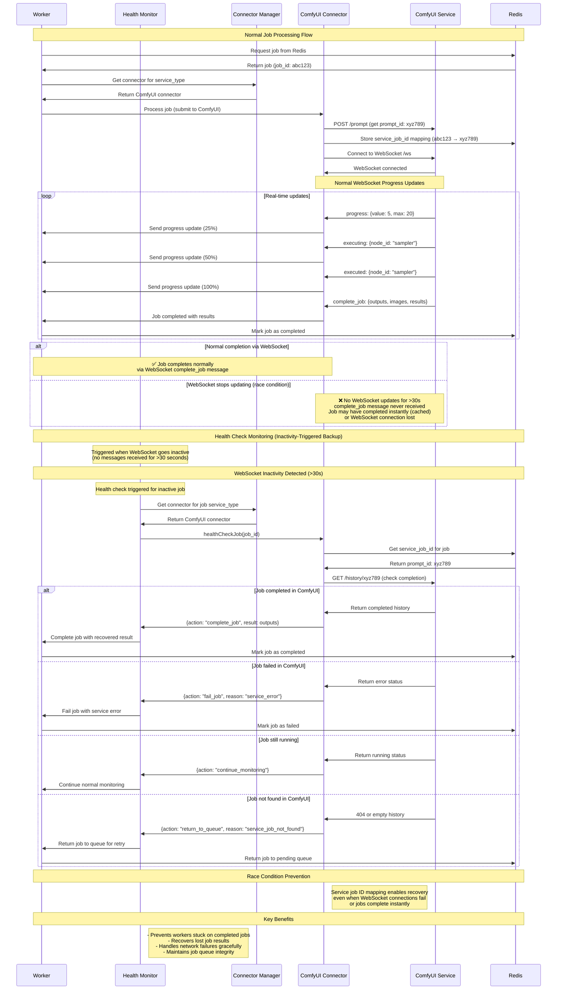

# Health Check Sequence Diagram

This diagram shows how the automatic health check mechanism prevents stuck jobs by periodically verifying job progress with external services (ComfyUI, etc.).

## Problem Statement

Workers can get stuck when the normal WebSocket flow fails:

**Normal Flow:** Worker submits job → ComfyUI WebSocket sends progress updates → WebSocket sends `complete_job` message with results → Job marked complete

**Failure Scenarios:**
- **Cached Results**: ComfyUI completes instantly (cached result) but WebSocket never sends `complete_job` message
- **WebSocket Connection Loss**: Network issues cause WebSocket to disconnect before `complete_job` message
- **Missed Completion Signals**: Worker waits for `complete_job` message that never arrives
- **No Activity Timeout**: No WebSocket updates for >30 seconds, worker stuck waiting

## Solution: Automatic Health Check Loop

<FullscreenDiagram>



</FullscreenDiagram>

## Implementation Details

### Health Check Trigger Conditions
1. **WebSocket Inactivity**: Triggered when no WebSocket messages received for >30 seconds
2. **Worker Status**: Only check when worker status is "busy"  
3. **Active Jobs**: Only check jobs in `currentJobs` map
4. **Message Reset**: Any WebSocket message (progress, executing, executed) resets the inactivity timer
5. **Timer-Based**: Health check runs periodically (every 30s) but only acts on inactive jobs

### Health Check Actions
- **complete_job**: Job found completed in service, recover results and complete
- **fail_job**: Job failed in service, mark as failed
- **return_to_queue**: Job not found or submission failed, retry
- **continue_monitoring**: Job still processing normally

### Service Job ID Mapping
```typescript
// Stored immediately when job is submitted to external service
await redis.hmset(`job:${jobId}`, {
  service_job_id: promptId,           // ComfyUI prompt_id
  service_submitted_at: timestamp,    // When submitted to service
  last_service_check: timestamp,      // Last health check time
  service_status: 'submitted'         // Last known service status
});
```

### Configuration
- `WORKER_HEALTH_CHECK_INTERVAL_MS`: Health check frequency (default: 30000ms)
- `WORKER_WEBSOCKET_INACTIVITY_TIMEOUT_MS`: WebSocket inactivity threshold (default: 30000ms)
- Health check timeout: 5 seconds per request

## Architecture Alignment

This health check mechanism advances the **North Star** goals:

1. **Reliability**: Prevents job loss and stuck workers in distributed environments
2. **Elasticity**: Enables confident scaling knowing jobs won't get lost
3. **Observability**: Provides detailed logging of recovery actions
4. **Foundation**: Critical infrastructure for specialized machine pools

The health check system ensures robust job processing across ephemeral machines and prepares for advanced pool-aware routing.