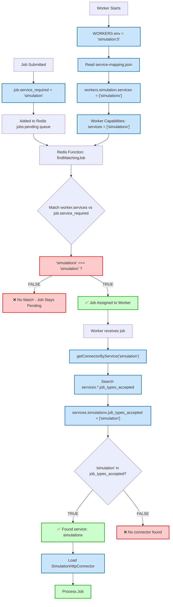
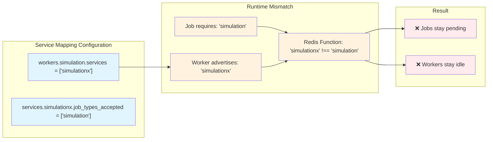
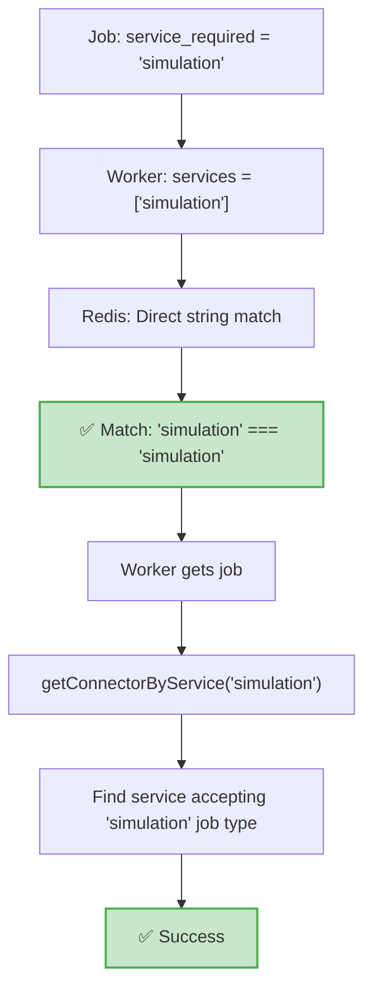
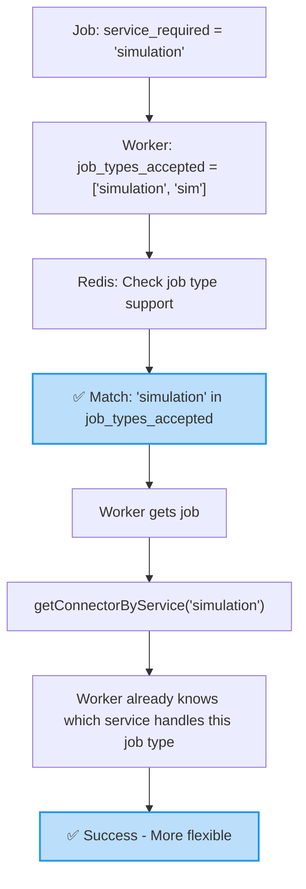
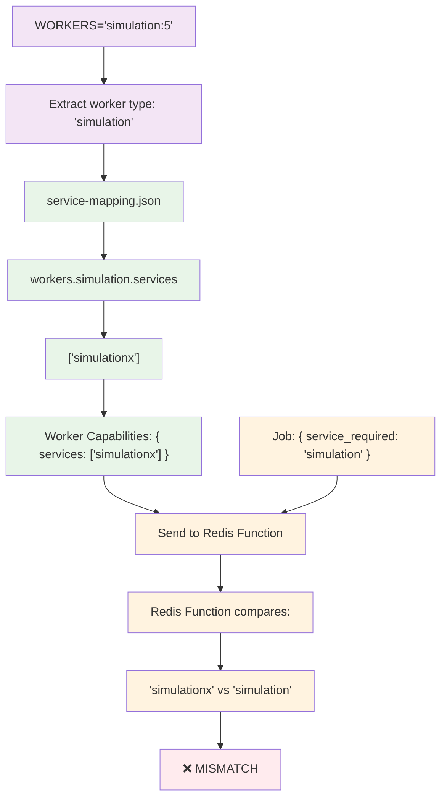
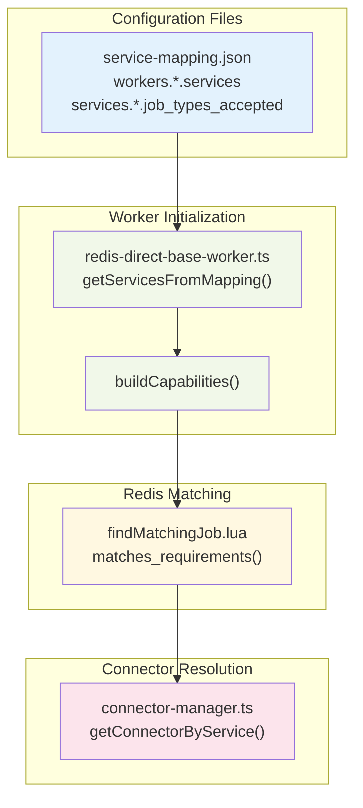

# Job Routing Flow - Visual Diagrams

## Complete Job Routing Architecture

<FullscreenDiagram>



</FullscreenDiagram>

## Current Problem: Service Name Mismatch

<FullscreenDiagram>



</FullscreenDiagram>

## Two Architectural Approaches

### Approach A: Service-Name Matching (Current)

<FullscreenDiagram>



</FullscreenDiagram>

### Approach B: Job-Type Matching (Better Long-term)

<FullscreenDiagram>



</FullscreenDiagram>

## Environment Variable Flow

<FullscreenDiagram>



</FullscreenDiagram>

## Code Locations Map

<FullscreenDiagram>



</FullscreenDiagram>

## Quick Fix Implementation

To make the current system work immediately:

### Before (Broken)
```json
{
  "workers": {
    "simulation": {
      "services": ["simulationx"]  // ❌ Different from job service_required
    }
  },
  "services": {
    "simulationx": {
      "job_types_accepted": ["simulation"]
    }
  }
}
```

### After (Working)
```json
{
  "workers": {
    "simulation": {
      "services": ["simulation"]  // ✅ Matches job service_required
    }
  },
  "services": {
    "simulation": {              // ✅ Rename service to match
      "job_types_accepted": ["simulation"]
    }
  }
}
```

## Debug Commands

```bash
# Check what services worker advertises
docker exec container pm2 logs worker | grep "Derived services"

# Check Redis function matching
REDIS_URL="redis://localhost:6379" node -e "
const Redis = require('ioredis');
const redis = new Redis(process.env.REDIS_URL);
console.log('Worker caps vs Job requirement matching...');
redis.quit();
"

# Check service-mapping configuration
docker exec container cat /workspace/src/config/service-mapping.json | jq '.workers.simulation'
```