# Documentation Site Map

**Last Updated:** January 2025  
**Total Pages:** 60+ (35 completed, 25+ planned)

This document provides a comprehensive map of the entire documentation site structure, showing all existing and planned pages across the VitePress documentation system.

## 🗺️ **Complete Site Structure**

```mermaid
graph TD
    %% Main Navigation Hub
    HOME[🏠 Home<br/>index.md ✅]
    
    %% Primary Sections - Vertical Layout
    HOME --- UNDER[📋 1. Understanding]
    HOME --- HOW[⚙️ 2. How It Works]
    HOME --- IMPL[🛠️ 3. Implementation]
    HOME --- PROD[🚀 4. Production]
    
    %% Secondary Sections  
    HOME --- DEV[💻 5. Development]
    HOME --- FUTURE[🔮 6. Future Vision]
    HOME --- API[🌐 8. Open API]
    HOME --- OBS[📊 9. Observability]
    
    %% Understanding System - Compact Vertical
    UNDER --- U1[Overview ✅]
    UNDER --- U2[System Overview ✅]
    UNDER --- U3[North Star Vision 🚧]
    UNDER --- U4[Business Context 📝]
    UNDER --- U5[Capabilities & Limitations 📝]
    
    %% How It Works - Compact Vertical
    HOW --- H1[Overview ✅]
    HOW --- H2[Job Lifecycle ✅]
    HOW --- H3[Worker Selection ✅]
    HOW --- H4[Redis Architecture 📝]
    HOW --- H5[Machine Communication 📝]
    HOW --- H6[Scaling Mechanisms 🚧]
    
    %% Implementation Details - Two Columns
    IMPL --- I1[Overview ✅]
    IMPL --- I2[Unified Machine Architecture ✅]
    IMPL --- I3[Technical Implementation ✅]
    IMPL --- I4[WebSocket API ✅]
    IMPL --- I5[Machine Bootstrap & Lifecycle ✅]
    
    I1 --- I6[Webhook Notification System ✅]
    I2 --- I7[Connector Architecture ✨ ✅]
    I3 --- I8[Redis Data Structures 📝]
    I4 --- I9[Service Communication 📝]
    I5 --- I10[API Connectors 🚧]
    
    %% Production - Two Columns
    PROD --- P1[Overview ✅]
    PROD --- P2[Failure Handling ✅]
    PROD --- P3[Machine Logs Analysis ✅]
    PROD --- P4[Deployment Strategies 📝]
    
    P1 --- P5[Monitoring & Alerting 📝]
    P2 --- P6[Performance Tuning 🚧]
    P3 --- P7[Capacity Planning 📝]
    
    %% Development - Compact
    DEV --- D1[Overview ✅]
    DEV --- D2[Development Changelog ✅]
    DEV --- D3[Monorepo Migration ✅]
    DEV --- D4[Local Development Setup 📝]
    
    D1 --- D5[Testing Procedures 🚧]
    D2 --- D6[Contributing Guidelines 📝]
    D3 --- D7[Architecture Decisions 📝]
    
    %% Future Vision - Compact
    FUTURE --- F1[Overview ✅]
    FUTURE --- F2[North Star Architecture 🚧]
    FUTURE --- F3[Predictive Model Management 🚧]
    
    F1 --- F4[Pool-Based Routing 📝]
    F2 --- F5[Technical Roadmap 📝]
    F3 --- F6[Customer Documentation Plans 📝]
    
    %% Open API - Hierarchical Sections
    API --- A1[Overview ✅]
    API --- ARCH[🏗️ Architecture]
    API --- REF[📚 API Reference]
    API --- GUIDE[📖 Implementation Guides]
    API --- EX[💡 Examples]
    
    %% Architecture Subsection
    ARCH --- A2[Architecture Overview ✅]
    ARCH --- A3[Collection System ✅]
    A2 --- A4[Frontend Collection Flow ✨ ✅]
    A3 --- A5[Database Schema 📝]
    
    %% API Reference Subsection  
    REF --- R1[API Reference Overview ✅]
    REF --- R2[Collections 📝]
    R1 --- R3[Workflows 📝]
    R2 --- R4[Models 📝]
    R3 --- R5[Generation 📝]
    
    %% Implementation Guides
    GUIDE --- G1[Implementation Overview ✅]
    GUIDE --- G2[Collection Creation API ✨ ✅]
    G1 --- G3[Social Collection API ✨ ✅]
    G2 --- G4[Workflow Integration 📝]
    G3 --- G5[Authentication Setup 📝]
    
    %% Examples
    EX --- E1[Examples Overview ✅]
    EX --- E2[Basic Collection 📝]
    E1 --- E3[Advanced Workflows 📝]
    E2 --- E4[Progress Tracking 📝]
    
    %% Observability - Two Column Layout
    OBS --- O1[Overview ✅]
    OBS --- O2[Information Flow ✅]
    OBS --- O3[Architecture ✨ ✅]
    OBS --- O4[Progress Status ✅ ✅]
    OBS --- O5[Information Flow Detailed ✨ ✅]
    
    O1 --- O6[Adding Telemetry 📝]
    O2 --- O7[Debugging Guide 📝]
    O3 --- O8[Query Cookbook 📝]
    O4 --- O9[Monitoring Setup 📝]
    O5 --- O10[Alert Configuration 📝]
    O6 --- O11[Performance Tuning 📝]
    
    %% Meta Pages - Separate Cluster
    META[📋 Site Map ✅]
    EXAMPLES_SECTION[📚 Examples Section ✅]
    UTIL1[Health Check Sequence ✅]
    UTIL2[WebSocket Connection Issue ✅]
    UTIL3[Base vs Basic Comparison ✅]
    
    %% Legend - Bottom Right
    subgraph "Status Legend"
        L1[✅ Completed & Published]
        L2[✨ Recently Added] 
        L3[🚧 Work in Progress]
        L4[📝 Planned]
    end
    
    %% Styling for better readability
    classDef completed fill:#d4edda,stroke:#28a745,stroke-width:2px
    classDef recent fill:#fff3cd,stroke:#ffc107,stroke-width:2px
    classDef wip fill:#cce5ff,stroke:#007bff,stroke-width:2px
    classDef planned fill:#f8d7da,stroke:#dc3545,stroke-width:2px
    
    class HOME,U1,U2,H1,H2,H3,I1,I2,I3,I4,I5,I6,P1,P2,P3,D1,D2,D3,F1,A1,A2,A3,ARCH,REF,GUIDE,EX,G1,G2,G3,R1,E1,O1,O2,META,EXAMPLES_SECTION,UTIL1,UTIL2,UTIL3 completed
    class I7,A4,O3,O4,O5 recent
    class U3,H6,I10,P6,D5,F2,F3 wip
    class U4,U5,H4,H5,I8,I9,P4,P5,P7,D4,D6,D7,F4,F5,F6,A5,R2,R3,R4,R5,G4,G5,E2,E3,E4,O6,O7,O8,O9,O10,O11 planned
```

<FullscreenDiagram>



</FullscreenDiagram>

---

## 📊 **Page Status Summary**

### **Completion Statistics**
- **✅ Completed Pages:** 35
- **✨ Recently Added:** 5  
- **🚧 Work in Progress:** 6
- **📝 Planned:** 25+
- **Total Coverage:** ~60% complete

### **Status Legend**
- **✅** - Page exists and is published
- **✨** - Recently added or updated page
- **🚧** - Work in progress, partially implemented
- **📝** - Planned but not yet started

---

## 🗂️ **Detailed Section Breakdown**

### **1. Understanding the System** (3/5 complete)
**Status:** 60% complete  
**Focus:** High-level system overview and business context

| Page | Status | Description |
|------|--------|-------------|
| Overview | ✅ | Main section landing page |
| System Overview | ✅ | Core system architecture and components |
| North Star Vision | 🚧 | Strategic direction and long-term goals |
| Business Context | 📝 | Business requirements and use cases |
| Capabilities & Limitations | 📝 | Current system boundaries and constraints |

### **2. How It Works** (3/6 complete)  
**Status:** 50% complete  
**Focus:** System mechanics and operational flow

| Page | Status | Description |
|------|--------|-------------|
| Overview | ✅ | Section introduction |
| Job Lifecycle | ✅ | Complete job processing flow |
| Worker Selection | ✅ | Worker matching and assignment logic |
| Redis Architecture | 📝 | Redis data structures and patterns |
| Machine Communication | 📝 | Inter-service communication protocols |
| Scaling Mechanisms | 🚧 | Auto-scaling and load balancing |

### **3. Implementation Details** (7/10 complete)
**Status:** 70% complete  
**Focus:** Technical implementation and architecture

| Page | Status | Description |
|------|--------|-------------|
| Overview | ✅ | Technical section overview |
| Unified Machine Architecture | ✅ | Machine deployment patterns |
| Technical Implementation | ✅ | Core implementation details |
| WebSocket API | ✅ | Real-time communication API |
| Machine Bootstrap & Lifecycle | ✅ | Machine startup and management |
| Webhook Notification System | ✅ | Event notification system |
| **Connector Architecture** | ✅ ✨ | **Service connector inheritance hierarchy** |
| Redis Data Structures | 📝 | Redis schema and data organization |
| Service Communication | 📝 | Inter-service protocols and patterns |
| API Connectors | 🚧 | Service integration connectors |

### **4. Running in Production** (3/7 complete)
**Status:** 43% complete  
**Focus:** Production operations and reliability

| Page | Status | Description |
|------|--------|-------------|
| Overview | ✅ | Production operations overview |
| Failure Handling | ✅ | Error handling and recovery |
| Machine Logs Analysis | ✅ | Log analysis and troubleshooting |
| Deployment Strategies | 📝 | Production deployment patterns |
| Monitoring & Alerting | 📝 | System monitoring setup |
| Performance Tuning | 🚧 | Optimization guidelines |
| Capacity Planning | 📝 | Resource planning and scaling |

### **5. Development** (3/7 complete)
**Status:** 43% complete  
**Focus:** Developer experience and contribution

| Page | Status | Description |
|------|--------|-------------|
| Overview | ✅ | Development section overview |
| Development Changelog | ✅ | Recent changes and updates |
| Monorepo Migration | ✅ | Migration to monorepo structure |
| Local Development Setup | 📝 | Development environment setup |
| Testing Procedures | 🚧 | Testing guidelines and procedures |
| Contributing Guidelines | 📝 | Contribution workflow |
| Architecture Decisions | 📝 | Technical decision records |

### **6. Future Vision** (2/6 complete)
**Status:** 33% complete  
**Focus:** Future roadmap and strategic direction

| Page | Status | Description |
|------|--------|-------------|
| Overview | ✅ | Future vision overview |
| North Star Architecture | 🚧 | Target architecture design |
| Predictive Model Management | 🚧 | AI model optimization strategy |
| Pool-Based Routing | 📝 | Specialized worker pools |
| Technical Roadmap | 📝 | Development timeline |
| Customer Documentation Plans | 📝 | User-facing documentation |

### **8. EmProps Open API** (9/17 complete)
**Status:** 53% complete  
**Focus:** Public API and integration

| Section | Pages | Complete | Status |
|---------|-------|----------|--------|
| **Architecture** | 4 | 3 | 75% ✅ |
| **API Reference** | 5 | 1 | 20% 📝 |
| **Implementation Guides** | 5 | 3 | 60% ✨ |
| **Examples** | 4 | 1 | 25% 📝 |

### **9. Observability** (5/11 complete) ✨
**Status:** 45% complete  
**Focus:** System monitoring and telemetry

| Page | Status | Description |
|------|--------|-------------|
| Overview | ✅ | Observability section overview |
| Information Flow | ✅ | Basic telemetry flow |
| **Architecture** | ✅ ✨ | **Complete observability system design** |
| **Progress Status** | ✅ ✨ | **Current implementation status** |
| **Information Flow (Detailed)** | ✅ ✨ | **Detailed technical telemetry documentation** |
| Adding Telemetry | 📝 | How to add observability to services |
| Debugging Guide | 📝 | Troubleshooting observability issues |
| Query Cookbook | 📝 | Common queries and analysis |
| Monitoring Setup | 📝 | Production monitoring configuration |
| Alert Configuration | 📝 | Alerting rules and thresholds |
| Performance Tuning | 📝 | Observability performance optimization |

---

## 📁 **File System Organization**

### **VitePress Structure**
```
apps/docs/src/
├── .vitepress/
│   ├── config.ts           # Site configuration and navigation
│   ├── components/         # Vue components (FullscreenDiagram, etc.)
│   └── theme/             # Custom theme configuration
├── public/                # Static assets
│   ├── css/
│   ├── images/
│   └── favicon.ico
├── 01-understanding-the-system/
├── 02-how-it-works/
├── 03-implementation-details/
├── 04-running-in-production/
├── 05-development/
├── 06-future-vision/
├── 08-emprops-open-api/
├── 09-observability/
├── examples/              # Documentation examples
└── index.md              # Home page
```

### **Navigation Configuration**
The site navigation is defined in `.vitepress/config.ts`:
- **Main Navigation:** Top-level sections
- **Sidebar Configuration:** Section-specific page lists
- **Status Indicators:** Emoji system for page status
- **Custom Components:** FullscreenDiagram for Mermaid diagrams

---

## 🎯 **Priority Pages for Completion**

### **High Priority** (Core Functionality)
1. **Redis Architecture** - Critical for understanding data flow
2. **Adding Telemetry** - Essential for observability implementation  
3. **Local Development Setup** - Required for contributor onboarding
4. **Deployment Strategies** - Needed for production operations

### **Medium Priority** (Enhanced Features)
1. **API Connectors** - Important for service integrations
2. **Testing Procedures** - Important for code quality
3. **Performance Tuning** - Valuable for optimization
4. **Query Cookbook** - Useful for observability users

### **Lower Priority** (Future Planning)
1. **Business Context** - Nice to have for stakeholder understanding
2. **Capacity Planning** - Important but not immediately critical
3. **Customer Documentation Plans** - Future customer-facing work

---

## 🚀 **Recent Additions & Updates**

### **January 2025 - Observability & Connector Documentation**
- ✨ **Connector Architecture** - Complete inheritance diagram and implementation guide
- ✨ **Observability Architecture** - Comprehensive system design with Fluent Bit/Fluentd
- ✨ **Progress Status** - Current implementation status and deployment roadmap
- ✨ **Information Flow (Detailed)** - Technical telemetry flow documentation
- ✨ **Site Map** - This comprehensive documentation overview

### **Navigation Improvements**
- Updated status indicators with emoji system
- Added recently completed pages to appropriate sections
- Organized observability section with new content
- Enhanced implementation details with connector architecture

---

## 🔄 **Maintenance Guidelines**

### **Updating This Site Map**
1. **Page Status Changes** - Update status indicators when pages are completed
2. **New Pages** - Add new pages to both diagram and tables
3. **Navigation Updates** - Sync changes with `.vitepress/config.ts`
4. **Regular Reviews** - Monthly review of completion status

### **Status Transition Workflow**
1. **📝 Planned** → **🚧 Work in Progress** - When development starts
2. **🚧 Work in Progress** → **✅ Completed** - When page is published
3. **✅ Completed** → **✨ Recently Added** - For highlighting new content
4. **✨ Recently Added** → **✅ Completed** - After initial promotion period

---

**Last Updated:** January 2025  
**Maintained By:** Development Team  
**Next Review:** Monthly documentation review