# Documentation Site Map

**Last Updated:** January 2025  
**Total Pages:** 60+ (35 completed, 25+ planned)

This document provides a comprehensive map of the entire documentation site structure, showing all existing and planned pages across the VitePress documentation system.

## 🗺️ **Complete Site Structure**

```mermaid
graph TB
    subgraph "Main Navigation"
        HOME[🏠 Home<br/>index.md ✅]
        HOME --> UNDER[📋 1. Understanding]
        HOME --> HOW[⚙️ 2. How It Works]
        HOME --> IMPL[🛠️ 3. Implementation]
        HOME --> PROD[🚀 4. Production]
        HOME --> DEV[💻 5. Development]
        HOME --> FUTURE[🔮 6. Future Vision]
        HOME --> API[🌐 8. Open API]
        HOME --> OBS[📊 9. Observability]
    end
    
    subgraph "1. Understanding the System"
        UNDER --> U1[Overview<br/>index.md ✅]
        UNDER --> U2[System Overview<br/>system-overview.md ✅]
        UNDER --> U3[North Star Vision<br/>north-star-vision.md 🚧]
        UNDER --> U4[Business Context<br/>business-context.md 📝]
        UNDER --> U5[Capabilities & Limitations<br/>capabilities-limitations.md 📝]
    end
    
    subgraph "2. How It Works"
        HOW --> H1[Overview<br/>index.md ✅]
        HOW --> H2[Job Lifecycle<br/>job-lifecycle.md ✅]
        HOW --> H3[Worker Selection<br/>worker-selection.md ✅]
        HOW --> H4[Redis Architecture<br/>redis-architecture.md 📝]
        HOW --> H5[Machine Communication<br/>machine-communication.md 📝]
        HOW --> H6[Scaling Mechanisms<br/>scaling-mechanisms.md 🚧]
    end
    
    subgraph "3. Implementation Details"
        IMPL --> I1[Overview<br/>index.md ✅]
        IMPL --> I2[Unified Machine Architecture<br/>unified-machine-architecture.md ✅]
        IMPL --> I3[Technical Implementation<br/>technical-implementation.md ✅]
        IMPL --> I4[WebSocket API<br/>websocket-api.md ✅]
        IMPL --> I5[Machine Bootstrap & Lifecycle<br/>machine-bootstrap-lifecycle.md ✅]
        IMPL --> I6[Webhook Notification System<br/>webhook-notification-system.md ✅]
        IMPL --> I7[Connector Architecture ✨<br/>connector-architecture.md ✅]
        IMPL --> I8[Redis Data Structures<br/>redis-data-structures.md 📝]
        IMPL --> I9[Service Communication<br/>service-communication.md 📝]
        IMPL --> I10[API Connectors<br/>api-connectors.md 🚧]
    end
    
    subgraph "4. Running in Production"
        PROD --> P1[Overview<br/>index.md ✅]
        PROD --> P2[Failure Handling<br/>failure-handling.md ✅]
        PROD --> P3[Machine Logs Analysis<br/>machine-logs-analysis.md ✅]
        PROD --> P4[Deployment Strategies<br/>deployment-strategies.md 📝]
        PROD --> P5[Monitoring & Alerting<br/>monitoring-alerting.md 📝]
        PROD --> P6[Performance Tuning<br/>performance-tuning.md 🚧]
        PROD --> P7[Capacity Planning<br/>capacity-planning.md 📝]
    end
    
    subgraph "5. Development"
        DEV --> D1[Overview<br/>index.md ✅]
        DEV --> D2[Development Changelog<br/>changelog.md ✅]
        DEV --> D3[Monorepo Migration<br/>monorepo-migration.md ✅]
        DEV --> D4[Local Development Setup<br/>local-development.md 📝]
        DEV --> D5[Testing Procedures<br/>testing-procedures.md 🚧]
        DEV --> D6[Contributing Guidelines<br/>contributing.md 📝]
        DEV --> D7[Architecture Decisions<br/>architecture-decisions.md 📝]
    end
    
    subgraph "6. Future Vision"
        FUTURE --> F1[Overview<br/>index.md ✅]
        FUTURE --> F2[North Star Architecture<br/>north-star-architecture.md 🚧]
        FUTURE --> F3[Predictive Model Management<br/>predictive-model-management.md 🚧]
        FUTURE --> F4[Pool-Based Routing<br/>pool-based-routing.md 📝]
        FUTURE --> F5[Technical Roadmap<br/>technical-roadmap.md 📝]
        FUTURE --> F6[Customer Documentation Plans<br/>customer-docs-planning.md 📝]
    end
    
    subgraph "8. EmProps Open API"
        API --> A1[Overview<br/>index.md ✅]
        API --> ARCH[Architecture Section]
        API --> REF[API Reference Section]
        API --> GUIDE[Implementation Guides]
        API --> EX[Examples Section]
        
        ARCH --> A2[Architecture Overview<br/>architecture/index.md ✅]
        ARCH --> A3[Collection System<br/>architecture/collection-system.md ✅]
        ARCH --> A4[Frontend Collection Flow ✨<br/>architecture/frontend-collection-flow.md ✅]
        ARCH --> A5[Database Schema<br/>architecture/database-schema.md 📝]
        
        REF --> R1[API Reference Overview<br/>api-reference/index.md ✅]
        REF --> R2[Collections<br/>api-reference/collections.md 📝]
        REF --> R3[Workflows<br/>api-reference/workflows.md 📝]
        REF --> R4[Models<br/>api-reference/models.md 📝]
        REF --> R5[Generation<br/>api-reference/generation.md 📝]
        
        GUIDE --> G1[Implementation Overview<br/>implementation-guides/index.md ✅]
        GUIDE --> G2[Collection Creation API ✨<br/>implementation-guides/collection-generation-api.md ✅]
        GUIDE --> G3[Social Collection API ✨<br/>implementation-guides/social-collection-api.md ✅]
        GUIDE --> G4[Workflow Integration<br/>implementation-guides/workflow-integration.md 📝]
        GUIDE --> G5[Authentication Setup<br/>implementation-guides/authentication-setup.md 📝]
        
        EX --> E1[Examples Overview<br/>examples/index.md ✅]
        EX --> E2[Basic Collection<br/>examples/basic-collection.md 📝]
        EX --> E3[Advanced Workflows<br/>examples/advanced-workflows.md 📝]
        EX --> E4[Progress Tracking<br/>examples/progress-tracking.md 📝]
    end
    
    subgraph "9. Observability"
        OBS --> O1[Overview<br/>index.md ✅]
        OBS --> O2[Information Flow<br/>information-flow.md ✅]
        OBS --> O3[Architecture ✨<br/>architecture.md ✅]
        OBS --> O4[Progress Status ✅<br/>progress-status.md ✅]
        OBS --> O5[Information Flow Detailed ✨<br/>information-flow-detailed.md ✅]
        OBS --> O6[Adding Telemetry<br/>adding-telemetry.md 📝]
        OBS --> O7[Debugging Guide<br/>debugging-guide.md 📝]
        OBS --> O8[Query Cookbook<br/>query-cookbook.md 📝]
        OBS --> O9[Monitoring Setup<br/>monitoring-setup.md 📝]
        OBS --> O10[Alert Configuration<br/>alert-configuration.md 📝]
        OBS --> O11[Performance Tuning<br/>performance-tuning.md 📝]
    end
    
    subgraph "Meta & Utility Pages"
        META[📋 Site Map<br/>sitemap.md ✅]
        EXAMPLES[📚 Examples Section<br/>examples/ ✅]
        UTIL1[Health Check Sequence<br/>health-check-sequence-diagram.md ✅]
        UTIL2[WebSocket Connection Issue<br/>websocket-connection-issue.md ✅]
        UTIL3[Base vs Basic Comparison<br/>base_vs_basic_comparison.md ✅]
    end
    
    subgraph "Legend"
        L1[✅ Completed & Published]
        L2[✨ Recently Added]
        L3[🚧 Work in Progress]
        L4[📝 Planned]
    end
```

<FullscreenDiagram>



</FullscreenDiagram>

---

## 📊 **Page Status Summary**

### **Completion Statistics**
- **✅ Completed Pages:** 35
- **✨ Recently Added:** 5  
- **🚧 Work in Progress:** 6
- **📝 Planned:** 25+
- **Total Coverage:** ~60% complete

### **Status Legend**
- **✅** - Page exists and is published
- **✨** - Recently added or updated page
- **🚧** - Work in progress, partially implemented
- **📝** - Planned but not yet started

---

## 🗂️ **Detailed Section Breakdown**

### **1. Understanding the System** (3/5 complete)
**Status:** 60% complete  
**Focus:** High-level system overview and business context

| Page | Status | Description |
|------|--------|-------------|
| Overview | ✅ | Main section landing page |
| System Overview | ✅ | Core system architecture and components |
| North Star Vision | 🚧 | Strategic direction and long-term goals |
| Business Context | 📝 | Business requirements and use cases |
| Capabilities & Limitations | 📝 | Current system boundaries and constraints |

### **2. How It Works** (3/6 complete)  
**Status:** 50% complete  
**Focus:** System mechanics and operational flow

| Page | Status | Description |
|------|--------|-------------|
| Overview | ✅ | Section introduction |
| Job Lifecycle | ✅ | Complete job processing flow |
| Worker Selection | ✅ | Worker matching and assignment logic |
| Redis Architecture | 📝 | Redis data structures and patterns |
| Machine Communication | 📝 | Inter-service communication protocols |
| Scaling Mechanisms | 🚧 | Auto-scaling and load balancing |

### **3. Implementation Details** (7/10 complete)
**Status:** 70% complete  
**Focus:** Technical implementation and architecture

| Page | Status | Description |
|------|--------|-------------|
| Overview | ✅ | Technical section overview |
| Unified Machine Architecture | ✅ | Machine deployment patterns |
| Technical Implementation | ✅ | Core implementation details |
| WebSocket API | ✅ | Real-time communication API |
| Machine Bootstrap & Lifecycle | ✅ | Machine startup and management |
| Webhook Notification System | ✅ | Event notification system |
| **Connector Architecture** | ✅ ✨ | **Service connector inheritance hierarchy** |
| Redis Data Structures | 📝 | Redis schema and data organization |
| Service Communication | 📝 | Inter-service protocols and patterns |
| API Connectors | 🚧 | Service integration connectors |

### **4. Running in Production** (3/7 complete)
**Status:** 43% complete  
**Focus:** Production operations and reliability

| Page | Status | Description |
|------|--------|-------------|
| Overview | ✅ | Production operations overview |
| Failure Handling | ✅ | Error handling and recovery |
| Machine Logs Analysis | ✅ | Log analysis and troubleshooting |
| Deployment Strategies | 📝 | Production deployment patterns |
| Monitoring & Alerting | 📝 | System monitoring setup |
| Performance Tuning | 🚧 | Optimization guidelines |
| Capacity Planning | 📝 | Resource planning and scaling |

### **5. Development** (3/7 complete)
**Status:** 43% complete  
**Focus:** Developer experience and contribution

| Page | Status | Description |
|------|--------|-------------|
| Overview | ✅ | Development section overview |
| Development Changelog | ✅ | Recent changes and updates |
| Monorepo Migration | ✅ | Migration to monorepo structure |
| Local Development Setup | 📝 | Development environment setup |
| Testing Procedures | 🚧 | Testing guidelines and procedures |
| Contributing Guidelines | 📝 | Contribution workflow |
| Architecture Decisions | 📝 | Technical decision records |

### **6. Future Vision** (2/6 complete)
**Status:** 33% complete  
**Focus:** Future roadmap and strategic direction

| Page | Status | Description |
|------|--------|-------------|
| Overview | ✅ | Future vision overview |
| North Star Architecture | 🚧 | Target architecture design |
| Predictive Model Management | 🚧 | AI model optimization strategy |
| Pool-Based Routing | 📝 | Specialized worker pools |
| Technical Roadmap | 📝 | Development timeline |
| Customer Documentation Plans | 📝 | User-facing documentation |

### **8. EmProps Open API** (9/17 complete)
**Status:** 53% complete  
**Focus:** Public API and integration

| Section | Pages | Complete | Status |
|---------|-------|----------|--------|
| **Architecture** | 4 | 3 | 75% ✅ |
| **API Reference** | 5 | 1 | 20% 📝 |
| **Implementation Guides** | 5 | 3 | 60% ✨ |
| **Examples** | 4 | 1 | 25% 📝 |

### **9. Observability** (5/11 complete) ✨
**Status:** 45% complete  
**Focus:** System monitoring and telemetry

| Page | Status | Description |
|------|--------|-------------|
| Overview | ✅ | Observability section overview |
| Information Flow | ✅ | Basic telemetry flow |
| **Architecture** | ✅ ✨ | **Complete observability system design** |
| **Progress Status** | ✅ ✨ | **Current implementation status** |
| **Information Flow (Detailed)** | ✅ ✨ | **Detailed technical telemetry documentation** |
| Adding Telemetry | 📝 | How to add observability to services |
| Debugging Guide | 📝 | Troubleshooting observability issues |
| Query Cookbook | 📝 | Common queries and analysis |
| Monitoring Setup | 📝 | Production monitoring configuration |
| Alert Configuration | 📝 | Alerting rules and thresholds |
| Performance Tuning | 📝 | Observability performance optimization |

---

## 📁 **File System Organization**

### **VitePress Structure**
```
apps/docs/src/
├── .vitepress/
│   ├── config.ts           # Site configuration and navigation
│   ├── components/         # Vue components (FullscreenDiagram, etc.)
│   └── theme/             # Custom theme configuration
├── public/                # Static assets
│   ├── css/
│   ├── images/
│   └── favicon.ico
├── 01-understanding-the-system/
├── 02-how-it-works/
├── 03-implementation-details/
├── 04-running-in-production/
├── 05-development/
├── 06-future-vision/
├── 08-emprops-open-api/
├── 09-observability/
├── examples/              # Documentation examples
└── index.md              # Home page
```

### **Navigation Configuration**
The site navigation is defined in `.vitepress/config.ts`:
- **Main Navigation:** Top-level sections
- **Sidebar Configuration:** Section-specific page lists
- **Status Indicators:** Emoji system for page status
- **Custom Components:** FullscreenDiagram for Mermaid diagrams

---

## 🎯 **Priority Pages for Completion**

### **High Priority** (Core Functionality)
1. **Redis Architecture** - Critical for understanding data flow
2. **Adding Telemetry** - Essential for observability implementation  
3. **Local Development Setup** - Required for contributor onboarding
4. **Deployment Strategies** - Needed for production operations

### **Medium Priority** (Enhanced Features)
1. **API Connectors** - Important for service integrations
2. **Testing Procedures** - Important for code quality
3. **Performance Tuning** - Valuable for optimization
4. **Query Cookbook** - Useful for observability users

### **Lower Priority** (Future Planning)
1. **Business Context** - Nice to have for stakeholder understanding
2. **Capacity Planning** - Important but not immediately critical
3. **Customer Documentation Plans** - Future customer-facing work

---

## 🚀 **Recent Additions & Updates**

### **January 2025 - Observability & Connector Documentation**
- ✨ **Connector Architecture** - Complete inheritance diagram and implementation guide
- ✨ **Observability Architecture** - Comprehensive system design with Fluent Bit/Fluentd
- ✨ **Progress Status** - Current implementation status and deployment roadmap
- ✨ **Information Flow (Detailed)** - Technical telemetry flow documentation
- ✨ **Site Map** - This comprehensive documentation overview

### **Navigation Improvements**
- Updated status indicators with emoji system
- Added recently completed pages to appropriate sections
- Organized observability section with new content
- Enhanced implementation details with connector architecture

---

## 🔄 **Maintenance Guidelines**

### **Updating This Site Map**
1. **Page Status Changes** - Update status indicators when pages are completed
2. **New Pages** - Add new pages to both diagram and tables
3. **Navigation Updates** - Sync changes with `.vitepress/config.ts`
4. **Regular Reviews** - Monthly review of completion status

### **Status Transition Workflow**
1. **📝 Planned** → **🚧 Work in Progress** - When development starts
2. **🚧 Work in Progress** → **✅ Completed** - When page is published
3. **✅ Completed** → **✨ Recently Added** - For highlighting new content
4. **✨ Recently Added** → **✅ Completed** - After initial promotion period

---

**Last Updated:** January 2025  
**Maintained By:** Development Team  
**Next Review:** Monthly documentation review