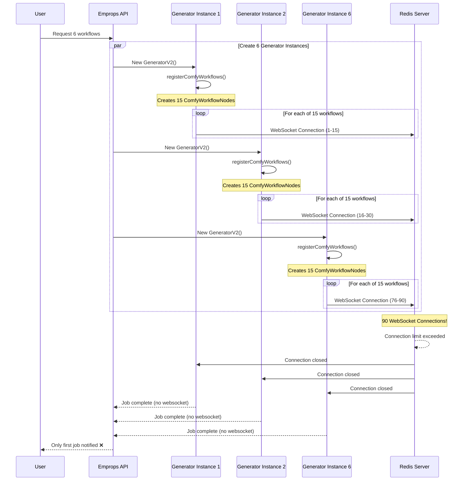
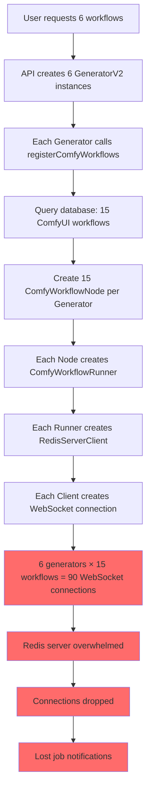
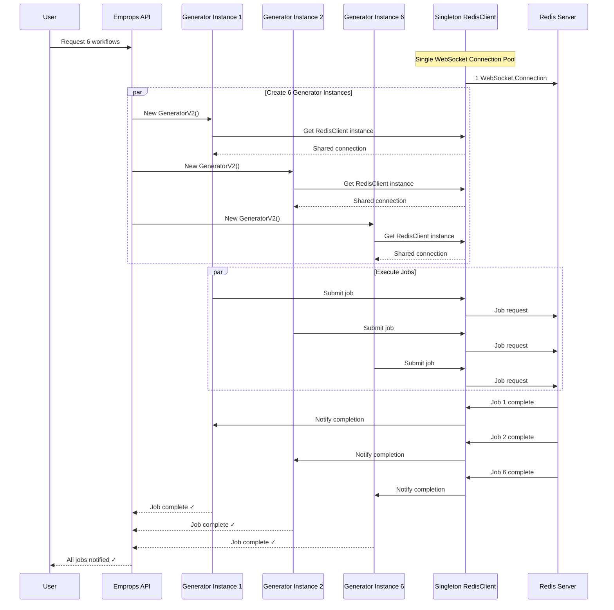

# WebSocket Connection Proliferation Issue

## Overview

A critical issue was identified where the Emprops Open API creates excessive WebSocket connections to the Redis job queue server, causing connection drops and failed job notifications after the first workflow completion.

## The Problem

### Root Cause
Each `GeneratorV2` instance creates a separate `RedisServerClient` connection for **every ComfyUI workflow** in the database, leading to connection proliferation that overwhelms the Redis server.

### Current Scale
- **Production Database**: 21 total workflows, 15 ComfyUI workflows
- **Per Generation Request**: 15 WebSocket connections created
- **6 Generation Request**: 90 WebSocket connections
- **Multiple Users**: Could reach 500+ workflows × 10 components = 5000+ connections

### Impact
1. Redis server connection limits exceeded
2. WebSocket connections forcibly closed after first job
3. Subsequent workflow completions lost (no UI feedback)
4. Poor user experience with "stuck" generations

## Current Architecture (Broken)
<FullscreenDiagram>



</FullscreenDiagram>

## Connection Creation Flow
<FullscreenDiagram>


</FullscreenDiagram>

## Connection Lifecycle Analysis

### Per-Request Connection Pattern
<FullscreenDiagram>

```
Single User Request (6 workflows):
├── GeneratorV2 Instance #1
│   ├── ComfyWorkflowNode "flux-dev" → RedisClient → WebSocket #1
│   ├── ComfyWorkflowNode "sdxl-base" → RedisClient → WebSocket #2
│   ├── ... (13 more) → WebSockets #3-15
├── GeneratorV2 Instance #2
│   ├── ComfyWorkflowNode "flux-dev" → RedisClient → WebSocket #16
│   ├── ComfyWorkflowNode "sdxl-base" → RedisClient → WebSocket #17
│   ├── ... (13 more) → WebSockets #18-30
├── ... (4 more instances) → WebSockets #31-90
```

</FullscreenDiagram>

### System-Wide Connection Pattern
<FullscreenDiagram>

```
Multi-User Scenario:
├── User A: 6 requests = 90 connections
├── User B: 4 requests = 60 connections  
├── User C: 2 requests = 30 connections
├── User D: 8 requests = 120 connections
└── Total: 300 WebSocket connections for 20 workflows
```

</FullscreenDiagram>

## Proposed Solution: Singleton RedisServerClient

### Architecture Change
<FullscreenDiagram>



</FullscreenDiagram>
### Implementation

```typescript
// Before (Broken)
export class ComfyWorkflowRunner {
  private redisServerClient: RedisServerClient;
  constructor(prisma: PrismaClient, eventEmitter?: EventEmitter) {
    // Creates new connection every time!
    this.redisServerClient = new RedisServerClient(
      process.env.REDIS_SERVER_URL,
      process.env.REDIS_SERVER_TOKEN,
      eventEmitter,
    );
  }
}

// After (Fixed)
export class ComfyWorkflowRunner {
  private redisServerClient: RedisServerClient;
  constructor(prisma: PrismaClient, eventEmitter?: EventEmitter) {
    // Reuses singleton connection
    this.redisServerClient = RedisServerClient.getInstance(
      process.env.REDIS_SERVER_URL,
      process.env.REDIS_SERVER_TOKEN,
      eventEmitter,
    );
  }
}

class RedisServerClient {
  private static instance: RedisServerClient | null = null;
  private activeJobs: Map<string, JobContext> = new Map();
  private ws: WebSocket | null = null;
  
  static getInstance(url?: string, token?: string, eventEmitter?: EventEmitter): RedisServerClient {
    if (!RedisServerClient.instance) {
      RedisServerClient.instance = new RedisServerClient(url, token, eventEmitter);
    }
    return RedisServerClient.instance;
  }
  
  // Existing methods remain the same...
}
```

## Benefits of Singleton Pattern

### Connection Efficiency
- **Before**: 90 connections per 6 workflows
- **After**: 1 connection for unlimited workflows
- **Scalability**: Handles 1000s of workflows with single connection

### Resource Management
- Eliminates connection pool exhaustion
- Reduces memory usage
- Prevents connection timeout issues

### Reliability
- Consistent job notifications
- No dropped connections under load
- Better error handling and recovery

## Implementation Plan

1. **Modify RedisServerClient** to use singleton pattern
2. **Update ComfyWorkflowRunner** constructor
3. **Add connection pooling** for high throughput
4. **Implement connection recovery** logic
5. **Add monitoring** for connection health

## Testing Strategy

### Load Testing
- Test with 100 concurrent workflow requests
- Monitor connection count and stability
- Verify all job notifications received

### Edge Cases
- Connection drops during job execution
- Redis server restarts
- Network interruptions

### Performance Metrics
- Connection count: Should remain at 1
- Job completion rate: Should be 100%
- Notification delivery: Should be reliable

## Files to Modify

### Primary Changes
- `src/clients/redis-server-client.ts` - Add singleton pattern
- `src/lib/workflows.ts` - Use singleton instance

### Secondary Changes  
- `src/modules/art-gen/nodes-v2/nodes/comfy.ts` - Connection management
- Tests for new singleton behavior
- Documentation updates

## Risk Assessment

### Low Risk
- Singleton pattern is well-established
- Existing job queueing logic unchanged
- Backwards compatible

### Mitigation
- Implement connection health checks
- Add fallback connection creation
- Gradual rollout with monitoring

---

## Related Issues
- [WebSocket disconnection after first generation]
- [Redis connection limits]
- [Job notification reliability]

## Status: READY FOR IMPLEMENTATION

This fix is critical for system stability and user experience. The singleton pattern will eliminate connection proliferation while maintaining all existing functionality.