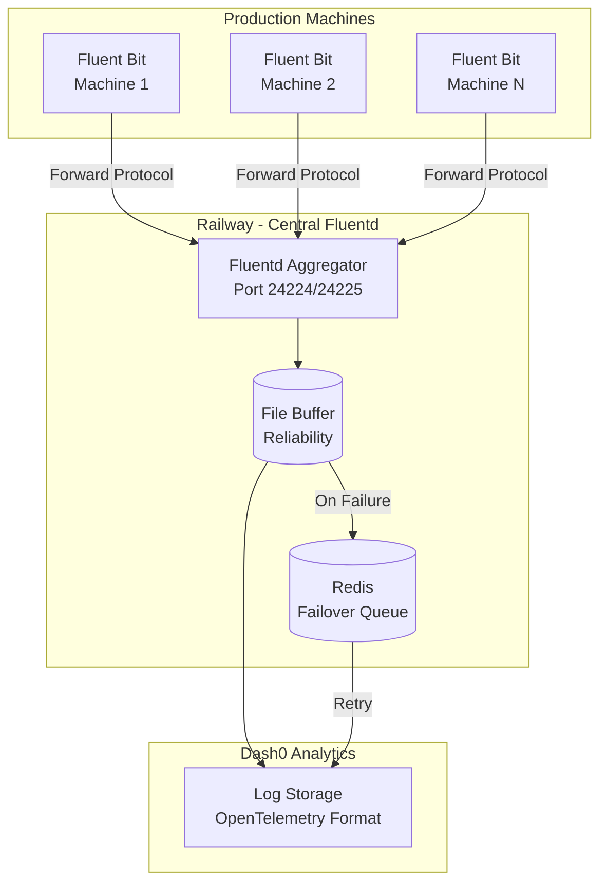

# Fluentd Log Aggregation Service

Centralized log aggregation service for the EMP Job Queue system. Receives logs from Fluent Bit instances running on each machine and forwards them to Dash0 for analysis.

## Architecture



## Features

### Log Collection
- **Fluent Forward Protocol**: Primary input from Fluent Bit instances
- **TLS Support**: Secure log transmission for production
- **HTTP Fallback**: Direct log submission for development/debugging
- **Security**: Shared key authentication and TLS encryption

### Processing Pipeline
- **Correlation Preservation**: Maintains trace_id, job_id, machine_id across all logs
- **Format Standardization**: Converts to OpenTelemetry log format for Dash0
- **Context Enrichment**: Adds environment, service, and processing metadata
- **Multi-format Parsing**: Handles JSON, structured text, and plain text logs

### Reliability Features
- **File Buffering**: Local disk buffering for network outages
- **Redis Failover**: Secondary storage when Dash0 is unavailable
- **Exponential Backoff**: Smart retry logic with circuit breaking
- **Local Backup**: File-based log backup for disaster recovery

### Monitoring & Observability
- **Prometheus Metrics**: Throughput, error rates, buffer status
- **Health Endpoints**: `/api/plugins.json` for load balancer checks
- **Self-monitoring**: Internal log processing metrics and alerts

## Configuration

### Environment Variables

```bash
# Core settings
NODE_ENV=production
SERVICE_NAME=fluentd-aggregator
HOSTNAME=fluentd-central

# Dash0 integration
DASH0_API_KEY=auth_w8VowQspnZ8whZHWp1pe6azIIehBAAvL
DASH0_DATASET=production
DASH0_LOGS_ENDPOINT=https://ingress.us-west-2.aws.dash0.com/v1/logs

# Redis failover
REDIS_HOST=your-redis-host
REDIS_PORT=6379
REDIS_PASSWORD=your-redis-password

# Security
FLUENTD_SHARED_KEY=emp-log-aggregation-key

# TLS (production)
TLS_CERT_PATH=/fluentd/certs/server.crt
TLS_KEY_PATH=/fluentd/certs/server.key
TLS_CA_PATH=/fluentd/certs/ca.crt
```

### Port Configuration

- **24224**: Fluent Forward Protocol (TCP)
- **24225**: Fluent Forward with TLS (TCP)
- **8888**: HTTP log ingestion
- **24220**: Health/monitoring API
- **9880**: Prometheus metrics

## Deployment

### Local Development

```bash
# Build and run locally
docker build -t emp-fluentd .
docker run -p 24224:24224 -p 24220:24220 \
  -e NODE_ENV=development \
  -e DASH0_API_KEY=your-key \
  emp-fluentd
```

### Railway Production

```bash
# Deploy to Railway
railway login
railway deploy --service fluentd

# Configure environment variables
railway variables set DASH0_API_KEY=auth_...
railway variables set DASH0_DATASET=production
railway variables set REDIS_HOST=your-redis-host
railway variables set REDIS_PASSWORD=your-password
railway variables set FLUENTD_SHARED_KEY=your-shared-key
```

## Log Format

### Input (from Fluent Bit)

```json
{
  "timestamp": "2024-01-15T10:30:45.123Z",
  "level": "info",
  "message": "Job processing started",
  "trace_id": "abc123def456",
  "job_id": "job-789",
  "machine_id": "comfyui-prod-1",
  "worker_id": "comfyui-prod-1-worker-0",
  "source": "worker.comfyui",
  "component": "job-executor"
}
```

### Output (to Dash0)

```json
{
  "resourceLogs": [{
    "resource": {
      "attributes": [
        {"key": "service.name", "value": {"stringValue": "emp-job-queue"}},
        {"key": "deployment.environment", "value": {"stringValue": "production"}}
      ]
    },
    "scopeLogs": [{
      "logRecords": [{
        "timeUnixNano": "1705315845123000000",
        "severityNumber": 9,
        "severityText": "INFO",
        "body": {"stringValue": "Job processing started"},
        "attributes": [
          {"key": "trace_id", "value": {"stringValue": "abc123def456"}},
          {"key": "job_id", "value": {"stringValue": "job-789"}}
        ],
        "traceId": "abc123def456"
      }]
    }]
  }]
}
```

## Monitoring

### Health Check

```bash
# Check service health
curl http://fluentd-host:24220/api/plugins.json

# Check Prometheus metrics  
curl http://fluentd-host:9880/metrics
```

### Key Metrics

- `fluentd_input_status_num_records_total`: Total incoming logs
- `fluentd_output_status_num_records_total`: Total outgoing logs  
- `fluentd_buffer_queue_length`: Current buffer depth
- `fluentd_retry_count`: Number of retries for failed sends

### Troubleshooting

```bash
# View Fluentd logs
docker logs fluentd-container -f

# Check buffer status
ls -la /fluentd/buffer/

# Test connectivity to Dash0
curl -H "Authorization: Bearer $DASH0_API_KEY" \
     -H "Dash0-Dataset: development" \
     https://ingress.us-west-2.aws.dash0.com/v1/logs

# Test local log ingestion
curl -X POST http://localhost:8888/test \
     -H "Content-Type: application/json" \
     -d '{"message": "test log", "level": "info"}'
```

## Integration with Fluent Bit

Fluent Bit instances on machines should be configured to forward to this service:

```ini
[OUTPUT]
    Name              forward
    Match             *
    Host              fluentd.railway.app
    Port              24225
    tls               on  
    tls.verify        off
    Shared_Key        emp-log-aggregation-key
    Compress          gzip
    
    # Reliability settings
    Retry_Limit       10
    Buffer_Max_Size   8M
```

## Custom Plugins

The service includes a custom `out_dash0` plugin optimized for:
- OpenTelemetry log format conversion
- Batch processing for efficiency
- Correlation ID preservation
- Error handling and retries
- Resource attribution

## Performance Tuning

### Buffer Configuration

```ruby
<buffer>
  # Tune based on log volume
  chunk_limit_size 8MB      # Larger chunks for high volume
  queue_limit_length 64     # More buffering for bursts
  flush_interval 5s         # Faster flushing for real-time needs
  flush_thread_count 2      # Parallel processing
</buffer>
```

### Memory Usage

- Base image: ~100MB
- Ruby process: ~50-100MB
- File buffers: 256MB max (configurable)
- Total expected: ~500MB peak usage

### Throughput Expectations

- **Input rate**: Up to 10,000 logs/second
- **Output rate**: Up to 8,000 logs/second (with batching)
- **Latency**: P95 < 100ms processing time
- **Buffer capacity**: Up to 1 hour of logs during outages