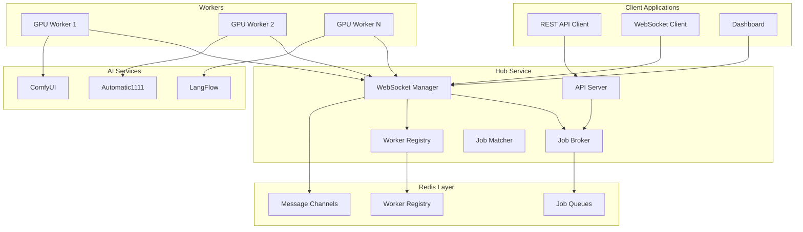

# JavaScript emp-redis Architecture

## Overview

This document describes the architecture for the JavaScript/TypeScript rebuild of the emp-redis system. The goal is to maintain the proven pull-based job broker model while improving developer experience, deployment, and maintainability.

## Core Principles

### 1. Pull-Based Job Selection
Workers actively query for jobs they can handle, rather than being assigned jobs by a central dispatcher.

```
Worker: "What's the highest priority job I can process?"
Broker: "Job #123: ComfyUI workflow, needs 8GB GPU, customer A"
Worker: "I'll take it" → processes job → reports completion
```

### 2. Multi-Dimensional Job Matching
Jobs are matched to workers using comprehensive capability scoring:
- **Service Compatibility**: ComfyUI, A1111, etc.
- **Hardware Requirements**: GPU memory, CPU cores, RAM
- **Model Availability**: Specific models loaded on worker
- **Customer Isolation**: Strict/loose/none isolation levels
- **Performance Needs**: Quality levels, processing time limits
- **Geographic Constraints**: Region, compliance requirements
- **Cost Efficiency**: Budget tiers, cost optimization

### 3. Priority + FIFO Ordering
- **Priority-first**: Higher priority jobs always processed before lower priority
- **FIFO within priority**: Same priority jobs processed in submission order
- **Dynamic priority**: Based on customer tier, urgency, deadlines

## System Architecture



## Data Flow

### Job Submission Flow
1. **Client submits job** via REST API
2. **Hub validates** job requirements and customer access
3. **Job added** to Redis priority queue with calculated priority
4. **Workers poll** for available jobs matching their capabilities
5. **Best worker claims** the job and begins processing
6. **Worker reports progress** via WebSocket to hub
7. **Worker completes** job and submits results

### Worker Registration Flow
1. **Worker connects** to hub via WebSocket
2. **Worker registers** capabilities (services, hardware, models)
3. **Hub validates** worker and adds to registry
4. **Worker sends heartbeat** to maintain active status
5. **Worker polls** for jobs matching its capabilities

## Core Components

### 1. Job Broker (`core/JobBroker.ts`)

Central component managing job lifecycle and worker matching.

**Key Responsibilities:**
- Job submission and validation
- Priority calculation and queue management
- Worker-job matching algorithm
- Job state transitions (pending → active → completed/failed)

**Redis Data Structures:**
```redis
# Priority-ordered job queue
jobs:pending              # ZSET: score=priority+timestamp, value=jobId
jobs:active:{workerId}    # HASH: jobId → job data
jobs:completed           # HASH: jobId → result (TTL 24h)
jobs:failed              # HASH: jobId → error (TTL 7d)

# Job metadata
job:{jobId}              # HASH: job details and requirements
job:{jobId}:progress     # HASH: progress updates and status
```

**Key Methods:**
```typescript
interface JobBroker {
  submitJob(job: JobRequest): Promise<string>;           // Returns jobId
  getNextJob(capabilities: WorkerCapabilities): Promise<Job | null>;
  claimJob(jobId: string, workerId: string): Promise<boolean>;
  updateProgress(jobId: string, progress: JobProgress): Promise<void>;
  completeJob(jobId: string, result: JobResult): Promise<void>;
  failJob(jobId: string, error: JobError): Promise<void>;
}
```

### 2. Worker Registry (`core/WorkerRegistry.ts`)

Tracks worker capabilities, status, and health.

**Worker Capability Schema:**
```typescript
interface WorkerCapabilities {
  workerId: string;
  services: ServiceType[];                    // ['comfyui', 'a1111']
  hardware: {
    gpu: { count: number; memory_gb: number; model: string; };
    cpu: { cores: number; threads: number; };
    memory: { total_gb: number; available_gb: number; };
  };
  models: {
    [service: string]: string[];              // Available models per service
  };
  customer_access: {
    isolation: 'strict' | 'loose' | 'none';
    allowed_customers?: string[];
    denied_customers?: string[];
  };
  location: {
    region: string;
    compliance: string[];                     // ['gdpr', 'hipaa']
  };
  performance: {
    concurrent_jobs: number;
    quality_levels: string[];                 // ['fast', 'balanced', 'quality']
  };
  cost: {
    tier: 'economy' | 'standard' | 'premium';
    rate_per_hour?: number;
  };
}
```

**Redis Data Structures:**
```redis
workers:active           # SET: active worker IDs
worker:{workerId}        # HASH: worker capabilities and status
worker:{workerId}:heartbeat  # STRING: last heartbeat timestamp
worker:{workerId}:jobs   # SET: currently active job IDs
```

### 3. Job Matcher (`core/JobMatcher.ts`)

Multi-dimensional scoring algorithm for worker-job matching.

**Matching Algorithm:**
```typescript
interface MatchingWeights {
  service_compatibility: number;    // 100 - Must match exactly
  hardware_requirements: number;    // 90  - Must meet minimums
  model_availability: number;       // 80  - Preferred models available
  customer_access: number;          // 70  - Customer isolation rules
  performance_match: number;        // 60  - Quality/speed requirements
  location_preference: number;      // 50  - Geographic/compliance
  cost_efficiency: number;          // 40  - Budget optimization
  current_load: number;             // 30  - Worker availability
}

function scoreWorkerForJob(job: JobRequest, worker: WorkerCapabilities): number {
  const scores = {
    service: checkServiceCompatibility(job, worker),
    hardware: checkHardwareRequirements(job, worker),
    models: checkModelAvailability(job, worker),
    customer: checkCustomerAccess(job, worker),
    performance: checkPerformanceMatch(job, worker),
    location: checkLocationPreference(job, worker),
    cost: checkCostEfficiency(job, worker),
    load: checkCurrentLoad(worker)
  };
  
  return calculateWeightedScore(scores, weights);
}
```

### 4. Message Router (`core/MessageRouter.ts`)

Handles WebSocket and Redis pub/sub communication.

**Message Types:**
```typescript
// Worker → Hub
interface RegisterWorkerMessage {
  type: 'register_worker';
  worker_id: string;
  capabilities: WorkerCapabilities;
}

interface RequestJobMessage {
  type: 'request_job';
  worker_id: string;
  capabilities: WorkerCapabilities;
}

interface UpdateProgressMessage {
  type: 'update_progress';
  job_id: string;
  worker_id: string;
  progress: JobProgress;
}

// Hub → Worker
interface JobAssignedMessage {
  type: 'job_assigned';
  job_id: string;
  job_data: JobRequest;
}

interface JobCancelledMessage {
  type: 'job_cancelled';
  job_id: string;
  reason: string;
}
```

## Hub Service Architecture

### API Server (`hub/HubServer.ts`)
Express.js server providing REST endpoints for job management.

**Endpoints:**
```
POST /jobs                    # Submit new job
GET  /jobs/:id               # Get job status
GET  /jobs/:id/progress      # Get job progress
POST /jobs/:id/cancel        # Cancel job
GET  /workers                # List active workers
GET  /workers/:id            # Get worker details
GET  /metrics                # System metrics
GET  /health                 # Health check
```

### WebSocket Manager (`hub/WebSocketManager.ts`)
Manages real-time communication with workers and clients.

**Connection Types:**
- **Worker connections**: Job requests, progress updates, heartbeats
- **Client connections**: Real-time monitoring, job status updates
- **Dashboard connections**: Admin interface, system management

## Worker Architecture

### Base Worker (`worker/BaseWorker.ts`)
Core worker logic and job processing loop.

**Worker Lifecycle:**
```typescript
class BaseWorker {
  async start(): Promise<void> {
    await this.connectToHub();
    await this.registerCapabilities();
    await this.startJobProcessingLoop();
  }

  private async jobProcessingLoop(): Promise<void> {
    while (this.running) {
      try {
        // Request job from hub
        const job = await this.requestJob();
        if (job) {
          await this.processJob(job);
        } else {
          await this.sleep(this.pollInterval);
        }
      } catch (error) {
        await this.handleError(error);
      }
    }
  }

  private async processJob(job: Job): Promise<void> {
    const connector = this.getConnector(job.service_type);
    await connector.processJob(job);
  }
}
```

### Connector System (`worker/connectors/`)
Modular connectors for different AI services.

**BaseConnector Interface:**
```typescript
interface BaseConnector {
  getServiceName(): string;
  getServiceVersion(): string;
  getAvailableModels(): Promise<string[]>;
  checkHealth(): Promise<boolean>;
  processJob(job: JobData): Promise<JobResult>;
  cancelJob(jobId: string): Promise<void>;
}
```

**ComfyUI Connector Example:**
```typescript
class ComfyUIConnector implements BaseConnector {
  async processJob(job: JobData): Promise<JobResult> {
    // 1. Validate workflow
    const workflow = this.validateWorkflow(job.payload);
    
    // 2. Submit to ComfyUI
    const promptId = await this.submitWorkflow(workflow);
    
    // 3. Monitor progress
    while (!this.isComplete(promptId)) {
      const progress = await this.getProgress(promptId);
      await this.reportProgress(job.id, progress);
      await this.sleep(1000);
    }
    
    // 4. Get results
    const result = await this.getResult(promptId);
    return this.formatResult(result);
  }
}
```

## Redis Data Model

### Job Storage
```redis
# Job queue (priority + FIFO)
jobs:pending                 # ZSET: score=(priority*1000 + timestamp), value=jobId

# Active jobs by worker
jobs:active:{workerId}       # HASH: jobId → job_data

# Job details
job:{jobId}                  # HASH: 
                            #   id, customer_id, service_type, priority,
                            #   requirements, payload, created_at, assigned_at

# Job progress
job:{jobId}:progress         # HASH:
                            #   status, percentage, message, updated_at,
                            #   worker_id, started_at, estimated_completion

# Completed jobs (TTL)
jobs:completed               # HASH: jobId → result (expire 24h)
jobs:failed                  # HASH: jobId → error (expire 7d)
```

### Worker Storage
```redis
# Active workers
workers:active               # SET: workerId1, workerId2, ...

# Worker details
worker:{workerId}            # HASH:
                            #   capabilities (JSON), status, connected_at,
                            #   last_heartbeat, current_jobs, total_completed

# Worker jobs
worker:{workerId}:jobs       # SET: jobId1, jobId2, ... (current active jobs)

# Worker heartbeat
worker:{workerId}:heartbeat  # STRING: timestamp (expire 60s)
```

### Message Channels
```redis
# Worker communication
channel:worker:{workerId}    # Messages to specific worker
channel:workers:all          # Broadcast to all workers
channel:hub:events           # System events and notifications
```

## Deployment Architecture

### Hub Deployment
```
Hub Service
├── Redis (job storage)
├── API Server (job submission)
├── WebSocket Server (worker communication)
└── Dashboard (monitoring)
```

**Docker Compose:**
```yaml
services:
  redis:
    image: redis:7-alpine
    volumes:
      - redis_data:/data
  
  hub:
    build: ./hub
    environment:
      - REDIS_URL=redis://redis:6379
      - HUB_PORT=3001
      - WS_PORT=3002
    ports:
      - "3001:3001"
      - "3002:3002"
```

### Worker Deployment
```
GPU Server
├── Worker Binary (standalone)
├── Service (ComfyUI/A1111)
├── Models
└── Configuration
```

**Installation:**
```bash
# Download worker release
curl -L https://github.com/org/repo/releases/latest/worker-linux.tar.gz | tar xz

# Configure
cp .env.example .env
vim .env  # Set HUB_REDIS_URL, services, etc.

# Run with PM2
pm2 start worker.js --name gpu-worker
```

## Performance Considerations

### Redis Optimization
- **Connection pooling**: Reuse Redis connections
- **Pipeline operations**: Batch Redis commands
- **Key expiration**: TTL on completed jobs and worker heartbeats
- **Memory management**: Limit queue sizes and job retention

### Job Matching Efficiency
- **Capability indexing**: Pre-filter workers by service type
- **Score caching**: Cache worker scores for similar jobs
- **Batch processing**: Process multiple job requests together
- **Early termination**: Stop scoring when perfect match found

### Worker Communication
- **Message batching**: Group progress updates
- **Compression**: Compress large job payloads
- **Connection persistence**: Maintain WebSocket connections
- **Graceful degradation**: Handle network failures

## Security Considerations

### Authentication & Authorization
- **Worker authentication**: Secure tokens for worker registration
- **Customer isolation**: Enforce customer access controls
- **API authentication**: Secure job submission endpoints
- **Admin access**: Role-based access for dashboard

### Data Protection
- **Job data encryption**: Encrypt sensitive job payloads
- **Secure communication**: TLS for all WebSocket connections
- **Audit logging**: Track all job and worker activities
- **Data retention**: Configurable job history retention

## Monitoring & Observability

### Metrics Collection
- **Job metrics**: Submission rate, completion time, failure rate
- **Worker metrics**: Utilization, health, performance
- **System metrics**: Queue depth, memory usage, connection count
- **Business metrics**: Customer usage, cost tracking

### Alerting
- **Job failures**: Alert on high failure rates
- **Worker health**: Alert on worker disconnections
- **Queue backlog**: Alert on job queue growth
- **Performance**: Alert on slow job processing

### Logging
- **Structured logging**: JSON format with correlation IDs
- **Log levels**: Configurable debug/info/warn/error levels
- **Log aggregation**: Centralized logging for distributed workers
- **Error tracking**: Detailed error reporting and stack traces

This architecture provides a robust, scalable, and maintainable foundation for the JavaScript rebuild of emp-redis while preserving the proven pull-based job broker model.