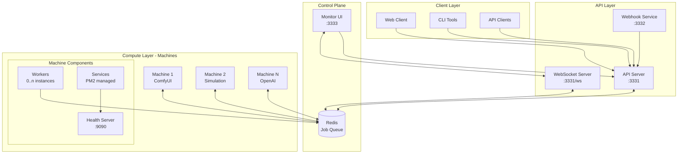
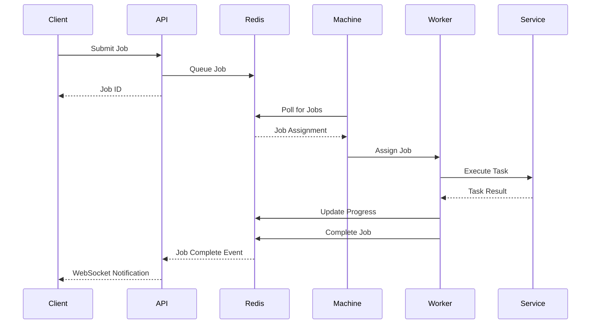
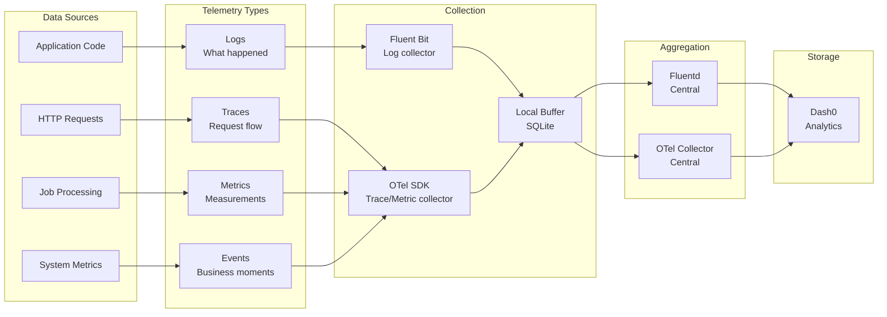
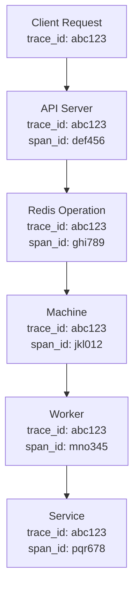

# Observability Information Flow & Service Architecture

## System Overview

The EMP Job Queue system consists of distributed services that need comprehensive observability. This document defines the information flow between services and how telemetry data moves through the system.

## Service Architecture



## Information Flow Types

### 1. Job Lifecycle Flow



### 2. Telemetry Data Flows



## Detailed Information Flows

### API Server Information Flow

```yaml
Service: API Server
Port: 3331
Responsibility: Job submission, status queries, WebSocket events

Inbound:
  - HTTP Requests:
      - POST /api/jobs (job submission)
      - GET /api/jobs/:id (status query)
      - GET /api/machines (machine list)
  - WebSocket Connections:
      - Client subscriptions for job updates

Outbound:
  - To Redis:
      - Job submissions (ZADD jobs:pending)
      - Status queries (HGETALL job:*)
      - Event publishing (PUBLISH channels)
  - To Dash0:
      - Request traces (HTTP spans)
      - API metrics (request count, latency)
      - Error logs (structured JSON)
      - Business events (job submitted)

Telemetry Generated:
  - Traces:
      - HTTP request spans
      - Redis operation spans
      - WebSocket message spans
  - Metrics:
      - api_requests_total{method, path, status}
      - api_request_duration_seconds{method, path}
      - websocket_connections_active
      - jobs_submitted_total{type}
  - Logs:
      - Request logs with trace_id
      - Error logs with stack traces
      - WebSocket connection events
  - Events:
      - job.submitted
      - client.connected
      - client.disconnected
```

### Machine Information Flow

```yaml
Service: Machine (ComfyUI/Simulation/OpenAI)
Port: 9090 (health)
Responsibility: Job execution, worker management, service orchestration

Inbound:
  - From Redis:
      - Job assignments (via polling)
      - Configuration updates
      - Control commands

Outbound:
  - To Redis:
      - Machine status (every 10s)
      - Worker status updates
      - Job progress updates
      - Job completion events
  - To Dash0:
      - Machine metrics (CPU, memory, GPU)
      - Worker metrics (active, idle, failed)
      - Service health metrics
      - Job execution traces

Telemetry Generated:
  - Traces:
      - Job execution spans (parent)
      - Worker processing spans (child)
      - Service operation spans (child)
  - Metrics:
      - machine_uptime_seconds
      - machine_cpu_usage_percent
      - machine_memory_usage_bytes
      - machine_gpu_usage_percent
      - workers_active{service}
      - workers_total{service}
      - jobs_processed_total{type, status}
      - job_duration_seconds{type}
  - Logs:
      - Machine startup/shutdown
      - Worker lifecycle events
      - Service health changes
      - Job execution logs
  - Events:
      - machine.started
      - worker.spawned
      - job.started
      - job.completed
      - service.unhealthy
```

### Worker Information Flow

```yaml
Service: Worker (within Machine)
Responsibility: Individual job processing

Inbound:
  - From Machine:
      - Job assignment
      - Shutdown signals

Outbound:
  - To Redis:
      - Progress updates (XADD progress:*)
      - Status updates (HSET worker:*)
      - Heartbeats
  - To Services:
      - Task execution requests
      - Resource requirements
  - To Dash0:
      - Execution traces
      - Performance metrics
      - Error logs

Telemetry Generated:
  - Traces:
      - job.execution (root span)
      - task.preprocessing
      - service.call
      - result.postprocessing
  - Metrics:
      - worker_job_duration_seconds
      - worker_memory_usage_bytes
      - worker_errors_total
  - Logs:
      - Job start/complete
      - Errors with context
      - Performance warnings
  - Events:
      - job.timeout
      - job.retry
      - resource.exhausted
```

### Monitor UI Information Flow

```yaml
Service: Monitor UI
Port: 3333
Responsibility: Real-time system visualization

Inbound:
  - From API:
      - Initial state queries
      - Historical data
  - From WebSocket:
      - Real-time updates
      - Machine status
      - Job progress

Outbound:
  - To API:
      - Control commands
      - Query requests
  - To Dash0:
      - Frontend performance metrics
      - User interaction events
      - Error tracking

Telemetry Generated:
  - Metrics:
      - page_load_time_seconds
      - websocket_message_rate
      - ui_render_time_milliseconds
  - Events:
      - user.action{type, target}
      - view.changed
      - filter.applied
  - Logs:
      - Client errors
      - WebSocket disconnections
```

## Context Propagation

### Trace Context Flow



### Context Propagation Headers

```yaml
HTTP Headers:
  - traceparent: 00-{trace_id}-{span_id}-01
  - tracestate: emp=machine:123,worker:456
  - x-job-id: job-789
  - x-request-id: req-abc

Redis Context (stored with job):
  - trace_id: Original request trace
  - job_id: Unique job identifier
  - parent_span_id: Calling span
  - baggage: Custom key-value pairs

Environment Context (automatic):
  - machine_id: From MACHINE_ID env
  - environment: From NODE_ENV
  - region: From AWS_REGION
  - version: From package.json
```

## Data Correlation Strategy

### Primary Correlation IDs

```yaml
trace_id:
  - Purpose: Link all operations for a single request
  - Scope: Entire request lifecycle
  - Format: 32-character hex string
  - Example: "8d12404289e478577467c87b7b93f785"

job_id:
  - Purpose: Link all operations for a job
  - Scope: Job submission to completion
  - Format: "job-{uuid}"
  - Example: "job-550e8400-e29b-41d4-a716-446655440000"

machine_id:
  - Purpose: Identify originating machine
  - Scope: Machine lifetime
  - Format: "{type}-{identifier}"
  - Example: "comfyui-prod-us-east-1a"

worker_id:
  - Purpose: Identify specific worker
  - Scope: Worker lifetime
  - Format: "{machine_id}-worker-{index}"
  - Example: "comfyui-prod-us-east-1a-worker-0"

request_id:
  - Purpose: Identify HTTP requests
  - Scope: Single HTTP request
  - Format: "req-{uuid}"
  - Example: "req-123e4567-e89b-12d3-a456-426614174000"
```

### Correlation in Practice

```typescript
// Example: Following a job through the system

// 1. Client submits job
POST /api/jobs
Headers:
  traceparent: 00-abc123-client1-01
Body:
  { type: "image_generation", ... }

// 2. API creates job
{
  trace_id: "abc123",
  job_id: "job-789",
  request_id: "req-456",
  machine_id: null, // not yet assigned
  timestamp: "2024-01-15T10:00:00Z"
}

// 3. Machine picks up job
{
  trace_id: "abc123",
  job_id: "job-789",
  machine_id: "comfyui-prod-1",
  worker_id: "comfyui-prod-1-worker-0",
  timestamp: "2024-01-15T10:00:05Z"
}

// 4. Query all related data
Query: trace_id:"abc123" OR job_id:"job-789"
Returns: All logs, traces, metrics, events for this job
```

## Critical Information Paths

### High-Priority Flows (Must Never Lose)

1. **Job Submission Path**
   ```
   Client → API → Redis → Machine → Worker → Completion
   ```
   - Every step must be traced
   - Every step must log
   - Failures must be captured

2. **Error Path**
   ```
   Error → Local Buffer → Retry Queue → Dash0
   ```
   - Errors must never be lost
   - Stack traces must be complete
   - Context must be preserved

3. **Health Status Path**
   ```
   Service → Health Check → Aggregator → Redis → Monitor
   ```
   - Health changes must be immediate
   - State transitions must be logged
   - Recovery must be tracked

### Performance-Critical Paths (Must Be Fast)

1. **Job Assignment**
   - Redis → Machine: <10ms
   - Must not block on telemetry

2. **Progress Updates**
   - Worker → Redis: <5ms
   - Batched telemetry acceptable

3. **WebSocket Events**
   - Redis → API → Client: <50ms
   - Async telemetry only

## Telemetry Overhead Budget

```yaml
Maximum Overhead per Operation:
  - Trace creation: <0.1ms
  - Metric recording: <0.05ms
  - Log writing: <0.5ms
  - Event emission: <0.1ms
  - Context propagation: <0.01ms

Network Overhead:
  - Batch size: 100-1000 events
  - Compression: gzip enabled
  - Max payload: 1MB
  - Send interval: 5-10 seconds

Storage Overhead:
  - Local buffer: Max 100MB
  - Rotation: After 50MB
  - Retention: 1 hour local
  - Cleanup: Automatic

CPU Overhead:
  - Target: <1% CPU
  - Sampling: Adaptive
  - Background: All IO
```

## Implementation Priority

### Phase 1: Foundation (Week 1)
- [ ] Define correlation ID standards
- [ ] Implement context propagation
- [ ] Create telemetry package structure

### Phase 2: Critical Path (Week 2)
- [ ] Instrument job submission flow
- [ ] Instrument error paths
- [ ] Add health monitoring

### Phase 3: Full Coverage (Week 3)
- [ ] Instrument all services
- [ ] Add performance metrics
- [ ] Implement buffering

### Phase 4: Intelligence (Week 4)
- [ ] Add correlation queries
- [ ] Build dashboards
- [ ] Create alerts

## Success Criteria

1. **Can answer within 30 seconds:**
   - "Why did job X fail?"
   - "How long did job Y take at each step?"
   - "What errors occurred on machine Z?"
   - "Which jobs are stuck?"

2. **Automatic correlation shows:**
   - All logs for a trace_id
   - All spans for a job_id
   - All metrics for a machine_id
   - All events in a time window

3. **Zero data loss during:**
   - Network outages
   - Service restarts
   - High load periods
   - Dash0 maintenance